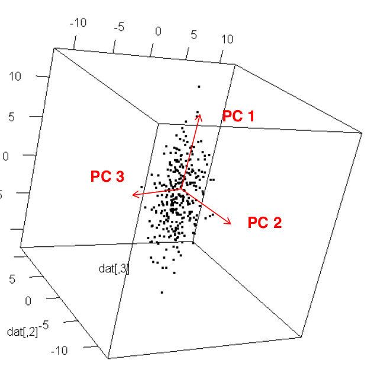

# Dimension reduction with examples

## Introduction

Dimensional reduction is the transformation of high-dimensional data into a low dimension representation. During this process, some information is lost but the main features are (hopefully!) preserved.

These transformations are very important because processing and analyzing high-dimensional data can be intractable. Dimension reduction is thus very useful in dealing with large numbers of observations and variables and is widely used in many fields.

Here we'll approach three different techniques: 
    
1. Principal component analysis (PCA)
2. Multidimensional Scaling (MDS)
3. Stochastic Neighbor Embedding (SNE)

PCA tries to project the original high-dimensional data into lower dimensions by capturing the most prominent variance in the data.

MDS is a technique for reducing data dimensions while attempting to preserve the relative distance between high-dimensional data points.

SNE is a non-linear technique to “cluster" data points by trying to keep similar data points close to each other.

PCA and classical MDS share similar computations: they both use the spectral decomposition of symmetric matrices, but on different input matrices.

## Principal component Analysis (PCA)

PCA is often used to find low dimensional representations of data that **maximizes the spread (variance) of the projected data.**

- The first principal component (PC1) is the direction of the largest variance of the data.
- The second principal component (PC2) is perpendicular to the first principal component and is the direction of the largest variance of the data among all directions that are perpendicular to the first principal component.
- The third principal component (PC3) is perpendicular to both first and second principal components and is in the direction of the largest variance among all directions that are perpendicular to both the first and second principal components. 

**This can continue until we obtain as many principal components as the dimensions of the original space in which the data is given, i.e. an orthogonal basis of the data space consisting of principal components.**

Principal component analysis can be formulated in the following three equivalent ways. For simplicity, we will only formulate the problem for the first principal component.

Let $x^{(1)},x^{(2)},...,x^{(n)} \in \mathbb{R}^p$ denote $n$ data points in $p$ dimensional space. Without loss of generality, we assume that the data is centered at the origin (i.e. $\sum_{i=1}^n x^{(i)} = 0$). The first PC is the line spanned by a unit vector $w \in \mathbb{R}^p$ such that

- $\mathbf{w}$ minimizes the sum of squared residuals of the orthogonal projections of data $x^{(i)}$ onto $w$,

$$
\min_{w \in \mathbb{R}^p} \sum_{i=1}^n |\mathbf{x}^{(i)} - (\mathbf{x}^{(i)}.\mathbf{w})\mathbf{w}|^2.
$$

- $\mathbf{w}$ maximizes the sum of squared norms of the orthogonal projections of data $x^{(i)}$ onto $w$,

$$
\max_{w \in \mathbb{R}^p}\sum_{i=1}^n|\mathbf{x}^{(i)}.\mathbf{w}|^2.
$$

- $\mathbf{w}$ is an eigenvector corresponding to the largest eigenvalue of the sample covariance matrix $\mathbf{S}$,

$$
\mathbf{S} = \frac{1}{n-1}\mathbb{X}^T\mathbb{X}, 
\ \text{where}\ \mathbb{X} = \begin{pmatrix}
\leftarrow & (x^{(1)})^T & \rightarrow \\
\leftarrow & (x^{(2)})^T & \rightarrow \\
           &    \cdots   &             \\
\leftarrow & (x^{(n)})^T & \rightarrow \\
\end{pmatrix}
$$

To find the second principal component, we can repeat the process on the data projected into the space that is orthogonal to PC1, and so on.

**Note: by definition, PCA gives linear projections into lower dimensional subspaces.**

**Note: PCA applies even when to data without any labels.**

We can decide how many PCs to retain in the projection of the data based on their explained variance. 

The **total variance** is the sum of variance of all the PCs, which equals to the sum of the eigenvalues of the covariance matrix,

$$
\text{Total variance} = \sum_{j=1}^p \lambda_j.
$$

The **fraction of variance explained by a PC** is the ratio of the variance of that PC to the total variance.

$$
PC_i\ \text{variance ratio} = \frac{\lambda_i}{\sum_{j=1}^p\lambda_j}.
$$

## Multidimensional Scaling (MDS)

Multidimensional scaling (MDS) is a non-linear dimensionality reduction method to extract a lower-dimensional configuration from the measurement of pairwise distances (dissimilarities) between the points in a dataset.

### Classical MDS

Let $x^{(1)},x^{(2)},...,x^{(n)} \in \mathbb{R}^p$ denote $n$ data points in $p$ dimensional space, and let the distance matrix $\mathbf{D} \in \mathbb{R}^{n\times n}$ consists of the elements of distances between each pair of the points, i.e. $d_{i,j} = |x^{(i)}-x^{(j)}|$.

The objective of MDS is to find points $y^{(1)},...,y^{(n)}\in\mathbb{R}^q$ in a lower dimensional space ($q<p$), such that the sum of all pairwise distances

$$
\sum_{i=1}^n\sum_{j=1}^n\left(d_{ij}-|y^{(i)}-y^{(j)}|_2\right)^2
$$

is minimized.

The resulting points $y^{1},...,y^{(n)}$ are called a lower-dimensional embedding of the original data points. 

### Weighted MDS

Besides the above classical MDS, there are variations of MDS that use different objective functions.

The **weighted MDS** uses the objective function

$$
\sum_{i=1}^n\sum_{j=1}^n w_{ij}\left(d_{ij}-|y^{(i)}-y^{(j)}|_2\right)^2,
$$
where $w_{ij} \ge 0$ is the assigned weight.

### Non-metric MDS

The non-metric MDS uses the objective function

$$
\sum_{i=1}^n\sum_{j=1}^n\left(\theta(d_{ij})-|y^{(i)}-y^{(j)}|_2\right)^2,
$$
in which we also optimize the objective over an increasing function $\theta$.

**Note: non-classical MDS the objective functions are non-convex!**

## Stochastic Neighbor Embedding (SNE)

Stochastic neighbor embedding (SNE) is a probabilistic approach to dimensional reduction that places data points in high dimensional space into low dimensional space while preserving the identity of neighbors. That is, SNE attempts to keep nearby data points nearby, and separated data points relatively far apart.

The idea of SNE is to define a probability distribution on pairs of data points in each of the original high dimensional space and the target low dimensional space, and then determine the placement of objects in low dimension by minimizing the “difference' of the two probability distributions.

So we'll have

1. An input. The distance matrix $D_{ij}$ of the data in a p-dimensional space.

2. In the high dimensional $p$ space, center a Gaussian distribution on each data point $\mathbf{x}^{(i)}$, and define the probability of another data point $\mathbf{x}^{(j)}$ to be its neighbor to be

$$
p_{ij} = \frac{e^{-D_{ij}^2}}{\sum_{k\ne l} e^{-D_{ij}^2}},\ \text{where}\ D_{ij}^2 = |\mathbf{x}^{(i)} - \mathbf{x}^{(j)}|^2,\ i\ne j,
$$
where the denominator sums over all distinct pairs of data points. Notice the symmetry $p_{ij} = p_{ji}$. Hence we can restrict to indices where $i<j$, and the above definition turns to

$$
p_{ij} = \frac{e^{-D_{ij}^2}}{\sum_{k<l} e^{-D_{ij}^2}},\ \text{where}\ D_{ij}^2 = |\mathbf{x}^{(i)} - \mathbf{x}^{(j)}|^2,\ i < j.
$$

The shape of the Gaussian distribution ensures that pairs that are close together are given much more weight than pairs that are far apart.

3. In the low dimensional target space do the same procedure as in the previous point: define for each point $y^{(i)}$ the probability of $y^{(j)} being its neighbor to be

$$
q_{ij} = \frac{e^{-D_{ij}^2}}{\sum_{k<l} e^{-D_{ij}^2}},\ \text{where}\ D_{ij}^2 = |\mathbf{y}^{(i)} - \mathbf{y}^{(j)}|^2,\ i < j.
$$

