# Time series example: climate change signal

## Introduction

In this example we will explore climate data from Middlesex County, Massachusets, USA.

Temperature records are from Wolfram Schlenker, and are available [here](https://www.dropbox.com/sh/fe844ythm9xhz25/AABMmYzeY44zP_CwuNa1BOgoa?dl=0). This weather dataset was developed to study how crop yields respond to climate change, and includes a grid of values across the United States based on a network of weather stations. You can read more about that work [here](https://www.pnas.org/doi/10.1073/pnas.0906865106).

*? Is the trend in average temperature statistically significant, after controlling for components that can be explained by seasonal components or ENSO index?* 

**Note: ENSO is the acronym of El Niño southern oscillation.**

## Input data

First, we upload the data from the internet.

```python
import pandas as pd
import numpy as np

climate_df = pd.read_csv('https://raw.githubusercontent.com/maxoboe/6419_recitations/main/data/annual_weather.csv')
climate_df.head()
	Unnamed: 0	fips	year	prec	tAvg	tMax	tMin
0	0	1001	1950.0	0.316240	18.562836	24.982644	12.143027
1	1	1003	1950.0	0.396390	19.632386	25.255855	14.008918
2	2	1005	1950.0	0.314359	18.764575	25.225654	12.303496
3	3	1007	1950.0	0.339745	17.712741	24.537339	10.888144
4	4	1009	1950.0	0.346355	16.051495	22.331040	9.771949
```

We can observe that the data has information about time, precipitation (`prec`), average, maximum and minimum temperatures (`tAvg`,`tMax`, and `tMin` respectively). The time spans from 1950 to 2019 with almost 150k sequential measurements for the counties of Massachusets.

The county code is located in column `fips`. The county code for Middlesex County is `23017`, which has 70 datapoints.

Let's now plot the average temperature as a function of time using the following code. We will be using the python packages `matplotlib` and `seaborn` for data visualization.

```python
import matplotlib.pyplot as plt
import seaborn as sns; sns.set_theme()
plt.figure(figsize=(9, 6), dpi=80)
subset = climate_df[climate_df.fips == 23017] # Only looking at Middlesex County
year = subset.year.values.reshape(-1,1)
temp = subset.tAvg.values.reshape(-1,1)
sns.lineplot(x=subset.year,y=subset.tAvg)
plt.title("Average Temperature in Middlesex County, MA")
plt.ylabel('Temp (C)')
plt.show()
subset.head()
```


We can readily observe a linear trend in the data. *Is this trend statistically significate? What is its origin?*

Before answering this pressing question we need to take the long walk around it. 

## Simulated data

Let's start by generating some simulating data so we can put into practice time series methods and approaches.

This simulated time series has a quadratic trend, a periodic component, and an exogenous regressor. We will fit each component in sequence. We can write the fitting function as

$$
y_{t} = \beta z_t + T_t + S_t + \varepsilon_t
$$

where $z_t$ is an external regressor, $T_t$ is a quadratic trend component, and $S_t$ is a periodic component with period 5, and $\epsilon_t$ is random noise, normal and independent for different times $t$.

We generate the data with the following code

```python
# This code was used to generate the original dataset; 
np.random.seed(1234) #this is to obtain the same result in different runs. it is arbitrary
x_vals = np.arange(0, 200) #number of simulated datapoints
z = 5 * np.random.beta(1,1,size=len(x_vals)) #simulated external regressor (drawn from a beta distribution)
quad_trend = x_vals ** 2 * 0.004 + 0.2 * x_vals #simulated quadratic trend
seasonality = 2 * (x_vals % 5 == 0) + 3 * (x_vals % 5 == 1) + 1 * (x_vals % 5 == 2) - 1 * (x_vals % 5 == 4) #simulated seasonality with period 5
random_noise = np.random.normal(size=len(x_vals)) #white normal noise
y_vals = quad_trend + seasonality + z + random_noise #our final time series
x = x_vals.reshape(-1,1)
z = z.reshape(-1,1)
y = y_vals.reshape(-1,1)
sns.set()
plt.plot(x, y)
```

The following plot shows our generated data. Pretty isn't it? ;)

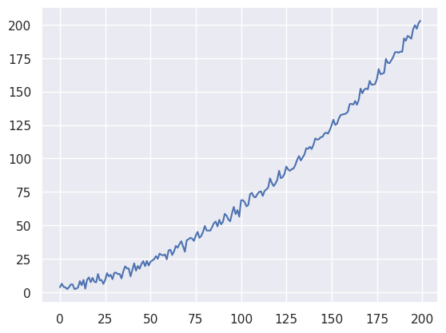

Now we'll show to different ways of removing the trends. The first one consists in removing the line with a linear regression package such as `sklearn.linear_model`.

### Removing the trends with linear regression

Let's consider the case of the model with only a linear time trend,

$$
y_t = T_t + W_t.
$$

We can find the parameters of a linear regression following the code below. The printed values are the $\beta$ regressors.

```python
from sklearn import linear_model
clf = linear_model.LinearRegression()
clf.fit(x, y)
print(clf.coef_,clf.intercept_) # Print the beta values found via regression 
y_hat = clf.predict(x) #generated predictors
plt.plot(x, y, label='original data')
plt.plot(x, y_hat, 'r', label='fitted line')
plt.legend()
```

From the generated plot we can observe the fitted line superimposed on the original data. Clearly, there is more in it than a simple linear fit. Let's take a look at the residuals.

```python
linear_residuals = y - y_hat
plt.plot(x, linear_residuals,'o')
```

It is now clear we have a quadratic residual. Let's remove the quadratic trend via linear regression. In other words, we need to linearize the quadratic expression

$$
y_t = t\beta_1 + t^2\beta_2.
$$

We thus need to generate a set of $x^2$ values from our previously generated $x$ values as shown in the code below. The printed values show the regression coefficients.

```python
# Difference in this text block: we're including this squared term 
x_stacked = np.hstack((x, x**2)) #stack x and x² to input into LinearRegression
clf = linear_model.LinearRegression()
clf.fit(x_stacked, y)
quadratic_y_hat = clf.predict(x_stacked)
print(clf.coef_,clf.intercept_) # Print the beta values found via regression 
plt.plot(x, y, label='original data')
plt.plot(x, quadratic_y_hat, 'r', label='best fit quadratic')
plt.legend()
plt.show()
nonlinear_residuals = y - quadratic_y_hat
plt.plot(x, nonlinear_residuals,'o');
[[0.20453378 0.00399063]] [3.1017371]
```

The generated plot now shows a much better fit as expected.

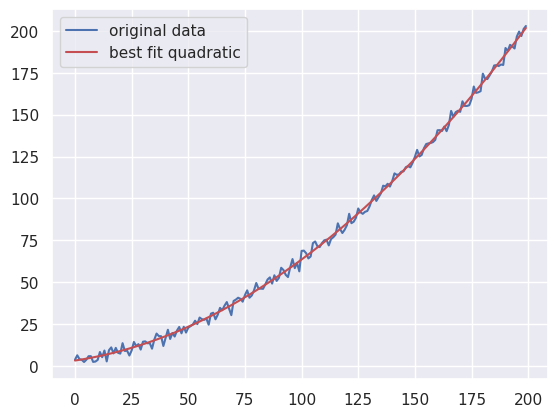

The code also generated a residual plot as shown below. There is no clear trend in the data.

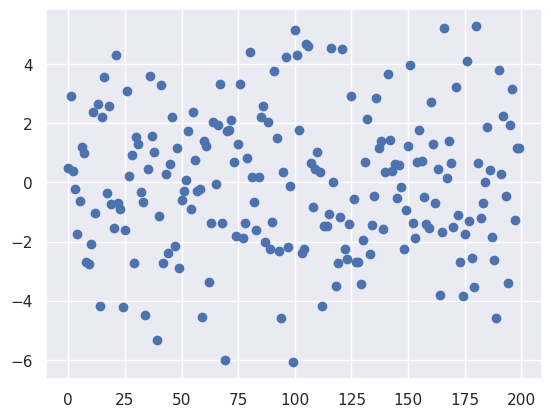

The command `regplot` from the `seaborn` package can show us the mean (blue line) and the 95% confidence interval from bootstrap (light blue area around the line) of the data.

```python
import seaborn as sns 
sns.regplot(x=x, y=nonlinear_residuals)
```

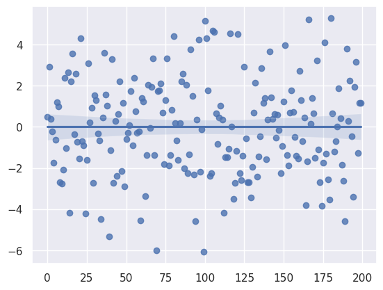

Again, the fit shows that the residuals have zero mean and no apparent trend left.

### Removing the trends with first differences

Let's now approach the same problem using the first differences method. If we take the first difference we obtain

$$
y_t-y_{t-1} = T_t-T_{t-1}+W_t-W_{t-1}.
$$

If $T_t$ is linear,

$$
T_t-T_{t-1} = t\beta-(t-1)\beta = \beta
$$

Simple enough? Let's try it out.

```python
first_diff = y[1:] - y[:-1]
plt.plot(x[:-1],first_diff, 'o')
sns.regplot(x=x[:-1], y=first_diff)
```

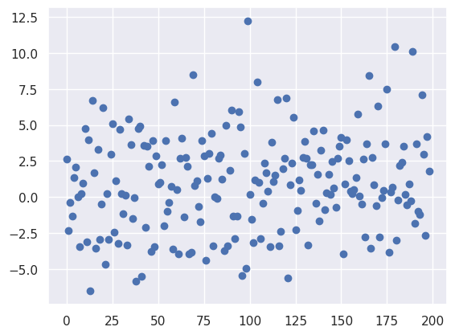

The first plot shows that the remaining structure in the data is not clear. 

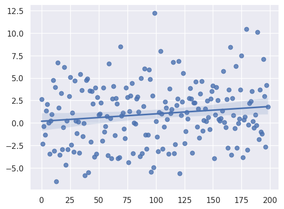

The second plot shows that there is a small linear trend still in the data. 

Let's try another differencing layer to remove the quadratic trend. If we consider a quadratic model as before we have

$$
y_t = t\beta_1 + t^2\beta_2.
$$

If we take the difference we obtain

$$
y_t-y_{t-1} = T_t-T_{t-1} + W_t - W_{t-1} = t\beta_1 + t^2\beta_2 - ((t-1)\beta_1 + (t-1)^2\beta_2).
$$

When we expand this becomes

$$
t^2 \beta_2 + t \beta_1 - (t^2 - 2t + 1) \beta_2 - (t - 1)\beta_1.
$$

The squared terms and the noise cancel out, but we're left with a linear term: $2t \beta_2 - \beta_2 + \beta_1$. As we've seen before, the first difference removes the linear component, so we just take another difference. Therefore,

$$
\Delta y_t^2 = 2t \beta_2 - \beta_2 + \beta_1 - (2(t-1) \beta_2 - \beta_2 + \beta_1) = \beta_2
$$

**Note: it is possible to successively to this to remove any polynomial component.**

Code:

```python
# Alternate approach: taking a second difference
first_diff = y[1:] - y[:-1]
second_diff = first_diff[1:] - first_diff[:-1]
sns.regplot(x[:-2],second_diff, 'o')
```

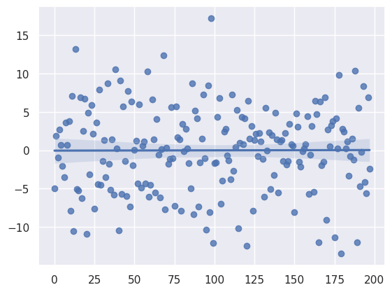

We now have mean zero residuals.

Ok! Let's now look in more detail to what is left in the residuals.

### ACF/PACF plots and seasonality

The ACF and PACF plots are very useful to make diagnostics in time series, including for identifying the existence of seasonal components in data.

**Note: the `tsa` package from `statsmodels` is the reference to look for in python.**

Let's plot the ACF and the PACF of the de-trended residuals.

```python
import statsmodels.api as sm
sm.graphics.tsa.plot_acf(nonlinear_residuals, lags=30)
plt.show()
sm.graphics.tsa.plot_pacf(nonlinear_residuals, lags=30)
plt.show()
```

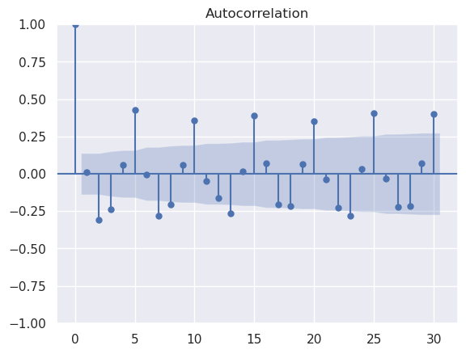

The ACF plot shows a significant (i.e. above error) periodic signal with period 5 (i.e. goes from 0 to 5 to 10, etc).

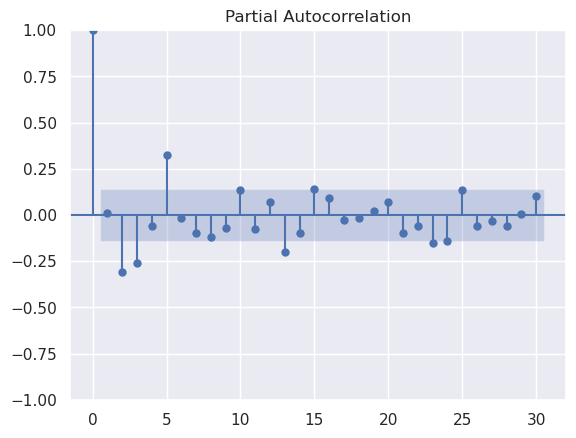

The PACF also shows a similar signal at $h=0$ and $h=5$ as well at $h=10,15,25,30$ at the signal to noise limit.

#### Sinusoidal approximation

At this point we can try to remove the periodic signal with a sinusoidal approximation. For the de-trended signal we will try to fit

$$
S_t = a + b\sin\left(\phi+\frac{2pit}{T} \right),
$$

where $a$ is the mean of the sine function, $b$ is the amplitude, $\phi$ is the phase shift, and $T$ is the period. Here we will fix $T = 5$ because it can be measured from the ACF plot. Therefore, we are estimating three parameters: $a,b, and \phi$. 

In the following code we will define the `sine_function` where its parameters will be found using the `curve_fit` function from the `scipy.optimize` package.

```python
from scipy import optimize
period = 5 #period is fixed
def sine_function(X, amp, phase_shift, mean):
  return (amp * np.sin(1/period * 2 * np.pi * (X - phase_shift)) + mean)
params, _ = sine_curve_fit = optimize.curve_fit(
  f = sine_function,
  xdata = x.flatten(),
  ydata = nonlinear_residuals.flatten(),
  p0 = np.array([3, 1, 10])) #p0 are the initial values for the parameters
print(params)
amp, phase_shift, mean = params
sin_approx = sine_function(x, amp, phase_shift, mean)
plt.plot(x, nonlinear_residuals, label='detrended data')
plt.plot(x, sin_approx, 'r', label='fitted line')
plt.legend()
plt.plot()
plt.show()
sin_residuals = nonlinear_residuals - sin_approx
plt.plot(x, sin_residuals,'o');
[ 1.92428331e+00 -2.93991107e-01 -2.17336386e-09]
```

The optimized output printed parameters are the amplitude, the phase shift, and the mean of the function respectively.

The first generated plot shows the detrended data in blue and the fitted line in red. 

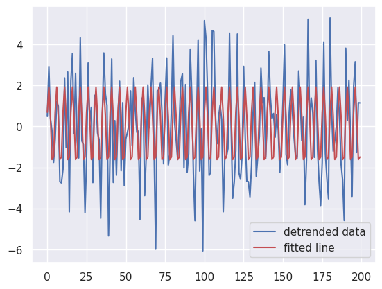

We can observe a reasonable agreement regarding the phase shift and the mean but not the amplitude. Therefore, there are still more stuff hidden in the data! 

Let's take a look at the second generated plot, the residuals.

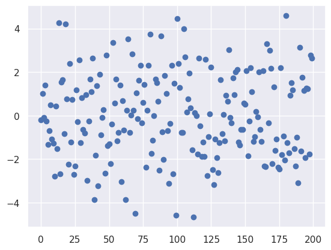

The residuals are centered, have mean zero and don't show any apparent pattern in the data.

Let's take another look at the ACF plots and check what's left.


```python
sm.graphics.tsa.plot_acf(sin_residuals, lags=30)
plt.show()
```

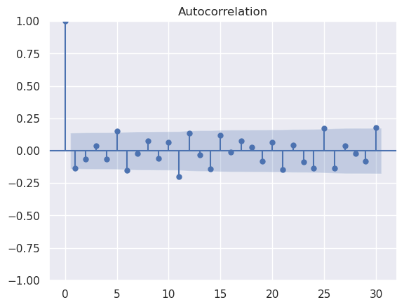

Indeed, the plot does not show any periodic signal at the noise level. **At this level we already have a stationary signal or a good aproximation to white noise**.

#### Time-series fixed effects

Another approach to remove a periodic signal involves time-series fixed effects. 

Here we remove the mean from each time element up to the time series. If the period is 5, we can fit an element for $\{0,1,2,3,4\}$ and then we find $S_t$ by looping through those fixed elements.

We can estimate these values by taking the mean at each point or by fitting a regression with a "fixed effect" at each integer modulus. The following code shows the latter approach.

```python
period = 5
x_with_fixed_effects = x
for i in range(period):
  x_with_fixed_effects = np.hstack((x_with_fixed_effects, (x % period)==i))
clf.fit(x_with_fixed_effects, nonlinear_residuals)
print(clf.coef_)
fixed_effects_predicted = clf.predict(x_with_fixed_effects)
plt.plot(x, nonlinear_residuals, label='detrended data')
plt.plot(x, fixed_effects_predicted, 'r', label='fitted line')
plt.legend();
plt.plot()
plt.show()
fixed_effects_residuals = nonlinear_residuals - fixed_effects_predicted
plt.plot(x, fixed_effects_residuals, 'o')
```

The first plot generated by the code shows the data and the fitted line. As can be observed, the result is similar to the one that fitted a sinusoidal line.

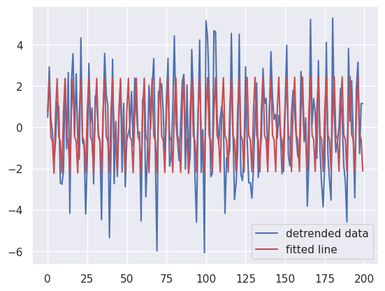

The second plot shows the residuals.

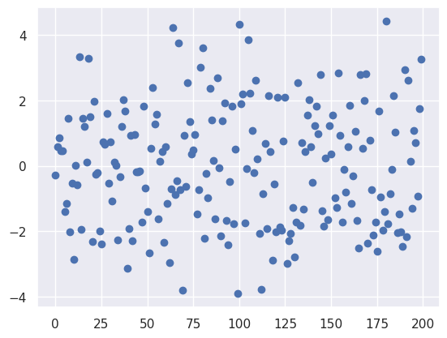

We can compare the performance of both methods by computing the mean of the squared residuals.

```python
print(np.mean((sin_residuals)**2))
print(np.mean((fixed_effects_residuals)**2))
3.7962668641256028
3.297378223877299
```

We can see that, in fact, the second method obtains lower uncertainties. This is also observed in the ACF plot, where the errors are slightly smaller.

```python
sm.graphics.tsa.plot_acf(fixed_effects_residuals, lags=30)
plt.show()
```


### Fitting external regressors

Now that we have estimates for $T_t$ and $S_t$ we can try and find external regressors. 

*How do you know there are external regressors?* It depends. In many cases, there are sources of expert guidance (scientific or theoretical advice) about what might be relevant to the problem at hand.

In this case we know that a strange variable "z" is interfering with our measurements and may be correlated with our residuals. 

Therefore, the first thing to try is to plot the residuals against z and observe if there is a clear correlation. If there is, we can quantify it by calculating, for instance, the well-known Pearson correlation coefficient. 

```python
from scipy import stats
plt.scatter(fixed_effects_residuals, z)

stats.spearmanr(fixed_effects_residuals,z)
SignificanceResult(statistic=0.8115307882697069, pvalue=4.344729600805482e-48)
```

From the generated plot it is possible to observe a clear positive correlation, with a r = 0.81 and vanishingly small p-value. 

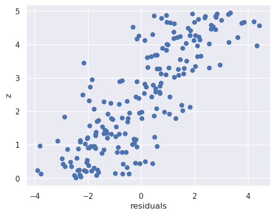

We can now include this external variable by regressing the correlation and subtracting its own residuals from the previous ones, as shown in the code below.

```python
clf.fit(z, fixed_effects_residuals)
with_external_regressor = clf.predict(z)
print(clf.coef_) # Print the beta values found via regression 
plt.plot(x, fixed_effects_residuals, label='residuals after seasonal')
plt.plot(x, with_external_regressor, 'r', label='fitted line')
plt.legend()
plt.show()
external_residuals = fixed_effects_residuals - with_external_regressor
plt.plot(x, external_residuals,'o');
```

This code generates two plots. The first one depicts the residuals after seasonal fit in blue and the fitted line in red. We can observe that including the external variable captures a significant part of the residuals. 

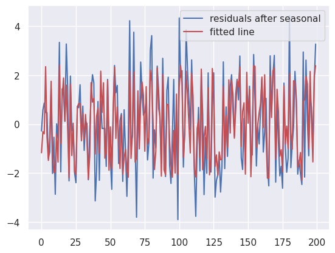

The second plot shows the latest residuals and we can already observe that the uncertainties are smaller than before. If we quantify them by calculating the mean of the square residuals we obtain $\sim 1.14$, a value much smaller than before.

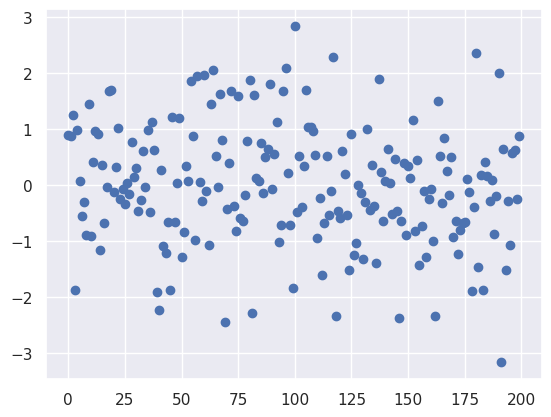

### Information criteria

Information criteria allows us to get a better metric than mean squared error, because they calculate the balance between complexity of the model and precision.

The following code shows two functions, `evaluate_AIC` and `evaluate_BIC` where the Akaike information criteria and the Bayesian information criteria are defined. The log likelihood is calculated using the function `norm.logpdf` from the package `scipy.stats`.

```python
# Example here about how to find; what my assumption is behind this 
from scipy.stats import norm 
def evaluate_AIC(k, residuals):
  """
  Finds the AIC given the number of parameters estimated and 
  the residuals of the model. Assumes residuals are distributed 
  Gaussian with unknown variance. 
  """
  standard_deviation = np.std(residuals)
  log_likelihood = norm.logpdf(residuals, 0, scale=standard_deviation)
  return 2 * k - 2 * np.sum(log_likelihood)
def evaluate_BIC(k, residuals):
  """
  Finds the AIC given the number of parameters estimated and 
  the residuals of the model. Assumes residuals are distributed 
  Gaussian with unknown variance. 
  """
  standard_deviation = np.std(residuals)
  log_likelihood = norm.logpdf(residuals, 0, scale=standard_deviation)
  return k * np.log(len(residuals)) - 2 * np.sum(log_likelihood)
```

Now, we will use both functions to evaluate all residual we've calculated so far.

```python
# plt.plot(x, detrended, label='detrended data')
for residual, label, DOF_used in zip([linear_residuals, nonlinear_residuals, sin_residuals, fixed_effects_residuals, external_residuals], 
                         ['linear', 'nonlinear', 'sinusoidal', 'fixed effects', 'with external regressor'], 
                         [1, 2, 5, 7, 8]):
  print('Mean squared error with {} method is: {}'.format(label, np.nanmean((residual)**2)))
  print('AIC with {} method is: {}'.format(label, evaluate_AIC(DOF_used, residual)))
  print('BIC with {} method is: {}'.format(label, evaluate_BIC(DOF_used, residual)))
  print('-'*20)
Mean squared error with linear method is: 147.1867487705771
AIC with linear method is: 1567.9158493425778
BIC with linear method is: 1571.2141667091257
--------------------
Mean squared error with nonlinear method is: 5.647710964231751
AIC with nonlinear method is: 917.8254780805322
BIC with nonlinear method is: 924.4221128136282
--------------------
Mean squared error with sinusoidal method is: 3.7962668641398625
AIC with sinusoidal method is: 844.3790492185412
BIC with sinusoidal method is: 860.8706360512814
--------------------
Mean squared error with fixed effects method is: 3.297378223877299
AIC with fixed effects method is: 820.200948300849
BIC with fixed effects method is: 843.2891698666853
--------------------
Mean squared error with with external regressor method is: 1.1397781811944072
AIC with with external regressor method is: 609.7421463966742
BIC with with external regressor method is: 636.1286853290585
--------------------
```

From the results we observe that AIC and BIC have very similar results and its value goes down in every successive data re-trending. As shown before, the fixed effects method is preffered to the sinusoidal method in this case for the detrending of the seasonal signal. 

**Note: In practice it's best to fit all components simultaneously. However, it's good practice to test components sequentially and examine residuals.**

The **a posterior** simultaneous fitting can be done with one of the many python packages available. Here we will showcase `Autoreg` from the package `statsmodels.tsa`.

```python
# With a Python package
exog = z
period = 5
from statsmodels.tsa.ar_model import AutoReg
from statsmodels.tsa.deterministic import DeterministicProcess
det_comp = DeterministicProcess(x.flatten(), period=period, order=2, seasonal=True)
model = AutoReg(y, exog=exog, deterministic=det_comp, lags=None).fit()
print(model.summary())
model_predictions = model.predict(exog=exog)
plt.plot(x, y, label='raw y data')
plt.plot(x, model_predictions, 'r', label='fitted model')
plt.legend()
plt.plot()
plt.show()
residuals = y - model_predictions.reshape(-1,1)
plt.plot(x, residuals,'o');
                            AutoReg Model Results                             
==============================================================================
Dep. Variable:                      y   No. Observations:                  200
Model:                   AutoReg-X(0)   Log Likelihood                -289.120
Method:               Conditional MLE   S.D. of innovations              1.027
Date:                Mon, 29 Jan 2024   AIC                            596.241
Time:                        09:39:05   BIC                            625.925
Sample:                             0   HQIC                           608.254
                                  200                                         
=================================================================================
                    coef    std err          z      P>|z|      [0.025      0.975]
---------------------------------------------------------------------------------
trend             0.1987      0.005     39.307      0.000       0.189       0.209
trend_squared     0.0040   2.44e-05    162.705      0.000       0.004       0.004
s(1,5)            1.5908      0.281      5.659      0.000       1.040       2.142
s(2,5)            2.7402      0.290      9.453      0.000       2.172       3.308
s(3,5)            0.5163      0.280      1.846      0.065      -0.032       1.064
s(4,5)           -0.2821      0.291     -0.971      0.332      -0.852       0.288
s(5,5)           -1.5140      0.285     -5.307      0.000      -2.073      -0.955
x1                0.9911      0.048     20.621      0.000       0.897       1.085
=================================================================================
/tmp/ipykernel_8343/1370006017.py:7: SpecificationWarning: When using deterministic, trend must be "n" and seasonal must be False.
  model = AutoReg(y, exog=exog, deterministic=det_comp, lags=None).fit()
```

The ICs output a similar value to our own. The following two plots show the raw data and the fitted fitted model and its residuals respectively.

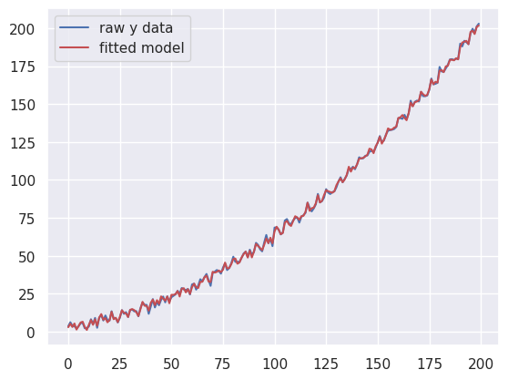

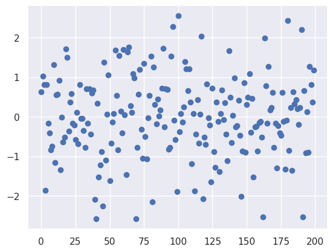

## Returning to the climate change problem

Now that we have all the tools in our hands, let's apply them to the real problem.:

? *Is the trend in average temperature statistically significant, after controlling for components that can be explained by seasonal components or ENSO index?*

The temperature versus time in Middlesex County that we've obtain before is the following one. 

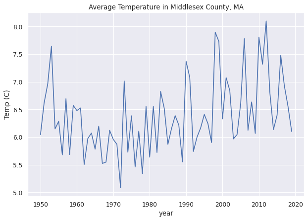

*Do we need to adjust the scale?* 

In this case it does not seem to be necessary to make any log or other kind of adjustment as the variance does not change much throughout the time series.

### Fitting a linear trend

*Should we fit a linear trend?*

To answer this question we start our exploratory analysis. Let's fit a linear regression and vizualize the results and its residuals.

```python
sns.regplot(x=subset.year, y=subset.tAvg)
plt.show()
clf = linear_model.LinearRegression()
clf.fit(year, temp)
print(clf.coef_,clf.intercept_)
linear_residuals = temp - clf.predict(year)
plt.plot(linear_residuals, 'o')
[[0.01144365]] [-16.32905344]
```

The two plots generated by the code are shown below. The first one depicts the data and the linear fit line. We can observe a clear linear trend, therefore it makes sense to remove this trend from the raw data.
 
 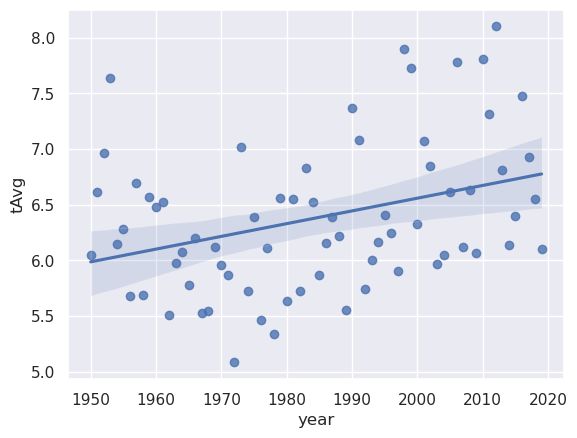

The second plot shows the residuals.

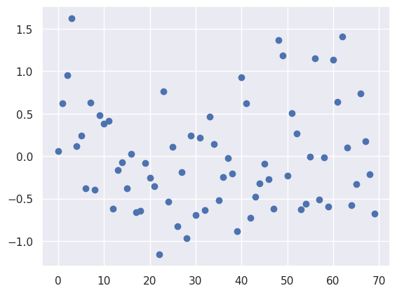 

### Fitting a seasonal trend

Now we'll examine the existence of a seasonal trend via the ACF/PACF plots. 

```python
sm.graphics.tsa.plot_acf(linear_residuals, lags=20)
plt.show()
sm.graphics.tsa.plot_pacf(linear_residuals, lags=20)
plt.show()
```

The ACF/PACF plots show one or two signals above the error level but the periodicity of this signals is very weak or insignificant. 

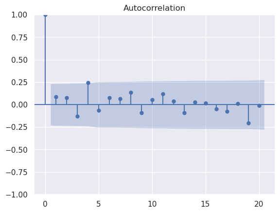

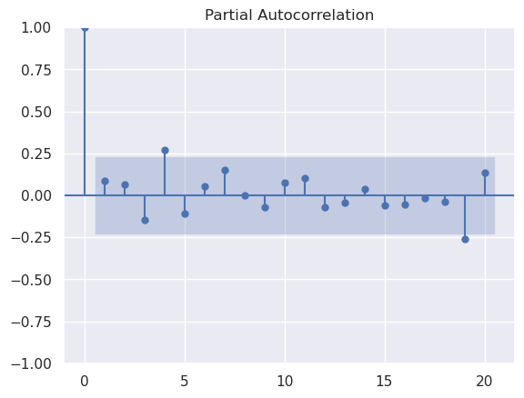

Despite that, we will go through the process to find the periodicity. First, we need to test different values within a reasonable range as shown in the code below. In this case we will scan from $T=1$ to $T=20$ years, where the latter value matches the maximum lag of the ACF/PACF analysis. For each period value we calculate the mean squared error of the residuals and find the minimum MSE.  The `sine_function` was already describe in detail before so we will not do it again.

```python
from scipy import optimize
period_range = np.arange(1, 20)
mse_list = []

def find_sine_approximation(period, x_data=year, y_data=temp):
  """
  Finds a best-fitting sinusoidal approximation, for the given period. 
  """
  def sine_function(X, amp, phase_shift, mean):
    return (amp * np.sin(1/period * 2 * np.pi * (X - phase_shift)) + mean)
  params, _ = sine_curve_fit = optimize.curve_fit(
    f = sine_function,
    xdata = x_data.flatten(),
    ydata = y_data.flatten(),
    p0 = np.array([3, 1, 0]))
  amp, phase_shift, mean = params
  sin_prediction = sine_function(x_data, amp, phase_shift, mean)
  return sin_prediction

for period in period_range:
  sin_prediction = find_sine_approximation(period, year, linear_residuals)
  mse = np.nanmean((linear_residuals - sin_prediction) **2)
  mse_list.append(mse)
plt.plot(period_range, mse_list)
plt.ylabel('MSE'),plt.xlabel('Period')
plt.show()
period_guess = period_range[np.argmin(mse_list)]
print("minimizing period is:", period_guess)
sin_residuals = linear_residuals - find_sine_approximation(period_guess, year, linear_residuals)
minimizing period is: 12
```

The plot shows that the optimized period is located at $P=12 years$. **However, the gain in detrending this signal does not seem significative (goes from a MSE of 0.3875 to 0.3675).

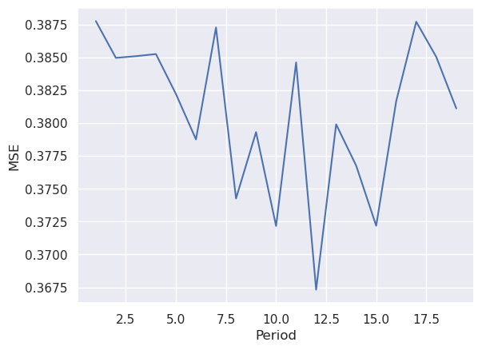

### External regressor: the El Niño index

If we plot the residuals we can observe that there is still a signal in the detrended data. **In fact very little has changed.**

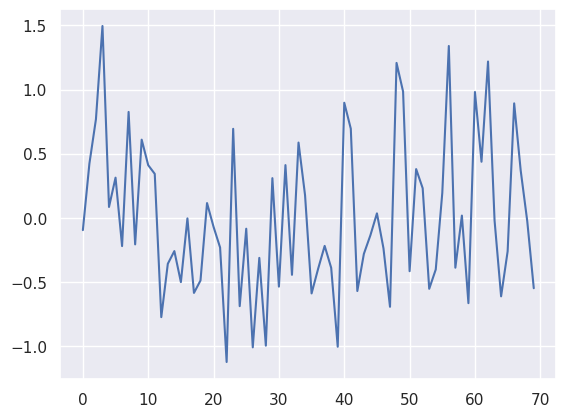

From scientific research we know that the "El Niño" phenomenon may impact global temperatures. Let's see if we can find a correlation between our residuals and ENSO data.

Here we will use the "ONI" variable which is a measure of how anomalously warm or cool the central-to-eastern equatorial Pacific Ocean is compared to "normal".

```python
enso_df = pd.read_csv('https://raw.githubusercontent.com/maxoboe/6419_recitations/main/data/enso_index.csv')
ONI = enso_df[enso_df.year.isin(climate_df.year)]['ONI_index'].values.reshape(-1,1)
plt.plot(year, ONI)
plt.title("ENSO Index Over Time")
plt.ylabel("ONI")
```

The following plot shows the ONI index versus time. 

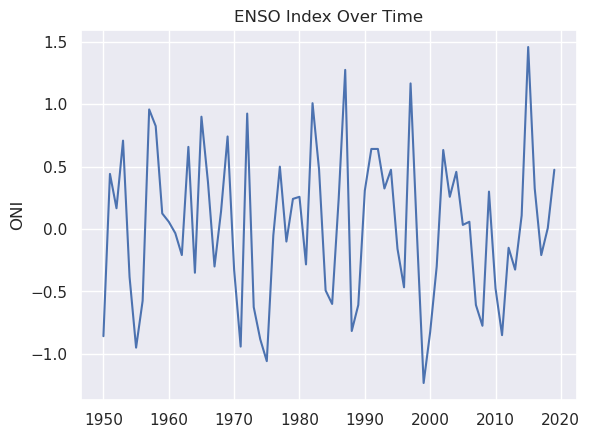

Ok, seems promising. Let's plot the residuals versus the ONI index. 

```python
plt.scatter(linear_residuals, ONI)
stats.spearmanr(linear_residuals,ONI)
SignificanceResult(statistic=-0.12904975717128836, pvalue=0.28699964373818654)
```

We readily observe no correlation with the linear trend residuals, which is confirmed by the value of the statistic $= -0.13$.From here we would conclude we shouldn't include the ENSO data in our model.

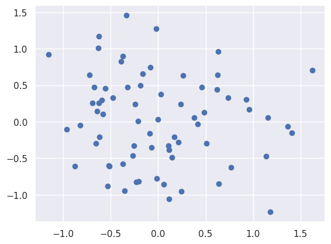

### Do we need to find ARMA components?

Nope. There is no evidence for AR/MA components from the ACF/PACF plots. 

### Model selection

Finally, we will test each combinations of models simultaneously using the following code.

```python
min_AIC=np.inf # starting values
min_BIC = np.inf # starting values
AIC_choice = None
BIC_choice = None

for period in [None] + [x for x in range(2, 13)]: #range of periods from none to 13
  for order in [0, 1]:                            #range of orders (0 and 1)
    for exog, exog_label in zip([ONI, None], ['ONI',None]): # range of exog from ONI to None
      det_comp = DeterministicProcess(year.flatten(), period=period, constant=True,
                                      order=order, seasonal=period is not None)
      model = AutoReg(temp, exog=exog, deterministic=det_comp, lags=None, 
                      trend='n',seasonal=False).fit()
      # print("Model has period {}, order {}, exog {}".format(period, order, exog_label))
      # print("AIC", model.aic, "BIC", model.bic )
      # print("-"*20)
      if model.aic < min_AIC:
        AIC_choice = (period, order, exog_label)
        min_AIC = model.aic
      if model.bic < min_BIC:
        BIC_choice = (period, order, exog_label)
        min_BIC = model.bic 
print('AIC_choice: Period = ',AIC_choice[0],'Polynomial order = ',AIC_choice[1],'External regressor = ',AIC_choice[2])
print('BIC_choice: Period = ',BIC_choice[0],'Polynomial order = ',BIC_choice[1],'External regressor = ',BIC_choice[2])
AIC_choice: Period =  None Polynomial order =  1 External regressor =  None
BIC_choice: Period =  None Polynomial order =  1 External regressor =  None
```

From the results we can conclude that a linear model is the most likely (and simplest) candidate to fit our data. 

If we fit our data we obtain the following two plots from the code below.

```python
period, order, exog = AIC_choice
det_comp = DeterministicProcess(year.flatten(), period=period, order=order, constant=True, seasonal =period is not None)
model = AutoReg(temp, exog=exog, deterministic=det_comp, lags=None, trend='n',seasonal=False).fit()
model_predictions = model.predict()
plt.plot(year, temp, label='average temp')
plt.plot(year, model_predictions, 'r', label='fitted line')
plt.legend()
plt.show()
residuals = temp - model_predictions.reshape(-1,1)
plt.plot(year, residuals,'o');
plt.show()
print(model.summary())
```

The first one shows the data and the linear fit in red. The second one depicts the residuals.

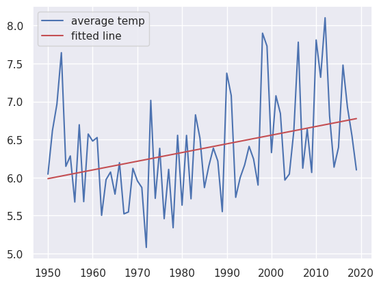

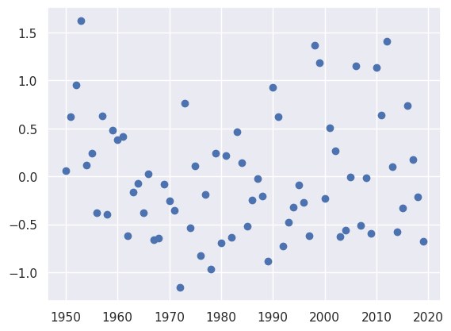

Finally the code also output the table from the `Autoreg` function. We observe a very low p-value for the linear fit coefficient which gives confidence in our results.

```python
AutoReg Model Results                             
==============================================================================
Dep. Variable:                      y   No. Observations:                   70
Model:                     AutoReg(0)   Log Likelihood                 -66.167
Method:               Conditional MLE   S.D. of innovations              0.623
Date:                Mon, 29 Jan 2024   AIC                            138.335
Time:                        15:20:56   BIC                            145.080
Sample:                             0   HQIC                           141.014
                                   70                                         
==============================================================================
                 coef    std err          z      P>|z|      [0.025      0.975]
------------------------------------------------------------------------------
const          5.9746      0.150     39.708      0.000       5.680       6.270
trend          0.0114      0.004      3.107      0.002       0.004       0.019
==============================================================================
```