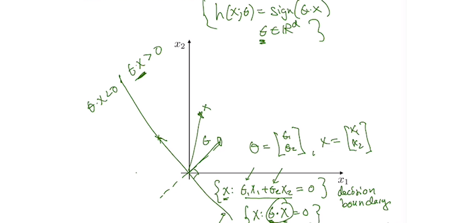

# The Mauna Loa $CO_2$ concentration

## Introduction

In 1958, Charles David Keeling (1928-2005) from the Scripps Institution of Oceanography began recording carbon dioxide ($CO_2$) concentrations in the atmosphere at an observatory located at about 3,400 m altitude on the Mauna Loa Volcano on Hawaii Island. The location was chosen because it is not influenced by changing $CO_2$ levels due to the local vegetation and because prevailing wind patterns on this tropical island tend to  bring well-mixed air to the site. 

While the recordings are made near a volcano (which tends to produce $CO_2$), wind patterns tend to blow the volcanic $CO_2$ away from the recording site. Air samples are taken several times a day, and concentrations have been observed using the same measuring method for over 60 years. In addition, samples are stored in flasks and periodically reanalyzed for calibration purposes. The observational study is now run by Ralph Keeling, Charles's son. The result is a data set with very few interruptions and very few inhomogeneities. It has been called the “most important data set in modern climate research."

Let $C_i$ be the average $CO_2$ concentration in month $i$ ($i=,1,2...$). We want to look for a form of the type

$$
C_i = F(t_i) + P_i + R_i,
$$

where: 

- $F(t_i)$ accounts for the long-term trend 
- $t_i$ is the time at the middle of the $ith$ month, measured in fractions of years after Jan 15 1958. Specifically we take 

$$
t_i = \frac{i+0.5}{12}, i = 0,1,...,
$$

where $i$ = 0 corresponds to January 1958. We add 0.5 because the first measurement is halfway through the month.
- $P_i$ is periodic in $i$ with a fixed period, accounting for the seasonal pattern.
- $R_i$ is the remaining residual that accounts for all other influences.

## Data

The input data for this example can be found in the file `CO2.csv` under the folder `data_and_materials`. It provides the concentration of CO2 recorded at Mauna Loa for each month starting March 1958. Here, we will consider only the $CO_2$ concentration given in column 5, which is unadjusted. 

First we load the libraries and the data.

```python
import numpy as np
import math
import scipy as sp
import scipy.stats as st
import matplotlib as mp
import matplotlib.pyplot as plt
import pandas as pd
import statsmodels.sandbox.stats.multicomp as multi
from sklearn.linear_model import LinearRegression
from sklearn.model_selection import train_test_split
from sklearn.metrics import mean_absolute_percentage_error,mean_squared_error

df = pd.read_csv('data_and_materials/CO2.csv',sep=',',skiprows=57,header=None)
df.columns=('yr','mn','datem','date','co2','season','fit','seasonf','co2_2','season_2')
t = np.array((df.index+0.5)/12) #rearranged time index
```

## Pre-processing data

After a quick look at the data we observe that there are missing values in the data of interest (column `co2`) expressed by the number $-99.99$. 

```python
df2 = df[df['co2']!=-99.99] #remove all values with missing CO2
t2 = t[df['co2']!=-99.99]
```

In this particular case we'll just drop the missing values because we have enough data points. Other alternatives would be to forward-fill missing values, average them or use interpolation. Also, we need to reshape the time array as shown in the code below.

```python
x = np.array(t2.reshape(-1,1))
y = df2.copy()
```

We will start the analysis by plotting our data. 

```python
plt.plot(x,y['co2'])
plt.xlabel('time (years)'),plt.ylabel('CO2 concentration (ppm)')
```


We observe an upward trend and a short term variability.

## Linear fit

Our first step in terms of model construction will be to try to fit a linear regression to the data. Here we will use a training-testing approach with 20% of the data randomly assigned for testing via the `train_test_split` function of the `sklearn.model_selection` package. To perform the linear regression we use the function `LinearRegression` from the ` sklearn.linear_model` package. We also compute the mean squared error and the mean absolute percentage error.

```python
x_train,x_test,y_train,y_test = train_test_split(x,y,test_size=0.20,shuffle=True)
lr = LinearRegression().fit(x_train,y_train)
print('Slope:',lr.coef_[0], '| Intercept',lr.intercept_)
print('RMSE:',mean_squared_error(y_test,ypred_test,squared=False))
print('MAPE:',mean_absolute_percentage_error(y_test,ypred_test)*100)
Slope: 1.5681723482042962 | Intercept 305.9069030985543
RMSE: 4.166763700749321
MAPE: 0.9410328547751814
```

If we calculate the coefficient of determination we will obtain a very good value. This, along with the small MAPE portraits a good outlook for the model.

```python
lr.score(x_test,y_test),lr.score(x_train,y_train)
(0.9767837845369832, 0.9767595805451984)
```

However, when we plot again the data with the linear regression and its residuals we get a very different picture!

```python
ypred = lr.predict(x)
plt.plot(x,y['co2'],label='data')
plt.plot(x,ypred,'r',label='linear fit') #plot of the fit + data
plt.xlabel('time (years)'),plt.ylabel('CO2 concentration (ppm)')
plt.show()
resid = y['co2']-ypred.flatten()
plt.plot(x,resid,'.') #plot of the residuals
plt.xlabel('time (years)'),plt.ylabel('CO2 residuals(ppm)')
plt.show()
```


There is an obvious trend that was overlooked. The residuals look quadratic in shape so we'll try and fit a quadratic fit.

## Quadratic fit

In order to do this we'll just linearize the equation. Therefore we will create a new variable equal to time squared and stacked them with the linear term. Then we train-test split again and do the usual linear regression.

```python
x2 = np.column_stack((x,x**2))
x_train2,x_test2,y_train2,y_test2 = train_test_split(x2,y,test_size=0.20,shuffle=True)
lr2 = LinearRegression().fit(x_train2,y_train2['co2'])
print('Coefficients:',lr2.coef_,' | Intercept',lr2.intercept_)
ypred_test2 = lr2.predict(x_test2)
print('RMSE:',mean_squared_error(y_test2['co2'],ypred_test2,squared=False))
print('MAPE:',mean_absolute_percentage_error(y_test2['co2'],ypred_test2)*100)
Coefficients: [0.7541035  0.01311819]  | Intercept 314.44436484756886
RMSE: 2.2464018887138573
MAPE: 0.529222614510803
```

We observe that the RMSE and MAPE values dropped to half. Also the coefficient of determination is almost one.

```python
lr2.score(x_test2,y_test2['co2']),lr2.score(x_train2,y_train2['co2'])
(0.9939947348069286, 0.9936396430856269)
```

We can observe the difference by plotting the data with the quadratic fit and its residuals.

```python
ypred2 = lr2.predict(x2)
plt.plot(x,y['co2'],label='data')
plt.plot(x,ypred2,label='quadratic fit')
plt.xlabel('time (years)'),plt.ylabel('CO2 concentration (ppm)')
plt.legend()
plt.show()
#residuals
plt.plot(x,y['co2']-ypred2,'.')
plt.xlabel('time (years)'),plt.ylabel('CO2 residuals (ppm)')
plt.show()
```




It looks much better! We may try a cubic model but we known the result would be worse on the top of an increase in complexity.

## Fitting a periodic signal

The residuals are low. However there seems still to be some kind of trend there. Let's now try to fit a periodic signal.

It is hard to observe a periodic signal in the residuals, so we'll concentrate the data by averaging for each month. In the end we get one data point for each month.

Fortunately we already have the data discriminated by month in the field `mn`. We order the data with the following code to get the yearly periodic signal. 

```python
ypred_train2 = lr2.predict(x_train2)
res = y_train2['co2']-ypred_train2 #remove the deterministic trend from the data
y_train2['res'] = res #adding the residuals to the dataframe
```

