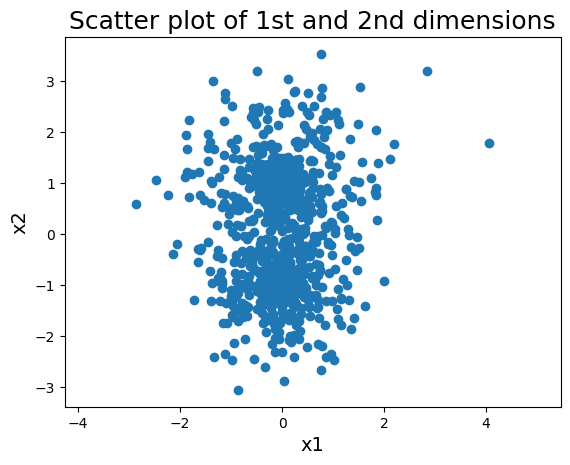
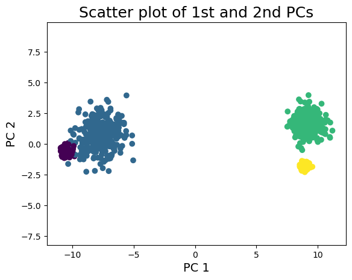
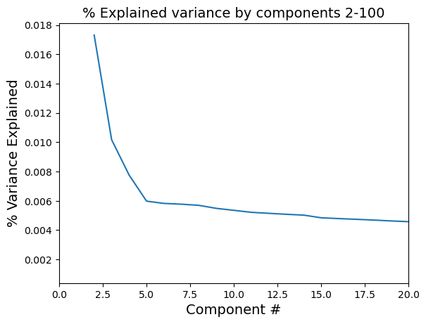
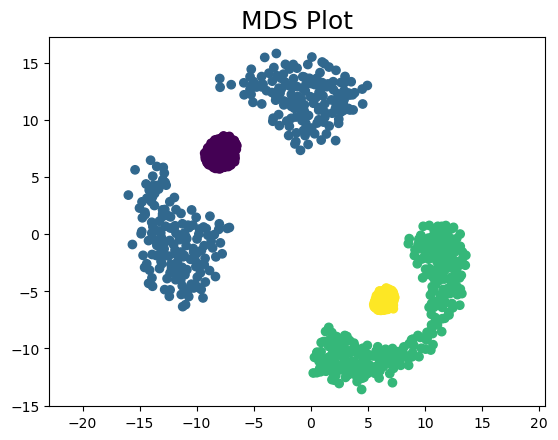
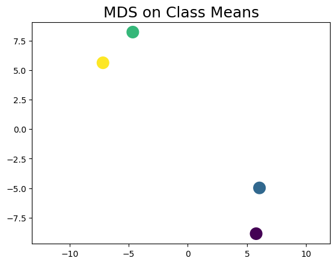

# Clustering with high-dimensional data


Clustering aims to group data points together so that within the same group the observations are very similar while between different groups the observations are very different, according to some dissimilarity rule.

**Note: The data points do not need to come with any labels.** 

Often, clustering is used as a way to decide what and how many class labels are suitable for the data set. 

**For example, we may want to cluster gene expression data into groups that will characterize different cell types in a blood sample.**

Other examples:
  - Find customer groups to adjust advertisement
  - Find subtypes of diseases to fine-tune treatment

In a naïve approach we may try to assign data to clusters using *brute force* methods. However, we quickly find that it is impossible to search through all assignments as it scales with $k^N$, where $k$ is the number of clusters and $N$ the sample size.

Therefore we need smarter approaches to this problem.

## K-means

K means start with a pre-defined number of clusters $K$ and aims at minimizing the value of the **within group sum of squares (WGSS)**:

$$
WGSS = \sum_{k=1}^N\sum_{x^{{i}},x^{(j)} \in C_k} |x^{(i)}-x^{(j)}|^2,
$$

where the $k$ indexes the K different clusters, $C_k$ denotes the $k$-th cluster and $|x^{(i)}-x^{(j)}|$ is the euclidean distance between the data points $i$ and $j$.

The WGSS measures how dissimilar data points in the same cluster are. To find an algorithm to minimize WGSS, it helps to first rewrite WGSS in terms of the means $\mu_k = \sum_{x^{(i)} \in C_k} x^{(i)}/n_k$ of each cluster $C_k$.

$$
WGSS = \sum_{k=1}^N\sum_{x^{{i}},x^{(j)} \in C_k} |(x^{(i)}-\mu_k) - (x^{(j)}-\mu_k)|^2 = \cdots \\
= 2 \sum_{k=1}^K |(x^{(i)}-\mu_k)|^2.
$$

### K-means algorithm

1. Initialize the K means ${\mu_k}_k=1,...,K to random positions.

Then repeat 2. and 3. until convergence.

2. Cluster assignment. Cluster each point with the closest centroid $\mu_k$. Call the set of all points in the cluster $C_k$.
3. Centroids update. Update all centroids $\mu_k$ to be the average position of all points assigned to $C_k$ in the step above.

**Note: K-means does not guarantee convergence to the global minimum. Therefore it is necessary to conduct multiple runs starting with different random initializations. This is more effective when the number of clusters is small.**

### K-medoids

There are two limitations with K-means:
- Its results are sensitive to outliers.
- The cluster centroids are not necessarily data points

In order to overcome these issues, it is possible no modify the algorithm and use medoids instead of means. The medoid is just the data point of a cluster closest to its mean.

### Optimizing K

One heuristic method to determine the number of clusters K is the **elbow method**. 

Plot the loss function WGSS as a function of K and pick the K corresponding to the "elbow" of the plot. For instance, according to the plot below, the best choice for K is 3. Basically what is important here is to balance how much information each cluster provides is with the number of clusters: after some number $k$ the new information gained is very small.


## Gaussian mixture models

Clustering using Gaussian mixture model (GMM) generalizes $K$-mean in two ways:

- Cluster assignment is based on the probabilities of the data point being generated by the different clusters.

- The shape of the clusters can be elliptical rather than only spherical.

Consider the Gaussian mixture model of $K$ Gaussians. We can write the probability of obtaining the observation $\mathbf{X}$ as

$$
P(\mathbf{X}) = \sum_{k=1}^K p_k P(\mathbf{X}|cluster\ k)
$$

where

$$
p_k = P(cluster\ k)
$$

is the missing proportion of each cluster, and

$$
\mathbf{X}|cluster\ k \sim \mathcal{N}(\mu_k,\Sigma_k). 
$$

$P(X|cluster\ k)$ is the probability of obtaining the observation $\mathbf{X}$ given that it is generated by the model for cluster $k$. This mixture has parameters $\theta = \{p1,...,p_k,\mu_1,...,\mu_K,\Sigma_1,..,\Sigma_K\}$. They correspond to the missing proportions, means and covariance matrices of each of the $K$ gaussians respectively.

Given $n$ data points, $x^{(1)},...,x^{(n)} \in \mathbb{R}^d$, our goal is to optimize $\theta$ in order to maximize the data log-likelihood, where

$$
l(x^{(1)},...,x^{(n)};\theta) = \log{\prod_{i=1}^n P(x^{(i)};\theta)} = \sum_{i=1}^n\log{\left[\sum_{k=1}^n p_k P(\mathbf{x}^{(i)}|\text{cluster k};k)\right]}.
$$

**However, there is no closed-form solution to the parameter set $\theta$.**

### The EM algorithm

The **Expectation-Maximization algorithm** (or EM algorithm) is an iterative algorithm that finds a locally optimal solution $\hat{\theta}$ to the GMM likelihood maximization problem.

It involves two steps. 

1. The **E step** involves finding the posterior probability $p(k|i) = P(\text{cluster k}|x^{(i)};\theta)$ that point $x^{(i)}$ was generated by cluster $k$, for every $i=1,...,n$ and $k=1,...,K$. This step assumes the knowledge of the parameter step $\theta$. The posterior is calculated using the Bayes' rule,

$$
p(k|i) = P(\text{cluster k}|x^{(i)};\theta) = \frac{p_k P(x^{(i)}|\text{cluster k};\theta)}{P(x^{(i)};\theta)} = \frac{p_k\mathcal{N}(x^{(i)};\mu^{(k)},\Sigma_k)}{\sum_{j=1}^K\mathcal{N}(x^{(i)};\mu^{(j)},\Sigma_j)}.
$$

2. The **M step** maximizes the **expected log likelihood** function $\tilde{\ell}(x^{(1)},...,x^{(n)};\theta)$, which is a lower bound of the log-likelihood. The algorithm is therefore going to push the data likelihood upwards.

$$
\tilde{\ell}(x^{(1)},...,x^{(n)};\theta) = \sum_{i=1}^n\left[ \sum_{k=1}^K p(k|i)\log{\left( \frac{P(x^{(i)},\text{cluster k};\theta)}{p(k|i)}\right)}\right] = \tilde{\ell}(x^{(1)},...,x^{(n)};\theta) 
$$
$$
= \sum_{i=1}^n\left[ \sum_{k=1}^K p(k|i)\log{\left(\frac{p_k\mathcal{N}(x^{(i)};\mu^{(k)},\Sigma_k)}{p(k|i)}\right)}\right]
$$

This expected log-likelihood function is a lower bound on the actual log-likelihood, 

$$
{\ell}(x^{(1)},...,x^{(n)};\theta) = \sum_{i=1}^n\log{\left[ \sum_{k=1}^K  P(x^{(i)},\text{cluster k};\theta)\right]}.
$$

due to Jensen's inequality.

In the special case where the covariance matrix is $\Sigma_k = \sigma_k^2 \mathbf{I}$, the parameters that maximiz the expected log-likelihood function are as follows:

$$
\hat{\mu}^k = \frac{\sum_{i=1}^n x^{(i)}p(k|i)}{\sum_{i=1}^n p(k|i)}
$$
$$
\hat{p}_k = \frac{1}{n}\sum_{i=1}^n p(k|i),
$$
$$
\hat{\sigma}_k^2 = \frac{\sum_{i=1}^n p(k|i)|x^{(i)}-\hat{\mu}^k|^2}{\sum_{i=1}^n p(k|i)}.
$$

The E and M steps are repeated iteratively until there is no noticeable change in the actual likelihood computed after M step using the newly estimated parameters or if the parameters do not vary by much.

#### Initialization

For the initialization it is possible to 

- do a random initialization of the parameter set $\theta$.
- employ a k-means to find the initial cluster centers of the $K$ clusters and use the global variance of the dataset as the initial variance of all the $K$ clusters.  In the latter case, the mixture weights can be initialized to the proportion of data points in the clusters as found by the k-means algorithm.

### Optimizing K

In the context of GMM, the optimization of the number of clusters can be found by, for instance, maximizing the **Bayesian Information Criterion** (BIC), where

$$
BIC = \text{log-likelihood} - \frac{\log{n}}{2} \text{\# of parameters}.
$$

## Hierarchical clustering

Hierarchical clustering does not start with a fixed chosen number of clusters, but builds a hierarchy of clusters with different levels corresponding to different numbers of clusters.

Advantages of hierarchical clustering:

- solves clustering for all possible numbers of clusters $1,2,...,n$ all at once.
- can choose desired number of clusters *a posteriori*.

We can use a bottom-up or top-down approach:

- Agglomerative clustering (Bottom-Up)

or 

- Divisive clustering (Top-down)

**Here we will detail the bottom-up approach.**

### Agglomerative Clustering

Agglomerative clustering starts with 1 data point per cluster and, at each stage, merges pairs of clusters that are the closest together, according to a dissimilarity measure.


The merging can be graphically be depicted by a tree, also known as **dendogram**. The bottom most level has $n$ clusters (of 1 observation each), and the merging occurs as the levels go up. The number of clusters decreases, and the top-most level only has 1 cluster comprising all data. 

#### Dissimilarity between clusters

In order to choose which pair of clusters to merge at each stage, we need to define a dissimilarity measure between clusters, and the dissimilarity measure between clusters is often based on dissimilarity between points. A few commonly used distances between individual points are:

- $l^2$ norm, i.e. the usual Euclidean distance

$$
d(\mathbf{x}^{(i)},\mathbf{x}^{(j)}) = \sqrt{\left(x_1^{(i)}-x_1^{(j)}\right)^2 + \left(x_2^{(i)}-x_2^{(j)}\right)^2 + ... + \left(x_p^{(i)}-x_1^{(p)}\right)^2}, \mathbf{x}^{(i)} \in \mathbb{R}^p
$$

- $l^1$ norm (also known as Manhattan distance)

$$
d(\mathbf{x}^{(i)},\mathbf{x}^{(j)}) = |x_1^{(i)} - x_1^{(j)}| + |x_2^{(i)} - x_2^{(j)}| + ... + |x_p^{(i)} - x_p^{(j)}|, \mathbf{x}^{(i)} \in \mathbb{R}^p
$$

- $\lambda^\infty$ norm (i.e. the maximum distance among all coordinates)

$$
d(\mathbf{x}^{(i)},\mathbf{x}^{(j)}) = \max_{k=1,...,p} |x_k^{(i)} - x_k^{(j)}|, \mathbf{x}^{(i)} \in \mathbb{R}^p.
$$

Now we can define dissimilarity measures between clusters:

- Minimum distance between points in two clusters, known as **single linkage**

$$
d(C_1,C_2) = \min_{x^{(i)} \in C_1,x^{(j)} \in C_2} d(x^{(i)},x^{(j)}).
$$

- Maximum distance between points in two clusters, known as **complete linkage**

$$
d(C_1,C_2) = \max_{x^{(i)} \in C_1,x^{(j)} \in C_2} d(x^{(i)},x^{(j)}).
$$

- Average distance between points in two clusters, known as **average linkage**

$$
d(C_1,C_2) = \frac{1}{n_1n_2}\sum_{x^{(i)}\in C_1}\sum_{x^{(j)}\in C_2}d(x^{(i)},x^{(j)}).
$$

*How do the resulting clusters look like? Which is which?*


*The colors show the different clusters.*

### Optimizing K

- There are no strict rules.
- Rule of thumb: find the larges vertical "drop" in the tree.


*In this case we assume the largest drop is where K=3. It is always useful to check the end result on the left.*

## DBSCAN

**Density-based spatial clustering of applications with noise** (DBSCAN) aims to cluster together points that are close to each another in a dense region, and leave out points that are in low density regions.

Let two points be **connected** if they are within a distance $\epsilon$ of one another. a **core point** is a point that is connected to at least $k$ other points, where $k$ is a measure of **core strength**.

- Two points are placed in the same cluster if and only if there is a connecting path between them **consisting of only core points**, except possibly at the ends of the path. 

Let's observe the following figure.


In this diagram the blue points are core points with core strenth $k=4$, since they are connected to at least four other points. Two clusters are formed. In each cluster, each non-core (black) point is connected to a core point (blue). The points not connected to any core points are **outliers** and are part of no cluster in DBSCAN.

## Silhouette plot

A silhouette plot helps us measuring the quality of cluster assignments. 

The **silhouette score** of a data point $\mathbf{x}^{(i)}$ is defined as

$$
S(x^{(i)}) = \frac{b(x{(i)}-a(x^{(i)}))}{\max{(b(x^{(i)}),a(x^{(i)}))}}
$$

where 

$$
a(x^{(i)}) = \frac{1}{n_i-1}\sum_{x^{(j)}\in C_i,j\ne i} d(x^{(i)},x^{(j)})
$$

is the average "within group" distance or dissimilarity from $x^{(i)} and

$$
b(x^{(i)}) = \min_{C_k\ne C_i}\frac{1}{n_k}\sum_{x^{(j)}\in C_k} d(x^{(i)}x^{(j)})
$$

is the average distance or dissimilarity from $x^{(i)} to the closest other cluster.

# Examples

In this example we will use synthetic data generated from a gaussian mixture model (4 gaussian mixtures with different means and covariance matrices).

The function below will be used to generate the data.

```python
import numpy as np
import matplotlib.pyplot as plt

from scipy.stats import ortho_group # Used for random rotation of covariance matrix

# Samples a Gaussian mixture with provided means and covariances. Optionally returns ground truth labels
def sample_gmm(n, mu, cov, return_labels=True):
    data = np.vstack([np.random.multivariate_normal(mu[i], cov[i], size=n//mu.shape[0]) for i in range(mu.shape[0])])
    labels = np.hstack([i*np.ones(n//mu.shape[0]) for i in range(mu.shape[0])])
    perm = np.random.permutation(data.shape[0])
    if return_labels:
        return data[perm], labels[perm]
    return data[perm]
```

To create the GMM we need to first set up the model parameters.

1. The averages across 100 data points (4x100 matrix)

```python
d = 100 #number of dimensions
mu = np.zeros((4,d))
mu[0,1:]=1
mu[1,1:40]=1
mu[1,40:]=0.5
mu[2,1:]=-1
mu[3,1:95]=-1
mu[3,96]=2
```

2. The covariance matrices. Covariance structure: 0 and 3: small isotropic, 1: large spike and randomly rotated covariance, 2: medium isotropic.

```python
np.random.seed(350) #same seed for testing purposes
cov=np.zeros((4,d,d))
cov[0] = 0.05*np.eye(d) #small isotropic
rot = ortho_group.rvs(d)
mat = np.eye(d)
mat[0,0] = 3.0
mat[1,1] = 1.0
cov[1] = np.dot(rot, np.dot(mat,rot.T)) #large spike with rotated covariance
cov[2] = 0.5*np.eye(d) #medium isotropic
cov[3] = 0.02*np.eye(d) #smallest isotropic
```

Then we generate 1200 models with 

```python
X,y=sample_gmm(1200,mu,cov) #X - 1200x100 Mx; y - 1200 label vector [0 to 3]
```

## Data visualization

First of all we can plot the data as is. For instance, we can plot the first and the second dimension of the data (out of 100 dimensions) with the following code.

```python
plt.scatter(X[:,0],X[:,1])
plt.title("Scatter plot of 1st and 2nd dimensions",size=18)
plt.xlabel("x1",size=14)
plt.ylabel("x2",size=14)
plt.axis("equal")
plt.show()
```



Looking at the dots in the scatter plot it is not clear what is the data structure.

If we have labelled data, as it is the case of our data we can use it to enhance the visualization of our "ground truth".

```python
# Ground truth
plt.scatter(X[:,0],X[:,1],c=y)
plt.title("Scatter plot of 1st and 2nd dimensions",size=18)
plt.xlabel("x1",size=14)
plt.ylabel("x2",size=14)
plt.axis("equal")
plt.show()
```

Using that information we obtain the following plot


From here we can observe what seems to be two main structures, but it is still very messy. 

### PCA

PCA can produce an informative visualization where global structure and distances are preserved. Let's use the `sklearn-decomposition` package and import the PCA tool. Using this tool we'll transform our data onto its principal components.

**Note: if we don't specify the number of PCAs by default the tool will compute the first 100 PCAs. This can be very slow if we have a lot of dimensions! In our case, it will compute the 100 PCAs in 0.2 seconds!**

```python
from sklearn.decomposition import PCA
pca = PCA() # Initialize with n_components parameter to only find the top eigenvectors
z = pca.fit_transform(X)
```

From the computed data we create a scatter plot using the code below

```python
plt.scatter(z[:,0],z[:,1])
plt.title("Scatter plot of 1st and 2nd PCs",size=18)
plt.xlabel("PC 1",size=14)
plt.ylabel("PC 2",size=14)
plt.axis("equal")
plt.show()
```


Now we're seeing some structure! We see two larger clusters and one or two smaller clusters. As further apart the clusters are the more dissimilar they are.

Using our privileged information about the labels, we can color up our plot

```python
# With labels
plt.scatter(z[:,0],z[:,1],c=y)
plt.title("Scatter plot of 1st and 2nd PCs",size=18)
plt.xlabel("PC 1",size=14)
plt.ylabel("PC 2",size=14)
plt.axis("equal")
plt.show()
```



where we observe that, indeed, we have 4 clusters.

From our discussion above, we saw that we could use the **Scree/Elbow plot** to decide the number of clusters to use. In the context of PCA this translates into the number of PCAs.

```python
plt.plot(np.arange(1,101),pca.explained_variance_ratio_[0:100])
plt.title("% Explained variance by component",size=18)
plt.xlabel("Component #",size=14)
plt.ylabel("% Variance Explained",size=14)
plt.show()
```


The plot shows a huge drop of the \% of variance right after the first PCAs...*but how many?* It is not clear, we need to zoom in.

```python
plt.plot(np.arange(2,101),pca.explained_variance_ratio_[1:100])
plt.title("% Explained variance by components 2-100",size=14)
plt.xlabel("Component #",size=14)
plt.ylabel("% Variance Explained",size=14)
plt.xlim(0,20)
plt.show()
```



From the Figure it is clear that the optimal number of PCAs is 5.

Quantitatively we have that each of the first five PCAs contribute 

```python
pca.explained_variance_ratio_[0:5]
array([0.66738202, 0.01731062, 0.01016968, 0.00776102, 0.0059808 ])
```

Summing everything up we obtain

```python
np.sum(pca.explained_variance_ratio_[0:5])
0.7086041492760643
```
of variance explained for the first five PCAs.

Ok, the first five PCAs can explain 70\% of the variance of the data. But what if I want a higher threshold, for instance, 85\%?

In that case, we can just calculate the cumulative variance explained and set a threshold at 0.85. In order to known the PCA threshold we just calculate the position of the cumulative sum with the numpy function `where` as shown in the code below.

```python
cumulative_sum = np.cumsum(pca.explained_variance_ratio_)
pca_num = np.where(cumulative_sum >=.85)[0][0] #index of cumsum @ 0.85
plt.plot(np.arange(0,100),cumulative_sum,label='cumulative sum')
plt.plot((pca_num,pca_num),(cumulative_sum[0],cumulative_sum[pca_num]),'r--',label='PCA threshold')
plt.arrow(37,0.75,3,0,width=0.001,head_length=1)
plt.text(42,0.745,'Threshold = 36')
plt.title("Cumulative Variance Explained",size=18)
plt.xlabel("Number of Components",size=14)
plt.ylabel("% Variance Explained",size=14)
plt.ylim(cumulative_sum[0],1.02)
plt.legend()
plt.show()
```
The generated Figure is shown below.


### MDS

As shown before, Multidimensional scaling (MDS) is a non-linear dimensionality reduction method to extract a lower-dimensional configuration from the measurement of pairwise distances (dissimilarities or disparities) between the points in a dataset.

In this example we will use the MDS function from the `sklearn.manifold` package. **This implementation can be quite slow with large $n$!** There are several parameters which can be tweaked. Basically, MDS from `sklearn.manifold` calculates a quantity called *stress* which is the sum of squared distance of the disparities for all constrained points. 

In our case we will use `n_components=2` because we want to see the results in a 2-D plot and `eps=1e-5` which is just a convergence factor. The code to generate the plot is shown below.

```python
# MDS can be slow when n is large
mds = MDS(n_components=2,verbose=1,eps=1e-5)
mds.fit(X)
plt.scatter(mds.embedding_[:,0],mds.embedding_[:,1],c=y)
plt.title("MDS Plot",size=18)
plt.axis("equal")
plt.show()
```



Using the label color code, we can observe that the MDS can separate the points. However it does separate the 'blue' points into two different clusters for some reason. This suggests that there is additional structure inside the 'blue' labeled points.

Also, more scatter mean more dissimilarity, in general terms. 

If we want a quicker or with less information, for instance if we have really a lot of data, we can reduce the data to its means, like in the following code:

```python
means = np.array([np.mean(X[np.where(y == i)],axis=0) for i in range(4)])
mds_means = MDS(2,verbose=1,eps=1e-8,n_init=10)
mds_means.fit(means)
plt.scatter(mds_means.embedding_[:,0],mds_means.embedding_[:,1],c=[0,1,2,3],s=200)
plt.title("MDS on Class Means",size=18)
plt.axis("equal")
plt.show()
```

This code produces the following plot. Of course we only obtain one point for each class.



We can observe that the points of the clusters and its means are not very far away from each other in terms of embedded space locations.

**It is worth noting that with every initialization we will obtain different results. However most of the times they will revolve around the same results.**

### T-SNE


