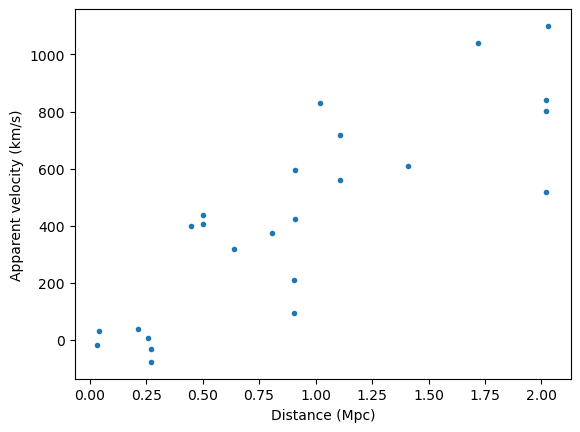
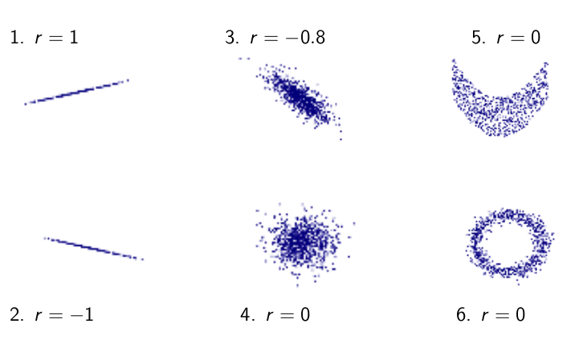
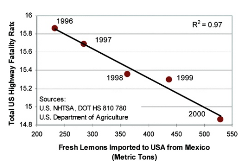

# Correlation and least squares regression - A general view

## Example from Astronomy

In this example we will investigate the correlation found by Edwin Hubble in 1930 from data from distant Galaxies.

He recorded the apparent velocity of these galaxies – the speed at which they appear to be receding away from us – by observing the spectrum of light they emit, and the distortion thereof caused by their relative motion to us. He also determined the distance of these galaxies from our own by observing a certain kind of star known as a Cepheid variable which periodically pulses. The amount of light this kind of star emits is related to this pulsation, and so the distance to any star of this type can be determined by how bright or dim it appears.

The following plot shows his data, where the X axis depicts the distance in mega-parsecs (Mpc) and the Y axis shows the apparent velocities in km/s. One mega-parsec is one million parsecs (one parsec is approximately 3.26 light-years).Positive values of velocities means the object is moving away from us, negative velocities away from us.



This figure help us visualize the relationship between the two variables? *Are they correlated?*

But first, let's calculate some basic quantities.

From the data we can calculate the sample averages and sample standard deviations. Using the *mean* and *std* commands from the numpy package we obtain

$$\hat{X} = 0.9199\ Mpc,$$

$$\hat{Y} = 425.6175\ km/s,$$

$$\sigma_X = 0.6534\ Mpc,$$

and

$$\sigma_Y = 348.7337\ km/s$$.

From the average value of the two variables we can calculate the sample covariance, which is defined as the amount that $X$ and $Y$ vary away from the mean **at the same time**. The covariance has a maximum when X and Y are perfectly correlated. This value is equal to

$$s^2_{X,Y} = \sigma_X\sigma_Y.$$ 

When X and Y are perfectly anti-correlated,

$$s^2_{X,Y} = -\sigma_X\sigma_Y.$$ 

Finally, when there is no correlation between X and Y (i.e. X and Y are independent), the value of the covariance is zero.

In our example the value of the sample covariance is

$$s^2_{X,Y} = 191.2071\ Mpc\ km/s.$$

*Ok, but what does this mean? How can we quantify the correlation in more precise terms?*

**We need a coefficient without units in order to have a standardized measure of the correlation!** We can write the correlation coefficient as

$$\rho_{X,Y} = \frac{s^2_{X,Y}}{s_Xs_Y} = \frac{1}{N+1}\sum_{i=1}^{N}\left(\frac{X_i-\hat{X}}{s_X}\frac{Y_i-\hat{Y}}{s_Y}\right),$$

where the covariance is now scaled by its maximum possible value. This means the maximum possible value of the correlation coefficient is 1, the minimum is -1, and having no correlation is still zero. The following plot shows some possible ranges of $\rho$.



In the figure we can observe that we must be very careful with the interpretation of the coefficient as the same value can correspond to different point distributions and to non-linearities. We also need to be careful with the outliers and understand their origin.

In our example we obtain a correlation value of

$\rho = 0.8391$.

This shows that there is a strong correlation between the two variables. This was a startling realization for Hubble, as it was largely unexpected in the scientific community. *Why should another galaxy's velocity depend on the distance to us ?* This gave origin to a whole new area in Astronomy called observational cosmology that led to the theory of the Big Bang!

Now, let's go further into our analysis! We know there exists a correlation between the distance and the velocity, but now we want to find an analytic model to this relationship. 

The most intuitive, which is also the best first approach in almost any problem is to try to find a linear relationship, which in this case is quite obvious from the observation of the previous figure. As we have two variables, we can write that

$$y = \beta_1 x + \beta_0 + \epsilon,$$

where $\beta_1$ is the slope of the linear model, $beta_0$ is the intercept, and $\epsilon$ is the noise model.

To identify the model parameters for a given dataset we define the **fitting error function**

$$E(\beta_0,\beta_1) = \sum_{i=1}^{N}{(\beta_1X_i + \beta_0-Y_i})^2,$$

which is the squared sum of the residuals (i.e. the difference between the predicted and the observed Y values).

To obtain $\beta_0$ and $\beta_1$ we need to minimize $E$. It is shown that the optimum values for the slope and intercept is achieved when

$$\hat{\beta}_1 = \frac{s^2_{X,Y}}{s^2_{X}} = \rho\frac{\sigma_Y}{\sigma_X},$$

and 

$$\hat{\beta}_0 = \overline{Y}-\hat{\beta}_1\overline{X}$$ 

respectively.

From here we can use this model to obtain predictors for Y:

$$\hat{Y}(X) = \hat{\beta}_1X+\hat{\beta}_0.$$

In our example we obtain 

$$\hat{\beta}_1 = 447.8706.$$

and

$$\hat{\beta}_0 = 13.6101\ km/s.$$

The value of the slope is what was then named the *Hubble constant*, which we now know that it is slowly increasing, which means in turn that the Universe is expanding!

### Goodness of fit metric

The least squares regression has a goodness of fit metric called coefficient of determination $R^2$. This coefficient is defined as

$$R^2 = 1-\frac{SumSq_{res}}{SumSq_{tot}},$$

where $SumSq_{res}$ is the sum of the squared residuals and $SumSq_{tot}$ is the total sum of the squares. 

We don't need to perform these calculation as it is known that 

$$R^2 = \rho.$$

### A brief historical note

The value of $\beta_1$ is known as the Hubble's parameter. Hubble's original value is close to the value we obtain here. However today's measurement is quite different! The original value is actually too large by a factor of between 6 and 7. 

Hubble didn't know at the time that there are two types of Cepheid variable stars, the stars he measured to obtain the distances to the galaxies, and the difference between them needs to be accounted for in order to accurately estimate the distance to other galaxies.

Even today this matter is not settled: the measurements of the parameter based on nearby galaxies disagrees with measurements based on the cosmic microwave background (which tells us about the early universe, and thus much greater distances). Hubble's parameter is critical to understanding the geometry of space-time in our universe, and its value and evolution in time still an open question to this day.

## Correcting simple non-linear relationships

If the underlying relationship in the data is non-linear, and in most cases it is, fitting a linear model may give poor results and can even be misleading: you may conclude that there is no relationship in the data (although a simple visualization does wonders!).

In general, fitting a non-linear relationship must be done using a non-linear regression (i.e. using a more complex model). However, if we have a simple nonlinearity, if we can clearly identify the underlying function by, for instance, looking at it in a plot, it can be possible to transform the nonlinear relationship into a linear one. 

Consider, for instance, that our data has an exponential trend that can be modelled as

$$Y=\alpha e^{\beta X},$$

where $\alpha$ and $\beta$ are two parameters. If we try to fit a linear relationship here it will fail miserably. However, if we take the log on both sides we obtain a linear form,

$$\ln{Y}=\beta X + \ln{\alpha},$$

where $\beta$ is the slope and $ln{\alpha} is the intercept. We can use the logarithm or the exponential in many situations as well as trying different functions as polynomials, powers, etc. **The basic rule of thumb is that we should choose the simplest model within the models which have a very similar (and very high) correlation coefficient.**

**We should note here a word of caution: the transformation will change the nature of the noise which in turn can interfere with the regression. It is thus very important to check how the transformation propagates to the error model.**

**Another note: correlation is not causation! Be careful!**



For instance if we have a relationship 

$$Y=\alpha e^{\beta X}\epsilon,$$

that has a multiplicative error model, then the transformation will be

$$\ln{Y}=\beta X + \ln{\alpha} + \ln{\epsilon}.$$

Also, if $\epsilon$ is small, a linear approximation can work well. However if $\epsilon$ is or becomes large we may have problems and a non-linear regression is needed.

### Solar system example as a cautionary tale

Consider the following data.

    Xs = np.array([ 0.387, 0.723, 1.00, 1.52, 5.20, 9.54, 19.2, 30.1, 39.5 ])

    Ys = np.array([ 0.241, 0.615, 1.00, 1.88, 11.9, 29.5, 84.0, 165.0, 248 ])

    N = 9

Each data point represents one planet in our solar system plus Pluto (we could not exclude Pluto!!!). In the following Figure, the $X_s$ is the semi-major axis in astronomical units (AU) and the $Y_s$ is the period in year. Earth is depicted as the black cross at (1,1) location.


We observe a linear trend with a beautiful $r^2 = 0.9888$! Right? 

**In fact this is not correct**. If we look carefully at the plot we already may see that something is not correct: following the linear fit line we observe the drawing of a curve. To dig deeper we need to follow methods that we'll use as a diagnostic. 

#### The residual plots

The first tool to consider is to draw the residual plots. The residuals are just the difference between the data and the values from the model at a given $X_s$, as shown below.


We know we should expect random noise in the residuals, if the noise is well modelled. Insted we obtain a highly non-linear trend! **This may mean that our linear model is not adequate.** Also, notice that the residuals (thus the errors) for the first three planets (Mercury, Venus, Earth) are many times their data values! This means that the model is really making very bad predictions.

#### The Q-Q plots

The QQ plots are another tool that can be used as a diagnostic. Drawing a QQ plot for each variable we can observe how close the residuals (meaning the errors of the model) are from normality, considering that ordinary linear regression assumes that the errors are normal. The result for the $X_s$ distribution is as follow. The plot for the $Y_s$ distribution is very similar to this one. 


From the plot we can observe that the distribution is clearly non-normal!

*That's terrible! We can we do **now?***

We can try a non-linear transformation!

After a few tries, the best transformation we can find is a ln-ln transformation. On other words, we apply a logarithm in both terms of the equation. The transformed version is then

$$\ln{Y_s} = \beta ln(X_s)+\alpha.$$ 

The resulting correlation coefficient is now a rounded 1,


and the residuals now display no discernible pattern with a greatly reduced error, from tens of years to fractions of a day!


Now that we found the linear relationship between the transformed variables, the next step will to find the actual non-linear relationship. Let

$$Y' = \kappa X' + \ln{\omega},$$

where $\kappa$ is the slope of the transformed relation and $\ln{\omega}$ is the intercept.

From the linear regression we know that $\kappa = 1.5$ and $\omega \sim 1$. To obtain the non-linear relation we just need to invert the transformation. Therefore we apply the exponential function to both sides of the equation and we get

$$Y_s = \omega X_s^{1.5} = X_s^{1.5}.$$

We've just discovered Kepler's third law! Johannes Kepler first discovered this relationship between orbital period and the distance of planets to the Sun in 1618 (Kepler only had data up to Saturn — Uranus, Neptune and Pluto had yet to be discovered).

Linear regression didn't exist at this time and calculus had yet to be invented by Newton and Leibnitz! So...how did Kepler got it right?

Kepler was looking for geometrical relationships as it as supposed that the heavens would mimic God's perfect mind. After some time he came up with the relationship between the period and the mean distance. As Kepler himself said: *I first believed I was dreaming... But it is absolutely certain and exact that the ratio which exists between the period times of any two planets is precisely the ratio of the 3/2th power of the mean distance.*

**Kepler's laws are some of the most important discoveries in the history of science. These simple relations provided evidence for the heliocentric model of the solar system, and paved the way for the scientific revolution.**

## Multiple linear regression

We are now reaching the *good stuff*. We will first introduce multiple regression, which is the basic framework for many of today's realistic models in many areas and then we'll also go through the strategies to choose the best model.

It's time to generalize linear regression to multiple dimensions. If we have more than two observed variables, we can create a model to predict one variable, $Y$ based on two or more variables: $X_1,X_2,...,X_p$. The model for **one observation** of the predicted variable $Y_i$ can then be written as

$$Y_i = \beta_0 + \beta_1 X_{i,1}+\beta_2 X_{i,2} +...+ \beta_p X_{i,p} + \epsilon_i,$$

where $X_{i,j}$ is the $jth$ feature of data point $i$ and $p$ is the number of parameters.

To better visualize this we can use the vector form. Let

$$
X_i = 
\begin{bmatrix}
1 \\
X_{i,1} \\
X_{i,2} \\
\vdots \\
X_{i,p}
\end{bmatrix} 
 \in \mathbb{R}^{p+1},
 $$

and

$$\beta = 
\begin{bmatrix}
\beta_0 \\
\beta_1 \\
\beta_2 \\
\vdots \\
\beta_p
\end{bmatrix} 
 \in \mathbb{R}^{p+1},$$


Then we can write the model in matrix form as

$$Y_i = \pmb{X_i^T\beta} + \pmb{\epsilon_i}.$$

**Note: the leading 1 in $\pmb{X_i^T}$ multiplies by $\beta_0$ in $\pmb{\beta}$ to create the intercept.**

**Note: this equation shows the computation of one element at a time from the matrix-vector product. We'll use this to simplify further, so that we'll only use one equation for all observations.**

Let's place all the $Y_i$ observations and noise terms into their own vectors,

$$
\pmb{y}=
\begin{bmatrix}
Y_1 \\
Y_2 \\
\vdots \\
Y_N
\end{bmatrix}
\in \mathbb{R}^N
$$

and

$$\pmb{\epsilon}=
\begin{bmatrix}
\epsilon_1 \\
\epsilon_2 \\
\vdots \\
epsilon_N
\end{bmatrix}
\in \mathbb{R}^N
$$

Now we arrange each row vector $\pmb{X_i^T}$ so that if forms one row of a larger matrix,

$$\bf{X} =
\begin{bmatrix}
X_{1,1} & X_{1,2} & \cdots & X{1,p} \\
X_{2,1} & X_{2,2} & \cdots & X{2,p} \\
\vdots  & \vdots  & \ddots & \vdots \\
X_{N,1} & X_{N,2} & \cdots & X_{N,p} \\
\end{bmatrix}
\in \mathbb{R}^{N\times(p+1)}
.$$

Now we can write that the multiple linear regression predictive model is

$$\pmb{y=X\beta+\epsilon}.$$

In order to find the model parameters we define the error function $E$

$$E = \pmb{(y-X\beta)^T}(\pmb{y-X\beta}).$$

The least squares solution to $E$ is found by searching its gradient with respect to $\pmb{\beta}$ and setting it to zero:

$$\nabla{S} = \frac{\partial{S}}{\partial{\pmb{\beta}}} = 0.$$

After some operations we obtain

$$\pmb{\beta} = (\pmb{X^TX})^{-1}\pmb{X^Ty}.$$

**Note: the $\pmb{X^TX}$ must be invertible!**.

### An example of multiple linear regression - exoplanet mass data

Let's now use an example and try to find a relationship that can predict the mass of an exoplanet. 

The data was pre-processed and is log-transformed as shown below

```python
LogPlanetMass = np.array([-0.31471074,  1.01160091,  0.58778666,  0.46373402, -0.01005034, 0.66577598, -1.30933332, -0.37106368, -0.40047757, -0.27443685, 1.30833282, -0.46840491, -1.91054301,  0.16551444,  0.78845736, -2.43041846,  0.21511138,  2.29253476, -2.05330607, -0.43078292, -4.98204784, -0.48776035, -1.69298258, -0.08664781, -2.28278247, 3.30431931, -3.27016912,  1.14644962, -3.10109279, -0.61248928])
  
LogPlanetRadius = np.array([ 0.32497786,  0.34712953,  0.14842001,  0.45742485,  0.1889661 ,0.06952606, 0.07696104,  0.3220835 ,  0.42918163, -0.05762911, 0.40546511,  0.19227189, -0.16251893,  0.45107562, 0.3825376 , -0.82098055,  0.10436002,  0.0295588 , -1.17921515,  0.55961579, -2.49253568,  0.11243543, -0.72037861,  0.36464311, -0.46203546, 0.13976194, -2.70306266,  0.12221763, -2.41374014,  0.35627486])

LogPlanetOrbit = np.array([-2.63108916, -3.89026151, -3.13752628, -2.99633245, -3.12356565, -2.33924908, -2.8507665 , -3.04765735, -2.84043939, -3.19004544, -3.14655516, -3.13729584, -3.09887303, -3.09004295, -3.16296819, -2.3227878 , -3.77661837, -2.52572864, -4.13641734, -3.05018846, -2.40141145, -3.14795149, -0.40361682, -3.2148838 , -2.74575207, -3.70014265, -1.98923527, -3.35440922, -1.96897409, -2.99773428])

StarMetallicity = np.array([ 0.11 , -0.002, -0.4  ,  0.01 ,  0.15 ,  0.22 , -0.01 ,  0.02 , -0.06 , -0.127,  0.   ,  0.12 ,  0.27 ,  0.09 , -0.077,  0.3  , 0.14 , -0.07 ,  0.19 , -0.02 ,  0.12 ,  0.251,  0.07 ,  0.16 , 0.19 ,  0.052, -0.32 ,  0.258,  0.02 , -0.17 ])

LogStarMass = np.array([ 0.27002714,  0.19144646, -0.16369609,  0.44468582,  0.19227189, 0.01291623,  0.0861777 ,  0.1380213 ,  0.49469624, -0.43850496, 0.54232429,  0.02469261,  0.07325046,  0.42133846, 0.2592826 , -0.09431068, -0.24846136, -0.12783337, -0.07364654,  0.26159474, 0.07603469, -0.07796154,  0.09440068,  0.07510747,  0.17395331, 0.28893129, -0.21940057,  0.02566775, -0.09211529,  0.16551444])

LogStarAge = np.array([ 1.58103844,  1.06471074, 2.39789527,  0.72754861,  0.55675456, 1.91692261,  1.64865863,  1.38629436,  0.77472717,  1.36097655,         0.        ,  1.80828877,  1.7837273 ,  0.64185389, 0.69813472, 2.39789527, -0.35667494,  1.79175947,  1.90210753,  1.39624469, 1.84054963,  2.19722458,  1.89761986,  1.84054963,  0.74193734, 0.55961579,  1.79175947,  0.91629073,  2.17475172,  1.36097655]) 

N = 30
```
LogPlanetMass is the logarithm of the observed exoplanet's mass in units of Jupiter's mass. A LogPlanetMass of zero is an exoplanet with the same mass as Jupiter. Jupiter is used as a convenient comparison, as large gas giants are the most easily detected, and thus most commonly observed, kind of exoplanet. LogPlanetRadius is the logarithm of the observed exoplanet's radius in units of Jupiter's radius, for much the same reason. LogPlanetOrbit is the logarithm of the observed planet's semi-major axis of orbit, in units of AU. StarMetallicity is the relative amount of metals (i.e. matter, dust) observed in the parent star. It is equal to the logarithm of the ratio of the observed abundance of the metal (i.e. element) to the observed abundance of the metal in the Sun. The Sun is a quite average star, so it serves as a good reference point. The most common metal to measure is Iron, but astronomers define any element that isn't Hydrogen or Helium as a metal. LogStarMass is the logarithm of the parent star's mass in units of the Sun's mass. LogStarAge is the logarithm of the parent star's age in giga-years.

*Why the log-transform?* Because in Astronomy it is very common that the variables have a multiplicative relation. And we know that it is true in this case as well.

To calculate beta we just apply what we've learned before:

```python
#Beta = (X^t*X)^-1*X^t*y
#y --> LogPlanetmass
y = LogPlanetMass #30x1
#construct matrix X. Using the transpose .T places each variable as columns
X = np.array([np.ones(N),LogPlanetRadius,LogPlanetOrbit,StarMetallicity,LogStarMass,LogStarAge]).T #30x6
#calculate Beta
#the @ operator is the inner product
A = np.linalg.inv(X.T@X) #6x6
B = X.T@y #6x1
beta = A@B #6x1
#columns: intercept logRadius logPlanOrbit StarMetallicity logStarMass logStarAge
beta
array([ 0.15379303,  1.40214538, -0.14099818, -1.59951364, -0.95610919,
       -0.46176234])
```

Here we are assuming a normal distribution model for $\epsilon \sim \mathcal{N(0,\sigma^2)}$ and that $\epsilon$ is independent of the data. Then, it can be shown that 

$$\mathbb{E}[\pmb{\hat{\beta}|X}] = \pmb{\beta}$$

and

$$Cov[\pmb{\hat{\beta}|X}] = \sigma^2(\pmb{X^TX})^{-1},$$

which implies that the estimator $\pmb{\hat{\beta}}$ is conditionally unbiased.

However we are still missing $\sigma$. It can also be shown that there exists a conditional unbiased estimator for $\sigma^2$, given by

$$\hat{\sigma^2} = \frac{\sum_{i}^{N}(Y_i-x_i^T\hat{\beta})^2}{N-p}.$$

From here we can use a t-test to test the null hypothesis that $\beta_j=0$. Under the null we have that


$$T_j = \frac{\hat{\beta_j}}{\hat{\sigma}_j},$$

where $T_j$ has a $t$ distribution with $N-p$ degrees of freedom.

From the data we can calculate the \textit{p-values} of the parameters using a few lines of code.

Code:

```python
# First, estimate the standard deviation of the noise.
sigmaHat = np.sqrt( np.sum( np.square(y - X.dot(beta) )) / ( N - X.shape[1] ) )
# Now estimate the (matrix part of the) covariance matrix for beta 
betaCov = np.linalg.inv(X.T.dot(X))
# Use the formula for the t-test statistic for each variable
tVals = beta/(sigmaHat * np.sqrt(np.diagonal(betaCov)))
# Calculate the 2-sided p-values.
pvals = sp.stats.t.sf(np.abs(tVals), N-X.shape[1])*2
#Parameters by order: intercept logRadius logPlanOrbit StarMetallicity logStarMass logStarAge
pvals
array([9.12757006e-01, 5.43077387e-05, 6.98598654e-01, 2.13109749e-01,
       4.00456619e-01, 2.25952781e-01])
```

From the results we can observe that the best predictor of the mass is the planet radius, which is not surprising due to the well-known mass-radius relationship. The other parameters are not good predictors of the mass. 
