# Examples

In this example we will use synthetic data generated from a gaussian mixture model (4 gaussian mixtures with different means and covariance matrices).

The function below will be used to generate the data.

```python
import numpy as np
import matplotlib.pyplot as plt

from scipy.stats import ortho_group # Used for random rotation of covariance matrix

# Samples a Gaussian mixture with provided means and covariances. Optionally returns ground truth labels
def sample_gmm(n, mu, cov, return_labels=True):
    data = np.vstack([np.random.multivariate_normal(mu[i], cov[i], size=n//mu.shape[0]) for i in range(mu.shape[0])])
    labels = np.hstack([i*np.ones(n//mu.shape[0]) for i in range(mu.shape[0])])
    perm = np.random.permutation(data.shape[0])
    if return_labels:
        return data[perm], labels[perm]
    return data[perm]
```

To create the GMM we need to first set up the model parameters.

1. The averages across 100 data points (4x100 matrix)

```python
d = 100 #number of dimensions
mu = np.zeros((4,d))
mu[0,1:]=1
mu[1,1:40]=1
mu[1,40:]=0.5
mu[2,1:]=-1
mu[3,1:95]=-1
mu[3,96]=2
```

2. The covariance matrices. Covariance structure: 0 and 3: small isotropic, 1: large spike and randomly rotated covariance, 2: medium isotropic.

```python
np.random.seed(350) #same seed for testing purposes
cov=np.zeros((4,d,d))
cov[0] = 0.05*np.eye(d) #small isotropic
rot = ortho_group.rvs(d)
mat = np.eye(d)
mat[0,0] = 3.0
mat[1,1] = 1.0
cov[1] = np.dot(rot, np.dot(mat,rot.T)) #large spike with rotated covariance
cov[2] = 0.5*np.eye(d) #medium isotropic
cov[3] = 0.02*np.eye(d) #smallest isotropic
```

Then we generate 1200 models with 

```python
X,y=sample_gmm(1200,mu,cov) #X - 1200x100 Mx; y - 1200 label vector [0 to 3]
```

## Data visualization

First of all we can plot the data as is. For instance, we can plot the first and the second dimension of the data (out of 100 dimensions) with the following code.

```python
plt.scatter(X[:,0],X[:,1])
plt.title("Scatter plot of 1st and 2nd dimensions",size=18)
plt.xlabel("x1",size=14)
plt.ylabel("x2",size=14)
plt.axis("equal")
plt.show()
```

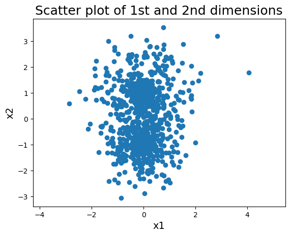

Looking at the dots in the scatter plot it is not clear what is the data structure.

If we have labelled data, as it is the case of our data we can use it to enhance the visualization of our "ground truth".

```python
# Ground truth
plt.scatter(X[:,0],X[:,1],c=y)
plt.title("Scatter plot of 1st and 2nd dimensions",size=18)
plt.xlabel("x1",size=14)
plt.ylabel("x2",size=14)
plt.axis("equal")
plt.show()
```

Using that information we obtain the following plot

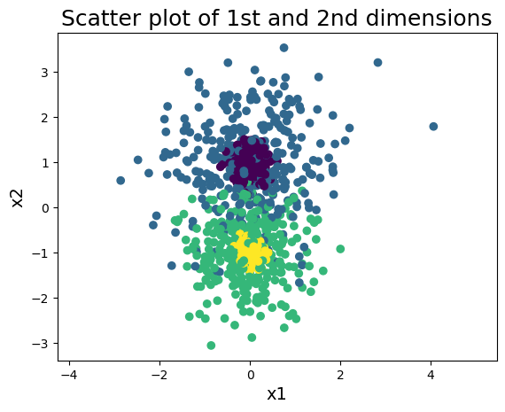

From here we can observe what seems to be two main structures, but it is still very messy. 

### PCA

PCA can produce an informative visualization **where global structure and distances are preserved**. Let's use the `sklearn-decomposition` package and import the PCA tool. Using this tool we'll transform our data onto its principal components.

**Note: if we don't specify the number of PCAs by default the tool will compute the first 100 PCAs. This can be very slow if we have a lot of dimensions! In our case, it will compute the 100 PCAs in 0.2 seconds!**

```python
from sklearn.decomposition import PCA
pca = PCA() # Initialize with n_components parameter to only find the top eigenvectors
z = pca.fit_transform(X)
```

From the computed data we create a scatter plot using the code below

```python
plt.scatter(z[:,0],z[:,1])
plt.title("Scatter plot of 1st and 2nd PCs",size=18)
plt.xlabel("PC 1",size=14)
plt.ylabel("PC 2",size=14)
plt.axis("equal")
plt.show()
```
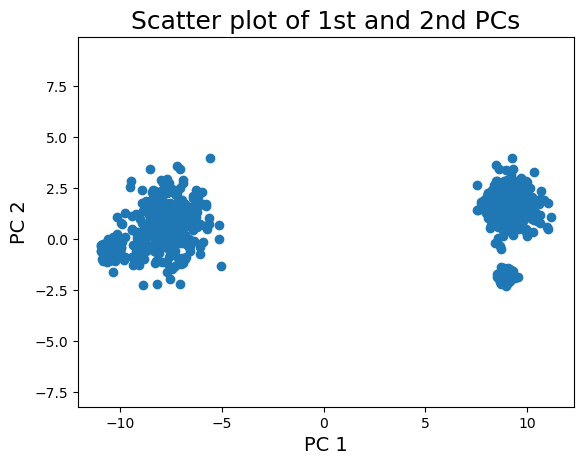

Now we're seeing some structure! We see two larger clusters (with more variance) and one or two smaller (denser, with less variance) clusters. As further apart the clusters are, the more dissimilar they are.

Using our privileged information about the labels, we can color up our plot

```python
# With labels
plt.scatter(z[:,0],z[:,1],c=y)
plt.title("Scatter plot of 1st and 2nd PCs",size=18)
plt.xlabel("PC 1",size=14)
plt.ylabel("PC 2",size=14)
plt.axis("equal")
plt.show()
```

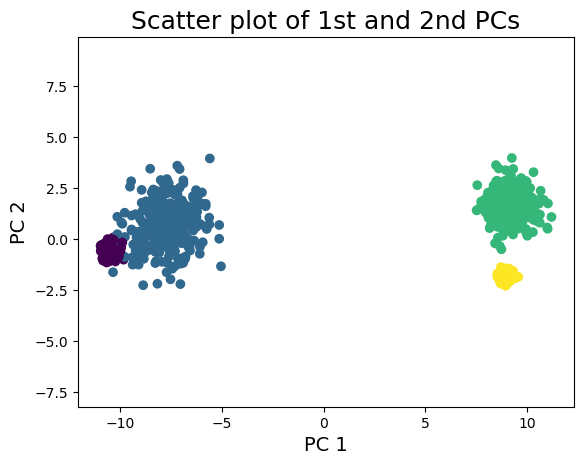

where we observe that, indeed, we have 4 clusters.

From our discussion above, we saw that we could use the **Scree/Elbow plot** to decide the number of clusters to use. In the context of PCA this translates into the number of PCAs.

```python
plt.plot(np.arange(1,101),pca.explained_variance_ratio_[0:100])
plt.title("% Explained variance by component",size=18)
plt.xlabel("Component #",size=14)
plt.ylabel("% Variance Explained",size=14)
plt.show()
```

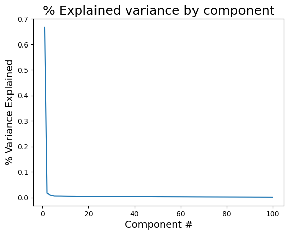

The plot shows a huge drop of the \% of variance right after the first PCAs...*but how many?* It is not clear, we need to zoom in.

```python
plt.plot(np.arange(2,101),pca.explained_variance_ratio_[1:100])
plt.title("% Explained variance by components 2-100",size=14)
plt.xlabel("Component #",size=14)
plt.ylabel("% Variance Explained",size=14)
plt.xlim(0,20)
plt.show()
```

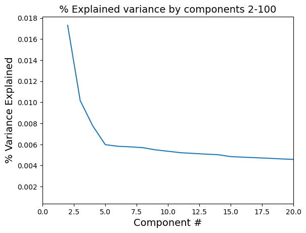

From the Figure it is clear that the optimal number of PCAs is 5.

Quantitatively we have that each of the first five PCAs contribute 

```python
pca.explained_variance_ratio_[0:5]
array([0.66738202, 0.01731062, 0.01016968, 0.00776102, 0.0059808 ])
```

Summing everything up we obtain

```python
np.sum(pca.explained_variance_ratio_[0:5])
0.7086041492760643
```
of variance explained for the first five PCAs.

Ok, the first five PCAs can explain 70\% of the variance of the data. But what if I want a higher threshold, for instance, 85\%?

In that case, we can just calculate the cumulative variance explained and set a threshold at 0.85. In order to known the PCA threshold we just calculate the position of the cumulative sum with the numpy function `where` as shown in the code below.

```python
cumulative_sum = np.cumsum(pca.explained_variance_ratio_)
pca_num = np.where(cumulative_sum >=.85)[0][0] #index of cumsum @ 0.85
plt.plot(np.arange(0,100),cumulative_sum,label='cumulative sum')
plt.plot((pca_num,pca_num),(cumulative_sum[0],cumulative_sum[pca_num]),'r--',label='PCA threshold')
plt.arrow(37,0.75,3,0,width=0.001,head_length=1)
plt.text(42,0.745,'Threshold = 36')
plt.title("Cumulative Variance Explained",size=18)
plt.xlabel("Number of Components",size=14)
plt.ylabel("% Variance Explained",size=14)
plt.ylim(cumulative_sum[0],1.02)
plt.legend()
plt.show()
```
The generated Figure is shown below.

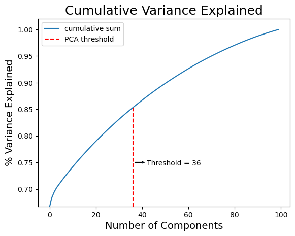

### MDS

As shown before, Multidimensional scaling (MDS) is a non-linear dimensionality reduction method to extract a lower-dimensional configuration from the measurement of pairwise distances (dissimilarities or disparities) between the points in a dataset.

In this example we will use the MDS function from the `sklearn.manifold` package. **This implementation can be quite slow with large $n$!** There are several parameters which can be tweaked. Basically, MDS from `sklearn.manifold` calculates a quantity called *stress* which is the sum of squared distance of the disparities for all constrained points. 

In our case we will use `n_components=2` because we want to see the results in a 2-D plot and `eps=1e-5` which is just a convergence factor. The code to generate the plot is shown below.

```python
# MDS can be slow when n is large
mds = MDS(n_components=2,verbose=1,eps=1e-5)
mds.fit(X)
plt.scatter(mds.embedding_[:,0],mds.embedding_[:,1],c=y)
plt.title("MDS Plot",size=18)
plt.axis("equal")
plt.show()
```

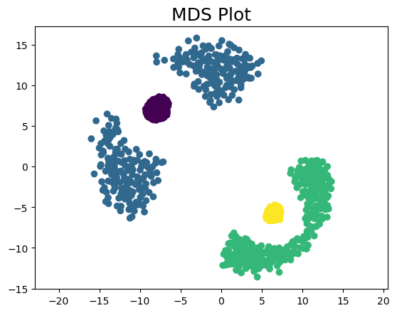

Using the label color code, we can observe that the MDS can separate the clusters because, in fact, it does not compute clusters but pairwise distances. This may suggest that there is additional structure inside the 'blue' labeled points.

Also, more scatter mean more dissimilarity, in general terms. 

If we want a quicker result or a result with less information, for instance if we have really a lot of data, we can reduce the data classes to their means, like in the following code:

```python
means = np.array([np.mean(X[np.where(y == i)],axis=0) for i in range(4)])
mds_means = MDS(2,verbose=1,eps=1e-8,n_init=10)
mds_means.fit(means)
plt.scatter(mds_means.embedding_[:,0],mds_means.embedding_[:,1],c=[0,1,2,3],s=200)
plt.title("MDS on Class Means",size=18)
plt.axis("equal")
plt.show()
```

This code produces the following plot. Of course we only obtain one point for each class, and we lose the information about its variation.

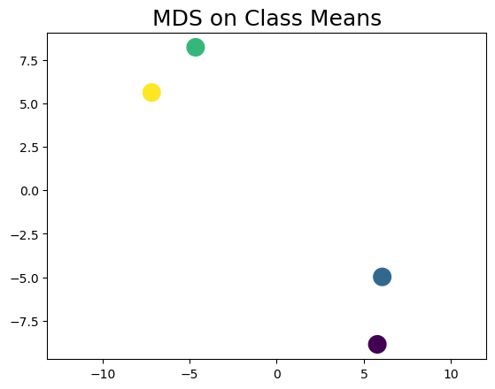

We can observe that the points of the clusters and its means are not very far away from each other in terms of embedded space locations.

**It is worth noting that with every initialization we will obtain different results. However most of the times they will revolve around the same results.**

### T-SNE

Stochastic neighbor embedding (SNE) is a probabilistic approach to dimensional reduction that places data points in high dimensional space into low dimensional space while preserving the identity of neighbors. That is, SNE attempts to keep nearby data points nearby, and separated data points relatively far apart.

One popular variation of SNE is the **t-distributed stochastic neighbor embedding (T-SNE)**, which uses the t-distribution instead of the Gaussian distribution to define the pdf of neighbors in the low-dimensional target space.

Here we will detail an example of T-SNE, using the `TSNE` function from the `skelarn.manifold` package. This function has a lot of parameters but the most important one is `perplexity`, which governs the range of the neighborhood at each point coordinate you're trying to match. This means that higher perplexity implies larger neighborhoods.

Let's start with an average perplexity value of 40 with our data. With the following code. Again, we have `n_components=2`.

```python
tsne = TSNE(n_components=2,verbose=1,perplexity=40)
z_tsne = tsne.fit_transform(X)
plt.scatter(z_tsne[:,0],z_tsne[:,1],c=y)
plt.title("TSNE, perplexity 40",size=18)
plt.axis("equal")
plt.show()
```

With `perplexity=40` the algorithm is "grabbing" the smaller clusters into the bigger ones as shown in the plot below.

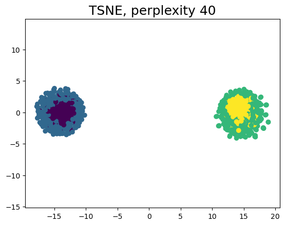

If we reduce the perplexity to `perplexity=5` we obtain a similar result, but this time we can observe a much more fragmented result, meaning that the algorithm tends to form smaller clusters inside the two bigger ones.

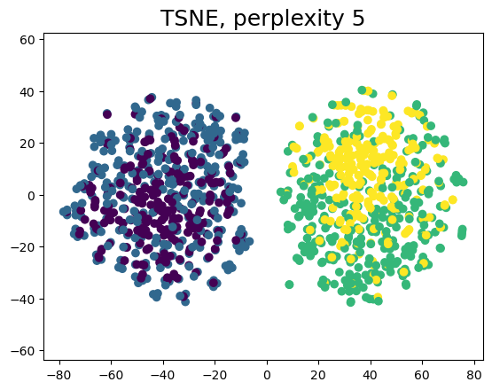

**Note: Distances in the T-SNE graph don't necessarily mean anything! Remember that we have a mixture of Gaussians.** 

Sometimes, we need to reduce the dimensionality (i.e. information) to reveal hidden patterns in the data, which is the case for this particular dataset.

Therefore, instead of using our raw data, we will get the information obtained with the first 10 PCs that was computed before.

```python
tsne = TSNE(n_components=2,verbose=1,perplexity=40)
z_tsne = tsne.fit_transform(z[:,0:10]) #z is the PCA matrix, we slice the first 10 PCAs
plt.scatter(z_tsne[:,0],z_tsne[:,1],c=y)
plt.title("TSNE on first 10 PCs, perplexity 40",size=18)
plt.axis("equal")
plt.show()
```

Now, we can clearly observe the 4 clusters as shown below.

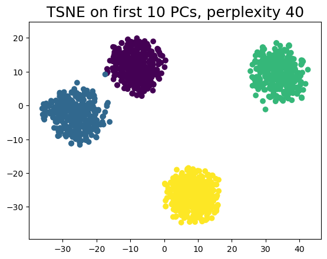

If we need to see the structure in more detail we just reduce the perplexity hyperparameter.


T-SNE can be a powerful visualization tool for clustering! We'll now create a second dataset, this time with 25 clusters.

```python
# Alternative dataset
mu2 = np.zeros((25,100))
for i in range(25):
    mu2[i,i] = 1
cov2 = [0.02*np.eye(100) for _ in range(25)]
X2,y2=sample_gmm(1000,mu2,cov2)
pca2 = PCA()
z2 = pca2.fit_transform(X2)
```

### Data visualization comparison

Let's first compare with a PCA analysis the first and the second datasets. 

```python
fig,(ax1,ax2) = plt.subplots(1, 2,figsize=(10,4))
ax1.scatter(z[:,0],z[:,1],c=y)
ax1.set_title("Dataset 1, Top PCs",size=18)
ax1.set_xlabel("PC 1",size=14)
ax1.set_ylabel("PC 2",size=14)
ax1.axis("equal")

ax2.scatter(z2[:,0],z2[:,1],c=y2)
ax2.set_title("Dataset 2, Top PCs",size=18)
ax2.set_xlabel("PC 1",size=14)
ax2.set_ylabel("PC 2",size=14)
ax2.axis("equal")
plt.show()
```

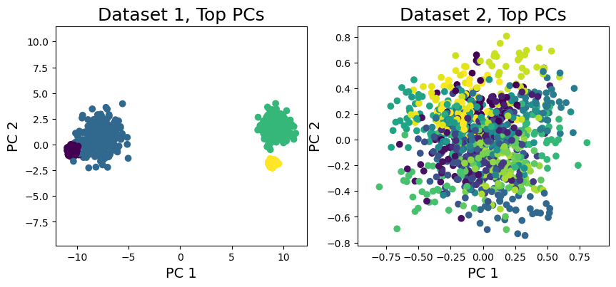

While we could observe the 4 clusters in the first dataset, we cannot distinguish the 25 clusters in the image on the right that depicts the second dataset.

Let's now try MDS.

```python
mds2 = MDS(n_components=2,verbose=1,eps=1e-5)
mds2.fit(X2)

fig,(ax1,ax2) = plt.subplots(1, 2,figsize=(10,4))
ax1.scatter(mds.embedding_[:,0],mds.embedding_[:,1],c=y)
ax1.set_title("Dataset 1, MDS",size=18)
ax1.axis("equal")

ax2.scatter(mds2.embedding_[:,0],mds2.embedding_[:,1],c=y2)
ax2.set_title("Dataset 2, MDS",size=18)
ax2.axis("equal")
plt.show()
```

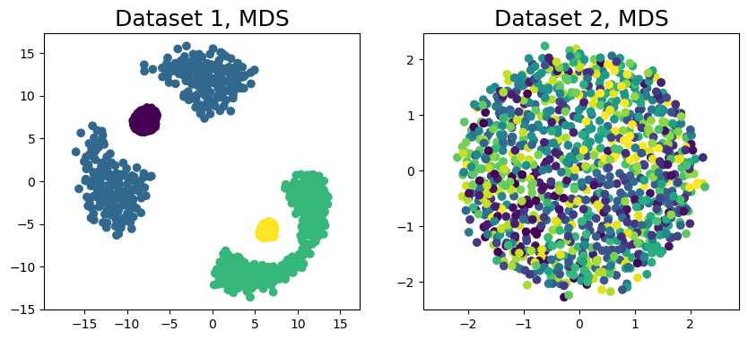

Using the raw data we can't distinguish anything! If we use the means instead, we obtain a much more sensible (and misleading!) result. Why? 

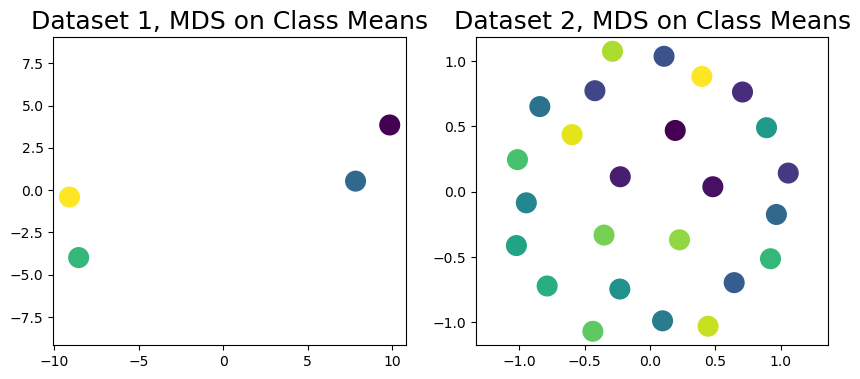

In fact, the MDS algorithm is trying to preserve *pairwise* distances! In multidimensional space the 25 clusters are equally set apart from each other. However in 2D, some appear very distant from other, which is actually false. **While on the left the MDS algorithm shows some ground truth on the right it doesn't.**

T-SNE on the other hand represents more accurately the 25 clusters **because the distances represented in the plat are not actual distances!** We don't even need to PCA the data.

```python
tsne2 = TSNE(n_components=2,verbose=1,perplexity=40)
z_tsne2 = tsne2.fit_transform(X2)

fig,(ax1,ax2) = plt.subplots(1, 2,figsize=(10,4))
ax1.scatter(z_tsne[:,0],z_tsne[:,1],c=y)
ax1.set_title("Dataset 1, TSNE",size=18)
ax1.axis("equal")

ax2.scatter(z_tsne2[:,0],z_tsne2[:,1],c=y2)
ax2.set_title("Dataset 2, TSNE",size=18)
ax2.axis("equal")
plt.show()
```

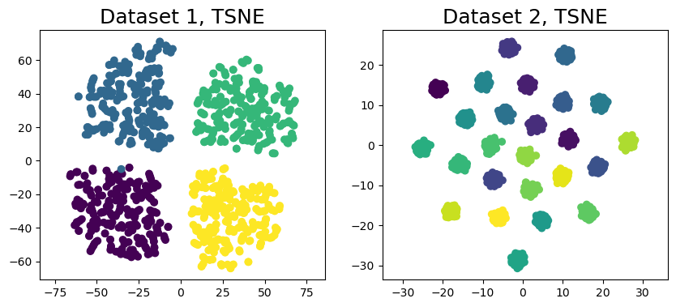

## Clustering method examples

### K-means

AS we've seen above, K means start with a pre-defined number of clusters $K$ and aims at minimizing the value of the **within group sum of squares (WGSS)** to its assigned center. **This means that we can find local minima as well as global minima.**

#### K-means applied to the PCA plot

We will be using the function `KMeans` from the `sklearn.cluster` package.

```python
from sklearn.cluster import KMeans
kmeans = KMeans(n_clusters=4,n_init=10)
y = kmeans.fit_predict(z)
plt.scatter(z[:,0],z[:,1],c=y)
plt.title("KMeans Clustering, PCA Plot",size=18)
plt.xlabel("PC 1",size=14)
plt.ylabel("PC 2",size=14)
plt.axis("equal")
plt.show()
```

The most important parameters are explicit in the code: `n_clusters` is the number of clusters we think we have and hope to find and `n_init` is the number of initializations of the algorithm. **This latter parameter is very important because the algorithm can compare between the different results and avoid local minima.** The plot below shows an example of a **bad** clustering allocation.

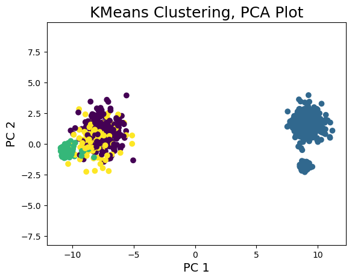


If we use `n_init=100` instead we obtain a much nicer plot as shown below.

```python
# More initializations
kmeans = KMeans(n_clusters=4,n_init=100)
y = kmeans.fit_predict(z)
plt.scatter(z[:,0],z[:,1],c=y)
plt.title("KMeans Clustering, PCA Plot",size=18)
plt.xlabel("PC 1",size=14)
plt.ylabel("PC 2",size=14)
plt.axis("equal")
plt.show()
```

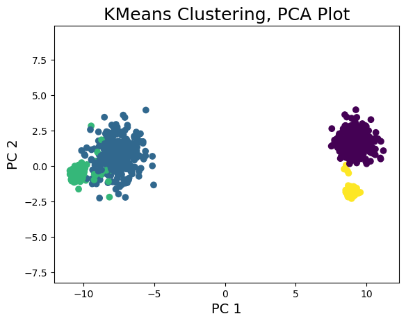

We can also reduce the number of dimensions. In the PCA case, if, for instance, we only use the first 10 PC we actually obtain a better and more stable performance with `n_init=10`

```python
# Reduced dimension
kmeans = KMeans(n_clusters=4,n_init=10)
y = kmeans.fit_predict(z[:,0:10])
plt.scatter(z[:,0],z[:,1],c=y)
plt.title("KMeans Clustering, PCA Plot",size=18)
plt.xlabel("PC 1",size=14)
plt.ylabel("PC 2",size=14)
plt.axis("equal")
plt.show()
```

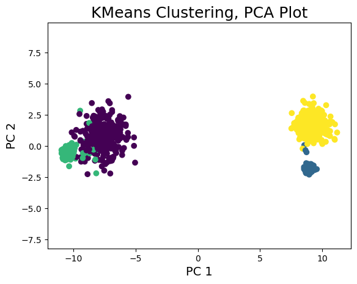

#### K-means applied to the MDS plot

To apply the k-means labels to the MDS plot we just add `c=y` into our previously computed MDS data.

```python
plt.scatter(mds.embedding_[:,0],mds.embedding_[:,1],c=y)
plt.title("KMeans Clustering, MDS Plot",size=18)
plt.axis("equal")
plt.show()
```

We obtain the following plot.

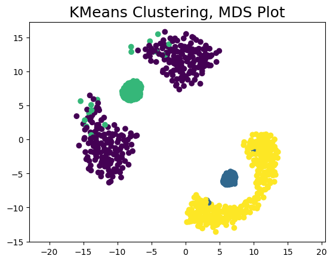

We observe that, in general we obtain a reasonable representation of the cluster, except for one of them, which may have a strong sub-structure as well as a few points which are mislabeled.

#### K-means applied to the T-SNE plot

We follow the same reasoning for the T-SNE plot.

```python
plt.scatter(z_tsne[:,0],z_tsne[:,1],c=y)
plt.title("KMeans Clustering, TSNE Plot",size=18)
plt.axis("equal")
plt.show()
```

We observe a good assignment for each cluster except for a few stragglers. 

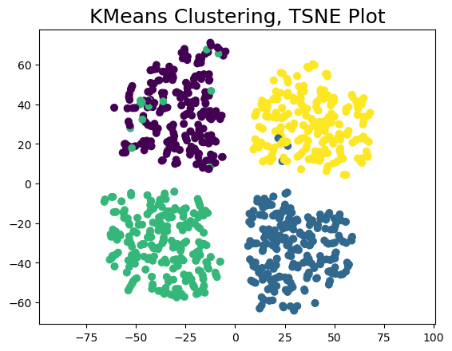

### Diagostics for clustering methods

#### Sum of squares criterion

In the clustering methodology context, we can use several techniques to know *how many clusters to estimate within the data*.

The sum of squares criterion is one of them and, as the name suggests, uses the same of squares function that is at the heart of the K-means algorithm to estimate the number of cluster we should point at. 

Here, we will use the estimate calculated within the function `KMeans` called `inertia`. To code it, we run a kmeans algorithm for a certain $i$ number of clusters as shown below.

```python
all_kmeans = [KMeans(n_clusters=i+1,n_init=100) for i in range(8)]
# i-th kmeans fits i+1 clusters
for i in range(8):
    all_kmeans[i].fit(X)

inertias = [all_kmeans[i].inertia_ for i in range(8)]
plt.plot(np.arange(1,9),inertias)
plt.title("KMeans Sum of Squares Criterion",size=18)
plt.xlabel("# Clusters",size=14)
plt.ylabel("Within-Cluster Sum of Squares",size=14)
plt.show()
```

Plotting the inertias versus the number of cluster we obtain the following Figure.

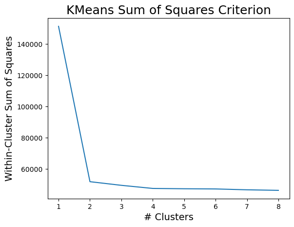

The elbow plot suggests $i=2$ for the number of clusters. Following that recommendation we obtain the plot shown below.

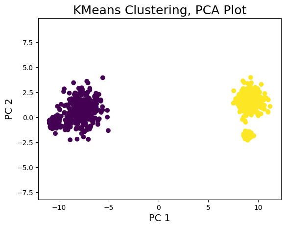

**This is a great starting point to explore further!**. It does capture the big difference between the two clusters on the left and the two clusters on the right. Despite that, it is easy to observe that there is further structure in the figure. If we zoom in in the elbow plot we observe that `i=4` should be a better option. Ultimately is quite subjective where the precise value of `i` should be! Five would also be a valid option.

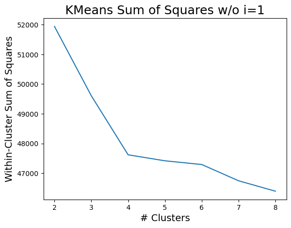

#### Silhouette plots

To ascertain the number of clusters we can also plot **silhouette scores**. It tries to represent how well the sample is clustered: it's a score between -1 and 1. Positive values represent good clustering, while negative numbers represent bad clustering.

**Note: Silhouettes may be less reliable on high-dimensional data, can give negative scores even for clusters which look good visually.**

In this example we'll be using the `silhouette_score` and `silhouette_samples` tools from the `sklearn.metrics` package and silhouette plot visualizer tools from the `yellowbricks package`. 

**Note: R has more developted tools regarding silhouette plots.**

The code shown below plots silhouette scores from $k=2$ to $k=8$ and shows how well the represent the clustering. The areas of each cluster represent its cumulative distribution.

```python
from sklearn.metrics import silhouette_score, silhouette_samples

from yellowbrick.cluster import SilhouetteVisualizer
from yellowbrick.style import rcmod
from yellowbrick.style.colors import resolve_colors

# Yellowbrick changes the plotting settings, reset to default here

rcmod.reset_orig()

visualizers = [SilhouetteVisualizer(all_kmeans[i], colors='yellowbrick',is_fitted=True) for i in range(1,8)]
for i in range(7):
    fig, (ax1, ax2) = plt.subplots(1, 2,figsize=(10,4))
    visualizer = SilhouetteVisualizer(all_kmeans[i+1], colors='yellowbrick',is_fitted=True,ax=ax1)
    visualizer.fit(X)
    
    colors = np.array(resolve_colors(i+2,"yellowbrick"))
    ax2.scatter(z[:,0],z[:,1],c=colors[all_kmeans[i+1].labels_])
    ax2.axis("equal")
    
    # If we want to set axes to be the same for all plots, need to do something like this
    # instead of visualizer.show(), which resets the axes
    visualizer.finalize()
    ax1.set_xlim((-.4,.8))
    plt.show()

```

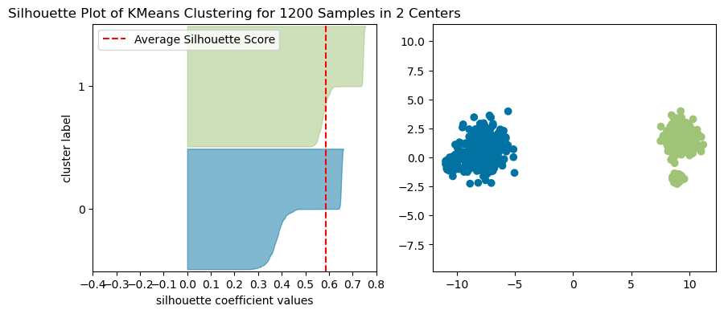
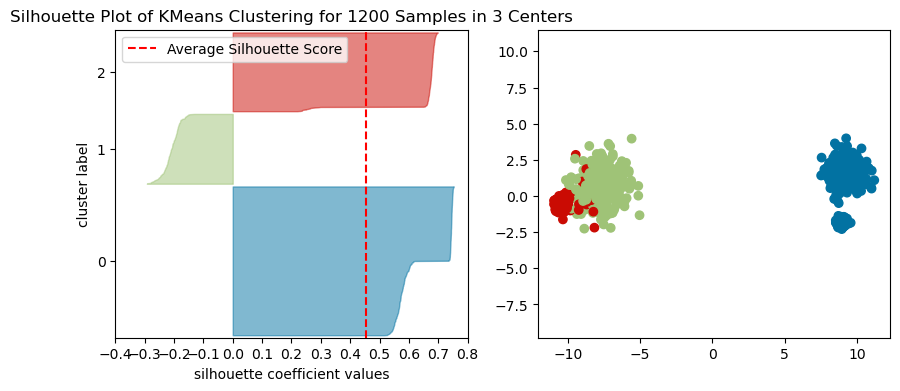
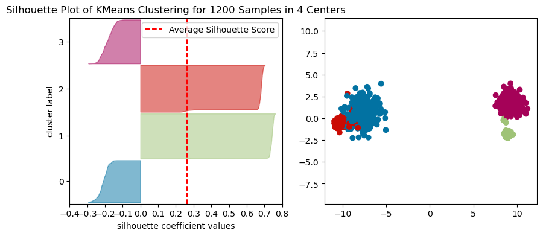
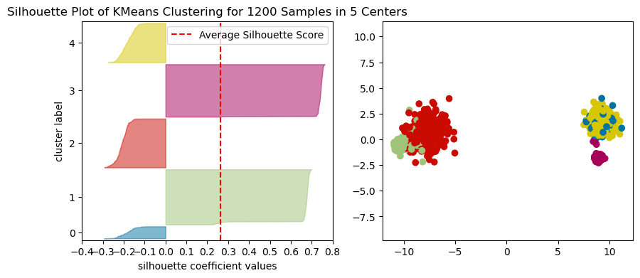
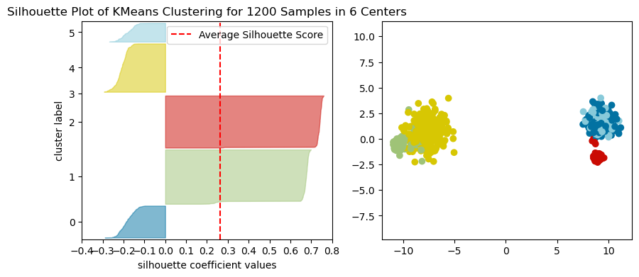
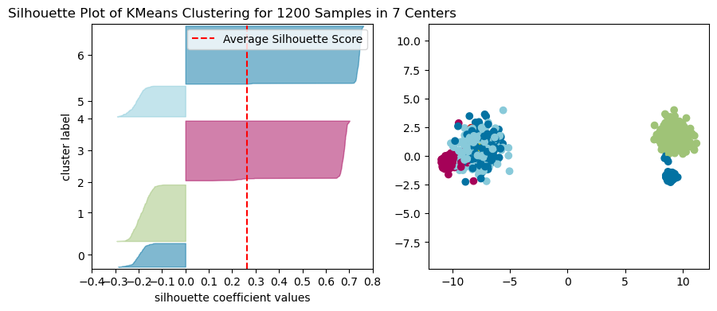
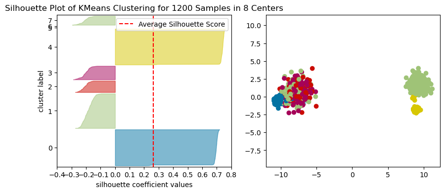

As observed in the 7 plots, we obtain mixed results: the silhouette index gets the most general clustering correctly, when $k=2$. However, for the most probable $k=4$, the silhouette index is negative for two clusters. **Therefore, it is important to be careful on the use of this tool. It is important to know which *a priori* knowledge we should rely on**.

We can also plot the average silhouette score as a function of the number of clusters. 

```python
# Silhouette score undefined for 1 class. i-th entry of avg_silhouette score is score for i+2 clusters.
avg_silhouette_scores = [silhouette_score(X,all_kmeans[i].labels_) for i in range(1,8)]
plt.plot(np.arange(2,9),avg_silhouette_scores)
plt.title("Average Silhouette Scores",size=18)
plt.xlabel("# Clusters",size=14)
plt.ylabel("Average Silhouette Score",size=14)
plt.show()
```

If we do that we obtain the following plot.

**Note: here we don't want an "elbow", we want the maximum value!**

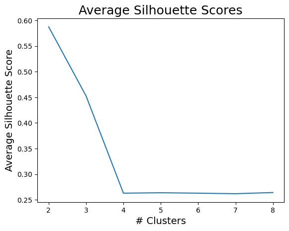

The plot shows that $k=2$ seems to be the best option, which goes against our better knowledge. 

## Hierarchical clustering examples (in R)

Now we're going to explore hierarchical clustering examples in R. We're changing languages because the packages for hierarchical clustering are more developed in R.

The multivariate normal distribution data will be generated using the `rmvnorm` function. Each distribution has different means but the same variance.

We'll start by visualizing the data using PCA and T-SNE tools (`prcomp` from `stats` package and the `Rtsne` function respectively). We use the following code to plot both.

```R
library(mvtnorm)
library(Rtsne)
library(dendextend)
library(RColorBrewer)

# Color palette and synthetic data
cols <- brewer.pal(n=5,name="YlOrRd")[c(2:4)]
cols <- c(cols, brewer.pal(n=4,name="RdPu")[c(2:3)])
cols <- c(cols, brewer.pal(n=4,name="Blues")[c(2:3)])
means = matrix(0,nrow=7,ncol=5)
means[1,1] = 0.4
means[2,1] = 0.2
means[3,1] = 0.6
means[4,2] = 0.7
means[5,3] = 0.7
means[6,1] = 1.0
means[6,2] = 2.8
means[7,1] = 1.0
means[7,2] = 2.4
cov = 0.003 * diag(5)
set.seed(314)
X=matrix(nrow=0,ncol=5)
for (i in 1:7) {
  X = rbind(X, rmvnorm(20, mean=means[i,], sigma=cov))
}
y = rep(c(1:7),each=20)

par(mfrow=c(2,1))
# PCA and TSNE visualizations
pca <- prcomp(X)
z <- pca$x
par(mar=c(5,5,5,3))
plot(z[,1],z[,2],col=cols[y],pch=19)
title("PCA, true labels")

z_tsne <- Rtsne(X,perplexity=5)
plot(z_tsne$Y[,1],z_tsne$Y[,2],col=cols[y],pch=19)
title("TSNE, true labels, perplexity 5")
```
With this code we obtain the following plot.

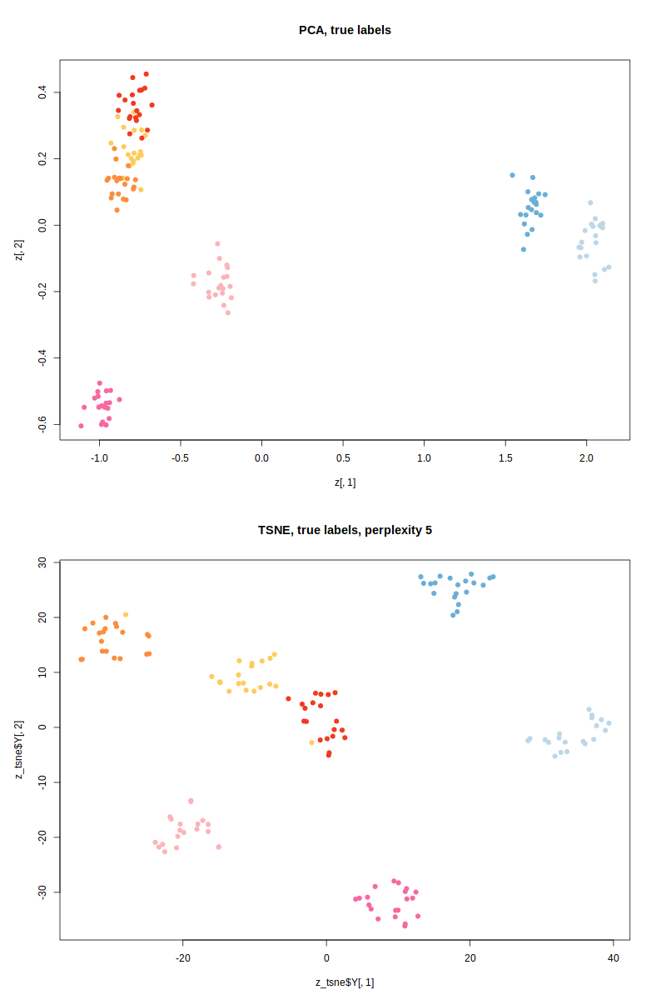

On the most part we can differentiat the cluster well. However, if we didn't have the labels (i.e. the colors) we could assume that the group of points in the top left side of the PCA plot would belong to the same cluster. This is not *entirely* the case for the TSNE plot. But then again we will have some doubts regarding cluster assignment.

*How can hierarchical cluster help in this case?*

**Yes!**

Let's use a dendogram. A dendogram is a data visualization tool that allow us to observe bottom-up **Agglomerative clustering.** As we've seen before, It starts with 1 data point per cluster and, at each stage, merges pairs of clusters that are the closest together, according to a dissimilarity measure.

Here we will use the `ward measure` in the `hclust` function of the `dendextend` library. In short the method will merge two points or clusters that will result in a bigger cluster with the minimum variance. 

The code used to plot our dendogram is shown below.

```R
# Hierarchical clustering: dist -> hclust -> dendrogram -> cutree pipeline
par(mfrow=c(1,1))
dis <- dist(X, method="euclidean")
hc1 <- hclust(dis, method="ward.D")
dend <- as.dendrogram(hc1)
plot(dend)
title("Dendrogram: Ward criterion", ylab="Height")
```

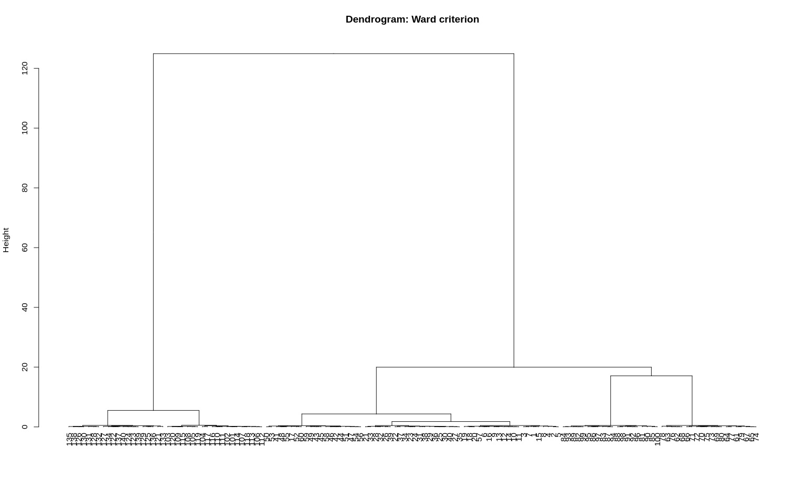

For clarity we'll zoom in and analyse the leftmost cluster of the dendogram, which is our cluster of interest, as shown in the figure below.

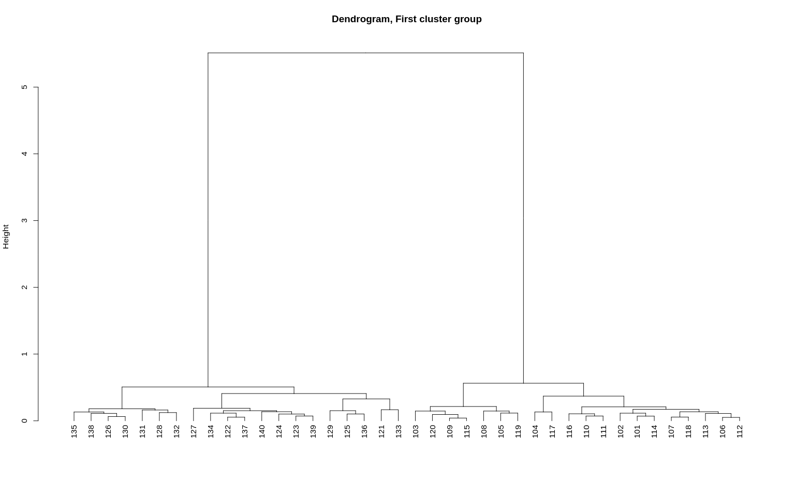

In the plot each horizontal line is the merging of two clusters. The height of the horizontal line represents the cost of merging the two clusters. To add more clusters we need to make a cut at a certain horizontal height. 

For instance in this plot if we cut at height 60 we get two cluster. But if we make the cut at height 10 we get 3 clusters and so on. 

Let's now observe how this works iteratively. The following code will produce 6 figures.

```R
for (i in 2:7) {
  # Plot clustering on original data
  cl <- cutree(dend,k=i)
  cl.orders <- unique(cl[order]) # Order colors according to how they appear in dendrogram
  colors_reordered <- cols[cl.orders]
  d1=color_branches(dend, col = colors_reordered,clusters=cl[order])
  d1=color_labels(d1,labels=labels(d1),col=cols[cl[order]])
  layout(matrix(c(1,2,2), nrow = 1, ncol = 3, byrow = TRUE))
  plot(d1)
  title("Dendrogram: Ward criterion", ylab="Height")
  plot(z[,1],z[,2],col=cols[cl],pch=19)
  title(paste("Hierarchical Clustering, ",i," clusters",sep=""))
}
```

The next 6 Figures show on the left the dendogram with color labels corresponding to each cluster and on the right the PCA plot. The number of classified clusters will increase from 2 in the first picture to 7 in the last. 

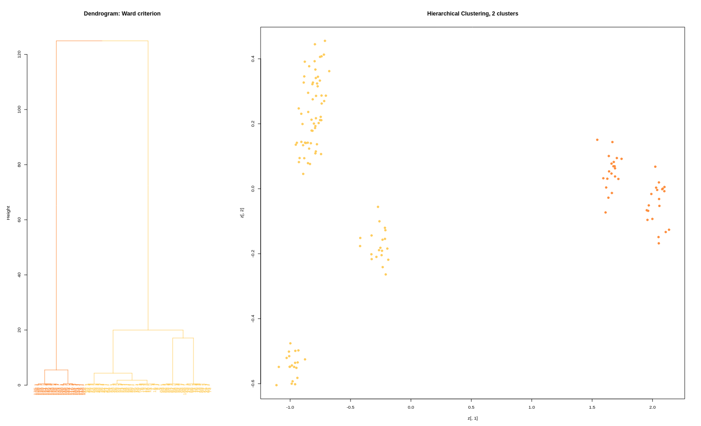
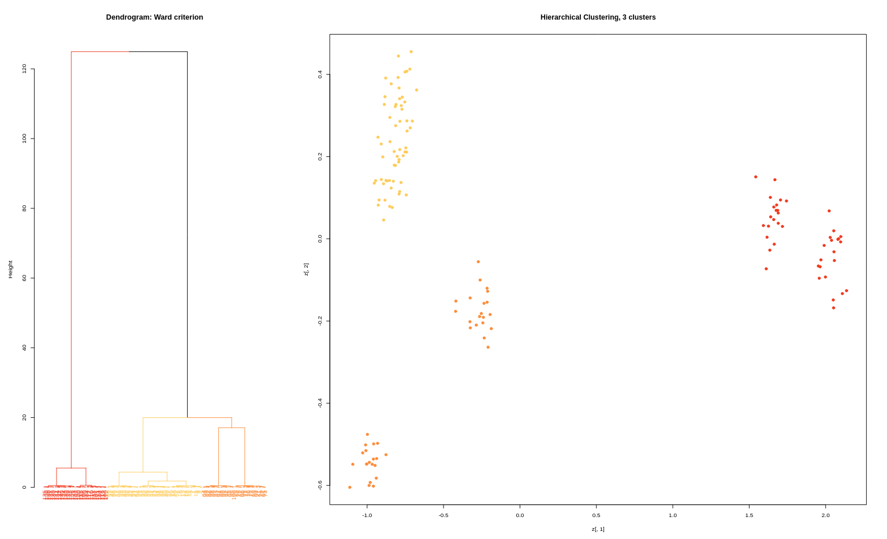
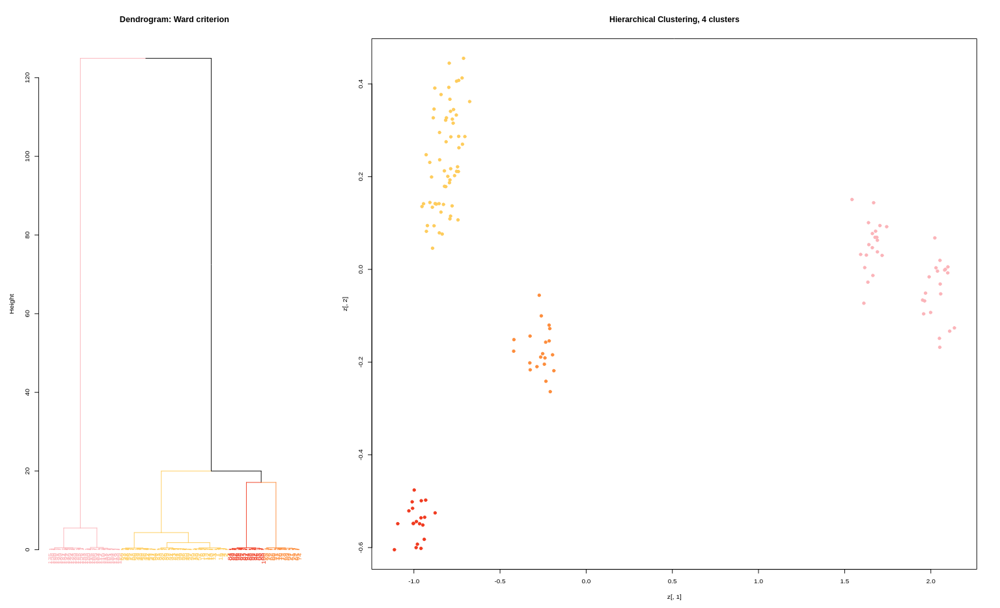

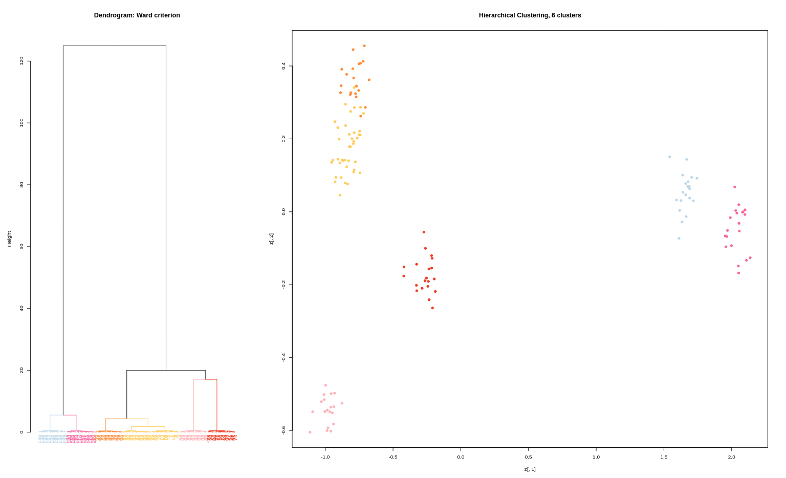
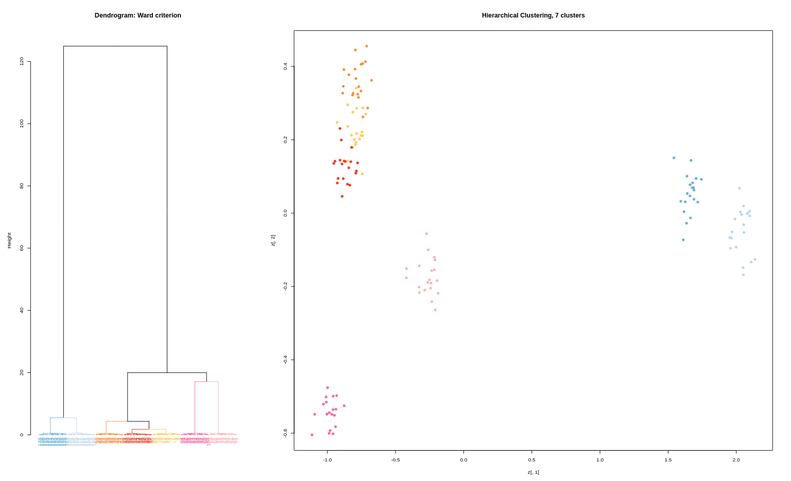

The selection criteria will only be the height.

At the figure where we have 5 clusters, we can observe that all separated clusters have different classifications, while the remaining points are classified in the same cluster (yellow color label). **At this point you may be satisfied with this clustering.**

However, we thing we have more structure in the data so we move onwards and we can observe in the dendogram that it still makes sense to have 7 clusters.

If we do the same exercise using the T-SNE method, it is even clearer that 7 is a good estimate of the number of clusters as shown in the figure below.

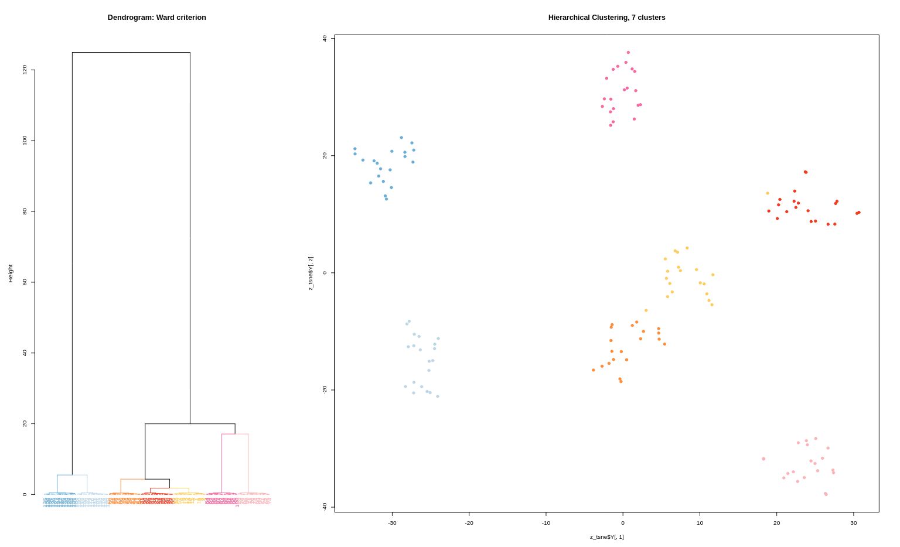

To finish the dendogram overview we present another method to create dendograms: the circlized dendograms.

Here we plot a circlized dendogram of our data with the original labels. 

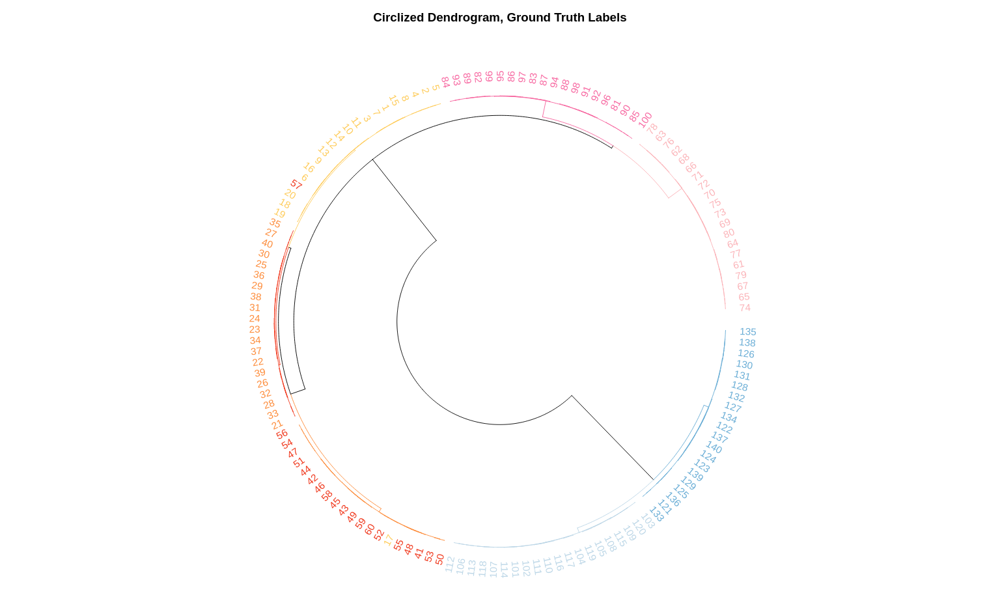

The following code was used to plot the previous figure.

```R
# Can make nice circlized dendrograms
par(mfrow=c(1,1),mar=c(0,0,3,0))
circlize_dendrogram((d1))
title("Circlized Dendrogram")
d2=color_labels(d1,labels=labels(d1),col=cols[y[order]])
circlize_dendrogram(d2)
title("Circlized Dendrogram, Ground Truth Labels")
```

## A real world example: RA Fisher's Wine Dataset

Let's now return to `python` and discuss a real world example using RA Fisher's Wine Dataset.

The dataset `load_wine` is included in `sklearn.datasets` and is a copy of the original data taken from the UCI ML Wine Data Set dataset (https://archive.ics.uci.edu/ml/machine-learning-databases/wine/wine.data).


In this dataset we have 178 wines and 13 features. The features are chemical composts of the wine. Here we're going to try to find the features without knowing the labels.

We start by loading and standardizing the data.

```python
from sklearn.datasets import load_wine
features, target = load_wine(return_X_y=True)
wine_std = (features-np.mean(features,0))/np.std(features,0) #178x13
```

From here we visualize the data using the PCA method as shown below.

```python
pca_wine = PCA(5).fit(wine_std)
pcs = pca_wine.transform(wine_std)
plt.figure(figsize=(12,9))
plt.scatter(pcs[:,0],pcs[:,1])
plt.title("Wine Data PCs",size=18)
plt.xlabel("PC 1",size=14)
plt.ylabel("PC 2",size=14)
plt.axis("equal")
plt.show()
```

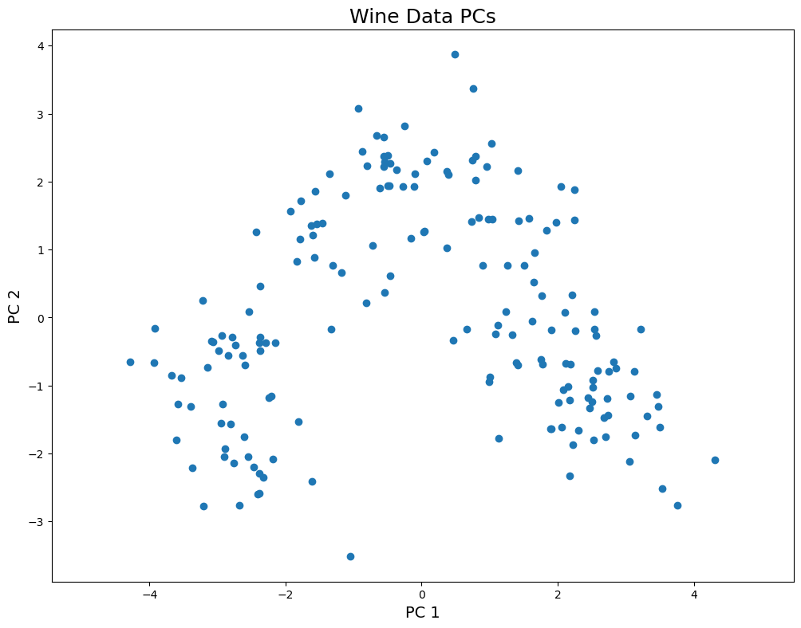

In the PCA plot it is not clear there are different clusters. Let's now visualize the MDS and TSNE plots.

```python
mds_wine = MDS(2).fit_transform(wine_std)
plt.scatter(mds_wine[:,0],mds_wine[:,1])
plt.title("Wine Data MDS",size=18)
plt.axis("equal")
plt.show()
```

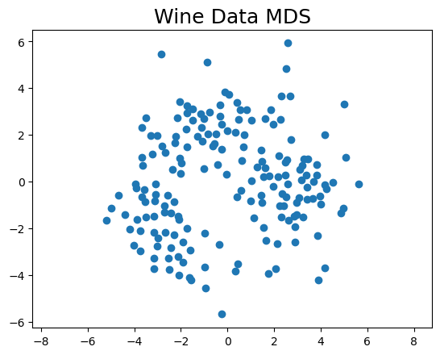

The same is true for the MDS plot.

For the T-SNE method we will going to create six plots with different perplexity values to observe if we can fine-tune the structure.

```python
for perplexity in [5,10,30,50,80,100]:
    tsne_wine = TSNE(n_components=2,perplexity=perplexity).fit_transform(wine_std)
    plt.scatter(tsne_wine[:,0],tsne_wine[:,1])
    plt.title("Wine Data TSNE, perplexity "+str(perplexity),size=18)
    plt.axis("equal")
    plt.show()
```

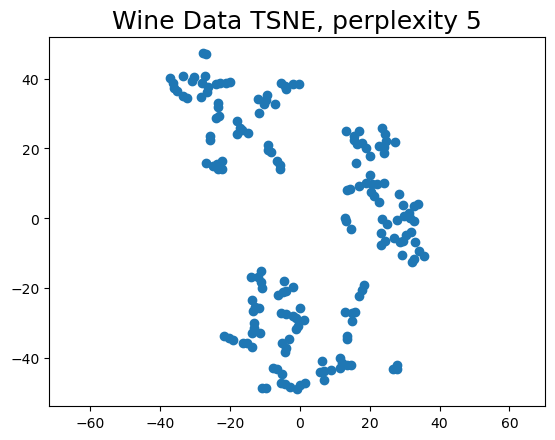
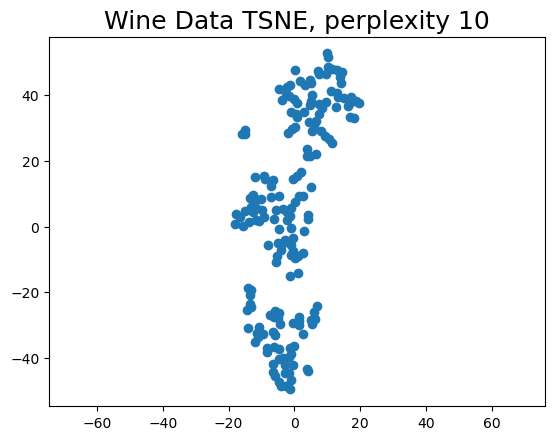
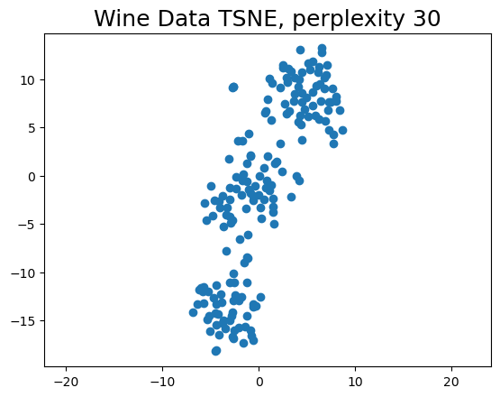
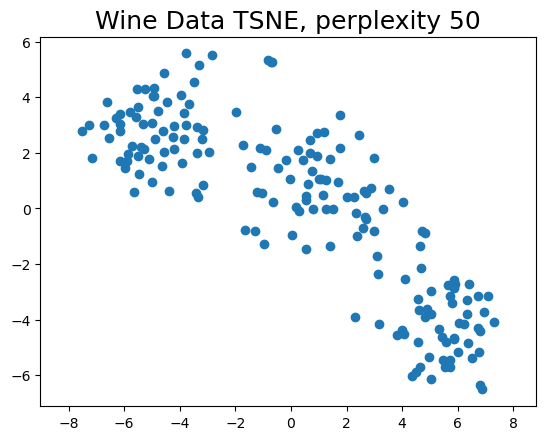
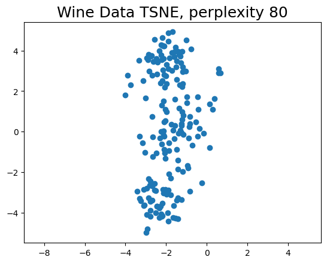
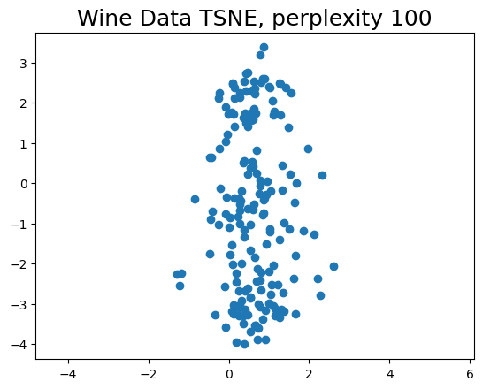

At low perplexity values ($p=5$) we observe a lot of granulation with at seems to be the formation of three bigger clusters. At $p=10$ we observe three clusters. At $p=30$ and $p=50$ the dispersion increases but it is still possible to observe three clusters. For greater values of perplexity it starts to be increasingly difficult to observe the clusters.

In short, we can say we may observe three cluster, but it is not really conclusive.

Let's move on with the analysis using the elbow and the silhouette methods.

```python
plt.plot(np.arange(1,6),[KMeans(i,n_init=50).fit(wine_std).inertia_ for i in range(1,6)])
plt.title("KMeans Sum of Squares Criterion",size=18)
plt.xlabel("# Clusters",size=14)
plt.ylabel("Within-Cluster Sum of Squares",size=14)
plt.show()
```

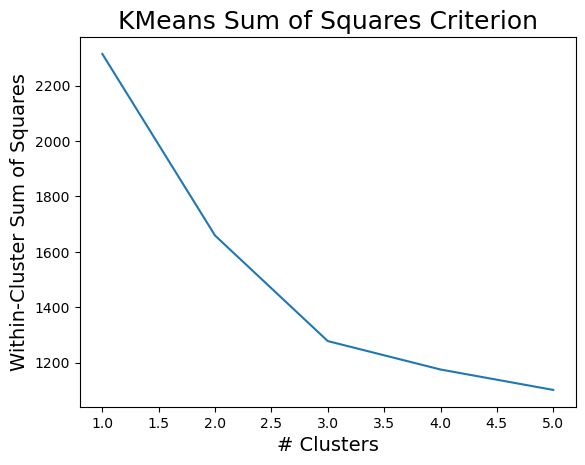

The elbow plot seems to converge on 3 clusters.

```python
from sklearn.metrics import silhouette_score
plt.plot(np.arange(2,6),[silhouette_score(wine_std,KMeans(i,n_init=50).fit(wine_std).labels_) for i in range(2,6)])
plt.title("Average Silhouette Scores",size=18)
plt.xlabel("# Clusters",size=14)
plt.ylabel("Average Silhouette Score",size=14)
plt.show()
```

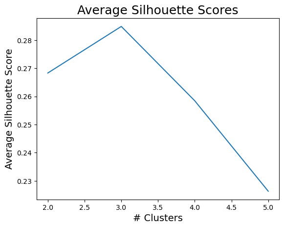
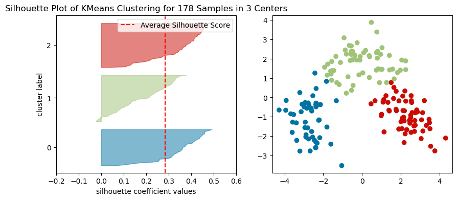

The silhouette scores also point for the same number.

Looks nice! Now we will use the `KMeans` algorithm to asign the best membership for each cluster and compare them with the "ground truth".

```python
clustering = KMeans(3,n_init=50)
clustering.fit(wine_std)
colors = np.array(resolve_colors(3,"yellowbrick"))

# Colors don't align since kmeans can order the clusters differently
#we need to change the colors manually through three masks
###NOTE THAT this may change depending on the KMeans color assignment!!!
ind0 = clustering.labels_ == 0
ind1 = clustering.labels_ == 1
ind2 = clustering.labels_ == 2

clustering.labels_[ind0] = 2
clustering.labels_[ind1] = 0
clustering.labels_[ind2] = 1
#
fig, (ax1,ax2) = plt.subplots(1,2,figsize=(12,4))
ax1.scatter(tsne_wine[:,0],tsne_wine[:,1],c=colors[clustering.labels_])
ax1.set_title("KMeans, Wine TSNE",size=18)
ax2.scatter(tsne_wine[:,0],tsne_wine[:,1],c=colors[target])
ax2.set_title("Wine TSNE Ground Truth",size=18)
ax1.axis("equal")
ax2.axis("equal")
plt.show()
```

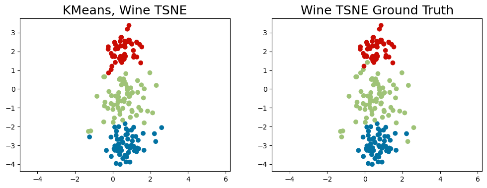

From the plot we observe that our assignment is pretty good when compared with the ground truth: we only have a few misassignments. 

The ground truth correponds to three different type of wines, which were extracted from 17 different chemical composts. In the end our method did well to identify the three groups.

## Logistic regression in the context of the wine dataset

Now we're going to do logistic regression on the multivariate wine database in order to predict the 3 different classes.

In order to do this we can try two different approaches: i) One vs Rest; ii) Multinomial

Here we will do the one vs the rest approach. We will train $k$ binary classifiers. Each classifier $i$ learns a rule class $i$ vs not class $i$. The classifier with the maximum score will be the class $i$.

To this end we will use the functions `LogisticRegression` and `LogisticRegressionCV` functions from the `sklearn.linear_model` package.

The first step consists in the separation of the data into training and testing subsamples. We'll have 4/5 of the data for the training and 1/5 for the testing.

```python
np.random.seed(317) #just to give always the same results
perm = np.random.permutation(wine_std.shape[0])
n_train = int(4/5*wine_std.shape[0])
print(n_train)
X_train = wine_std[perm[:n_train]]
y_train = target[perm[:n_train]]
X_test = wine_std[perm[n_train:]]
y_test = target[perm[n_train:]]
```

Let's begin by using the function `LogisticRegression`. We can write that

```python
log_reg = LogisticRegression(penalty="none",multi_class="ovr").fit(X_train,y_train)
```

In this line of code we don't use any type of penalty function, which is not recommended: regularization via penalty function is important to ensure convergence in many cases because it will introduce constraints in the iteration. The `multi_class="ovr"` a binary (one vs rest) is fit for each class or label.

If we calculate the log regression score for the training sample we obtain a perfect match as expected.

```python
log_reg.score(X_train,y_train)
1.0
```

When applying the regressors on the testing sample however, the result does not converge to one.

```python
log_reg.score(X_test,y_test)
0.9444444444444444
```

However if we regularize the regression by adding a constant $C$, which is the inverse regularization stength we will obtain

```python
# Some solvers only support certain regularization/multi_class parameters
log_reg = LogisticRegression(penalty="l2",C=0.1,max_iter=5000,multi_class="ovr").fit(X_train,y_train)
log_reg.score(X_train,y_train)
0.9929577464788732
log_reg.score(X_test,y_test)
1.0
```

The smaller the $C$ the strong the regulariation. Logistic regression is solved via iterative methods: different solvers exist, some support certain types of regularization or multi-class objective. Therefore it is important to play around with the different settings.

In this case our regression outputs a very good result and the testing and training results and indistinguishable. In general we should fine tune the value of $C$ experimentally to optimize the results.

A method to obtain the best $C$ parameter is to perform Cross Validation: we divide the data into $k$ folds and train on $k-1$ folds and evaluate on the remaining fold.

Here we will use the function `LogisticRegressionCV` directly.

```python
log_reg = LogisticRegressionCV(cv=5,Cs=[0.01,0.1,1,10],max_iter=5000,penalty="l1",solver="liblinear",multi_class="ovr")
log_reg.fit(X_train,y_train)
log_reg.score(X_train,y_train)
1.0
```

We can take a deeper look at the CV results using the commands `log_reg.C_` and `log_reg.scores_`.

```python
log_reg.C_
array([10.,  1.,  1.])

log_reg.scores_
{0: array([[0.62068966, 0.96551724, 0.96551724, 0.96551724],
        [0.62068966, 0.86206897, 0.93103448, 1.        ],
        [0.64285714, 1.        , 1.        , 1.        ],
        [0.64285714, 0.96428571, 0.96428571, 0.96428571],
        [0.60714286, 1.        , 1.        , 1.        ]]),
 1: array([[0.65517241, 0.86206897, 1.        , 1.        ],
        [0.65517241, 0.89655172, 1.        , 1.        ],
        [0.64285714, 0.89285714, 1.        , 1.        ],
        [0.64285714, 0.92857143, 0.92857143, 0.92857143],
        [0.67857143, 0.92857143, 1.        , 1.        ]]),
 2: array([[0.72413793, 0.96551724, 1.        , 1.        ],
        [0.72413793, 0.96551724, 1.        , 1.        ],
        [0.71428571, 1.        , 1.        , 1.        ],
        [0.71428571, 0.89285714, 0.96428571, 0.96428571],
        [0.71428571, 0.96428571, 1.        , 1.        ]])}
```

In `log_reg.C_` we obtain the $C$ values that optimized the three clusters. In `log_reg.scores_` we obtain the scores for each CV round (rows) as a function of the $C$ value (columns). In fact, in the second and third cluster there is no difference in the scores between $C=1$ and $C=10$.

Regardless the result on the test set is excellent.

```python
log_reg.score(X_test,y_test)
1.0
```

## Feature selection using logistic regression

We can also use logistic regression for feature selection. 

**Note: this may be not the ideal method to do feature selection but it can be a good baseline to start from**.

We can start by looking at the regression coefficient matrix. The number of rows is the number of classes (=3) and the number of columns is equal to the number of features (=13).

```python
log_reg.coef_
array([[ 3.03804169,  0.90425921,  2.25353081, -3.28730332,  0.        ,
         0.07756079,  1.84148469,  0.        , -0.07309995,  0.        ,
         0.        ,  2.31621553,  4.21456335],
       [-1.64847534, -0.35274206, -1.02727633,  0.56931675, -0.01746661,
         0.        ,  0.25367182,  0.        ,  0.49893444, -1.74217771,
         1.32355799,  0.        , -2.46335232],
       [ 0.        ,  0.30061583,  0.30204354,  0.        ,  0.        ,
         0.        , -2.64670061,  0.        ,  0.        ,  2.12828324,
        -0.65572067, -0.36972186,  0.        ]])
```

We can think that larger values mean that a feature is more important. One way of seleting the larger values is to take the sum of the absolute value per column as shown below.

```python
np.sum(np.abs(log_reg.coef_),axis=0)
array([4.68651703, 1.5576171 , 3.58285069, 3.85662007, 0.01746661,
       0.07756079, 4.74185712, 0.        , 0.57203438, 3.87046095,
       1.97927866, 2.68593739, 6.67791567])
```

From here we can apply the logistic regression to the last and the first feature, for instance. *How much these two features explain?*

```python
log_reg = LogisticRegressionCV(cv=5,Cs=[0.001,0.01,0.1,1,10],max_iter=5000,penalty="l1",solver="liblinear",multi_class="ovr")
log_reg.fit(X_train[:,np.array([0,12])],y_train) #selects the first and the last feature
log_reg.score(X_train[:,np.array([0,12])],y_train)
0.8028169014084507

log_reg.score(X_test[:,np.array([0,12])],y_test)
0.75
```

We obtain a 75\% explaining power from the test set from just the two biggest features. 

We can test this result against other features to establish a baseline. For instance if we select feature 4 and 5 (0.01746661 and 0.07756079) we obtain the following scores.

```python
log_reg.score(X_train[:,np.array([4,5])],y_train)
0.7394366197183099
log_reg.score(X_test[:,np.array([4,5])],y_test)
0.6388888888888888
```

We thus obtain a lower value. It is worth mentioning that it makes more sense to differentially compare the two testing values if we want to compare the explanatory power between the two sets of features. Here we observe that the stronger feature explain more than the weaker features but not by much. Therefore, it would be wiser to use the **full set** of features.


