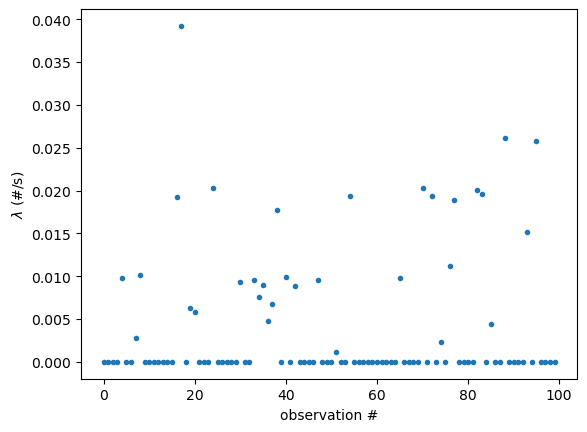
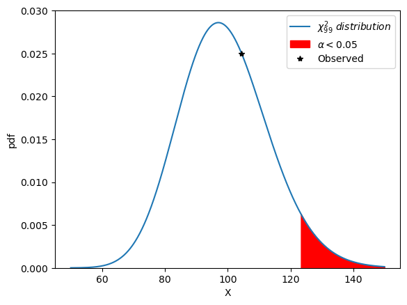

# Gamma ray observation analysis

The file ```gamma-ray.csv``` contains a small quantity of data collected from the Compton Gamma Ray Observatory, a satellite launched by NASA in 1991 (http://cossc.gsfc.nasa.gov/). For each of 100 sequential time intervals of variable lengths (given in seconds), the number of gamma rays originating in a particular area of the sky was recorded. You would like to check the assumption that the emission rate is constant.

The following plot shows the emission rate of each source.



1. *What is a good model for such data?*

**The number of gamma rays is discrete and non-negative. It would also be fair to assume that gamma rays emerge independently of one another, and at a constant rate in each time interval. As such a good model to use would be the Poisson distribution. More specifically we can write the model of the data, the number of gammy rays in time interval $i$ as $G_i \sim Poisson(\lambda_i t_i)$, where $\lambda_i$ denote the average rate of gamma rays (per second) in time interval $i$ and $t_i$ denote the lenth in seconds of this time interval.**

2. *Describe the null hypothesis $H_0$ and the alternative hypothesis $H_A$.*

- $H_0: \lambda_0 = \lambda_1 = ... = \lambda_9$.

- $H_A: \lambda_i \ne \lambda_j$ for some $i$ and $j$.

3. *What is(are) the most plausible parameter value(s) for the null model given the observations? Derive the MLE(s), i.e., maximum likelihood estimators. Calculate the value of the estimator(s) from the data.*

The likelihood function is

$f(G_0,G_1,...,G_{99}|\lambda) = \prod_{i=0}^{99}\frac{e^{-\lambda t_i}(\lambda t_i)^{G_i}}{G_i!}$.

We can now take the log of this function and we obtain

$ln(f) = -\lambda\sum_{i=0}^{99} t_i + ln(\lambda)\sum_{i=0}^{99} G_i + ln\prod_{i=0}^{99} t_i^{G_i} - ln(\prod_{i=0}^{99} G_i!)$.

Finally we take the derivative w.r.t. $\lambda$ and set the derivative to 0 to find the optimal value of $\lambda$.

$0 = - \sum_{i=0}^{99}t_i + \sum_{i=0}^{99} G_i / \lambda$.

$\hat{\lambda} = \sum_{i=0}^{99} G_i / \sum_{i=0}^{99}t_i$. 

Code:
```python
import numpy as np
import matplotlib.pyplot as plt
import pandas as pd

gamma_data = pd.read_csv('data_and_materials/gamma-ray.csv')

# For H0, the MLE estimator is a single average rate over the whole dataset
lambda_hat_H0 = gamma_data['count'].sum()/gamma_data['seconds'].sum()

#The expected value for the null model given the data is
print(lambda_hat_H0)
0.0038808514969907496
```
From the data we obtain

$\hat{\lambda}_{H_0} = 0.00388$.

4. *What is(are) the most plausible parameter value(s) for the alternative model given the observations? Derive the MLE(s) formula(ae).*

The likelihood function is

$f(G_0,G_1,...,G_{99}|\lambda_0,\lambda_1,...,\lambda_{99}) = \prod_{i=0}^{99}\frac{e^{-\lambda_i t_i}(\lambda_i t_i)^{G_i}}{G_i!}$.

We take the log and

$ln(f) = -\sum_{i=0}^{99} \lambda_i t_i + \sum_{i=0}^{99} ln(\lambda_i)G_i + \sum_{i=0}^{99} ln(t_i) G_i - ln(\prod_{i=0}^{99} G_i!)$.

Finally we take the partial derivative w.r.t. each parameter $\lambda_i$ and set the derivative to 0. For each $\lambda_i$ we obtain

$0 = -t_i + G_i/\lambda_i$,

$\hat{\lambda}_i = \frac{G_i}{t_i}$.

The result is shown in the plot at the beginning. As we can observe, most values are zero.

We can now check if our alternative hypothesis is statistical significative. To this end, we'll use the likelihood ratio test:

$L(x) = -2 ln(max(f(G_0,G_1,...,G_{99})|\lambda)/max(f(G_0,G_1,...,G_{99}|\lambda_0,...,\lambda_{99})))$.

The asymptotic distribution for $L(x)$ follows a $\chi^2$ distribution with 99 degrees of freedom. 

We calculate the likelihood ratio test with the following code:
```python
def likelihood_H0(lamb):
  # The likelihood function is a product of Poisson distributions. For H0, each Poisson distribution
  # has the same mean.
  return sp.stats.poisson.pmf(gamma_data['count'], gamma_data['seconds']*lamb).prod(axis=0)

def likelihood_H1(lambs):
  # For H1, the means for the Poisson distributions are given by the parameter 'lambs'
  return sp.stats.poisson.pmf(gamma_data['count'], gamma_data['seconds']*lambs).prod(axis=0)

# The test statistic for the MLE is given by calculating the likelihood ratio for the MLE estimators
# calculated earlier.
Lambda_observed = -2*np.log(likelihood_H0(lambda_hat_H0)/likelihood_H1(lambdas_hat_H1))
# Now we can use the CDF to find the p-value for the observed data
# with the MLE estimators.
pvalue = 1-sp.stats.chi2.cdf(Lambda_observed, 99) #pvalue = 1-CDF = SF
print('Statistic value =',Lambda_observed,'p-value =',pvalue)
Statistic value = 104.39792133021314 p-value = 0.33576662402509894
```
**From the results we conclude that we can't reject the null**. We can observe our result graphically in the plot below. The rejection region at a significance level equal or lower than 0.05 is shown in red.




Code:
```python
import scipy as sp

# Here we plot the chi^2 distribution for 99 degrees of freedom in the range of insterest (around the mean)
Xs = np.arange(50,150,0.1)
ys = sp.stats.chi2.pdf(Xs, 99)
plt.plot(Xs,ys,label='$\chi^2_{99}\ distribution$')
plt.ylim(0,0.030)
plt.xlabel('X'),plt.ylabel('pdf')

##rejection region @0.05 corresponds to region where the pdf >=0.95
reject = sp.stats.chi2.ppf(0.95,df=99) #percent point function
observed = 104.398 #statistic value
plt.fill_between(Xs,ys,color='red',where=(Xs>=reject),label='$\\alpha < 0.05$')
plt.plot(observed,sp.stats.chi2.pdf(observed,99),'k*',label='Observed')
plt.legend()
```


