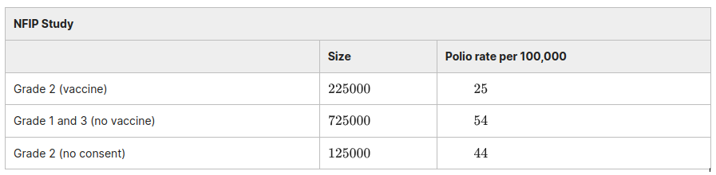
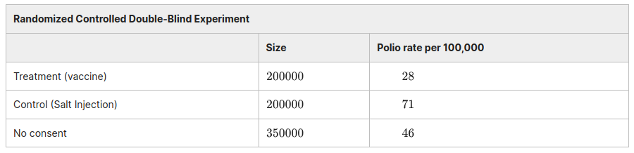

# Example. The Salk Vaccine Field Trial

**This example shows how we should qualitatively interpret simple results in the context of clinical trials.**

The first polio epidemic hit the United States in 1916. By the 1950s several vaccines against the disease had been discovered. The one developed by Jonas Salk seemed the most promising in laboratory trials. By 1954, the National Foundation for Infantile Paralysis (NFIP) was ready to try the vaccine in the real world.

They ran a controlled experiment to analyze the effectiveness of the vaccine. The data is shown in the first table below (grade refers to educational stage).

The experiment was run in the following way:

- Vaccines were offered to Grade 2 students, but some Grade 2 students did not consent and opted out of the offered vaccine.

- Vaccines were not offered to Grade 1 and Grade 3 students.

The experiment was later repeated as a randomized controlled double-blind experiment. The data is shown in the second table below.

1. *How would you run a randomized controlled double-blind experiment to determine the effectiveness of the vaccine? Write down procedures for the experimenter to follow.*

**I will first give the consent form to all students and parents, telling them they will be randomized into two groups for a study for vaccine. But they will not know which group they are in. Then I split the students who consent to this study randomly into two groups. Offer vaccine to one group, and call them "Group A". Offer placebo to the other group, and call them "Group B". (These names can also be randomized.) Vaccine is delivered to organizers in vials marked as "For group A" only, with no other identifier. The same is done for the placebo, marked "For group B". Thus, the medical staff nor students know who is given the vaccine (double blind).**

2. *For each of the NFIP study, and the Randomized controlled double blind experiment above, which numbers (or estimates) show the effectiveness of the vaccine? Describe whether the estimates suggest the vaccine is effective*

**The NFIP study has the following possible source of bias: the participants are first assigned groups before being asked to consent. Thus, participants that would not consent to a vaccine are included in the "no vaccine" group, but have sorted themselves out of the "vaccine" group. Therefore, to correct for this, the comparison must be made between the "no vaccine" group, and the sum of the "vaccine" and "no consent" groups (offered vaccine).**

**NFIP study The polio rate per 100,000 of the subgroup that is offered vaccine is:**

**$(25.225000 + 44.125000)/(225000+125000) = 31.79$.**

 		 	 
**The polio rate per 100,000 of the subgroup that is not offered vaccine is: $54$.**

**Therefore, the number $54-31.79 = 22.21$ shows the decrease of polio rate in the group that's offered vaccine. Yes, it is positive and suggests that offering the vaccine is effective. It is also reasonable to state that there are no groups, and thus no answer to the question of how effective the vaccine itself is (as opposed to offering the vaccine).**

**For the Randomized Control Trial, consent is asked first, so this bias is not present (non consenters are sorted out before assigning groups). Therefore, the comparison should be between just the "vaccine" and "placebo" groups.**

**RCT: $71-28=43$. This number suggests that the vaccine is effective.**

3. *Let us examine how reliable the estimates are for the NFIP study. A train of potentially problematic but quite possible scenarios cross your mind:*

a) *Scenario: What if Grade 1 and Grade 3 students are different from Grade 2 students in some ways? For example, what if children of different ages are susceptible to polio in different degrees?*

*Can such a difference influence the result from the NFIP experiment? If so, give an example of how a difference between the groups can influence the result. Describe an experimental design that will prevent this difference between groups from making the estimate not reliable.*

**If 3rd graders and 2nd grade students respond to the vaccine in different ways, formally, if the treatment effect for 3rd graders and 2nd graders are different, then the estimate from NFIP study is not accurate. For example, if 2nd graders are less susceptible to polio for some unknown reason, even without vaccine, then we can't conclude that the lower polio rate observed is due to vaccine.**

**In order to get rid of this bias, since we don't observe how Grade influence polio susceptibility nor how Grade influence vaccine effectiveness, it is better to eliminate Grade as a variable (i.e., confounder). We can do this by randomly assigning students to the control and vaccine group, independent of their Grade level.**

b) *Polio is an infectious disease. The NFIP study was not done blind; that is, the children know whether they get the vaccine or not. Could this bias the results? If so, Give an example of how it could bias the results. Describe an aspect of an experimental design that prevent this kind of bias.*

**An individual knowing that he is given the vaccine can increase his willingness to take risks and go to places with higher risk factors for contacting polio. On the contrary, knowing that he is not given the vaccine can increase caution and protect themselves by avoiding contacting risk factors. This can lead to a potential underestimate of vaccine effectiveness.**

**To eliminate this bias, make the experiment blinded, i.e., children do not know if they receive vaccine or not. In order to do this, this automatically requires prepare some placebo, such as salt water injection, so that children truly don't know if they get the vaccine or not.**

c) *Even if the act of “getting vaccine" does lead to reduced infection, it does not necessarily mean that it is the vaccine itself that leads to this result. Give an example of how this could be the case. Describe an aspect of experimental design that would eliminate biases not due to the vaccine itself.*

**For example, maybe the non-effective elements in the vaccine leads to reduced infection (injecting water helps). Maybe purely knowing you are vaccinated leads to reduced infection (placebo effect). Maybe the way the researcher who perform the vaccine treat the children leads to reduced infection (e.g., he educates the children on prevention while giving the vaccines.)**

**In order to eliminate this bias, make the study double-blinded, and give the control group injection with non-active elements.**

4. *In both experiments, neither control groups nor the no-consent groups got the vaccine. Yet the no-consent groups had a lower rate of polio compared to the control group. Why could that be?*

**The lower rate for polio in the no consent groups might suggest that the parents who decided not to participate in the trial did so knowing that their children were less predisposed to contracting the disease. i.e. they live in areas with lower rates of polio. This is a form of selection bias; specifically: a self-selection bias.**

**According to Freedman, Pasini and Purves, it was known that parents with higher incomes were more likely to consent to the study because higher-income families had a higher risk of contracting polio. They say that this seemingly paradoxical confound stems from the fact that higher-income families have generally better sanitation, while lower-income families have poorer sanitation. Poorer sanitation allows children at a young age to be exposed to various germs and develop antibodies that made them less vulnerable to polio than their higher-income peers.**

5. *In the randomized controlled trial, the children whose parents refused to participate in the trial got polio at the rate of 46 per 100000, while the children whose parents consented to participate got polio at a slighter higher rate of 49 per 100000 (treatment and control groups taken together). On the basis of these numbers, in the following year, some parents refused to allow their children to participate in the experiment and be exposed to this higher risk of polio. Were their conclusion correct? What would be the consequence if a large group of parents act this way in the next year's trial?*

**Not necessarily. The fact that those who participated in the trial had a slightly higher rate of contracting polio does not mean that the trial is what caused the polio. Again, some confounders may exist. For instance, the parents who did not consent to the trial the first year may have correctly assumed that their children were less at risk for contracting polio, for reasons stated in previous problem (perhaps they lived in a cleaner community). If this is the case, parents who refuse the second year and do not live in these cleaner communities are basing their decision on a sample of people with different circumstances and environmental factors, and we might see the rate of polio in the non-consenting group rise drastically in the next trial.**

