# Machine learning

## Linear classifiers and generalizations

### Introduction

Machine Learning (ML) as a discipline aims to design, understand, and apply computer programs that learn from experience (data) for the purpose of modelling, prediction and control. 

Here we will start with **prediction**.

*What can we predict?* Ex: market forecast, weather, next word in a sentence, pedestrian behavior etc.

We can also try to predict unknown properties. Ex: properties of materials, an object in an image, what English sentence translates in another language, whether a product review carries + or - sentiment etc.

However, all these problems have a common difficulty: it is very hard to write down a solution in terms of rules or code directly. It is far easier to lay out examples of correct behavior. In other words, it is much easier to provide large numbers of examples and design an algorithm that can learn from these examples.

In supervised learning, we hypothesize a collection of functions (or mappings) with **parameters** from the examples (e.g. images) to the targets (e.g. objects in images). The ML algorithm then automates the process of finding the parameter of the function that fits best with the example-target pair.

Let's use an example of a movie recommender system. Let's suppose we have five features (yes/no or 1/0) of interest in a movie. We can encode them, for each movie, in a feature vector as

$$
X_i = [x_1,x_2,x_3,x_4,x_5],
$$

where $x_i \in \{0,1\}$.

Our goal is to predict whether someone will like a movie or not. For a subsample of our data we know this value. It is also a {1,0} vector, each value corresponding to one movie (e.g. like/dislike).

Therefore, we can define this sentiment as $y_i$ where $y_i \in {0,1}. We call also call it the label.

We can then use the subsample where we have the label information and define a training set as

$$
S_n = {(X_i,Y_i)},
$$

where $X^i$ are the feature vectors and $y^i$ are the targets (or labels), as well as a test set where we don't have the labels and we will evaluate the algorithm.

Training data can be graphically depicted on a (hyper)plane. **Classifiers** are mappings that take feature vectors as input and produce labels as output. The **hypothesis space** is the set of possible classifiers. In this case we have +1 or -1 labels and we can display them as a projection in a plane such as the figure below.

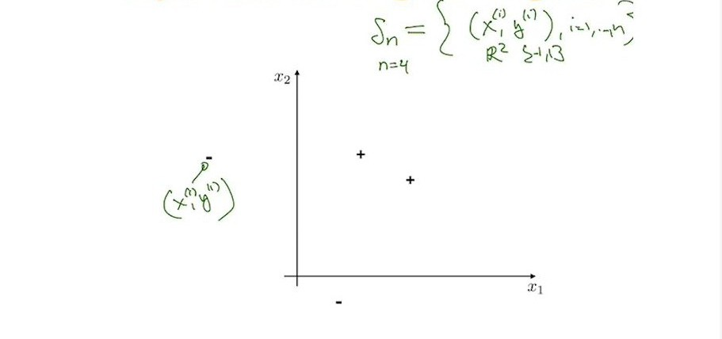

A common kind of classifier is the **linear classifier** which linearly divides space into two as shown, for instance, in the figure below.

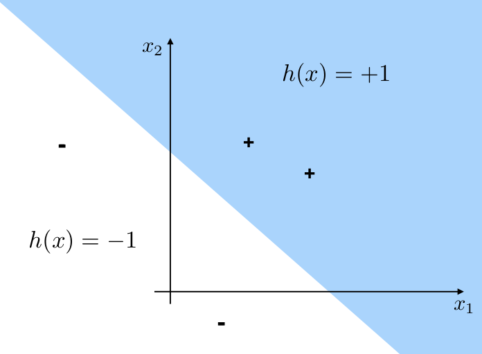

The line dividing the two regions is called the **decision boundary**.

We can define this type of classifier as

$$
h: x \rightarrow \{-1,1\}.
$$

There are many ways to perform this division. But before looking into that let's first define the **training error** which is the error that the classifier commits when performing its task. Thus,

$$
\epsilon_n(h) = \frac{1}{n}\sum_{i=1}^n[h_i(x) \ne y_i].
$$

An illustration of such error is shown in the figure below.

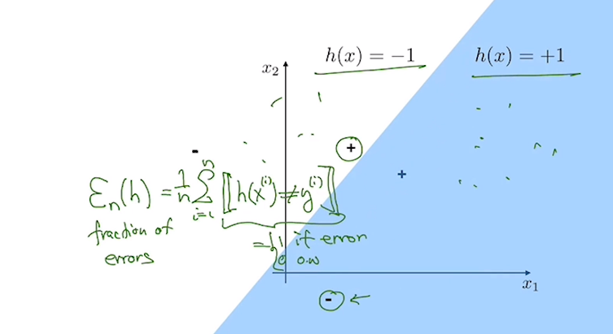

**Note: the classifier region needs to contain all regions of the test region as shown in the figure below. We need to generalize the best as possible but as the complexity arises, the more difficult it is to generalize.**

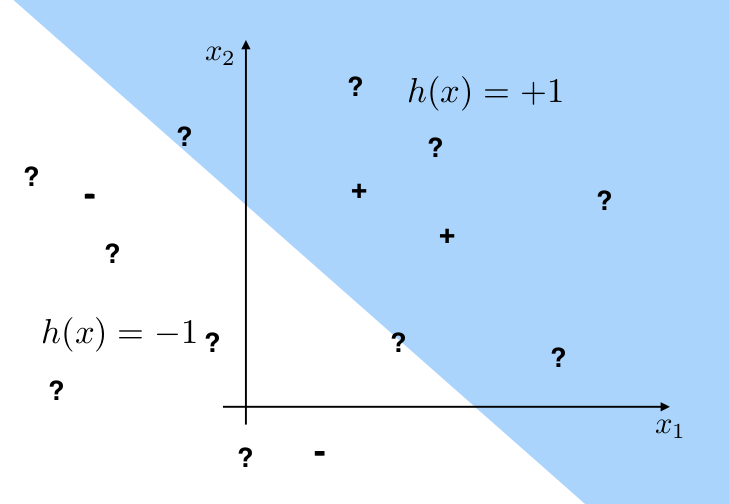

Let's now move to the separation issue. We'll start with the **linear separation**. 

*How to parametrize the classifiers?* We can do this i) through origin or ii) through anywhere.

i) Through origin: 

$$
h(x;\mathbf{\theta}) = sign(\mathbf{\theta . x}),
$$

*...because the dot product will be negative if the vector x with angle $\alpha$ related to $\theta$ will have $\alpha$ negative. The same happens if positive values.*

The illustration below shows this parametrization in the 2-D plane.

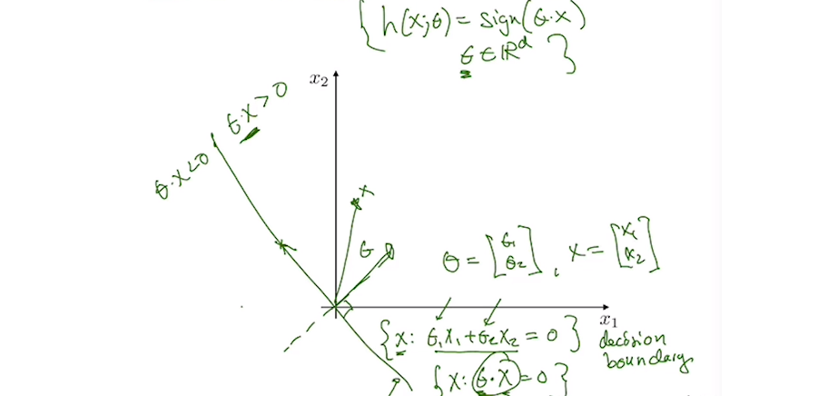

ii) Through anywhere: 

$$
h(x;\mathbf{\theta}) = sign(\mathbf{\theta . x} + \theta_0),
$$

where $\theta \in R^d$, $\theta_0 \in R$. The illustration below shows this parametrization in the 2-D plane. The only difference from i) to ii) is only the offset $\theta_0$ of the plane.

In other words, given $\theta$ and $\theta_0$, a linear classifier $h:X\rightarrow \{-1,0,1\}$ is a function that outputs 1 if $\mathbf{\theta.x} + \theta_0 \gt 0$, 0 if it is zero and -1 if $\mathbf{\theta.x} + \theta_0 \lt 0$.

**Definition:** The training examples $S_n$ are **linearly separable** if there exists a parameter vector $\hat{\theta}$ and offset parameter $\hat{\theta_0}$ such that $y_i(\hat{\theta}.x_i+\hat{\theta_0}) \gt 0\text{ } \forall \text{ } i=1,...,n$.

For instance, the following two examples are linearly separable

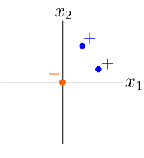

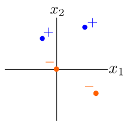

while the following two are not.

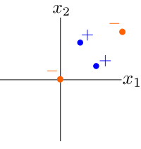

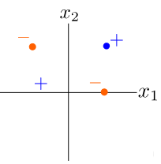

Let's go back to the training error, this time for a linear classifier. The training error was defined as

$$
\epsilon_n(h) = \frac{1}{n} \sum_{i=1}^n h_i(x) \ne y_i
$$

We can re-write this statement for linear classifiers as

$$
\epsilon_n(\theta) = \frac{1}{n} \sum_{i=1}^n y_i\theta.x_i \le 0
$$

if it runs through the origin, or 

$$
\epsilon_n(\theta,\theta_0) = \frac{1}{n} \sum_{i=1}^n y_i\theta.x_i + \theta_0 \le 0
$$

if it runs through anywhere.

### Perceptron algorithm

We can now construct our first ML algorithm called **perceptron algorithm** (without offset). This algorithm will find the best possible linear separation boundary. It can be written as

$
\text{Perceptron}(\{(x_i,y_i),i=1,...,n\},T) \text{:}
\\
\hspace{5mm} \text{initialize } \theta = 0 \text{ [vector]}
\\
\hspace{10mm}\text{for } t=1,...,T \text{ do}
\\  
\hspace{15mm}\text{for } i=1,...,n \text{ do}
\\
\hspace{20mm}\text{if } y_i(\theta.x_i) \le 0 \text{ then}
\\
\hspace{15mm}\text{update } \theta = \theta + y_i x_i
\\
\hspace{5mm}\text{return }\theta
$

In other words, for each time step $t=1,...,T$ and for each data point $i=1,...,n$, when the perceptron algorithm finds an error (line 5) it updates the angle $\theta$ in the right direction. When it finishes at $t=T$ it returns the final value of $\theta$.

The same algorithm, but this time including an offset is very similar. We can write it as

$
\text{Perceptron}(\{(x_i,y_i),i=1,...,n\},T) \text{:}
\\
\hspace{5mm} \text{initialize \{} \theta = 0 \text{ [vector], }\theta_0=0 \text{ [scalar]\}}
\\
\hspace{10mm}\text{for } t=1,...,T \text{ do}
\\  
\hspace{15mm}\text{for } i=1,...,n \text{ do}
\\
\hspace{20mm}\text{if } y_i(\theta.x_i + \theta_0) \le 0 \text{ then}
\\
\hspace{15mm}\text{update } \theta = \theta + y_i x_i
\\
\hspace{15mm}\text{update } \theta_0 = \theta_0 + y_i
\\
\hspace{5mm}\text{return }\theta
$

### Hinge Loss, Margin boundaries and Regularization

If the problem is linearly separable, the perceptron algorithm can find a solution. However, this solution is not optimized as there are infinite solutions to the problem as shown in the illustration below.

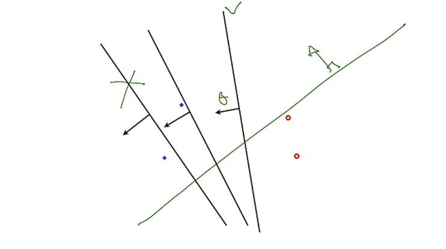

In this diagram, the solution on the left is clearly not correct, but there are many correct ones as shown. 

*How to optimize the solution? How to establish a large margin classifier, more robust to noise?*

#### Learning as optimization

We need to solve an objective function that optimizes the **hinge loss** and the size of the *fat* boundaries (**regularization**). To this end let's write three important concepts.

- The **decision boundary** is a set of points that satisfy $\theta.x+\theta_0 = 0$. 

- The **margin boundary** is the set of points that satisfy $\theta.x + \theta_0 = \pm 1$. This implies that the distance from teh decision boundary to the margin boundary is $1/||\theta||$. 

- The **signed distance** to the margin boundary can be written as 

$$
\gamma_i(\theta,\theta_0)  \frac{y_i(\theta x_i + \theta_0)}{||\theta||},
$$

where $y_i$ = \pm 1$, $y_i(\theta x_i + \theta_0) \pm 1$, and will be $+1$ if the correct side of the decision boundary was chosen. Otherwise it will be $-1$. The following figure illustrates these three concepts.

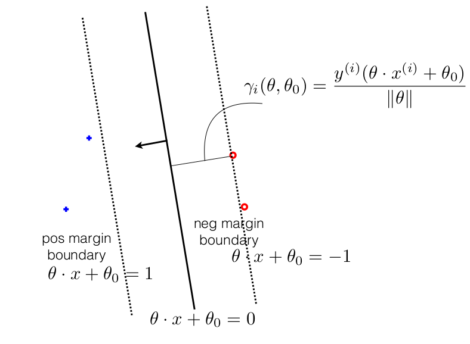

The objective function will then be the **hinge loss** plus the **regularization** as we'll see. The goal is to obtain the maximum margin boundary possible.

We can define the **hinge loss** as

$$
Loss(y_i(\theta.x_i + \theta_0)) =
    \begin{cases} 
    0 \text{ if } z \ge 1 \\ 
    1-z \text{ if } z \lt 1
    \end{cases}
,$$

where $z=y_i(\theta.x_i + \theta_0)$. In order to obtain the maximum margin we need to maximize the distance $\frac{1}{||\theta||}$. We can also write this as the minimization of $\frac{||\theta||^2}{2}$.

We can now write the objective function as

$$
J(\theta,\theta_0) = \frac{1}{n}\sum{Loss(y_i(\theta.x_i + \theta_0))} + \frac{\lambda}{2} ||\theta||^2,
$$

where $\lambda$ is the regularization parameter. It weights the loss and the regularization. **Here we want to minimize (derive) the value of J!**

The important thing here to remember is that:

- A large $\lambda$ means that we put more importance on maximizing the margin than minimizing the errors.
- A small $\lambda$ means that we put less importance on maximizing the margin than minimizing the errors.

**Note: the loss at the wrong side of the boundary has a value greater than 1!**

Let's look at a simple exercise. In a 2D dimensional space, there are points A, B, C, and D as depicted in the figure below.

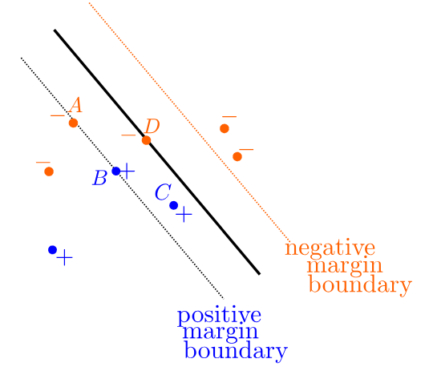

Here:

- The Loss of A is $1-(-1) = 2$
- The Loss of B is $1-(+1) = 0$
- The Loss of C is between 0 and 1
- The Loss of D is $1-0=1$

#### Novikoff theorem

The Novikoff theorem states that there exists a parameter $\theta^*$ such that $\frac{y_i(\theta^*.x_i)}{||\theta^*||} \ge \gamma \text{ } \forall \text{ } i=1,...,n \text{ and } \gamma \gt 0$.

