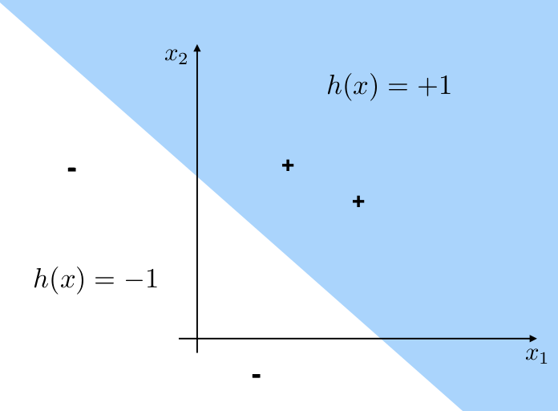

# Methods of classification on high-dimensional data

## Introduction

### Classification problem

Given data $X^{(1)},X^{(2)},...,X^{(n)}$ that take values in $\mathbb{R}^p$, a **classification problem** is a problem in which we look for a functions 

$$
f:\mathbb{R}^p \rightarrow C,\ \text{where } C={C1,...,C_k},
$$

which maps the sample space of the data into a set of class labels $C={c1,...,c_m}$. This function is called a **classifier**.

The goal of a classification problem is to predict the class that an unseen data point belongs to. 

Here we will only discuss classification methods using a **supervised framework**, where data with true class levels are available to be used as training.

### Methods of classification

We will begin with the methods with the most assumptions to the ones with the least assumptions:

- Classification using Baye's rule
- Quadratic discriminant analysis (QDA) and Linear discriminant analysis (LDA)
- Logistic regression
- Support vector machine (SVM).

Neural newtworks as also quite used for classification. However we will not discuss them at this time. Check out Machine learning with python.

## Bayes Rule for Classification

Let $X$ be a random variable (or vector) modeling the data, and $C$ be a random variable representing class labels. Assume a model $P(X|C)$ for the data in different classes, and assume a prior distribution $P(C)$ for the classes. We can then estimate the class label of data point $x$ by finding the class that maximizes the posterior distribution of $P(C|X=x)$ which is given by the Baye's rule

$$
P(C|x) = \frac{P(C)P(X|C)}{P(X)} \approx P(C)P(X|C)
$$

We dropped the $P(X)$ since that does not affect the maximization of $P(C|X)$. The prior distribution P(C) of the class labels can either be based on prior studies and knowledge or estimated from the prevalence of the training data (or be completely random).

Procedure:
- Assume $X|C \sim N(\mu_c,\sigma_c)$
- choose class $c \in {1,...,K}$ such that $P(C=c|X)$ is maximal (MLE)
- Special case: 2 classes (0 and 1)
  - chooce $c = 1$ if $P(C=1|X) > 0.5$
  - equivalently choose c = 1 if posterior odds $P(C=1|X)/P(C=0|X) > 1$
- We need to estimate P(C=c) on P(X|C).

In the special case of classification into only two classes, a decision boundary is a hipersurface such that data on one side are classified as one of the two classes, and data on the other side are classified into the other class.

### Example

Suppose we have developed a new COVID-19 test. It reports 99% of the time when the patient is indeed infected, but still report 10% of the time when the patient is not infected.

Suppose 5% of the population are infected. If a patient receives a positive test result, what is the probability that the patient is indeed infected?

To understand better we should construct an input table

| Test \ Truth | P (5%) | N   |
|--------------|--------|-----|
| TP           | 99%    | 10% |
| TN           | 1%     | 5%  |

Drawing a sketch always help as well, as shown below.

To solve this using the Bayes framework we need to understand what we already have:

- The probability of testing positive (TP) given the patient is indeed positive (infected) is $P(TP/P) = 0.99$.
- We also know than only 5% of the population is infected (5%).
- We know that the bayes rule is our basic framework:
$$
P(A|B) = \frac{P(B|A)P(A)}{P(B)}.
$$

First we compute the marginal (unconditional) probability of being test positive $P(TP)$. Using the total probability theorem we can write

$$
P(TP) = P(TP|P)P(P)+P(TP|N)P(N) = 0.99\times0.05+0.1\times0.95=0.1445.
$$

Then we apply Bayes rule

$$
P(P|TP) = \frac{P(TP|P)P(P)}{P(TP)} = \frac{0.99\times0.05}{0.99\times0.05 + 0.1\times 0.95} = 0.3426.
$$

The probability is quite low!!! This reflects the low accuracy of the test as well as the fact that a very small % of the population is infected.

If a patient receives a negative test results, what is the probability that he/she is not infected?

$$
P(N|TN) = \frac{P(TN|N)P(N)}{P(TN)} = \frac{0.90\times0.95}{0.90\times0.95 + 0.1\times 0.05} = 0.9994.
$$

The result reflects the higher accuracy for negative results by the test as well as the prior information that only 5% of the population are infected.

## Quadratic discriminant analysis

### 1-D

- Let's assume that $\mathbf{X}|(C=c) \sim \mathcal{N}(\mathbf{\mu_c},\mathbf{\sigma_c})$. 

- With MLE we can estimate $P(C=c), $\mu_c$ and $\sigma_c$ for each $c$.

- Choose class $c$ such that 

$$
P(C=c|X=x) \propto P(C=c)P(X=x|C=c)
$$
is maximal.

- Use the fact that maximizing $P(C=c|X=x)$ is equivalent to maximizing its log. Then,

$$
\log{(P(C=c|X=x))} \propto \log{(P(C=c))} - \frac{1}{2}\log{(det \Sigma_c)} - \frac{1}{2}(x-\mu_c)^T\Sigma_c^{-1}(x-\mu_c)
$$

- The decision boundaries are thus quadratic.

## Linear discriminant analysis

- Assumes the same covariance matrix $\Sigma$ in all classes, i.e. $(X|C=c) \sim N(\mu_c,\Sigma).$
- Estimate $P(C=c)$,$\mu_c$, and $\Sigma$ for each $c$.
- Choose class $c$ such that $\log{(P(C=c|X=x))}$ is maximal.
- Then,

$$
\log{(P(C=c|X=x))} \propto \log{(P(C=c))-\frac{1}{2}\mu_c^T\Sigma^{-1}\mu_c + x^T\Sigma^{-1}\mu_c}
$$
- The decision boundaries are thus linear

## Reduced-rank LDA (a.k.a. Fisher's LDA)

How can we use LDA to find informative low-dimensional projection of the data?

- $\mu_1,...,\mu_k \in \mathbb{R}^p$ lie in a linear subspace of dim(K-1) - usually $p>>k$.
- if $K = 3$, then data can be projected into 2D.
- if $K>3$, combine LDA with PCA, i.e. perform PCA on class means
  - The first LD is the first PC of the class means, the second LD is the second PC of the class means...etc

## Logistic regression

Logistic regression is a generalized linear model for predicting a binary response variable and is often used for binary classification tasks. In the logistic regression model, a binary class label $Y \in {0,1}$  given an observed data vector $\textbf{x} \in \mathbb{R}^d$  is written as a Bernoulli random variable:

$$
Y|_x \sim Bernoulli(p(\mathbb{x})).
$$

The aim of the logistic regression is to find the model with parameter $p(\mathbb{x})$. In particular we assume the parameter $p$ satisfies 

$$
log(\frac{p}{1-p}) = \beta_0 + \beta^T \mathbf{x},
$$

which is equivalent to

$$
p(\mathbf{x}) = \frac{1}{1+\exp{(-\beta_0-\beta^T\mathbf{x})}}.
$$

The task of *training* or *fitting* a logistic regression requires selecting values for the parameters $\beta_0$ and $\beta$ such that a set of observed data vectors and binary labels have a high likelihood under the model in the equation above.

The likelihood of observing a dataset $\left(\mathbf{x}^{(1)},Y^{(1)}\right),...,\left(\mathbf{x}^{(1)},Y^{(1)}\right)$ is given by

$$
L(\beta_0,\beta) = \prod_{i \in Y^{(i)}=1} p(x^{(i)})\prod_{i \in Y^{(i)}=0} (1 - p(x^{(i)}))
$$

$$
= \prod_{i=1}^n p(x^{(i)})^{Y^{(i)}}(1 - p(x^{(i)}))^{1-Y^{(i)}}.
$$

From here we can calculate the log-likelihood,

$$
log L = \sum_{i=1^n} Y^{(i)}\log{p(x^{(i)})} + (1-Y^{(i)})\log{(1-p(x^{(i)}))}
$$ 

$$
= \sum_{i=1}^n Y^{(i)}\log{\frac{p(x^{(i)})}{1-p(x^{(i)})}} + \log{(1-p(x^{(i)}))}
$$

$$
\sum_{i=1}^n Y^{(i)}(\beta_0+\beta^T \mathbf{x}^{(i)}) - \log{(1+\exp{(\beta_0+\beta^T\mathbf{x}^{(i)})})}
$$

By maximizing the log likelihood function, we solve the parameters $\beta$ and $\beta_0$.

## Support Vector Machines (SVMs)

*Taken from [en.wikipedia.org/wiki/Support_vector_machine](http://en.wikipedia.org/wiki/Support_vector_machine)*

Let $(x_1,y_1),...,(x,n,y_n)$, with $x_i \in \mathbb{R}p, y_i \in {-1,1}$ be our training data.

- If a perfect classification is possible, determine a hyperplane $(wx-b=0)$ that maximizes the distance to the nearest point $x_i$ from each group:

$$
\text{minimize } ||w||_2 \text{ such that } y_i(\textbf{w}x_i) \ge 1 \ \forall\ i.
$$

**Note: $\mathbf{w}$ is a vector that defines the hyperplane and is perpendicular to it**

- If a perfect classification is not possible, determine a hyperplane $(\mathbf{w}x-b=0)$ that maximizes the distance to the nearest point $x_i$ from each group and minimizes the sum of classification errors $\varphi_i$:

$$
\text{minimize } ||\mathbf{w}||_2 + \lambda\sum_{i=1}^n \varphi_i \text{ such that } y_i(\mathbf{w}x_i - b) \ge 1 - \varphi_i\ \forall\ i
$$

## Wrap-up: Classification

- Bayesian decision theory
  - Need to know *a priori* distribution of the categories
  - Does not even need training data
  - Can design optimal classifier
- LDA/QDA/Logistic regression
  - Shape of probability distribution of categories is known   
  - Need to estimate parameters of probability distribution
  - Needs training data
- Logistic regression and SVM
  - Non-parametric methods i.e. no probability distribution
  - Need to estimate parameters of discriminant function
  - Labeled data, need training data
- Clustering
  - Works on unlabeled data

## Quality of classification

2 approaches:

 - Separate training data from test data. Applies diagnostics to the latter.
 - Performs cross validation (e.g. leave-one out CV or block CV).

*How to calculate an empirical error rate?*

1. Build a confusion matrix like the on in the following table

2. Compute

$$
\text{error rate} = 1 - \frac{\sum\text{diag}}{N}.
$$

For instance, the error rate of this model would be

$$
er = 1-(23+27+29)/100 \sim 0.21
$$

