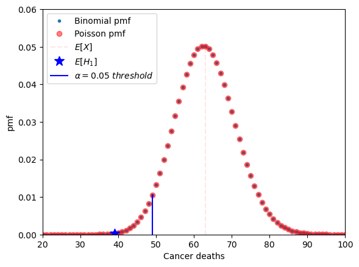

# Mammography study - a discrete variable example

Here I will demonstrate how we can analyze data from observational studies using a mammography study as an example.

The key questions here are the following: 

* *Does mammography speeds up cancer detection?*

* *How do we set up an experiment in order to minimize the problem of confounding?*

The study consists in the screening of women's breasts by X-rays as shown in the Table below.


Intuitively, we are inclined to compare between those who took the treatment with the ones how refused it. However this is an **observational comparison**!

Instead we need to compare the whole treatment group against the whole control group.

We need to do an **intent-to-treat analysis**.

From the table we will assume that the **outcome variable** will be death by breast cancer. This variable will depend on the treatment variable, that will be the people offered mammography.

Why? Because we cannot **force** people to do the mammography!

## RCT

In this experimental design we need to consider the following properties:

* Patient selection: Some populations are more likely to develop breast cancer than others depending on their prior health background, so the interpretation of any result we obtain will depend on how we have defined our selection procedure. In general, how we select the treatment and control groups will influence the population for which the conclusion is valid.

* Control group: We need to compare the outcome variable for those who have received the treatment with a baseline (i.e, the control group). Here, the control group (who were not offered a mammography) must be a comparable set of people to the treatment group (who have been offered a mammography).

* Features of the patients: One way to make accurate comparison and interpretation of results is to ensure that the treatment group is representative across factors such as health status, age, and ethnicity, and is similar along these dimensions as the control group. This way, we can attribute any differences in outcome to the treatment rather than differences in covariates. In a general study, it is upon the researchers' discretion to determine which features to be careful about.

An experimental design where treatments are assigned at random and that satisfies the three points described above is called a **randomized controlled trial (RCT)**. The controls can be an observational group or treated with a placebo.

## Double blind

In any experiment that involves human subjects, factors related to human behavior may influence the outcome, obscuring treatment effects. For example, if patients in a drug trial are made aware that they actually received the new treatment pill, their behavior may change in a number of ways, such as by being more or less careful with their health-related choices. Such changes are very difficult to model, so we seek to minimize their effect as much as possible.

The standard way to resolve this is through a double-blind study, also called a blinded experiment. Here, human subjects are prevented from knowing whether they are in the treatment or control groups. At the same time, whoever is in charge of the experiment and anyone else who could interact with the patient are also prevented from directly knowing whether a patient is in the treatment or the control group. This is to prevent a variety of cognitive biases such as observer bias or confirmation bias that could influence the experiment.

In some cases, it is impossible to ensure that a study is completely double-blind. In the mammography study, for example, patients will definitely know whether they received a mammography. If we modify the treatment instead to whether a patient is offered mammography (which they could decline), then we neither have nor want double-blindness.

## Hypothesis testing

From the table we can observe that

* death rate from breast cancer in control group = $\frac{63}{31k}$ = 0.0020
* death rate from breast cancer in treatment group = $\frac{39}{31k}$ = 0.0013

***Key question:*** *Is the difference in death rates between treatment and control sufficient to establish that mammography reduces the risk of death from breast cancer?*

We need to perform an **hypothesis test**.

Hypothesis testing steps:

1. Determine a model. In our case Binomial (modeling as the outcome of a number *n* of heads/tails) or a Poisson model (modeling as number of arrivals/events).

2. Determine a mutually exclusive null hypothesis and alternative.

* $H_0$: $\pi = 0.002$ or $\lambda = 63$

* $H_1$: $\pi = 0.0013$ or $\lambda = 39$

3. Determine a test statistic (quantity that can differentiate between $H_0$ and $H_1$ and whose assumptions under $H_0$ are true)

T = #Deaths under $H_0$:
    
* T ~ Binomial(31k,0.002) 
    
or 
    
* T ~Poisson(63)

4. Determine a significance level ($\alpha$) i.e. the probability of rejecting $H_0$ when $H_0$ is true: e.g. $\alpha \le 0.05$.

The following Figure shows the pmf of a Binomial and a Poissonian distributions. The significance level is depicted as the dashed blue line. We can observe that the distributions are very similar. Therefore, for large n, it is preferred to use the Poissonian approximation.

In this case, if the p-value of the test statistic is lower than 0.05 we can say that we reject the null at the 0.05 confidence level. In practice, however, we should be very careful about the importance of p-values and should use other statistical tools as well as we'll see later on.



*Code:*

```python
import numpy as np
from scipy.stats import poisson,binom
import matplotlib.pyplot as plt

n = 31000 #control sample size
death = 63 # number of cancer deaths in control
rate = death/n #death ratio in control
x = np.arange(0,125) #parameter space
#binomial calculation exercise
pmf_binomial = binom.pmf(x,n,rate)

#poisson approximation
pmf_poisson = poisson.pmf(x,death)

alpha = x[np.where(np.cumsum(pmf_binomial) <= 0.05)][-1] #alpha = 0.05

plt.plot(x,pmf_poisson,'.',label='Binomial pmf')
plt.plot(x,pmf_poisson,'or',alpha=0.5,label='Poisson pmf')
plt.plot((63,63),(0,0.05),'r--',alpha=0.1,label='$E[H_0]$')
plt.plot(39,pmf_binomial[39],'b*',markersize=12,label='$E[H_1]$')
plt.plot((alpha,alpha),(0,pmf_binomial[alpha]),'b-',label="$\\alpha=0.05\ threshold$")
plt.xlabel('Cancer deaths'),plt.ylabel('pmf')
plt.xlim(20,100),plt.ylim(0,0.06)

plt.legend()
```

The p-value is calculated by summing all pmf values up to pmf(x=39). Therefore, the p-value is a probability. In this case we obtain a value of 0.0008 which is much smaller than 0.05. **Thus, we reject the null**.

We can now define type I error, type II error and power from the following table.


Type I error is a false positive and is bounded by $\alpha$ (meaning type I error  $\le \alpha$), Type II error is a false negative, and the power can be written as

$$Power = 1-Type\ II\ error.$$

**Note:** there is a trade-off between type I error and type II error.

**Note:** the power of a 1-sided test is usually higher than the power of a 2-sided test. Thus you should always use 1-sided tests when evaluating deviations that go in one direction only.

The following plot shows a graphical depiction of the power of the test as well as the upper bound of the Type I error represented by $\alpha$. **The plot clearly shows the interplay between type I and type II errors: 


## Fisher exact test

What if we don't know the frequency of deaths of the control? We can do a **Fisher exact test** which is based on the hypergeometric distribution.

Null hypothesis: $\pi$ control = $\pi$ treatment

Alternative hypothesis: $\pi$ control > $\pi$ treatment

***Key question:*** *Knowing that 102 subjects died and that number of treatments / controls each is 31k what is the probability that deaths are so unevenly distributed?*

The $\textit{p-value}$ is then the sum of probabilities of obtaining a value of T that is more extreme than 39, in the direction of the alternate hypothesis:

$$P_{H_0}(T \le 39) = \sum_{t=0}^{39}{{31k \choose t}{31k \choose 102-t}{62k \choose 102}}$$

$\textit{p-value} = 0.011 < 0.05$

From here, based on the significance level $\alpha$, we can either

* reject the null if $p \le \alpha$

or

* fail to reject the null if $p > \alpha$.

Advantages:

- Does not assume knowledge about the true probability of dying due to breast cancer in the control population

Shortcomings:

- Assumes knowledge of the margins (i.e., row and column sums)
- **Alternative is Bernard’s test** (estimates the margins)
- Both tests are difficult to perform on large tables for computational reasons

# Sleeping drug study - a continuous variable example

Let's now move on to a different study where we have a **continuous variable** as our variable of interst.

In the clinical trial setup we are testing a new sleeping aid drug which in principle should help users suffering from insomnia to increase their sleeping time.

*Which should be the best approach to this problem?*

We could adapt the previous framework for the mammography study. However, the power of this hypothesis might not be very high, considering that the sample size is small: people have a wide range of sleep lengths and may be difficult to discern anything due to this natural variability. An alternative to the standard RTC test is a **paired test design**.

## Paired test design

In the paired test design one takes multiple samples from the same individual at different times, a group corresponding to the control situation and the other group corresponding to the treatment situation. This allow us to estimate the effect of the drug at the individual level. 

Therefore we will measure the difference between the observed values in the treatment and in the control situations,

$$Y_i = X_{i,treatment}-X_{i_control}$$.

The null hypothesis is the one where the expected value of the measurement $E[Y_i] = 0$.

**Note: the paired test design removes the need for randomization. However the individual does not know if he is in the treatment or the in the control group. This can be done by having two seperate observation periods: one for a placebo administration and the other for the drug treatment.**

## Modeling choce for the sleeping drug study

The following table shows the data collected for our clinical trial.


*What should be our modeling choice?*

In this case we can think in two possibilities *a priori*:

* The number of hour slept in a day has an upper bound, as shown in the table which implies that the difference $Y$ is also bounded. This points in favour of the **uniform distribution** as this model has bounded support, while the Gaussian distribution has infinite support.

* We can look at the empirical distribution of the observations. The number of hours slept by an adult is known to be centered around 8 hours, and outliers are rare, so this favours the Gaussian distribution model.

In this case, it is prefereble to choose the Gaussian distribution as it closely matches the empirical distribution of the sleeping population. We can further argue that the number of hours slept is a cumulative effect of a large number of biological and lifestile variables. As most of these variables are unrelated to each other, the cumulative effect can be approximated by a normal distribution.

## The central limit theorem (CLT) and the z-test statistic

From the CLT, we know that when $n$ is large, the distribution of the random variables of a sample $X_1...X_n$ is approximately normal with mean $\mu$ and variance $\sigma^2$. Therefore,

$$\overline{X} \sim N(\mu,\frac{\sigma^2}{n})$$

From here we can defina a test statistic, the **z-test statistic** as

$$z = \frac{\overline{X}-\mu}{\sigma/\sqrt{n}} \sim N(0,1)$$.

This test statistic does not depend on the parameters $\mu$ or $\sigma$. It is, in fact, the standard normal. Thus we can simply use the CDF of this function to calculate the $\textit{p-value}$ of the test statistic.

In our case we want to answer the following question:

*Does the drug increase hours of sleep enough to matter?*

To answer this question we go through the following steps:

1. Choose a model (Gaussian) and use the proper random variables ($Y_i = X_drug-X_placebo).
2. State the hypothesis (in this case is a one-sided test):
    - H_0: $\mu = 0$
    - H_1: $\mu > 0$.
3. Calculate the test statistic.

We have, however, a problem. To calculate z we need to known the true value of the variance $\sigma$. Since we do not know the population variance, only the sample variance we cannot use this test.

## T-test

The solution to this problem is to use a t-test instead. The t-test uses the sample variance, and enable us to write

$$T = \frac{\overline{X}-\mu}{\hat{\sigma}/\sqrt{n}},$$

under the assumption that $X_1,...,X_n \sim N(\mu,\sigma)$. This distribution is called a t-distribution and is parameterized by a number of *degrees of freedom*. In this case, $T \sim t_{n-1}$, the t distribution with $n-1$ degrees of freedom, where $n$ is the number of samples.

## Application to the sleeping drug experiment

To calculate the T-test to our experiment we first calculate the difference of the hours of sleep between drug and placebo as shown in the table below.


Then, we know that under the null the t-test follows a t distribution of 9 degrees of freedom,

$$\frac{\overline{X}}{\hat{\sigma}/sqrt{n}} \sim t_9$$.

Using for instance the t-test program in the scipy python library we obtain

```python
t_test = sp.stats.ttest_1samp(x,0,alternative='greater') #note: alternative='greater' because by default the t-test output is a two-sided test.
print ('The t-test statistic =',t_test[0], 'with a p-value =',t_test[1],'and df = 9.')
The t-test statistic = 3.1835383022188735 with a p-value = 0.005560692749284678 and df = 9.
```

In this case we can also reject the null at the 5% level (or even at the 1% level).

The pdf of a $t_9$ distribution is shown below and compared to a standard normal distribution.


Code:
```python
df = 9 #number of degrees of freedom
x = np.linspace(-5,5,1000) #support
td = sp.stats.t.pdf(x,df)
tn = sp.stats.norm.pdf(x)

indx = np.max(np.where(x<t_test[0])) #location of the pdf value of the t-score

plt.plot(x,td,'r',label='T-distribution (df=9)')
plt.plot(x,tn,'b',label='Z distribution')
plt.plot(t_test[0],td[indx],'*k',label='T score',markersize=12)

plt.legend()
```
A great feature of the $t_n$ distribution is that it introduces uncertainty due to the estimation of the population variance: As $n$ gets smaller and smaller the tails of the T distribution get larger and larger as shon in the following Figure.


**Note: as a rule of thumb, when the sample size $n \ge 30$ the t-distribution is already very similar to the normal distribution. At this threshold the normal approximation becomes (more) valid.**

## Testing the assumption of normality

- When using a t-test sometimes we have very few samples. It is thus important to check the assumption of normality of the random variables. *How can we do that?*

    - Using a qq-plot (quantile-quantile plot). By inspecting the form of the qq plot one has a **qualitative** measure of the form of the distribution. In this example I use the qqplot function of the statsmodels library. In short the function draws at random $n$ numbers and orders them, doing the same with the sample values. Then, if they're more or less in a straight line we can have some confidence that our sample is drawn from a normal distribution. **It's important to note that it is necessary to subtract by the mean and divide by the standard deviation to properly use the qq plot**.

   - Using a KS test (one sample Kolmogorov smirnov test of normality). For instance we can use the 1-sample KS test for normality contained in the scipy.stats library and we conclude that there is a high probability that our data is drawn from a normal distribution ($\textit{p-value} \sim 0.64$) as shown below. **Always take care to check if you're doing a 1-sided or a two-sided test**.

Code:
```python
sp.stats.ks_1samp(teste,sp.stats.norm.cdf,alternative='greater')
KstestResult(statistic=0.13524505784239993, pvalue=0.6393148695381738, statistic_location=-0.34577756840579527, statistic_sign=1)
```

## The Wilcoxon signed-rank test

*Ok, but what if the assumption of normality is not valid? What if the sample has origin in any other distribution?*

You can use the **Wilcoxon sign-rank test**. You just need to ensure that the sample are drawn from some distribution that is symmetric around a mean.

- Model: $X_1...X_n \sim Dist. $  symmetric around a mean $\mu$.
- Test statistic: $W=\sum{_{i=1}^n X_i-\mu}R_i$, where $R_i$ is the rank of $|X_i-\mu|$. The rank is just a weight that gives a value of 1 to the smallest distance and a value of $n$ to the largest distance.
- This test statistic is asymptotically normal.

There are many other tests. **The most important thing is to always check the assumption of each test very carefully!**

## Confidence intervals

Ok, we're now actually happy with our model to obtain the expected value and its variability. But *actually* we're more interested in a range of **realistic values**. *How should we quantify this range*?

This range is called a **confidence interval**. It is centered around the sample mean and its width is proportional to the standard error.

The interval is defined in such a way that with probability $1-\alpha$ the interval will contain the true mean $\mu$. In other words, if we sample the dataset many times and calculate inervals each time, the probability taht $\mu$ is in the proposed range is $1-\alpha$.

We can write this interval in the following way

$$P(-\Phi^{-1}_{1-\alpha/2} \le \frac{\overline{X}-\mu}{\sigma/\sqrt{n}} \le \Phi^{-1}_{1-\alpha/2}) = 1 - \alpha,$$

where $\phi$ is the cdf of the distribution and $\alpha$ is the significant level.

If we isolate $\mu$ then we obtain

$$P(\overline{X}-\frac{\sigma}{\sqrt{n}}\Phi^{-1}_{1-\alpha/2} \le \mu \le \overline{X}+\frac{\sigma}{\sqrt{n}}\Phi^{-1}_{1-\alpha/2}) = 1 - \alpha.$$

Therefore, the (two-sided in this case!) confidence interval will be

$$\overline{X} \pm \frac{\sigma}{\sqrt{n}}\Phi^{-1}_{1-\alpha/2}.$$

To better understand what the confidence interval is we can create a very simple simulation where we randomly draw 100 elements from a standard normal distribution 100 times. The result is depicted in the following Picture.


Here we assume that $\alpha = 0.05$ and thus $\Phi^{-1}_{0.975} \sim 1.96$.

Code:
```python
#simulation
#100 sets of 100 standard gaussian distribution draws
#here we assume alpha = 0.05
#we know the table value of phi^-1(0.95) = P(z<1.96) = 1.96
q = 1.96 #alpha quantile for alpha=0.05
media = np.zeros(100)
ci = np.zeros((100))
plt.figure(figsize=(3,8))
for n in range(100) :
    dist = sp.stats.norm.rvs(size=100)
    media[n] = dist.mean()
    ci[n] = dist.std()/np.sqrt(len(dist))*q
    plt.plot((media[n]-ci[n],media[n]+ci[n]),(n,n),linewidth=2)

plt.plot((media.mean(),media.mean()),(0,99),'r--',alpha=0.25,label='$\mu$')
plt.xlabel('Confidence interval'),plt.ylabel('simulation #')
plt.ylim(-1,100)
```
# A general approach: the likelihood ratio test

The likelihood ratio test is quite important because

* you can use it in any setting
* is quite powerfull! From the **Neyman-Pearson Lemma**, the likelihood raio test is the most powerful among all $\alpha$ tests for testing $H_0: \theta=\theta_0$ versus $H_A: \theta = \theta_A$ so it should be used in these cases.

In general terms we can write that

* We can have a model with r.v. X $\sim$ Distribution(x,$\theta$), where $\theta$ are the paremeters
* We want to do a test on a null hypothesis $H_0: \theta \in \Theta_0 $ versus $H_A: \theta \in \Theta_A$, where $\Theta_0 \cap \Theta_A = \emptyset$
* The likelihood ratio will be 
$L(X) = \frac{\max_{\theta \in \Theta_0 p(x;\theta)}}{\max_{\theta \in \Theta p(x;\theta)}}$, where $\Theta = \Theta_0 \cup \Theta_A$. Also,
  * $0 \le L(x) \le 1$
  * if $L(x) << 1, \theta \in \Theta_A$
  * if $L(x) \sim 1, \theta \in \Theta_0$
  * the numerator is the maximum of the probability of observing the data under the null.
  * the denominator is the maximum of the probability that you observe the data that you are given.
  * the parameter $\theta$ that maximizes $p(x;\theta)$ is called the maximum likelihood estimator (MLE).
  * the parameter $\theta$ can be in the null model or in the alternative model!

* The likelihood raio test
  * will reject $H_0$ if $L(x) < \eta$, where $\eta$ is chosen such that $P_H0(L(x) \le \eta) = \alpha$


*Looks very complicated! How do we calculate this thing?*

In general $L(x)$ does not have an easily computable null distribution. To actually comput it, we need to do the following transformation

$$\Lambda(x) = -2\log(L(x)),$$

where 

* $0 \le \Lambda(x) \le \inf$
* reject $H_0$ if $\Lambda(x)$ is too large.
* From the **Wilks Theorem** we know that, under H_0

$$\Lambda(x) \xrightarrow{n \rightarrow \inf} \chi^2_d,$$

where $d = dim(\Theta) - dim(\Theta_0) >0$.

*Still looks very cryptic...*

Let's go back to the HIP mammography cancer study. The table below shows our data.


In this case we have 

* $H_0: \pi_{treatment} = \pi_{control}$ versus $H_A: \pi_{treatment} \ne \pi_{control}$
* We're in the **binomial framework**. Therefore we need to calculate the binomial distribution probabilities for each case. Let $Y_T$ and $Y_C$ be the numbers of cancer deaths in the treatment and control groups respectively. Assumming that these groups are independent from each other, the probability of having y_t cancer deaths in the treatment group and y_c deaths in the control group is

$$P(Y_T=y_t,Y_C=yc) = P(Y_T=yt)P(Y_C=yc),$$

$Y_T$ and $Y_C$ will be

$$Y_T \sim Binom(31k,\pi_T)$$

and

$$Y_C \sim Binom(31k,\pi_C).$$

*Ok, let's calculate the LR test step-by-step!*

The initial equation is

$$\Lambda(Y_T,Y_C) = -2\log{\frac{\max_{\Theta_0}{P(y_t,y_c;\pi_T, \pi_C)}}{\max_{\Theta_A}{P(y_t,y_c;\pi_T, \pi_C)}}}.$$

The maximum values of the probabilities are obtained with MLE estimators, so we can write that

$$\Lambda(Y_T,Y_C) = -2\log{\frac{P(Binom(31k,\hat{\pi}^{MLE})=yt)P(Binom(31k,\hat{\pi}^{MLE})=yc)}{P(Binom(31k,\hat{\pi_T}^{MLE})=yt)P(Binom(31k,\hat{\pi_C}^{MLE})=yc)}}.$$

* Under $H_0$ the MLE is $\hat{\pi}$ and

$$p(x;\pi) = {62k \choose 102}\pi^{102}(1-\pi)^{61898}.$$

* Under $H_A$ the MLEs are $\hat{\pi}_{treatment}$ and $\hat{\pi}_{control.}$, and

$$p(x;\pi_{treat}) = {31k \choose 39}\pi^{39}(1-\pi)^{30961},$$

$$p(x;\pi_{control}) = {31k \choose 63}\pi^{63}(1-\pi)^{30937}.$$

To calculate the MLE estimators we need to transform the probability into a logarithm and then derive to find the maximum. Doing the two simple operations we end up with (surprise!):
  * $\hat{\pi} = \frac{102}{62k}$
  * $\hat{\pi}_{treat} = \frac{39}{31k}$
  * $\hat{\pi}_{control} = \frac{63}{31k}$

Now, we just need to plug-in the values into the formula above and we get

$$\Lambda(Y_T,Y_C) = -2\log{\frac{\max_{\Theta_0}{P(y_t,y_c;\pi_T, \pi_C)}}{\max_{\Theta_A}{P(y_t,y_c;\pi_T, \pi_C)}}} \sim 5.71.$$

Computing the test in python just takes one line of code.
```python
LRtest = -2*np.log(sp.stats.binom.pmf(39,31000,102/62000)*sp.stats.binom.pmf(63,31000,102/62000)/(sp.stats.binom.pmf(39,31000,39/31000)*sp.stats.binom.pmf(63,31000,63/31000)))
print ('The value of the LR test is',LRtest)
The value of the LR test is 5.709660479762173
```

Under the null, the Wilks theorem states that this distribution tends to a $\chi$ squared distribution of degree $d$, where $d = 2-1$.

Therefore, we will observe where the value of the test ended up in this distribution as shown below.


The $\alpha$ threshold is depicted by the red line and our test value is shwon as the blue star. As we can clearly see, according to the likelihood ratio test, for a significance value $\alpha = 0.05$ we can safely reject $H_0$.

We can also calculate the $\textit{p-value}$. In this case it will be the probability above the test value. We can obtain this value using the cdf of this function. 

The cdf will give the probability up to $x=5.71$. To obtain the p-value we just obtain the remaining part of the probability by calculating the complement $1-cdf$. Again we just need one line of code.

```python
pvalue = 1-sp.stats.chi2.cdf(5.71,1)
print('The p-value associated to the LR test is',pvalue)
The p-value associated to the LR test is 0.016868539397458027
```

We can also observe this p-value graphically as shown in the following plot.


Code:
```python
x = np.linspace(0.1,10,1000)
pdf_x = sp.stats.chi2.pdf(x,1)
q_alfa = 3.84 #0.95 quantile taken from table
f_alfa = pdf_x[np.max(np.where(x<=q_alfa))]

plt.plot(x,pdf_x,label='$\chi^2_1 distribution$')
plt.fill_between(x,pdf_x,color='red',where=(x>=LRtest),label='p-value')
plt.plot((q_alfa,q_alfa),(0,f_alfa),'b:',label='0.95 quantile')
plt.plot((0,0),(0,1.2),'k',linewidth=0.5)
plt.plot((0,10),(0,0),'k',linewidth=0.5)
plt.xlabel('X'),plt.ylabel('pdf')

plt.legend()
```

# Multiple hypothesis testing

So far we've seen cases for single hypothesis testing, but in the real world and in a lot of experiments there are at least a few variables that need to be taken into account.

There is also the temptation that, when doing an experiment, to test for as many variables as possible. This has the awful side effect of increasing the chances of finding spurious correlations. 

For instance:

* Intake of tomato sauce (p-value of 0.001), tomatoes (p-value of 0.03), and pizza (p-value of 0.05) reduce the risk of prostate cancer;
* But for example tomato juice (p-value of 0.67), or cooked spinach (p-value of 0.51), and many other vegetables are not significant.
* ”Orange cars are less likely to have serious damages that are discovered only after the purchase.”

*See where we are going?*

For instance consider the case of a famous product called "Wonder-syrup". To study the benefits of ingesting this syrup, a research group constructed the following experiment:

* they choose a randomized group of 1000 people.
* measured 100 variables before and after taking the syrup: weight, blood pressure, etc.
* performed a paired t-test with a significance level of 5\%.

If we model the number of false significant tests as having a Binomial distribution, or Binom(100,0.05), **on average we will get 5 out of 100 variables showing a significant effect!!**

**How can we prevent this from happening in multiple hypothesis testing?*

We need to **correct** our p-values! 

There are two main avenues to consider:

- Family-wise error rate (FWER) which is the probability of making at least one false discovery, or type I error.

and

- False discovery rate (FDR) which is the expected fraction of false significance results among **all** significance results.

## Family-wise error rate

FWER is usually used when we really need to be careful and control the error rate dut to possible serious consequences in any false discovery, such as the Pharmaceutical sector.

We can control the size of the FWER by choosing significance levels of the individual tests to vary with the size of the series of tests. This translates to correcting the *p-values* before comparing with a fixed significance level e.g. $\alpha = 0.05$.

### Bonferroni Correction

The simples of the possible correction for $\alpha$ is the Bonferroni Correction. If we have $m$ tests performed at the same time, the corrected *p-value* will be 

$$p'=\alpha/m,$$

then $FWER < \alpha$. We can re-write the equation stating that

$$FWER = mp' < \alpha.$$

**Note: We should note that this is a very stringent and conservative test, and can be applied when the tests are not necessarily independent of each other.**
**Note: when $m$ is large this criteria are stringent and lowers the power of the tests.**

### Holm-Bonferroni Correction

The Holms-Bonferroni method is more flexible and less stringent.

Suppose we have $m$ hypothesis. The application of the method consists in the following steps:

- Calculate the initial *p-values* for each hypothesis.
- Sort the initial *p-values* in increasing order.
- Start with the *p-value* with the lowest number. If

$$p_{i} < \frac{\alpha}{m-(i-1)},$$

then
  - reject $H_0^i$
- proceed to the next smallest *p-value* by 1, and again use the same rejection criterion above.
- As soon as hypothesis $H_0^k$ is not rejected, stop and do not reject any more of the $H_0$.

**Note: This procedure guarantees $FWER < \alpha$ for $m$ tests, *which do not need to be independent*.**
**Note: the Holms-Bonferroni method is more powerful than the Bonferroni correction, since it increases the chance of rejecting the null hypothesis, and thus reduces the change of type II errors.**

## False discovery rate (FDR)

In most cases, however, FWER is too strict and we loose too much statistical power. The most sensible course of action is then to control the expected proportion of false discoveries among all discoveries made. We can define 

$$FDR = \mathbb{E}[ \frac{ \text{\# type 1 errors or false discoveries}}{\text{total number of discoveries}}].$$

### The Benjamini-Hochberg correction

The Benjamini-Hochbert correction guarantees $FDR < \alpha$ for a series of **$m$ independent tests.**.

The method is as follows:

- Sort the $m$ *p-values* in increasing order.
- Find the maximum $k$ such that

$$p_{k} \le \frac{k}{m}\alpha$$

- Reject all of H_0^1, H_0^2,...,H_0^k.

**Example**

The table below illustrates how to apply the method. First we rank the p-values, then we calculate the adjusted value and then we reject the ones with $p<\alpha$.


## Commonly accepted practice

*What correction should we use and in which settings?*

- It's ok not correcting for multiple testing when generating the original hypothesis, **but the number of tests performed must be reported**. Generally, to check 
- If it's a screening or exploratory analysis you do want to get some significant results. Then, a $FDR \le 10\%$ is adequate.
- In more stringent contexts like confirmatory analysis you really need to use a $FWER \le 5\%$, like for instance the test done by the Food and Drug Administration.
- Personally, and in general, I would go for a FDR between 1 to 5\% but it all depends on the context, type of sample, sample number, variables, error type, etc.

# Correlation and least squares regression - A general view

## Example from Astronomy

In this example we will investigate the correlation found by Edwin Hubble in 1930 from data from distant Galaxies.

He recorded the apparent velocity of these galaxies – the speed at which they appear to be receding away from us – by observing the spectrum of light they emit, and the distortion thereof caused by their relative motion to us. He also determined the distance of these galaxies from our own by observing a certain kind of star known as a Cepheid variable which periodically pulses. The amount of light this kind of star emits is related to this pulsation, and so the distance to any star of this type can be determined by how bright or dim it appears.

The following plot shows his data, where the X axis depicts the distance in mega-parsecs (Mpc) and the Y axis shows the apparent velocities in km/s. One mega-parsec is one million parsecs (one parsec is approximately 3.26 light-years).Positive values of velocities means the object is moving away from us, negative velocities away from us.


This figure help us visualize the relationship between the two variables? *Are they correlated?*

But first, let's calculate some basic quantities.

From the data we can calculate the sample averages and sample standard deviations. Using the *mean* and *std* commands from the numpy package we obtain

$$\hat{X} = 0.9199\ Mpc,$$

$$\hat{Y} = 425.6175\ km/s,$$

$$\sigma_X = 0.6534\ Mpc,$$

and

$$\sigma_Y = 348.7337\ km/s$$.

From the average value of the two variables we can calculate the sample covariance, which is defined as the amount that $X$ and $Y$ vary away from the mean **at the same time**. The covariance has a maximum when X and Y are perfectly correlated. This value is equal to

$$s^2_{X,Y} = \sigma_X\sigma_Y.$$ 

When X and Y are perfectly anti-correlated,

$$s^2_{X,Y} = -\sigma_X\sigma_Y.$$ 

Finally, when there is no correlation between X and Y (i.e. X and Y are independent), the value of the covariance is zero.

In our example the value of the sample covariance is

$$s^2_{X,Y} = 191.2071\ Mpc\ km/s.$$

*Ok, but what does this mean? How can we quantify the correlation in more precise terms?*

**We need a coefficient without units in order to have a standardized measure of the correlation!** We can write the correlation coefficient as

$$\rho_{X,Y} = \frac{s^2_{X,Y}}{s_Xs_Y} = \frac{1}{N+1}\sum_{i=1}^{N}\left(\frac{X_i-\hat{X}}{s_X}\frac{Y_i-\hat{Y}}{s_Y}\right),$$

where the covariance is now scaled by its maximum possible value. This means the maximum possible value of the correlation coefficient is 1, the minimum is -1, and having no correlation is still zero. The following plot shows some possible ranges of $\rho$.


In the figure we can observe that we must be very careful with the interpretation of the coefficient as the same value can correspond to different point distributions and to non-linearities. We also need to be careful with the outliers and understand their origin.

In our example we obtain a correlation value of

$\rho = 0.8391$.

This shows that there is a strong correlation between the two variables. This was a startling realization for Hubble, as it was largely unexpected in the scientific community. *Why should another galaxy's velocity depend on the distance to us ?* This gave origin to a whole new area in Astronomy called observational cosmology that led to the theory of the Big Bang!

Now, let's go further into our analysis! We know there exists a correlation between the distance and the velocity, but now we want to find an analytic model to this relationship. 

The most intuitive, which is also the best first approach in almost any problem is to try to find a linear relationship, which in this case is quite obvious from the observation of the previous figure. As we have two variables, we can write that

$$y = \beta_1 x + \beta_0 + \epsilon,$$

where $\beta_1$ is the slope of the linear model, $beta_0$ is the intercept, and $\epsilon$ is the noise model.

To identify the model parameters for a given dataset we define the **fitting error function**

$$E(\beta_0,\beta_1) = \sum_{i=1}^{N}{(\beta_1X_i + \beta_0-Y_i})^2,$$

which is the squared sum of the residuals (i.e. the difference between the predicted and the observed Y values).

To obtain $\beta_0$ and $\beta_1$ we need to minimize $E$. It is shown that the optimum values for the slope and intercept is achieved when

$$\hat{\beta}_1 = \frac{s^2_{X,Y}}{s^2_{X}} = \rho\frac{\sigma_Y}{\sigma_X},$$

and 

$$\hat{\beta}_0 = \overline{Y}-\hat{\beta}_1\overline{X}$$ 

respectively.

From here we can use this model to obtain predictors for Y:

$$\hat{Y}(X) = \hat{\beta}_1X+\hat{\beta}_0.$$

In our example we obtain 

$$\hat{\beta}_1 = 447.8706.$$

and

$$\hat{\beta}_0 = 13.6101\ km/s.$$

The value of the slope is what was then named the *Hubble constant*, which we now know that it is slowly increasing, which means in turn that the Universe is expanding!

### Goodness of fit metric

The least squares regression has a goodness of fit metric called coefficient of determination $R^2$. This coefficient is defined as

$$R^2 = 1-\frac{SumSq_{res}}{SumSq_{tot}},$$

where $SumSq_{res}$ is the sum of the squared residuals and $SumSq_{tot}$ is the total sum of the squares. 

We don't need to perform these calculation as it is known that 

$$R^2 = \rho.$$

### A brief historical note

The value of $\beta_1$ is known as the Hubble's parameter. Hubble's original value is close to the value we obtain here. However today's measurement is quite different! The original value is actually too large by a factor of between 6 and 7. 

Hubble didn't know at the time that there are two types of Cepheid variable stars, the stars he measured to obtain the distances to the galaxies, and the difference between them needs to be accounted for in order to accurately estimate the distance to other galaxies.

Even today this matter is not settled: the measurements of the parameter based on nearby galaxies disagrees with measurements based on the cosmic microwave background (which tells us about the early universe, and thus much greater distances). Hubble's parameter is critical to understanding the geometry of space-time in our universe, and its value and evolution in time still an open question to this day.

## Correcting simple non-linear relationships

If the underlying relationship in the data is non-linear, and in most cases it is, fitting a linear model may give poor results and can even be misleading: you may conclude that there is no relationship in the data (although a simple visualization does wonders!).

In general, fitting a non-linear relationship must be done using a non-linear regression (i.e. using a more complex model). However, if we have a simple nonlinearity, if we can clearly identify the underlying function by, for instance, looking at it in a plot, it can be possible to transform the nonlinear relationship into a linear one. 

Consider, for instance, that our data has an exponential trend that can be modelled as

$$Y=\alpha e^{\beta X},$$

where $\alpha$ and $\beta$ are two parameters. If we try to fit a linear relationship here it will fail miserably. However, if we take the log on both sides we obtain a linear form,

$$\ln{Y}=\beta X + \ln{\alpha},$$

where $\beta$ is the slope and $ln{\alpha} is the intercept. We can use the logarithm or the exponential in many situations as well as trying different functions as polynomials, powers, etc. **The basic rule of thumb is that we should choose the simplest model within the models which have a very similar (and very high) correlation coefficient.**

**We should note here a word of caution: the transformation will change the nature of the noise which in turn can interfere with the regression. It is thus very important to check how the transformation propagates to the error model.**

**Another note: correlation is not causation! Be careful!**


For instance if we have a relationship 

$$Y=\alpha e^{\beta X}\epsilon,$$

that has a multiplicative error model, then the transformation will be

$$\ln{Y}=\beta X + \ln{\alpha} + \ln{\epsilon}.$$

Also, if $\epsilon$ is small, a linear approximation can work well. However if $\epsilon$ is or becomes large we may have problems and a non-linear regression is needed.

### Solar system example as a cautionary tale

Consider the following data.

    Xs = np.array([ 0.387, 0.723, 1.00, 1.52, 5.20, 9.54, 19.2, 30.1, 39.5 ])

    Ys = np.array([ 0.241, 0.615, 1.00, 1.88, 11.9, 29.5, 84.0, 165.0, 248 ])

    N = 9

Each data point represents one planet in our solar system plus Pluto (we could not exclude Pluto!!!). In the following Figure, the $X_s$ is the semi-major axis in astronomical units (AU) and the $Y_s$ is the period in year. Earth is depicted as the black cross at (1,1) location.


We observe a linear trend with a beautiful $r^2 = 0.9888$! Right? 

**In fact this is not correct**. If we look carefully at the plot we already may see that something is not correct: following the linear fit line we observe the drawing of a curve. To dig deeper we need to follow methods that we'll use as a diagnostic. 

#### The residual plots

The first tool to consider is to draw the residual plots. The residuals are just the difference between the data and the values from the model at a given $X_s$, as shown below.


We know we should expect random noise in the residuals, if the noise is well modelled. Insted we obtain a highly non-linear trend! **This may mean that our linear model is not adequate.** Also, notice that the residuals (thus the errors) for the first three planets (Mercury, Venus, Earth) are many times their data values! This means that the model is really making very bad predictions.

#### The Q-Q plots

The QQ plots are another tool that can be used as a diagnostic. Drawing a QQ plot for each variable we can observe how close the residuals (meaning the errors of the model) are from normality, considering that ordinary linear regression assumes that the errors are normal. The result for the $X_s$ distribution is as follow. The plot for the $Y_s$ distribution is very similar to this one. 


From the plot we can observe that the distribution is clearly non-normal!

*That's terrible! We can we do **now?***

We can try a non-linear transformation!

After a few tries, the best transformation we can find is a ln-ln transformation. On other words, we apply a logarithm in both terms of the equation. The transformed version is then

$$\ln{Y_s} = \beta ln(X_s)+\alpha.$$ 

The resulting correlation coefficient is now a rounded 1,


and the residuals now display no discernible pattern with a greatly reduced error, from tens of years to fractions of a day!


Now that we found the linear relationship between the transformed variables, the next step will to find the actual non-linear relationship. Let

$$Y' = \kappa X' + \ln{\omega},$$

where $\kappa$ is the slope of the transformed relation and $\ln{\omega}$ is the intercept.

From the linear regression we know that $\kappa = 1.5$ and $\omega \sim 1$. To obtain the non-linear relation we just need to invert the transformation. Therefore we apply the exponential function to both sides of the equation and we get

$$Y_s = \omega X_s^{1.5} = X_s^{1.5}.$$

We've just discovered Kepler's third law! Johannes Kepler first discovered this relationship between orbital period and the distance of planets to the Sun in 1618 (Kepler only had data up to Saturn — Uranus, Neptune and Pluto had yet to be discovered).

Linear regression didn't exist at this time and calculus had yet to be invented by Newton and Leibnitz! So...how did Kepler got it right?

Kepler was looking for geometrical relationships as it as supposed that the heavens would mimic God's perfect mind. After some time he came up with the relationship between the period and the mean distance. As Kepler himself said: *I first believed I was dreaming... But it is absolutely certain and exact that the ratio which exists between the period times of any two planets is precisely the ratio of the 3/2th power of the mean distance.*

**Kepler's laws are some of the most important discoveries in the history of science. These simple relations provided evidence for the heliocentric model of the solar system, and paved the way for the scientific revolution.**

## Multiple linear regression

We are now reaching the *good stuff*. We will first introduce multiple regression, which is the basic framework for many of today's realistic models in many areas and then we'll also go through the strategies to choose the best model.

It's time to generalize linear regression to multiple dimensions. If we have more than two observed variables, we can create a model to predict one variable, $Y$ based on two or more variables: $X_1,X_2,...,X_p$. The model for **one observation** of the predicted variable $Y_i$ can then be written as

$$Y_i = \beta_0 + \beta_1 X_{i,1}+\beta_2 X_{i,2} +...+ \beta_p X_{i,p} + \epsilon_i,$$

where $X_{i,j}$ is the $jth$ feature of data point $i$ and $p$ is the number of parameters.

To better visualize this we can use the vector form. Let

$$
X_i = 
\begin{bmatrix}
1 \\
X_{i,1} \\
X_{i,2} \\
\vdots \\
X_{i,p}
\end{bmatrix} 
 \in \mathbb{R}^{p+1},
 $$

and

$$\beta = 
\begin{bmatrix}
\beta_0 \\
\beta_1 \\
\beta_2 \\
\vdots \\
\beta_p
\end{bmatrix} 
 \in \mathbb{R}^{p+1},$$


Then we can write the model in matrix form as

$$Y_i = \pmb{X_i^T\beta} + \pmb{\epsilon_i}.$$

**Note: the leading 1 in $\pmb{X_i^T}$ multiplies by $\beta_0$ in $\pmb{\beta}$ to create the intercept.**

**Note: this equation shows the computation of one element at a time from the matrix-vector product. We'll use this to simplify further, so that we'll only use one equation for all observations.**

Lets place all the $Y_i$ observations and noise terms into their own vectors,

$$
\pmb{y}=
$\begin{bmatrix}
Y_1 \\
Y_2 \\
\vdots \\
Y_N
\end{bmatrix}
\in \mathbb{R}^N
$$

and

$$\pmb{\epsilon}=
$\begin{bmatrix}
\epsilon_1 \\
\epsilon_2 \\
\vdots \\
epsilon_N
\end{bmatrix}
\in \mathbb{R}^N
$$

Now we arrange each row vector $\pmb{X_i^T}$ so that if forms one row of a larger matrix,

$$\bf{X} =
$\begin{bmatrix}
X_{1,1} & X_{1,2} & \cdots & X{1,p} \\
X_{2,1} & X_{2,2} & \cdots & X{2,p} \\
\vdots  & \vdots  & \ddots & \vdots \\
X_{N,1} & X_{N,2} & \cdots & X_{N,p} \\
\end{bmatrix}
\in \mathbb{R}^{N\times(p+1)}
.$$

Now we can write that the multiple linear regression predictive model is

$$\pmb{y=X\beta+\epsilon}.$$

In order to find the model parameters we define the error function $E$

$$E = \pmb{(y-X\beta)^T}(\pmb{y-X\beta}).$$

The least squares solution to $E$ is found by searching its gradient with respect to $\pmb{\beta}$ and setting it to zero:

$$\nabla{S} = \frac{\partial{S}}{\partial{\pmb{\beta}}} = 0.$$

After some operations we obtain

$$\pmb{\beta} = (\pmb{X^TX})^{-1}\pmb{X^Ty}.$$

**Note: the \pmb{X^TX} must be invertible!**.

### An example of multiple linear regression - exoplanet mass data

Let's now use an example and try to find a relationship that can predict the mass of an exoplanet. 

The data was pre-processed and is log-transformed as shown below

```python
LogPlanetMass = np.array([-0.31471074,  1.01160091,  0.58778666,  0.46373402, -0.01005034, 0.66577598, -1.30933332, -0.37106368, -0.40047757, -0.27443685, 1.30833282, -0.46840491, -1.91054301,  0.16551444,  0.78845736, -2.43041846,  0.21511138,  2.29253476, -2.05330607, -0.43078292, -4.98204784, -0.48776035, -1.69298258, -0.08664781, -2.28278247, 3.30431931, -3.27016912,  1.14644962, -3.10109279, -0.61248928])
  
LogPlanetRadius = np.array([ 0.32497786,  0.34712953,  0.14842001,  0.45742485,  0.1889661 ,0.06952606, 0.07696104,  0.3220835 ,  0.42918163, -0.05762911, 0.40546511,  0.19227189, -0.16251893,  0.45107562, 0.3825376 , -0.82098055,  0.10436002,  0.0295588 , -1.17921515,  0.55961579, -2.49253568,  0.11243543, -0.72037861,  0.36464311, -0.46203546, 0.13976194, -2.70306266,  0.12221763, -2.41374014,  0.35627486])

LogPlanetOrbit = np.array([-2.63108916, -3.89026151, -3.13752628, -2.99633245, -3.12356565, -2.33924908, -2.8507665 , -3.04765735, -2.84043939, -3.19004544, -3.14655516, -3.13729584, -3.09887303, -3.09004295, -3.16296819, -2.3227878 , -3.77661837, -2.52572864, -4.13641734, -3.05018846, -2.40141145, -3.14795149, -0.40361682, -3.2148838 , -2.74575207, -3.70014265, -1.98923527, -3.35440922, -1.96897409, -2.99773428])

StarMetallicity = np.array([ 0.11 , -0.002, -0.4  ,  0.01 ,  0.15 ,  0.22 , -0.01 ,  0.02 , -0.06 , -0.127,  0.   ,  0.12 ,  0.27 ,  0.09 , -0.077,  0.3  , 0.14 , -0.07 ,  0.19 , -0.02 ,  0.12 ,  0.251,  0.07 ,  0.16 , 0.19 ,  0.052, -0.32 ,  0.258,  0.02 , -0.17 ])

LogStarMass = np.array([ 0.27002714,  0.19144646, -0.16369609,  0.44468582,  0.19227189, 0.01291623,  0.0861777 ,  0.1380213 ,  0.49469624, -0.43850496, 0.54232429,  0.02469261,  0.07325046,  0.42133846, 0.2592826 , -0.09431068, -0.24846136, -0.12783337, -0.07364654,  0.26159474, 0.07603469, -0.07796154,  0.09440068,  0.07510747,  0.17395331, 0.28893129, -0.21940057,  0.02566775, -0.09211529,  0.16551444])

LogStarAge = np.array([ 1.58103844,  1.06471074, 2.39789527,  0.72754861,  0.55675456, 1.91692261,  1.64865863,  1.38629436,  0.77472717,  1.36097655,         0.        ,  1.80828877,  1.7837273 ,  0.64185389, 0.69813472, 2.39789527, -0.35667494,  1.79175947,  1.90210753,  1.39624469, 1.84054963,  2.19722458,  1.89761986,  1.84054963,  0.74193734, 0.55961579,  1.79175947,  0.91629073,  2.17475172,  1.36097655]) 

N = 30
```
LogPlanetMass is the logarithm of the observed exoplanet's mass in units of Jupiter's mass. A LogPlanetMass of zero is an exoplanet with the same mass as Jupiter. Jupiter is used as a convenient comparison, as large gas giants are the most easily detected, and thus most commonly observed, kind of exoplanet. LogPlanetRadius is the logarithm of the observed exoplanet's radius in units of Jupiter's radius, for much the same reason. LogPlanetOrbit is the logarithm of the observed planet's semi-major axis of orbit, in units of AU. StarMetallicity is the relative amount of metals (i.e. matter, dust) observed in the parent star. It is equal to the logarithm of the ratio of the observed abundance of the metal (i.e. element) to the observed abundance of the metal in the Sun. The Sun is a quite average star, so it serves as a good reference point. The most common metal to measure is Iron, but astronomers define any element that isn't Hydrogen or Helium as a metal. LogStarMass is the logarithm of the parent star's mass in units of the Sun's mass. LogStarAge is the logarithm of the parent star's age in giga-years.

*Why the log-transform?* Because in Astronomy it is very common that the variables have a multiplicative relation. And we know that it is true in this case as well.

To calculate beta we just apply what we've learned before:

```python
#Beta = (X^t*X)^-1*X^t*y
#y --> LogPlanetmass
y = LogPlanetMass #30x1
#construct matrix X. Using the transpose .T places each variable as columns
X = np.array([np.ones(N),LogPlanetRadius,LogPlanetOrbit,StarMetallicity,LogStarMass,LogStarAge]).T #30x6
#calculate Beta
#the @ operator is the inner product
A = np.linalg.inv(X.T@X) #6x6
B = X.T@y #6x1
beta = A@B #6x1
#columns: intercept logRadius logPlanOrbit StarMetallicity logStarMass logStarAge
beta
array([ 0.15379303,  1.40214538, -0.14099818, -1.59951364, -0.95610919,
       -0.46176234])
```

Here we are assuming a normal distribution model for $\epsilon \sim \mathcal{N(0,\sigma^2)}$ and that $\epsilon$ is independent of the data. Then, it can be shown that 

$$\mathbb{E}[\pmb{\hat{\beta}|X}] = \pmb{\beta}$$

and

$$Cov[\pmb{\hat{\beta}|X}] = \sigma^2(\pmb{X^TX})^{-1},$$

which implies that the estimator $\pmb{\hat{\beta}}$ is conditionally unbiased.

However we are still missing $\sigma$. It can also be shown that there exists a conditional unbiased estimator for $\sigma^2$, given by

$$\hat{\sigma^2} = \frac{\sum_{i}^{N}(Y_i-x_i^T\hat{\beta})^2}{N-p}.$$

From here we can use a t-test to test the null hypothesis that $\beta_j=0$. Under the null we have that


$$T_j = \frac{\hat{\beta_j}}{\hat{\sigma}_j},$$

where $T_j$ has a $t$ distribution with $N-p$ degrees of freedom.

From the data we can calculate the \textit{p-values} of the parameters using a few lines of code.

Code:

```python
# First, estimate the standard deviation of the noise.
sigmaHat = np.sqrt( np.sum( np.square(y - X.dot(beta) )) / ( N - X.shape[1] ) )
# Now estimate the (matrix part of the) covariance matrix for beta 
betaCov = np.linalg.inv(X.T.dot(X))
# Use the formula for the t-test statistic for each variable
tVals = beta/(sigmaHat * np.sqrt(np.diagonal(betaCov)))
# Calculate the 2-sided p-values.
pvals = sp.stats.t.sf(np.abs(tVals), N-X.shape[1])*2
#Parameters by order: intercept logRadius logPlanOrbit StarMetallicity logStarMass logStarAge
pvals
array([9.12757006e-01, 5.43077387e-05, 6.98598654e-01, 2.13109749e-01,
       4.00456619e-01, 2.25952781e-01])
```

From the results we can observe that the best predictor of the mass is the planet radius, which is not surprising due to the well-known mass-radius relationship. The other parameters are not good predictors of the mass. 

# Gradient descent

## Notation and convexity

In the field of optimization the greek letter $\omega$ is usually used to describe the model parameter we want to find. We will thus change from $\beta$ to $\omega$ as the gradient descent algorithm is discussed in the context of optimization.

In this alternative notation we can write 

$$\hat{\omega} = f(\omega) = argmin \sum_{i=1}^{N}{(Y_i-\pmb{x_i^T\omega}^2)}.$$

To find the minimum we take the derivative of $\hat{\omega}$ and set it to zero:

$$\frac{\partial{\hat{\omega}}}{\partial{\omega}} = 0.$$

**Note: this estimator $\hat{\omega}$ is our optimization target, and we're trying to make it as small as possible. In the optimization field this is called the *loss function* or the _cost function_**.

This is a very simple yet powerful method and is used in many machine learning areas due to its simplicity and use of computation. 

*When does setting the derivative to zero give the minimum?*

- The function needs to be (locally) smooth and convex
- If the second derivative is non-negative everywhere (locally) then the critical point **(if it exists)** is the unique globl minimum.
- **locally** means we are considering only a certain range not the full function! Never generalize to the full function!

## Multidimensional convexity and local optimization

Let's consider loss functions parametrized by multiple weights. We'll arrange such weights such that they form a column vector $\omega \in \mathbb{R}$.

We can use the Taylor expansion to express $f(\omega)$ around a point in parameter space $\omega_0$:

$$f(\pmb{\omega}) = f(\pmb{\omega_0}) + \nabla f(\pmb{\omega_0})(\pmb{\omega}-\pmb{\omega_0}) + \frac{1}{2}(\pmb{\omega}-\pmb{\omega_0})^T(\nabla\nabla f)(\pmb{\omega}-\pmb{\omega_0}) + \mathcal{O}({\lvert \pmb{\omega}-\pmb{\omega_0}\rvert}^3),$$

where $\nabla f(\pmb{\omega_0})$ is the gradient of $f(\pmb{\omega})$ evaluated at $\omega_0$ and $\nabla\nabla f$ is the Hessian matrix which contains all the second derivatives of $f$.

The critical points of $f(\pmb{\omega})$ are define as the solutions to

$$\nabla f(\pmb{\omega'}) = 0.$$

At a critical point, the Taylor expansion is

$$f(\pmb{\omega}) = f(\pmb{\omega_0}) + \frac{1}{2}(\pmb{\omega}-\pmb{\omega'})^T(\nabla\nabla f)(\pmb{\omega}-\pmb{\omega'}) + \mathcal{O})({\lvert \pmb{\omega}-\pmb{\omega_0}\rvert}^3).$$

Therefore, in the vicinity of the critical point, the behavior of the function is governed by the Hessian term $(\pmb{\omega}-\pmb{\omega'})^T(\nabla\nabla f)(\pmb{\omega}-\pmb{\omega'})$. Let $\pmb{v}=\pmb{\omega}-\pmb{\omega'}$ and $H=\nabla\nabla f$.

If 

$$\pmb{v^T H v} > 0$$

for all non-zero vectors $v \ne 0$ then the critical point is a minimum. This result also implies that $H$ is a positive definite matrix which in turn implies that the eigenvalues of $H$ are all positive, and thus the determinant (the product of all eigenvalues of the matrix) is also positive.

For the hessian matrix $H$ at a critical point, we can interpret its eigenvalue-eigenvector pair as follows: the eigenvector is a vector that points towards a direction away from the critical point, and the eigenvalue shows if the curvature of $f(\pmb{\omega})$ is positive, negative or zero in that direction.

If a Hessian matrix has at least one positive eigenvalue, then we know that there is a direction away from the critical point where the loss function curves upwards. Meanwhile, if the same Hessian matrix also has at least one negative eigenvalue, then we know that there is a direction away from the critical point where the loss function curves downwards. A mixture of curving upwards and downwards is the definition of a saddle point (with eigenvalue=0), so we now know that the critical point associated with this Hessian is a saddle point.

Let's take a look at the example below. In this example, a saddle point is located at the origin (where the black vertical line intersects the surface). The black vector is an eigenvector that points in the direction of positive curvature. The red vector is an eigenvector that points in the direction of negative curvature.


We can now define one condition for convexity in multiple dimensions: $f$ is convex iif the Hessian is positive semi-definite everywhere (i.e. $\pmb{v^T H v} \ge 0$). In other words, the limit of convexity is where $\pmb{v^T H v} = 0$, when the convex function reaches the saddle points.

## Quadratic minimization and gradient descent

Convexity ensures that a loss function has a unique global minimum. However, it does not guarantee that it has a closed form (i.e. can be solved exactly).

Instead of trying to find a single equation to obtain the minimum, one can make a guess and iteratively refine this guess to bring it closer to the true minimum. 

Let the initial guess be $\omega_0$. To create an approximation, denoted by $g_0$ we truncate the Taylor expansion at the seconde order:

$$g_0(\omega_0) = f(\omega_0) + f'(\omega_0)(\omega-\omega_0) + \frac{1}{2}f''(\omega_0)(\omega-\omega_0)^2.$$

As $f$ is convex, we know that $f''(\omega_0) \ge 0$ and so $g_0$ will also be convex, and has a global minimum we can find.

### Newton's method of minimization

Using this approximation we can find the minimum by taking the derivative

$$\frac{\partial{g_0}}{\partial{\omega}}(\omega) = f'(\omega_0) + f''(\omega_0)(\omega-\omega_0),$$

setting this derivative to zero at $\omega = \omega_1$ gives the location of the minimum $\omega_1$ at

$$\omega_1 = \omega_0 - \frac{f'(\omega_0)}{f''(\omega_0)}.$$

This can be repeated iteratively with a step $t$:

$$\omega_{t+1} = \omega_t - \frac{f'(\omega_t)}{f''(\omega_t)}.$$

This is known as **Newton's method of optimization**.

**Note: We need to be careful of the possibility that $f''(\omega_t)$ is zero. For a practical algorithm, we would need to check if the second derivative is very small, and either terminate the algorithm, or threshold it to a larger positive value so as to allow the algorithm to continue.**

In multiple dimensions we can write Newton's method of optimization as

$$\omega_{t+1} = \pmb{\omega_t} - \left[(\nabla\nabla f \pmb{\omega_t} \right]^{-1} \nabla f (\pmb{\omega_t})^T.$$

In order for Newton's method to work it needs a condition to stop the iteration, as there is no single correct condition. Therefore we need to set a threshold that stops the program when a defined condition is very close to zero. This condition can be the squared value of the derivative, for instance,

$$(\nabla f(\pmb{\omega_t}))^2 < \epsilon$$

or the value of the $\delta$ of the loss function,

$$f(\omega_{t-1} - f(\omega_t) < \epsilon.$$

## Gradient descent

The problem with Newton's method is that it requires the computation of the Hessian matrix, which is computationally demanding. **In practice it is better to guess the value of the Hessian.**

Let the guess be

$$\nabla \nabla f(\omega_t) \sim \frac{1}{\alpha} \pmb{I},$$

where $\alpha$ is some positive real number and $\pmb{I}$ is the identity matrix.

The iterative procedure becomes

$$\pmb{\omega_{t+1}} = \pmb{\omega_t} - \alpha\nabla f(\pmb{\omega_t})^T.$$

**This is called gradient descent, as this procedure requires knowledge of the gradient.** The paramter $\alpha$ is called the step size. At each iteration, gradient descent moves $\pmb{\omega_t}$ in the **opposite direction** (downhill) of the gradient.

## Step sizes and quadratic bounds

*Ok, but know we have the step size parameter $\alpha$. How should we should its size?*

A good choice of the step size parameter $\alpha$ is critical for a good performance of gradient descent. 

- If the step size is too large we are effectively underestimating the curvature of the loss function. We may end up 'overstepping' the minimum and the algorithm will never converge.
- If the step size is too small we may have overestimated the curvature of the loss function and will 'understep' the minimum. However, we will get closer to it, but it will take much more (infinite?) time to reach it. 

### Bounding the curvature


We can find an upper bound $L$ of the curvature at point $\pmb{\omega_t}$ by computing the eigenvalues of the Hessian and using the maximum eigenvalue

$$L = max_i \lambda_i,$$

and approximate the Hessian by this upper bound,

$$\nabla\nabla f(\omega_t) \sim LI = \frac{\pmb{I}}{\alpha}.$$

Therefore,

$$\alpha = 1/L.$$

**But this requires the computation of the hessian, which is the thing we want to avoid!**

Fortunately, the maximum eigenvaulue is also given by the spectral norm of the (symmetric) matrix, which is define as

$$|H|_2 = max_{|n|^2=1}n^THn,$$

where $|H|_2 is the spectral norm for the unit vectors \pmb{n}$. To find the spectral norm, we need to find the unit vector $n$ that maximizes the term $n^THn$. It's like finding a direction which the Hessian-vector product $Hn$ maximizes. 

Thus, we can finally write that

$$\alpha = \frac{1}{|H|_2}.$$

### Global bounds

So far we only tried to set the step size using local information. The problem with this approach is, when the curvature increases sharply near the minimum the gradient descent will repetedly over-step the minimum. 

In order to tackle this, we can try to find the maximum curvature within a certain region of interest and check the boundary conditions. This is equivalent of limiting the dimensional region where the computation is going to take place.

### Quadratic bounds

Let's write the loss function in terms of its Taylor expansion and the remainer term $R_1$,

$$f(\pmb{\omega}) = f(\pmb{\omega_t}) + \nabla f(\pmb{\omega_t})(\pmb{\omega}-\pmb{\omega_t}) + R_1(\pmb{\omega,\omega_t}),$$

where

$$R_1(\pmb{w};\pmb{w_t}) = \frac{1}{2}(\pmb{\omega}-\pmb{\omega_t})^T(\nabla\nabla f)(\pmb{\omega}-\pmb{\omega_t}).$$

Suppose we know an upper bound on the spectral norm of the Hessian within some region R:

$$|H|_2 \le M, \forall\ \omega \in R.$$

Now we can use this information to substitute the Hessian by M and find a quadratic upper bound on the loss function:

$$f(\omega) \le f(\pmb{\omega_t}) + \nabla f(\pmb{\omega_t})(\pmb{\omega}-\pmb{\omega_t}) + \frac{1}{2}M|\pmb{\omega}-\pmb{\omega_t}|^2.$$

We can now use a step size $\alpha = \frac{1}{M}$.

In general, we don't need to find $M$ exactly to have a conservative step size. We just need to find some $L$ so that $L \ge M$, then we use the step size $\alpha = \frac{1}{L}$.

### Step size tuning or backtracking

*What if we don't have any information about the second derivative?*

There are cases we only have information about the function and its gradient. 

The approach here will be from the opposite direction. We assume a step size $\alpha_t$ and then observe what happens in the iteration itself. This implies that $L = \frac{1}{\alpha_t}$.

How does this work?

First we find a quadratic upper bound,

$$f(\omega) \le f(\pmb{\omega_t}) + \nabla f(\pmb{\omega_t})(\pmb{\omega}-\pmb{\omega_t}) + \frac{1}{2}\frac{1}{\alpha_t}|\pmb{\omega}-\pmb{\omega_t}|^2.$$

Then the gradient descent update finds the minimum of this quadratic and updates the current location to this minimum,

$$\omega_{t+1} = \omega_t - \alpha_t\nabla f(\omega_t)^T.$$

If we substitute this expression into the quadratic upper bound we find the implied upper bound at $\omega_{t+1}$.

$$f(\omega_{t+1}) = f(\omega_t) - \frac{1}{2\alpha}|\omega-\omega_t)|^2.$$

**If, after calculating $f(\omega_{t+1})$ we find that it actually violates the upper bound, then we know the step size was too large!** So we decrease the step size to $\alpha_t/2$ and try again. Decreasing the step size implies a larger curvature of the loss function, so the resulting upper bound will now be higher.

With the new step size we calculate $f(\omega_{t+1})$ again and do this until the upper bound is not violated. If this is the case, we move the function to the new location and use the new $\alpha$ as the initial guess for the next iteration. The $\alpha$ value is therefore adaptive for every cycle of the algorithm.

## Stochastic gradient descent

If our data is large we would ideally calculate the gradient on any datapoint. However, this is unfeasible. For instance if we had 80 parameters, each stored as a single 8 byte double precision floating point number and 10 billion data points we would need 6400 Gbytes of memory to perform the calculation!

Instead, we need to reduce the number of data points where we will perform the calculation. In other words we need to subsample the data.

We can for instance approximate the data to something similar to a mean. First we re-scale the loss function by a multiplicative constant

$$f(\omega) \rightarrow f(\omega) = \frac{1}{N} \sum_{i=1}^N f_i(\omega).$$

We can then write the loss function as an expectation

$$f(\omega) \rightarrow f(\omega) = \mathbb{E}[f_i(\omega)].$$

We can then estimate the update step using only one data point

$$\hat{\omega}_{t+1} = \omega_t - \alpha_t\nabla f_i (\omega_t).$$

The data point to use each time should be chosen randomly at each iteration step. In order to ensure that we use all available data, we should choose the maximum number of iterations to be several times larger than the data set. 

There are also variation on this squeme where the data points used are selected sequentially. 

If the data is chosen uniformly, we insure that the estimator is unbiased.

### Algorithm variance

However, the variance can be quite large. First, we notice that

$$Var(\hat{\omega}_{t+1}) = \alpha_t^2 Var(\nabla f_i(\omega_t)).$$

We can't control the variance of the gradients but we can reduce the step size. 

We can also modify the conditions of the computation so that it computes the average over a smaller sample $k$. Now the variance will be

$$Var(\hat{\omega}_{t+1}) = \frac{\alpha_t^2}{k} Var(\nabla f_i(\omega_t)),$$

where $k << population size$. Therefore if we increase the size of the sample we will decrease the variance as well. **This is known as mini-batch stochastic gradient descent**.

### Step size schedule

The variance of the stochastic gradient descent can be more problematic near the minimum, as the gradients of points close to it tend to point in different directions. 

We could set a very small step size to fix this, but that would be a waste of precious time. Instead, we create a **step-size schedule** where the $\alpha_t$ is a function of the step number $t$. For instance we can impose that

$$\alpha_t = \frac{1}{1+t},$$

so that the step size can start large and then be reduced as we converge.


