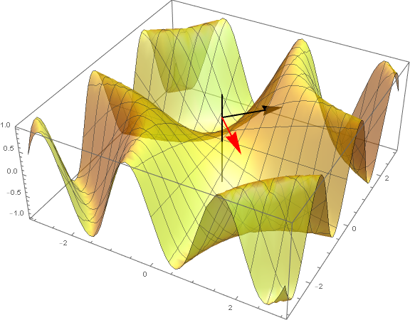

# Gradient descent

## Notation and convexity

In the field of optimization the greek letter $\omega$ is usually used to describe the model parameter we want to find. We will thus change from $\beta$ to $\omega$ as the gradient descent algorithm is discussed in the context of optimization.

In this alternative notation we can write 

$$\hat{\omega} = f(\omega) = argmin \sum_{i=1}^{N}{(Y_i-\pmb{x_i^T\omega}^2)}.$$

To find the minimum we take the derivative of $\hat{\omega}$ and set it to zero:

$$\frac{\partial{\hat{\omega}}}{\partial{\omega}} = 0.$$

**Note: this estimator $\hat{\omega}$ is our optimization target, and we're trying to make it as small as possible. In the optimization field this is called the *loss function* or the _cost function_**.

This is a very simple yet powerful method and is used in many machine learning areas due to its simplicity and use of computation. 

*When does setting the derivative to zero give the minimum?*

- The function needs to be (locally) smooth and convex
- If the second derivative is non-negative everywhere (locally) then the critical point **(if it exists)** is the unique globl minimum.
- **locally** means we are considering only a certain range not the full function! Never generalize to the full function!

## Multidimensional convexity and local optimization

Let's consider loss functions parametrized by multiple weights. We'll arrange such weights such that they form a column vector $\omega \in \mathbb{R}$.

We can use the Taylor expansion to express $f(\omega)$ around a point in parameter space $\omega_0$:

$$f(\pmb{\omega}) = f(\pmb{\omega_0}) + \nabla f(\pmb{\omega_0})(\pmb{\omega}-\pmb{\omega_0}) + \frac{1}{2}(\pmb{\omega}-\pmb{\omega_0})^T(\nabla\nabla f)(\pmb{\omega}-\pmb{\omega_0}) + \mathcal{O}({\lvert \pmb{\omega}-\pmb{\omega_0}\rvert}^3),$$

where $\nabla f(\pmb{\omega_0})$ is the gradient of $f(\pmb{\omega})$ evaluated at $\omega_0$ and $\nabla\nabla f$ is the Hessian matrix which contains all the second derivatives of $f$.

The critical points of $f(\pmb{\omega})$ are define as the solutions to

$$\nabla f(\pmb{\omega'}) = 0.$$

At a critical point, the Taylor expansion is

$$f(\pmb{\omega}) = f(\pmb{\omega_0}) + \frac{1}{2}(\pmb{\omega}-\pmb{\omega'})^T(\nabla\nabla f)(\pmb{\omega}-\pmb{\omega'}) + \mathcal{O})({\lvert \pmb{\omega}-\pmb{\omega_0}\rvert}^3).$$

Therefore, in the vicinity of the critical point, the behavior of the function is governed by the Hessian term $(\pmb{\omega}-\pmb{\omega'})^T(\nabla\nabla f)(\pmb{\omega}-\pmb{\omega'})$. Let $\pmb{v}=\pmb{\omega}-\pmb{\omega'}$ and $H=\nabla\nabla f$.

If 

$$\pmb{v^T H v} > 0$$

for all non-zero vectors $v \ne 0$ then the critical point is a minimum. This result also implies that $H$ is a positive definite matrix which in turn implies that the eigenvalues of $H$ are all positive, and thus the determinant (the product of all eigenvalues of the matrix) is also positive.

For the hessian matrix $H$ at a critical point, we can interpret its eigenvalue-eigenvector pair as follows: the eigenvector is a vector that points towards a direction away from the critical point, and the eigenvalue shows if the curvature of $f(\pmb{\omega})$ is positive, negative or zero in that direction.

If a Hessian matrix has at least one positive eigenvalue, then we know that there is a direction away from the critical point where the loss function curves upwards. Meanwhile, if the same Hessian matrix also has at least one negative eigenvalue, then we know that there is a direction away from the critical point where the loss function curves downwards. A mixture of curving upwards and downwards is the definition of a saddle point (with eigenvalue=0), so we now know that the critical point associated with this Hessian is a saddle point.

Let's take a look at the example below. In this example, a saddle point is located at the origin (where the black vertical line intersects the surface). The black vector is an eigenvector that points in the direction of positive curvature. The red vector is an eigenvector that points in the direction of negative curvature.



We can now define one condition for convexity in multiple dimensions: $f$ is convex iif the Hessian is positive semi-definite everywhere (i.e. $\pmb{v^T H v} \ge 0$). In other words, the limit of convexity is where $\pmb{v^T H v} = 0$, when the convex function reaches the saddle points.

## Quadratic minimization and gradient descent

Convexity ensures that a loss function has a unique global minimum. However, it does not guarantee that it has a closed form (i.e. can be solved exactly).

Instead of trying to find a single equation to obtain the minimum, one can make a guess and iteratively refine this guess to bring it closer to the true minimum. 

Let the initial guess be $\omega_0$. To create an approximation, denoted by $g_0$ we truncate the Taylor expansion at the seconde order:

$$g_0(\omega_0) = f(\omega_0) + f'(\omega_0)(\omega-\omega_0) + \frac{1}{2}f''(\omega_0)(\omega-\omega_0)^2.$$

As $f$ is convex, we know that $f''(\omega_0) \ge 0$ and so $g_0$ will also be convex, and has a global minimum we can find.

### Newton's method of minimization

Using this approximation we can find the minimum by taking the derivative

$$\frac{\partial{g_0}}{\partial{\omega}}(\omega) = f'(\omega_0) + f''(\omega_0)(\omega-\omega_0),$$

setting this derivative to zero at $\omega = \omega_1$ gives the location of the minimum $\omega_1$ at

$$\omega_1 = \omega_0 - \frac{f'(\omega_0)}{f''(\omega_0)}.$$

This can be repeated iteratively with a step $t$:

$$\omega_{t+1} = \omega_t - \frac{f'(\omega_t)}{f''(\omega_t)}.$$

This is known as **Newton's method of optimization**.

**Note: We need to be careful of the possibility that $f''(\omega_t)$ is zero. For a practical algorithm, we would need to check if the second derivative is very small, and either terminate the algorithm, or threshold it to a larger positive value so as to allow the algorithm to continue.**

In multiple dimensions we can write Newton's method of optimization as

$$\omega_{t+1} = \pmb{\omega_t} - \left[(\nabla\nabla f \pmb{\omega_t} \right]^{-1} \nabla f (\pmb{\omega_t})^T.$$

In order for Newton's method to work it needs a condition to stop the iteration, as there is no single correct condition. Therefore we need to set a threshold that stops the program when a defined condition is very close to zero. This condition can be the squared value of the derivative, for instance,

$$(\nabla f(\pmb{\omega_t}))^2 < \epsilon$$

or the value of the $\delta$ of the loss function,

$$f(\omega_{t-1} - f(\omega_t) < \epsilon.$$

## Gradient descent algorithm

The problem with Newton's method is that it requires the computation of the Hessian matrix, which is computationally demanding. **In practice it is better to guess the value of the Hessian.**

Let the guess be

$$\nabla \nabla f(\omega_t) \sim \frac{1}{\alpha} \pmb{I},$$

where $\alpha$ is some positive real number and $\pmb{I}$ is the identity matrix.

The iterative procedure becomes

$$\pmb{\omega_{t+1}} = \pmb{\omega_t} - \alpha\nabla f(\pmb{\omega_t})^T.$$

**This is called gradient descent, as this procedure requires knowledge of the gradient.** The paramter $\alpha$ is called the step size. At each iteration, gradient descent moves $\pmb{\omega_t}$ in the **opposite direction** (downhill) of the gradient.

## Step sizes and quadratic bounds

*Ok, but know we have the step size parameter $\alpha$. How should we should its size?*

A good choice of the step size parameter $\alpha$ is critical for a good performance of gradient descent. 

- If the step size is too large we are effectively underestimating the curvature of the loss function. We may end up 'overstepping' the minimum and the algorithm will never converge.
- If the step size is too small we may have overestimated the curvature of the loss function and will 'understep' the minimum. However, we will get closer to it, but it will take much more (infinite?) time to reach it. 

### Bounding the curvature


We can find an upper bound $L$ of the curvature at point $\pmb{\omega_t}$ by computing the eigenvalues of the Hessian and using the maximum eigenvalue

$$L = max_i \lambda_i,$$

and approximate the Hessian by this upper bound,

$$\nabla\nabla f(\omega_t) \sim LI = \frac{\pmb{I}}{\alpha}.$$

Therefore,

$$\alpha = 1/L.$$

**But this requires the computation of the hessian, which is the thing we want to avoid!**

Fortunately, the maximum eigenvaulue is also given by the spectral norm of the (symmetric) matrix, which is define as

$$|H|_2 = max_{|n|^2=1}n^THn,$$

where $|H|_2 is the spectral norm for the unit vectors \pmb{n}$. To find the spectral norm, we need to find the unit vector $n$ that maximizes the term $n^THn$. It's like finding a direction which the Hessian-vector product $Hn$ maximizes. 

Thus, we can finally write that

$$\alpha = \frac{1}{|H|_2}.$$

### Global bounds

So far we only tried to set the step size using local information. The problem with this approach is, when the curvature increases sharply near the minimum the gradient descent will repetedly over-step the minimum. 

In order to tackle this, we can try to find the maximum curvature within a certain region of interest and check the boundary conditions. This is equivalent of limiting the dimensional region where the computation is going to take place.

### Quadratic bounds

Let's write the loss function in terms of its Taylor expansion and the remainer term $R_1$,

$$f(\pmb{\omega}) = f(\pmb{\omega_t}) + \nabla f(\pmb{\omega_t})(\pmb{\omega}-\pmb{\omega_t}) + R_1(\pmb{\omega,\omega_t}),$$

where

$$R_1(\pmb{w};\pmb{w_t}) = \frac{1}{2}(\pmb{\omega}-\pmb{\omega_t})^T(\nabla\nabla f)(\pmb{\omega}-\pmb{\omega_t}).$$

Suppose we know an upper bound on the spectral norm of the Hessian within some region R:

$$|H|_2 \le M, \forall\ \omega \in R.$$

Now we can use this information to substitute the Hessian by M and find a quadratic upper bound on the loss function:

$$f(\omega) \le f(\pmb{\omega_t}) + \nabla f(\pmb{\omega_t})(\pmb{\omega}-\pmb{\omega_t}) + \frac{1}{2}M|\pmb{\omega}-\pmb{\omega_t}|^2.$$

We can now use a step size $\alpha = \frac{1}{M}$.

In general, we don't need to find $M$ exactly to have a conservative step size. We just need to find some $L$ so that $L \ge M$, then we use the step size $\alpha = \frac{1}{L}$.

### Step size tuning or backtracking

*What if we don't have any information about the second derivative?*

There are cases we only have information about the function and its gradient. 

The approach here will be from the opposite direction. We assume a step size $\alpha_t$ and then observe what happens in the iteration itself. This implies that $L = \frac{1}{\alpha_t}$.

How does this work?

First we find a quadratic upper bound,

$$f(\omega) \le f(\pmb{\omega_t}) + \nabla f(\pmb{\omega_t})(\pmb{\omega}-\pmb{\omega_t}) + \frac{1}{2}\frac{1}{\alpha_t}|\pmb{\omega}-\pmb{\omega_t}|^2.$$

Then the gradient descent update finds the minimum of this quadratic and updates the current location to this minimum,

$$\omega_{t+1} = \omega_t - \alpha_t\nabla f(\omega_t)^T.$$

If we substitute this expression into the quadratic upper bound we find the implied upper bound at $\omega_{t+1}$.

$$f(\omega_{t+1}) = f(\omega_t) - \frac{1}{2\alpha}|\omega-\omega_t)|^2.$$

**If, after calculating $f(\omega_{t+1})$ we find that it actually violates the upper bound, then we know the step size was too large!** So we decrease the step size to $\alpha_t/2$ and try again. Decreasing the step size implies a larger curvature of the loss function, so the resulting upper bound will now be higher.

With the new step size we calculate $f(\omega_{t+1})$ again and do this until the upper bound is not violated. If this is the case, we move the function to the new location and use the new $\alpha$ as the initial guess for the next iteration. The $\alpha$ value is therefore adaptive for every cycle of the algorithm.

## Stochastic gradient descent

If our data is large we would ideally calculate the gradient on any datapoint. However, this is unfeasible. For instance if we had 80 parameters, each stored as a single 8 byte double precision floating point number and 10 billion data points we would need 6400 Gbytes of memory to perform the calculation!

Instead, we need to reduce the number of data points where we will perform the calculation. In other words we need to subsample the data.

We can for instance approximate the data to something similar to a mean. First we re-scale the loss function by a multiplicative constant

$$f(\omega) \rightarrow f(\omega) = \frac{1}{N} \sum_{i=1}^N f_i(\omega).$$

We can then write the loss function as an expectation

$$f(\omega) \rightarrow f(\omega) = \mathbb{E}[f_i(\omega)].$$

We can then estimate the update step using only one data point

$$\hat{\omega}_{t+1} = \omega_t - \alpha_t\nabla f_i (\omega_t).$$

The data point to use each time should be chosen randomly at each iteration step. In order to ensure that we use all available data, we should choose the maximum number of iterations to be several times larger than the data set. 

There are also variation on this squeme where the data points used are selected sequentially. 

If the data is chosen uniformly, we insure that the estimator is unbiased.

### Algorithm variance

However, the variance can be quite large. First, we notice that

$$Var(\hat{\omega}_{t+1}) = \alpha_t^2 Var(\nabla f_i(\omega_t)).$$

We can't control the variance of the gradients but we can reduce the step size. 

We can also modify the conditions of the computation so that it computes the average over a smaller sample $k$. Now the variance will be

$$Var(\hat{\omega}_{t+1}) = \frac{\alpha_t^2}{k} Var(\nabla f_i(\omega_t)),$$

where $k << population size$. Therefore if we increase the size of the sample we will decrease the variance as well. **This is known as mini-batch stochastic gradient descent**.

### Step size schedule

The variance of the stochastic gradient descent can be more problematic near the minimum, as the gradients of points close to it tend to point in different directions. 

We could set a very small step size to fix this, but that would be a waste of precious time. Instead, we create a **step-size schedule** where the $\alpha_t$ is a function of the step number $t$. For instance we can impose that

$$\alpha_t = \frac{1}{1+t},$$

so that the step size can start large and then be reduced as we converge.

## Gradient descent example

In this example we'll the synthetic data matrix `syn_X.csv` and the vector `syn_y.csv`.

First we'll compute the parameter vector $\pmb{\beta}$ using ordinary least squares. In order to do this we'll just need to compute

$$
\beta = (\pmb{X^TX})^{-1}\pmb{X^Ty}.
$$

Code:
```python
##OLS calculation 
#note: Mx multiplication is done using the operator @
#note: CAREFUL with the dimensions!
###part1
p1 = np.linalg.inv(X.T@X)
###part2
p2 = X.T@y
###beta
beta = p1@p2
beta
print(beta)
[ 1.92960603  1.26397096 -4.59799331]
```
Now, we want to obtain the same result but using the gradient descent algorithm.

Basically the gradient descent iteration is

$$
\omega_{t+1} \leftarrow \omega_t - \alpha_t\nabla f(\omega_t).
$$

Calculating the gradient for the squared loss we obtain

$$
\nabla_{\omega}\left( \sum_{i=1}^N (y_i-x_i\omega)^2 \right) = \sum_{i=1}^N \nabla_\omega(y_i-x_i\omega)^2 = -2\sum_{i=1}^N (y_i-x_i\omega)^T x_i
$$

so

$$
\omega_{t+1} = \omega_t + 2\alpha_t \sum_{i=1}^N(y_i-x_i\omega)^T x_i.
$$

**Note: in this text we interchange $\beta$ with $\omega$ but they're the same!!!**

It is easier to implement the GD algorithm using a few separated functions as shown in the code below.

```python
def loss_fn(beta, X, y):
  # (y - X beta)^T (y - X beta)
  return np.sum(np.square(y - X.dot(beta)))

def loss_grad(beta, X, y):
  # -2*(y - X beta)^T X
  return -2*(y - X.dot(beta)).T.dot(X)

def gradient_step(beta, step_size, X, y):
  loss, grads = loss_fn(beta, X, y), loss_grad(beta, X, y)
  # beta_(i+1) = beta_i - alpha (del f)^T
  beta = beta - step_size * grads.T
  return loss, beta

def gradient_descent(X, y, step_size, precision, max_iter=10000, warn_max_iter=True):
  beta = np.zeros_like(X[0])
  # beta = np.random.randn(len(X[0]))

  losses = [] # Array for recording the value of the loss over the iterations.
  graceful = False
  for _ in range(max_iter):
    beta_last = beta # Save last values of beta for later stopping criterion
    loss, beta = gradient_step(beta, step_size, X, y)
    losses.append(loss)
    # Use the norm of the difference between the new beta and the old beta as a stopping criteria
    if np.sqrt(np.sum(np.square((beta - beta_last)/beta))) < precision:
      graceful = True
      break
  if not graceful and warn_max_iter:
    print("Reached max iterations.")
  return beta, np.array(losses)
```

We will use the function `gradient descent` that then calls all the other functions when needed. The input of the function is the matrix X, the vector y, the step size, the precision (should be a very small number),the maximum number of iterations, and also if the function should warn (true/false) if the number of max interactions is reached.

First we need to ascertain the optimal step size. To do this we'll just experiment in a reasonable range, let's say between 0.001 and 0.008.

Code:
```python
# Now run a scan over the step size in order to confirm this
step_size_scan_range = np.arange(0.001, 0.008, 0.001)

steps = np.zeros_like(step_size_scan_range)
for n in range(len(step_size_scan_range)) :
    beta_gd,out_loss = gradient_descent(X,y,step_size_scan_range[n],precision=1e-10)
    steps[n] = len(out_loss)
    #print (beta_gd) #diagnostic

print('The optimal step size is',step_size_scan_range[np.where(steps==min(steps))][0])
The optimal step size is 0.004

plt.plot(step_size_scan_range,steps)
plt.xlabel('step size')
plt.ylabel('# of iterations')

```
We obtain an optimal step size equal to 0.004 as shown in th plot below


The next Figure shows how the loss function behaves with the number of steps. 

Code:
```python
beta_gd2,loss_gd2 = gradient_descent(X,y,step_size=0.004,precision=1e-10)
print('Beta =', beta_gd2)
plt.plot(loss_gd2,'.',label='loss value')
plt.plot((0,20),(1e-10,1e-10),'r--',label='precision threshold')
plt.xticks([0,5,10,15,20])
plt.xlabel('# of iterations'),plt.ylabel('loss')
plt.legend()
```


As we observe, the loss function quickly diminishes towards the threshold value.


