# Single-Cell RNA-seq analysis

In this project we will analyze a single-cell RNA-seq dataset from the mouse neocortex, a region of the brain that governs its higher functions, such as perception and cognition.

This dataset is a subset of a larger single-cell RNA-seq dataset compiled by the [Allen Institute](https://alleninstitute.org/).

The single-cell RNA-seq data comes in the form of a counts matrix, where

- each row corresponds to a cell

- each column corresponds to the normalized transcript compatibility count (TCC) of an equivalence class of short RNA sequences, rescaled to units of counts per million. You can think of the TCC entry at location $(i,j)$ of the data matrix as the level of expression of the $j-th$ gene in the $i-th$ cell.

## Part 1 - Visualization and clustering on a small subsample

We will start the analysis using the **p1** folder which contains a small, labeled subset of the data. In it we have the count matrix along with “ground truth" clustering labels , which were obtained by scientists using domain knowledge and statistical testing. This is for use in Part 1.

We begin by loading the necessary libraries and loading the data.

```python
%matplotlib inline
%load_ext memory_profiler
import numpy as np
from scipy import sparse
import pandas as pd
from sklearn.decomposition import PCA, KernelPCA
from sklearn.manifold import TSNE, MDS, Isomap
from sklearn.cluster import KMeans
from sklearn.linear_model import LogisticRegression, LogisticRegressionCV
from sklearn.metrics.pairwise import cosine_similarity
import matplotlib.pyplot as plt
import time
import pandas as pd
import pickle
from sklearn.metrics import silhouette_score, silhouette_samples
from sklearn.cluster import AgglomerativeClustering
from scipy.cluster.hierarchy import dendrogram
from yellowbrick.cluster import SilhouetteVisualizer
import matplotlib as mpl
from yellowbrick.style import rcmod
from scipy.stats import spearmanr
from memory_profiler import profile

X = np.load('data/p1/X.npy') #Matrix nxp where n = 511 cells, p = 45768 genes
y = np.load('data/p1/y.npy') #ground truth labels
```

If we take a look at matrix X we observe that we have 511 rows and 45768 columns, corresponding to the different cells and genes respectively.

As the gene values can vary several orders of magnitude it is advisable to perform a log transformation on the data. In this case we use $log_2(x+1)$. The sum of one unit is done to avoid floating point infinity situations close to $log(0)$.

```python
X_log = np.log2(X + 1) #log transformation of the Data
```

We can calculate the PCA of the raw data and the log transformed data to show the reason for this transformation.

```python
pca = PCA().fit(X)
pca_log = PCA().fit(X_log)
```

First, we can calculate the percentage of variance explained by the first PCA for the raw and the log transformed data

```python
# Percentage of variance explained by first component
print("First component raw:", pca.explained_variance_ratio_[0])
print("First component log:", pca_log.explained_variance_ratio_[0])
First component raw: 0.4277967098357264
First component log: 0.13887564870826197
```

We can already observe that the explanatory power is much more concentrated in the first PC in the raw data than in the log transformed data.

Let's now plot the cumulative sum of the explained variance ratio. 

```python
# Cumulative variance explained plots
plt.plot(range(1, X.shape[0]+1), np.cumsum(pca.explained_variance_ratio_), color="red", label="raw")
plt.plot(range(1, X.shape[0]+1), np.cumsum(pca_log.explained_variance_ratio_), color="blue", label="log")
plt.legend()
plt.show()
```

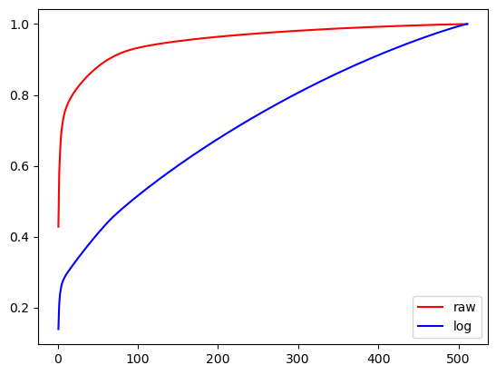

The plot shows that while the information in the PCs of the raw data is concentrated in the first few PCAs, in the log transformed data it is more evenly distributed. 

**This is important because we're looking for genes that can differentiate between cells, even if they are not present inside many cells and or have low levels of expression. Therefore, the log transformed data allows to better discern low levels of expression as well as high levels of expression.**

The 85\% level variance cutoffs can be calculated with the following code

```python
# 85% variance cutoffs
print("Raw:", np.where(np.cumsum(pca.explained_variance_ratio_) >= .85)[0][0] + 1)
print("Log:", np.where(np.cumsum(pca_log.explained_variance_ratio_) >= .85)[0][0] + 1)
Raw: 36
Log: 339
```

**This means that while in the raw data 85\% of the explained variance is concentrated in the first 36 PCAs, in the log transformed data the same explained variance is much more distributed allowing a much more sensitive analysis across different expression magnitudes.**

### Data visualization

Let's now try and visualize the data. For instance, if we plot the data from the first two columns from the log transformed data what do we obtain? 

```python
# Nothing informative!
plt.scatter(X_log[:,0],X_log[:,1])
```

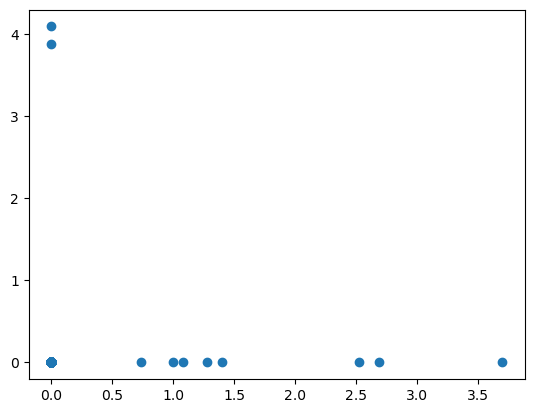

Not much! Let's try again, this time using PCA. 

```python
# Three visually distinct clusters. Could potentially argue for 4 or 5 as well, but these are not well-separated
z = pca_log.transform(X_log)
plt.scatter(z[:,0],z[:,1])
plt.xlabel('PC1'),plt.ylabel('PC2')
```

Now we can clearly distinguish at least 3 clusters and maybe two more. 

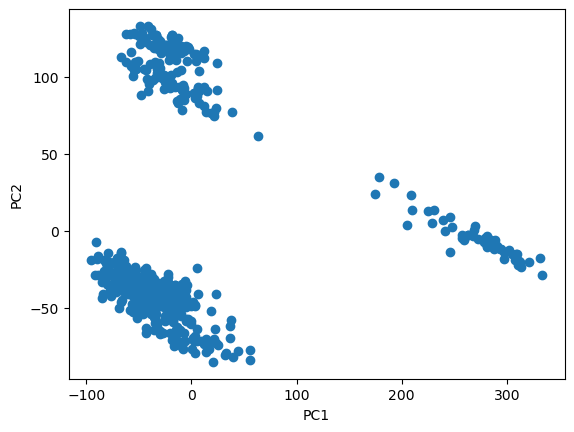

Let's now visualize the MDS and T-SNE plots.

```python
# We still see 3 distinct clusters.
mds=MDS(n_components=2).fit_transform(X_log)
plt.scatter(mds[:,0],mds[:,1])
```

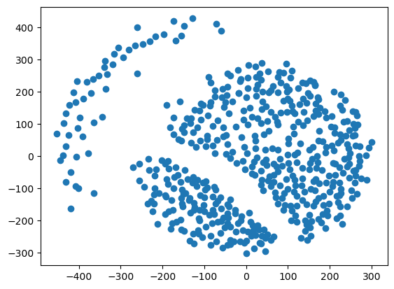

The MDS plot shows 3 distinct clusters.

```python
# Emergence of at least 5 clusters. 
z_tsne = TSNE(n_components=2,perplexity=40).fit_transform(z[:,0:50])
plt.scatter(z_tsne[:,0],z_tsne[:,1])
```

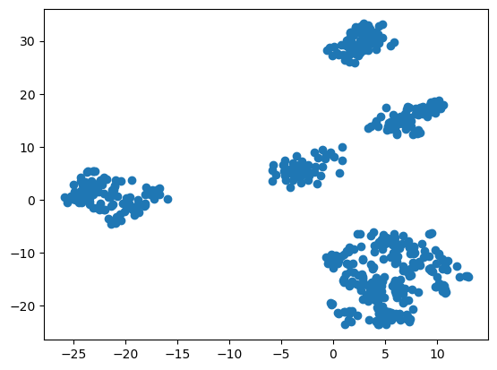

In the T-SNE plot it becames apparent that there are indeed 5 separate clusters. Of course we can still play around with the perplexity parameter.

### Cluster assignment


The next step will be to allocate the data points into the 5 different clusters. We will do that with the `KMeans` algorithm.

```python
# 5 clusters: PCA plot
kmeans = KMeans(5, tol=1e-6)
kmeans.fit(z[:,0:50])
plt.scatter(z[:,0],z[:,1], c=kmeans.labels_)
```
The code above runs the algorithm and generates a PCA plot color coded with each cluster assignment.

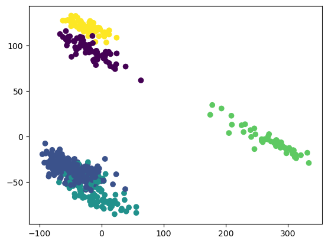

The cluster positions are now much clearer despite the two clusters at the bottom left corner being a bit mixed-up.

```python
# 5 clusters: MDA with K means plot
plt.scatter(mds[:,0],mds[:,1],c=kmeans.labels_)
```
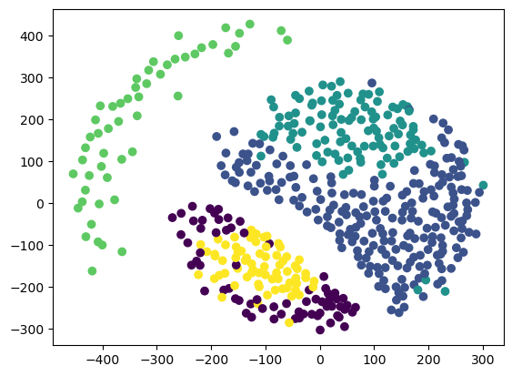

The color-coded MDS plot is not so clear but is still a possible outcome. We must remember we are reducing many dimensions onto a plane.

```python
# T-SNE plot
plt.scatter(z_tsne[:,0],z_tsne[:,1], c=kmeans.labels_)
```

The T-SNE plot has the clearest distinction among the 5 clusters, although the larger one on the bottom left corners seems that it is composed at least from two different clusters.

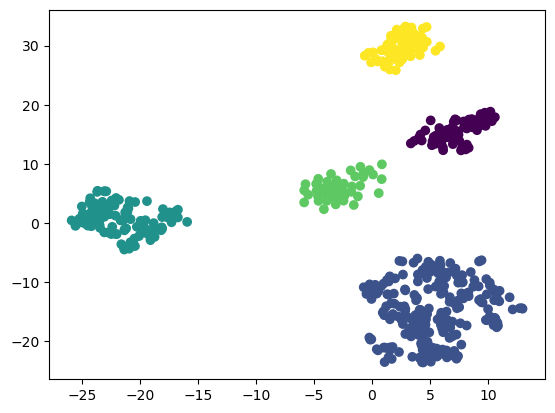

### Cluster diagnostics

Let's now do a sanity check using the elbow method. *How many clusters should we find?*

```python
# Would select 3, 4, or 5 clusters
all_kmeans = [i for i in range(8)]
for i in range(8):
    cur_kmeans = KMeans(i+2)
    cur_kmeans.fit(z[:,0:50])
    print("Num clusters", i+2, "Inertia:", cur_kmeans.inertia_)
    all_kmeans[i] = cur_kmeans
plt.plot([i+2 for i in range(8)], [all_kmeans[i].inertia_ for i in range(8)])
```

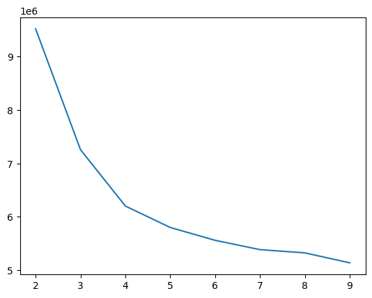

Observing the elbow plot, the number of clusters should be between 3 and 5 in my perspective.

Another test we can use is dendrogram analysis. In order to do this we must switch to R. 

```R
# Script with Dendrograms/hierarchical clustering

library(Rtsne)
library(cluster)
library(dendextend)
# For matrix multiplication
library(Rfast)
# irlba was the fastest SVD library
# library(bootSVD)
# library(gmodels)
library(irlba)
library(reticulate)
library(viridis)
library(RColorBrewer)
library(Polychrome)
# RcppCNPy is an alternative to reticulate but is buggy on the reduced datasets

# Load data and process, take PCA
np <- import("numpy")
X <- np$load("Documents/edx/data analysis: statistical modeling and computation in applications/data analysis/HW2/data/p1/X.npy")
X <- log2(X+1)
centered <- scale(X, scale=FALSE) #normalization
svd.result <- irlba(centered,nv=50)
z <- centered %*% svd.result$v

dend <- as.dendrogram(hc1)
d1=color_branches(dend,k=5, col = brewer.pal(n=5,name="Set2"))
plot(d1)
title("Hierarchical clustering, 5 clusters")
# Rectangles show 3 large subgroups
rect.hclust(hc1, k = 3, border = brewer.pal(n=5,name="Set2")[c(1,3,5)])
```
The figure shown below describes the three main clusters, cut at the height of the three rectangles around the dendrogram. We can observe that the orange cluster has a lot of substructure, showing at least three extra clusters! If we continue our descent up to the branching at the breach on the right corner of the dendogram and stop here, we will obtain the five clusters. At this point, it seems that there are more structure revealing at least one extra cluster (the branch with the orange color).

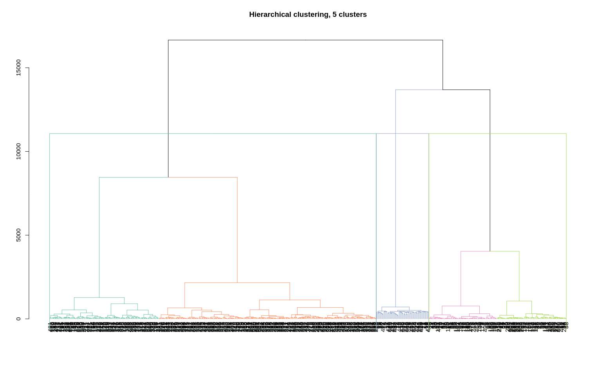

We can observe that, in the T-SNE plot there are more structures inside the biggest cluster as the dendrogram suggests.

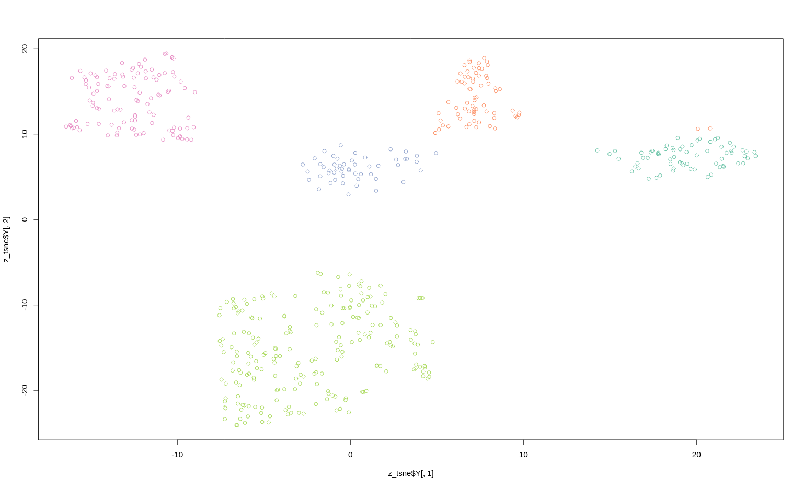

### Cluster means

Now let's calculate the cluster means and work with that data.

```python
#kmeans cluster means
cmeans = np.zeros((5,X_log.shape[1]))
for c in range(5):
    cmeans[c] = np.mean(X_log[np.where(kmeans.labels_==c)[0]],axis=0)
```

From here we can plot the PCAs, the MDSs and the T-SNEs. *What is the difference between the plots?*

```python
# PCA on cluster means
z_means = PCA(2).fit_transform(cmeans)
plt.scatter(z_means[:,0],z_means[:,1],c=[0,1,2,3,4],s=100)
#mds on cluster means
mds = MDS(n_components=2,verbose=1,eps=1e-5)
mds.fit(cmeans)
plt.scatter(mds.embedding_[:,0],mds.embedding_[:,1],c=[0,1,2,3,4],s=100)
# Emergence of at least 5 clusters. 
z_means_tsne = TSNE(n_components=2,perplexity=4).fit_transform(cmeans)
plt.scatter(z_means_tsne[:,0],z_means_tsne[:,1],c=[0,1,2,3,4],s=100)
```
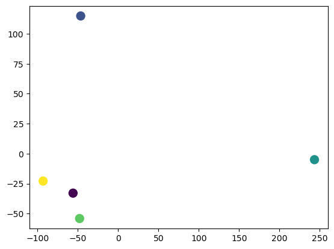

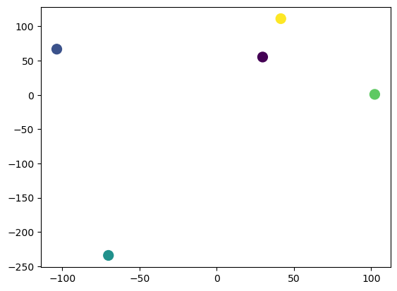

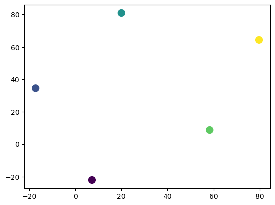

The PCA and the MDS plots show relatively accurate distance between three groups of clusters, while the others are far away. T-SNE does not provide this information, as the clusters are all at the same distance from each other.

**NOTE: If we didn't log transformed the data we would ended up with visualizations with much more dispersion where groups are harder to categorize.**

## Part 2 - The large dataset

We will now move to a larger, unlabeled dataset.  This dataset is has not been processed, so you should process using the same log transform as in Part 1.

```python
X = np.load("data/p2_unsupervised/X.npy")
X = np.log2(X + 1)
```

We now have 2169 cells and 45768 genes.

From here we calculate the PCs of PCA, but only the first fifty because the data is much bigger and becomes easily intractable.

```python
n_pcs = 50
pca = PCA(n_components=n_pcs).fit(X)
z = pca.transform(X)
```

### Visualization

We no longer have the labels. However, a scientist tells us that the cells in the brain are of three types: i) excitatory neutrons; ii) inhibitory neutrons; and iii) non-neuronal cells. 

Within each of these main three types, there are numerous distinct subtypes. 

Our goal: produce visualizations to show if the data reflect's this knowledge.

We can start by plotting the previously calculated PCs. 

```python
# Three distinct clusters, corresponding to inhibitory or excitatory neurons, and non-neuronal cells.
plt.scatter(z[:,0],z[:,1])
plt.xlabel('PC1'),plt.ylabel('PC2')
```

The first and second components are shown in the following figure.

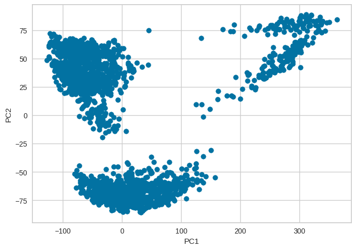

We can observe that there are three to five major groups with hints showing more sub-structure.

Let's now construct the MDS and the T-SNE plots using the 50 PCs as input.

```python
#MDS on the first 50 PCs
mds=MDS(n_components=2).fit_transform(z[:,0:50])
plt.scatter(mds[:,0],mds[:,1])

# There are many cell sub-types, as shown here.
z_tsne = TSNE(n_components=2,perplexity  =40).fit_transform(z)
plt.scatter(z_tsne[:,0],z_tsne[:,1])
```

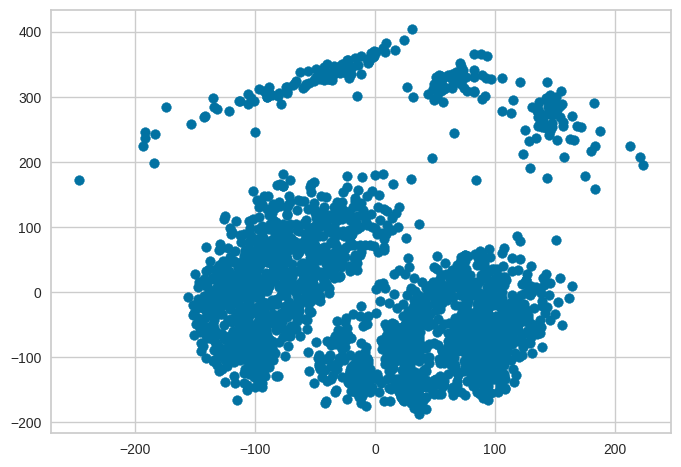

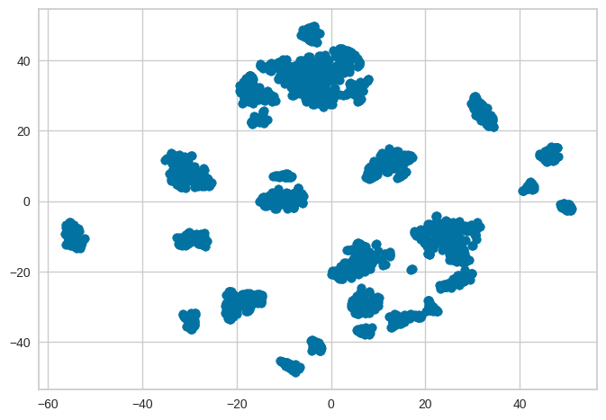

The MDS plot shows something similar to the PCA case. We can identify here 3 to 5 main groups with some substructure appearing inside them.

The T-SNE plot however, shows a different picture. Here we observe many more clusters (25 to 30 clusters). This may mean that the perplexity hiperparameter is tuned to the substructures that were mentioned before. Some of these clusters seem to agregate into two bigger structures but that it is not clear for about half of them.

We can go further here and try to use hierarchical clustering like the one we used in R, to label our clusters. We'll be using the ward method, and assume we have 30 clusters.

```python
# Hierarchical clustering shows the cell types. By inspection of the t-SNE plot, we guessed 30 clusters for the current exploration.  We see the the label from hierachical clustering does correspond roughly to the T-SNE clusters. 
slc = AgglomerativeClustering(n_clusters=30,linkage="ward")
predictions=slc.fit_predict(z)
plt.scatter(z_tsne[:,0],z_tsne[:,1],c=predictions)
```

After obtaining the labels we do the T-SNE plot again, as shown below.

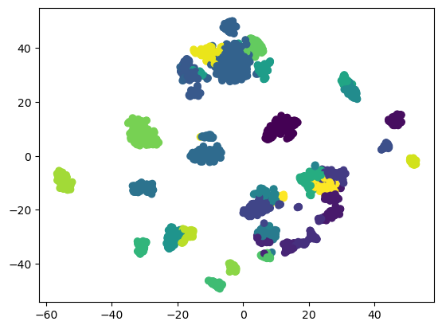

We observe a rough correspondence between the clusters found using agglomerative clustering and those of the T-SNE plot.

Finally we will depict how the hierarchical structure is organized by creating two PCA plots. The first featuring the three main clusters found via the k-means algorithm. The second using the labels from the agglomerative clustering method.

```python
# Use kmeans to fit the 3 classes of cells
kmeans = KMeans(n_clusters=3)
kmeans.fit(z)
plt.scatter(z[:,0],z[:,1],c=kmeans.labels_)

# The 30 cell-subtypes are within each of the 3 big clusters.
plt.scatter(z[:,0],z[:,1],c=predictions)
```
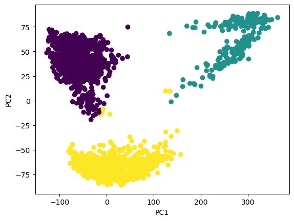

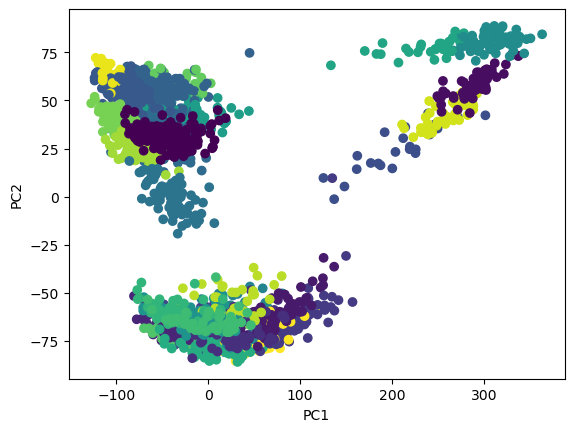

The K-means can allocate the three main clusters quite well, while the agglomerative clustering shows the hierarchical structure in a clear way.

To have a more precise measure of the number of cluster we can make the cluster assignments using, for instance, the agglomerative clustering technique, from 3 clusters to 43 clusters, and then using the labeled points to calculate mean silhouette scores.

### Unsupervised feature selection

```python
# Hierarchical clustering for many values of k. Means silhouette scores plotted below.
all_slc = [i for i in range(45)]
for i in range(40):
    if i % 5==0: #the remain of the division by 5 is zero?
        print(i) #control print
    slc = AgglomerativeClustering(n_clusters=i+2, linkage="ward") #starts at n=2
    slc.fit(z)
    all_slc[i] = slc

# Top silhouette score as a heuristic for number of clusters. Ignore first two entries because we want more clusters
best_index = 2 + np.argmax([silhouette_score(z,all_slc[i].labels_) for i in range(2,40)])
# Number of clusters is index + 2
print("Number of clusters:",best_index+2)

plt.plot([i+2 for i in range(40)], [silhouette_score(z,all_slc[i].labels_) for i in range(40)],'.')
plt.plot((26,26),(0.2,silhouette_score(z,all_slc[26].labels_)),'--r')

Number of clusters: 30
```

**We note here that the last line of code is in an embedded format. It is a way to compress code in python which is not very intuitive, but is worth placing it.**

The last line of code plot each value of the mean silhouette_score separately onto the same plot shown below. The dashed red line depicts the location of the best number of cluster suggested by the silhouette method.

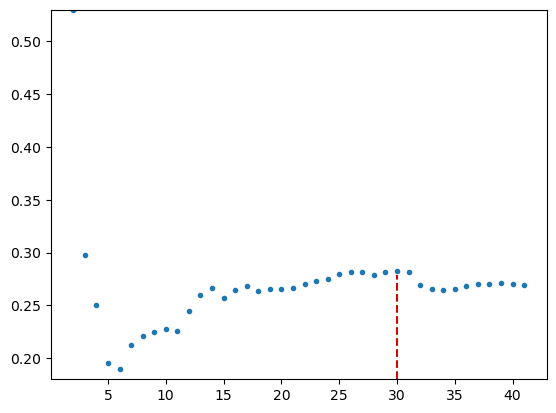

Now we attempt to find informative genes which can help us differentiate between cells, using only unlabeled data. A genomics researcher would use specialized, domain-specific tools to select these genes. We will instead take a general approach using **logistic regression** in conjunction with clustering.

Therefore, we will be using the calculated labels for $k=30$ as ground truth and fit a logistic regression model.

To calculate the logistic regression we will use the `LogisticRegressionCV` from the `sklearn.linear_model` module. First, we create the array label to label all datapoints into 30 different clusters, according to the agglomerative clustering assignments, as explained before. The we standardize the data and split the training and
testing data in a 80/20 proportion, according to the well-known Pareto principle.

```python
labels = all_slc[best_index].labels_
# Standardize the data
X_centered = X - np.mean(X,axis=0)
locs_nz = np.where(np.std(X_centered,axis=0)>0)[0]
X_standardized = X_centered
X_standardized[:,locs_nz] /= np.std(X_centered[:,locs_nz],axis=0)
# Splitting the data into training and testing subsamples
perm = np.random.permutation(X_standardized.shape[0]) #random permutations of the data
n_train = int(4/5*X_standardized.shape[0]) #number of training samples (80%)
X_train = X_standardized[perm[:n_train]] #training sample data
y_train = labels[perm[:n_train]] #training sample labels
X_test = X_standardized[perm[n_train:]] #testing sample data
y_test = labels[perm[n_train:]] #testing sample labels
```

From here, we will use the command `LogisticRegressionCV` to make our calculations. `LogisticRegressionCV` offers the possibility to fine tune the hyper-parameter $C$, which is the inverse regularization strength. We separate our data into training and testing even when using cross-validation because we want to evaluate the quality of our regression with an unbiased and independent sample from the training one. Therefore, we will have an internal validation, provided by the CV and an external validation, provided by the test sub-sample. We will make a “one-versus rest” approach for the multi-class logistic regression problem, as we have thirty classes.
```python
%%timeit -n 1 -r 1 #control
%%memit -r 1 #control
#cross validation of the logistic regression: divides data in k folds, trains on k-1 folds, tests on remaining fold
log_regcv = LogisticRegressionCV(cv=5,Cs=[0.01,0.1,1,10],max_iter=5000,penalty="l1",solver="liblinear",multi_class="ovr",n_jobs=4).fit(X_train,y_train)
```

The input parameters are: $cv=5$ which means we are using 5 folds: 4 for training and 1 for testing. 5-fold CV also follows the Pareto Principle; Cs=[0.01,0.1,1,10] - these are the Cs that the program uses to
fine-tune the C for each cluster; penalty=’l1’ - performs a L1 (or LASSO) regularization penalty on the regression procedure; solver=’liblinear’ is the chosen algorithm to solve the optimization problem. It is quick and can use L1 and L2 penalty functions. We also tried the SAGA algorithm but it takes a lot of time; and multi_class=”ovr” is the acronym of ‘one vs rest’, meaning the binary problem is fit for each label; finally, n_jobs=-1 means that all processors will be used to calculate the regression.

In our case we have obtained a $0.94$ correlation for the internal accuracy, using a different C for each of
the clusters, as shown below. Regarding external accuracy we obtain a smaller value of $0.78$. This might be due to the considerable number of clusters, meaning it is easier to make errors in the cluster assignments.

```python
print('C hyper-parameter used for each cluster:',log_regcv.C_)
print('Internal accuracy measure:',log_regcv.score(X_train,y_train))
print('External accuracy measure:',log_regcv.score(X_test,y_test))
C hyper-parameter used for each cluster: [ 0.1  10.    1.   10.   10.    0.1   0.1  10.    0.1   0.1  10.   10.
  0.01 10.    0.1   1.    0.1   0.1   0.1   1.    0.1   0.1   0.01 10.
  1.   10.    0.1   0.1   1.    0.01]
Internal accuracy measure: 0.9446685878962536
External accuracy measure: 0.783410138248848
```

To investigate this question further we also used a $\ell_2$ penalty. Despite that, the result ends up to be almost the same.

### Feature selection and validation

Now, we're going to select only the 100 top coefficient values of the logistic regression using the evaluation training data provided in some files. The coefficient values will be ranked according to their sum of absolute values over classes.

**Note: in the data providade we have 36 classes as opossed as 30! We will use now 36 clusters.**

The first step is to load the evaluation training and testing data.

```python
X_train_eval = np.load('data/p2_evaluation/X_train.npy') #50/50
y_train_eval = np.load('data/p2_evaluation/y_train.npy')
X_test_eval = np.load('data/p2_evaluation/X_test.npy') #50/50
y_test_eval = np.load('data/p2_evaluation/y_test.npy')
logX = np.log2(X+1)
logX_train_eval = np.log2(X_train_eval+1)
logX_test_eval = np.log2(X_test_eval+1)
```

Now, we will take the original log-transformed data and select the 100 most expressive genes by summing up the absolute value over the 36 clusters.

```python
rank = np.abs(log_regcv.coef_).sum(axis=0)
indsort = (-rank).argsort() #rank the indices in descending order
ind_100 = indsort[0:100] #choose the indices with the 100 most expressive genes
```
Then, we will calculate the logistic regression using the evaluation data for the 100 best genes and report the internal and external accuracy, as done before.

```python
log_regcv100 = LogisticRegressionCV(cv=5,Cs=[0.01,0.1,1,10],max_iter=5000,penalty="l1",solver="liblinear",multi_class="ovr",n_jobs=4).fit(logX_train_eval[:,ind_100],y_train_eval)
print('Internal accuracy measure:',log_regcv100.score(logX_train_eval[:,ind_100],y_train_eval))
print('External accuracy measure:',log_regcv100.score(logX_test_eval[:,ind_100],y_test_eval))

Internal accuracy measure: 0.9842154131847726
External accuracy measure: 0.8709386281588448
```

We obtain a better internal and external accuracy, as expected, although it is not an uniform comparison. Despite that, this result suggests that our approach is validated by the evaluation sample.

We will now compare this result with two baselines: one with 100 random genes, and the other with the 100 genes with the most variance. 

For the first case we did 10 runs and took the average and standard
deviation of the accuracies.

```python
internal = np.zeros(10)
external = np.zeros(10)
for n in range(10) :
    ind_random = np.random.permutation(len(rank))[:100] #100 random indices
    log_regcvrandom = LogisticRegressionCV(cv=5,Cs=[0.01,0.1,1,10],max_iter=5000,penalty="l1",solver="liblinear",multi_class="ovr",n_jobs=-1).fit(logX_train_eval[:,ind_random],y_train_eval)
    internal[n] = log_regcvrandom.score(logX_train_eval[:,ind_random],y_train_eval)
    external[n] = log_regcvrandom.score(logX_test_eval[:,ind_random],y_test_eval)
print('Internal error mean/std of 10 random trials:',internal.mean().round(2),internal.std().round(2))
print('External error mean/std of 10 random trials:',external.mean().round(2),internal.std().round(2))

Internal error mean/std of 10 random trials: 0.46 0.1
External error mean/std of 10 random trials: 0.36 0.1
```

As expected, the accuracy is close to 0.5 and is much lower than the one using the 100 best genes, meaning there is a big advantage in selecting the genes with the most information. It also validates the used technique that consists of summing the absolute values of the coefficients over the 36 clusters.

Next we did the same thing for the 100 genes with the most variance. Again, we took the original regression coefficients and took its variance over the 36 clusters. Then we took the indices of these 100 genes.

```python
#highest variance
rank_var = logX_train_eval.var(axis=0)
ind_rank_var = (-rank_var).argsort()[0:100]
log_regcvvar = LogisticRegressionCV(cv=5,Cs=[0.01,0.1,1,10],max_iter=5000,penalty="l1",solver="liblinear",multi_class="ovr",n_jobs=-1).fit(logX_train_eval[:,ind_rank_var],y_train_eval)
print('Internal accuracy measure:',log_regcvvar.score(logX_train_eval[:,ind_rank_var],y_train_eval))
print('External accuracy measure:',log_regcvvar.score(logX_test_eval[:,ind_rank_var],y_test_eval))

Internal accuracy measure: 0.9953574744661096
External accuracy measure: 0.9133574007220217
```

This shows that the genes with the highest variances are good predictors of the cluster assignments.

We can now compare the variance of the 100 best genes with the 100 genes with the highest variance in the same histogram. 

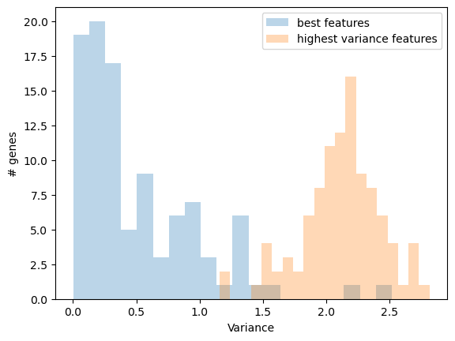

As observed, the logistic regression does not necessarily choose the features with the highest variance.

Using cross-validation actually seemed to make us select features with low variances. This could be because we used the `one-vs-rest` multi-class method, so for CV, a separate regularization strength can be used for each class. Somehow, this might have caused us to pick lower variance features than if we had a uniform regularization strength.

## Part 3 - Hyper-parameter explorations

### TSNE on 10, 50, 100, 250 and 500 PC's

Clustering is most clear when using fewer pc's. But using 500 pc's gives a more accurate representation of the distances.

We will go back to p1 dataset for this part.

Let's compute a full PCA and plot it.

```python
X = np.load("data/p1/X.npy") # data matrix
y = np.load("data/p1/y.npy") # labels

X = np.log2(X+1)

%%timeit -n 1 -r 1
%%memit -r 1
pca = PCA().fit(X) #PCA with 511 components
z=pca.transform(X)

plt.scatter(z[:,0],z[:,1],c=y)
```

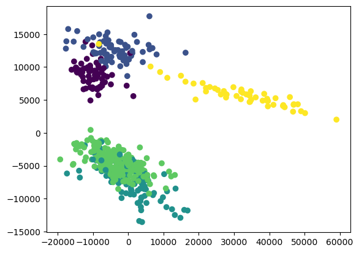

Fewer PC's tend to show the clusters more clearly. If we use many PC's, the clusters tend to merge together. 

For example, between 50 and 250 PCs, the yellow cluster blends with some of the other clusters.

The next five figures show the T-SNE plots from 10 to 500 PCAS.

```python
for n_pcs in [10,50,100,250,500]:
    print("Number of PCs:", n_pcs)
    z_tsne = TSNE(n_components=2,perplexity=40).fit_transform(z[:,0:n_pcs])
    plt.scatter(z_tsne[:,0],z_tsne[:,1], c=y)
    plt.title('# PCA = %i' %n_pcs) 
    plt.show()
```

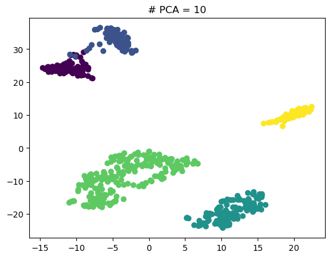
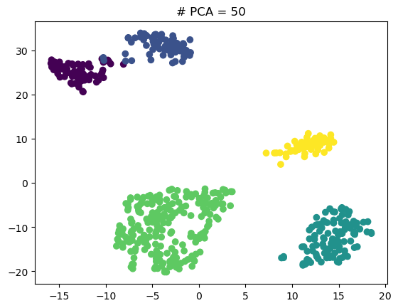
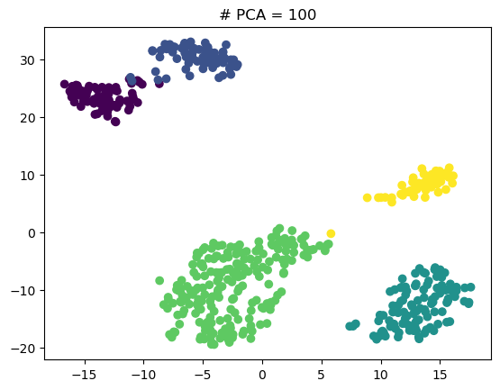
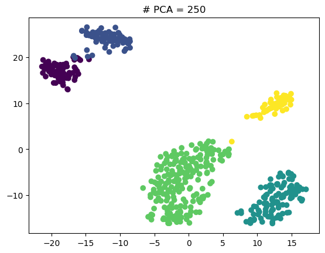


### Effect of perplexity

To observe the effect of changing the perplexity parameter on T-SNE we will use a transformation with 50 PCs.

The following code plots 7 T-SEN figures as shown below.

```python
for perplexity in [5,10,20,30,40,50,60]:
    print("Perplexity:", perplexity)
    z_tsne = TSNE(n_components=2,perplexity=perplexity).fit_transform(z[:,0:50])
    plt.scatter(z_tsne[:,0],z_tsne[:,1], c=y)
    plt.title('perplexity = %i' %perplexity)
    plt.show()
```

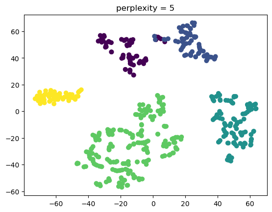
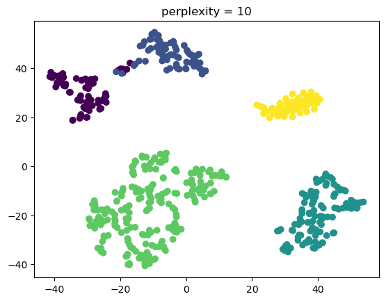
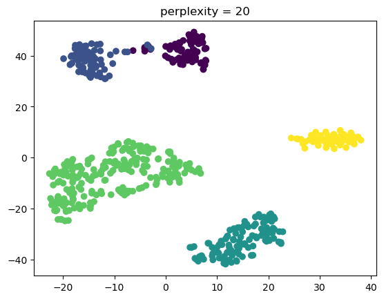
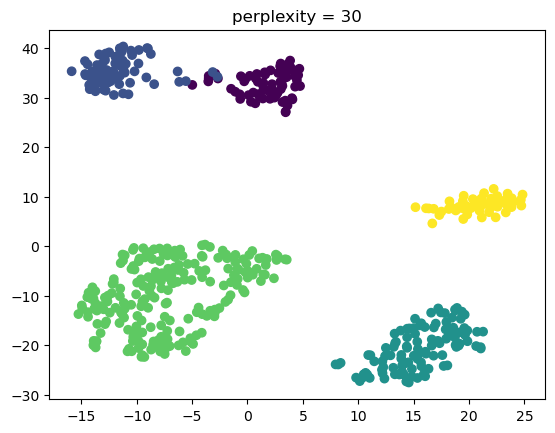
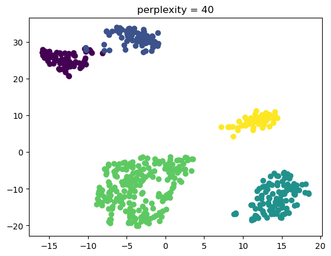
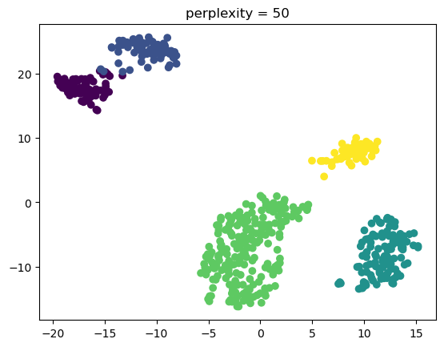
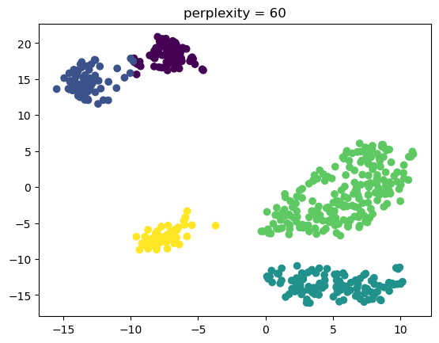

As the parameter perplexity grows, the cluster tend to aggregate more and more. Except for the first case, the 5 original clusters are clearly visible in all plots.

*What happens if we use 500 PCSs?*

Even at 500 PCs the T-SNE algorithm seems to behave properly in this version at least. 

```python
for perplexity in [5,20,40,60,100]:
    print("Perplexity:", perplexity)
    z_tsne = TSNE(n_components=2,perplexity=perplexity).fit_transform(z[:,0:500])
    plt.scatter(z_tsne[:,0],z_tsne[:,1], c=y)
    plt.title('perplexity = %i' %perplexity)
    plt.show()
```


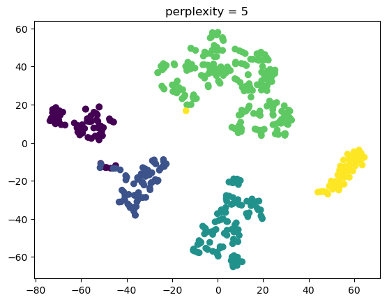
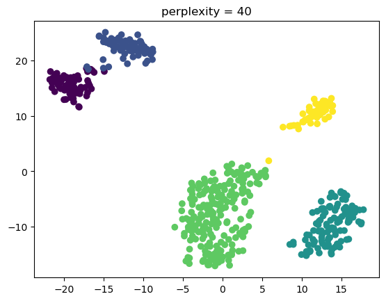
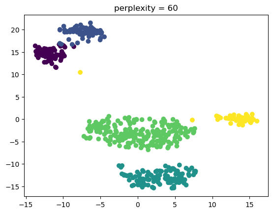
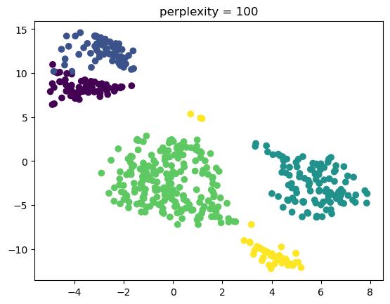

### Learning rate

We can also change the *learning rate* of the algorithm. If it is too low the algorithm may be stuck in some local minima and the cluster points became all clumped up. If the learning rate is too high, the data may not clump.

For 50 PCs the results are quite consistent and give excellent results (not shown). 

Even for 500 PCs we can observe there is not much difference among different learning rates.

```python
for learning_rate in [10,100,200,500,1000]:
    print("Learning rate:", learning_rate)
    z_tsne = TSNE(n_components=2,perplexity=40, learning_rate=learning_rate).fit_transform(z[:,0:500])
    plt.scatter(z_tsne[:,0],z_tsne[:,1], c=y)
    plt.title('learning_rate = %i' %learning_rate)
    plt.show()
```

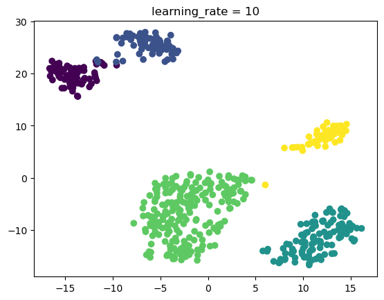
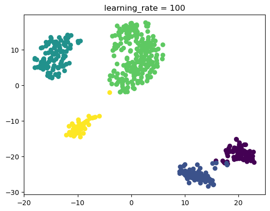
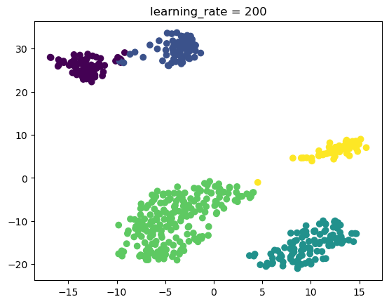
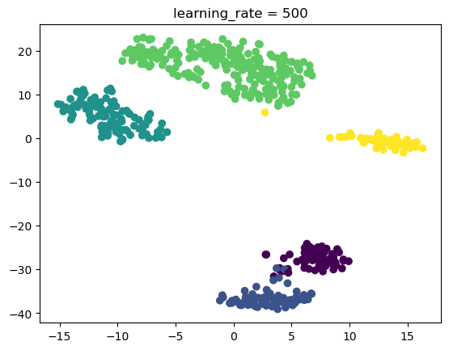
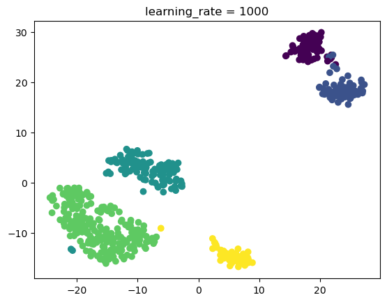


