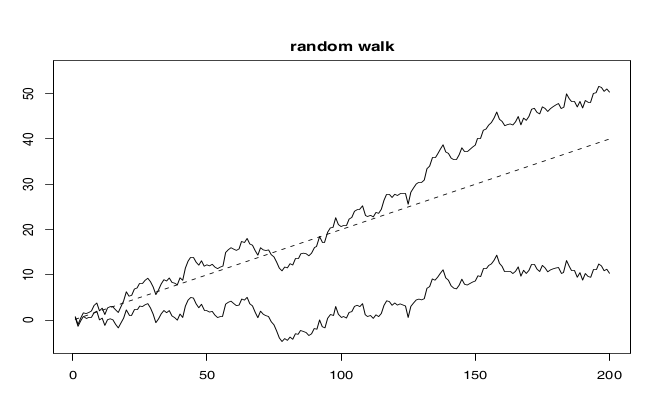

# Time Series

## Introduction

A **time series** is a special kind of statistical data. It is a collection of numerical measurements called **observations**

$$
x_1,x_2,...,x_t,...,x_n \in \mathbb{R}
$$

that are indexed by a time stamp $t=1,...,n$. The time stamps form a deterministic sequence and are regularly spaced in time with equal intervals between any two adjacent stamps. 

The observations are modeled mathematically as realizations of a corresponding series of random variables (r.v.),

$$
X_1,X_2,...,X_t,...,X_n : \Omega \rightarrow \mathbb{R}
$$

and are defined on some common probability space ($\Omega,P$). 

Then, what is observed is a particular outcome of a specialized probability model:

$$
x_1 = X_1(\omega),...,x_t = X_t(\omega),...,x_n = X_n(\omega),
$$

for an outcome $\omega in \Omega$ in some probability space ($\Omega,P$).

So, we have one r.v. for each time stamp and one observation for each r.v.. All r.v. are defined on a common probability space, so we can speak of probabilities of **joint events** that involve any number of these r.v. The realizations that come from the real world occur sequentially ($x_t$ before $x_{t+1}$), where the time interval between any observation is the same.

### Dependence in Time Series

The most important feature of time series data is that we make **no assumption about independence of these r.v.** In fact most time series are dependent., typically because past realizations influence future observations. The main goal of time-series analysis is to first model and then estimate from data (guided by a model) the dependence structure of these r.v.

**Statistical dependence in a time series is a double edged sword!** On the one hand, dependence **helps** us make predictions about the future realizations from knowledge of the past realizations. On the other hand, dependence poses technical challenges in the distributional analysis of the estimators, because there is less statistical information in dependent data about the data generating process **(e.g. The LLN and the CLT do not apply here!)**

Let's consider the following examples:

- **Economic data**: stock prices, inflation rate, GDP, emplyment rate, interest rate, exchange rates;
- **Biometric data**: heart rate, blood pressure, weight, fMRI;
- **Environmental data**: temperature, precipitation, pressure, humidity, pollution;
- **Sound data**: speech, music, pollution;

*Johnson & Johnson quarterly earnings per share*

*global air traffic passengers*

*exchange rates GBP to NZ dollar*

*Air pressure and fish population*

*Price index USA*

In all these examples, data takes the form of discrete measurements of a real world phenomena that evolves continuously in time. A general probabilistic model to describe such phenomena is called a **stochastic process**, which is simply a collection of r.v. indexed by either a continuous or discrete time parameter $t$. A time series can therefore be considered as a **single realization** of a stochastic process. Each r.v. $X_t$ has a marginal distribution $P_t$. The process ${X_t}_{t>0}$ as a whole also has a probability law, which can be thought of as the **joint** distribution of all the $X_t$s.

## Deterministic dependencies in time series

Two of the most important deterministic dependence features in a time series are a **trend** and the **seasonal variation**. 

Let 

$$
\mu_X(t) = \mathbb{E}[X_t]
$$

denote the mean function of the marginal distributions of the series. We can also write the mean function as

$$
\mu_X(t) = m_X(t) + s_X(t),
$$

where $m_X(t)$ is the **trend** of the series, the non-constant and non-cyclical component of $\mu_X(t)$ and $s_X(t)$ is the **seasonal** variation of the series, the cyclical component of $mu_X(t)$ that repeats itself at a fixed time interval. 

### Example 0: White noise

A basic building block of time series models is the white noise process. The simplest example is the i.i.d. data $W_t \sim \mathcal{N}(0,\sigma^2)$.

*Does the series above has a trend or seasonality?*

No! White noise does not have deterministic features.

We can now add a noise term to our model. Thus, we can write that

$$
X_t = m_X(t) + s_X(t) + W_t,
$$

where $W_t$ is a white noise time series. 

In the Figure below we have a time series with a seasonal variation and some noise. We can readily observe the cyclical pattern by visual inspection.

However, when we increase the noise term, it starts to be challenging to discern the deterministic pattern.

Now consider the following time series with a linear trend and some noise.

If we add more noise, the trend starts to be more difficult to observe.

The same applies to a time series with a quadratic trend and some noise...

and the same with more noise.

Again the same for an exponential trend.

Let's now mix both deterministic features.

In the plot below we have both features: a linear trend and a seasonal variation with some noise.

As we increase the noise, it is harder to discern the signal.

And yet another example, this time for a quadratic trend with a cyclical variation with some noise...

...and with a lot of noise!

Enough of examples!

## Stochastic dependence

Very often time series observations that are close to each other in time are **strongly correlated**.  For many, this correlation decays as the time distance between observations increases, while the variation of $X_t$ stays constant over time. For others, the correlation of $X_t$ with future observations stay constant, while the total variation of the series accumulates and increases with time. 

We can write this description as the **autocovariance** function of a time series. Therefore,

$$
\gamma_X(s,t) = Cov[X_s,X_t] = \mathbb{E}\left[ (X_s-\mu_X(s))(X_t-\mu_X(t))\right],
$$

decribes the linear stochastic association between the terms of the series. The **marginal variance** function

$$
\gamma_X(t,t) = Var[X_t] = \mathbb{E}\left[ (X_t-\mu_x(t))^2\right],
$$

describes the magnitude of the random fluctuations in the series at different time points. Realizations of time series with strong stochastic dependencies tend to look much smoother and more regular than the white noise process with the same marginal variance function.

## Objective of time series analysis

The **goal** of time series analysis is to understand and explore the deterministic and stochastic dependencies of the stochastic process that generates the data.

Specifically we need statistical tools and models to:

- Detect the trend $m_X(t).
- Detect the seasonal variation $s_X(t)$ and determine its period.
- Understand the correlation structure $\gamma_X(t,s)$ within the same time series.
- Understand the correlation structure between two different time series.

In many applications the important goal is to be able to forecast future observations.

Let's take a look at real data. *What properties does the series has?*

Here we have air passenger data. We observe a linear trend, a seasonal variation of period 4 and an increase in variance over time. 

## Stationarity

In order to do statistical estimation and inference in time series we need certain technical conditions to be met. In other words, we need to insure that the observations along a single realization of the process are representative of all possible realizations of the process, so that we are able to estimate population parameters for the whole process (e.g. expectations, variances, correlations). Also, we need conditions that allow us to extrapolate statistical models fitted to observations from the past ntoto the future.

While time series data are not i.i.d it is possible to do inference via **time averages** along a sample path and allowing for stochastic dependencies. 

A time series $X_t$ is **strongly stationary** if the joint distribution of $X_t,...,X_{t+n}$ is the same as the joint distribution of $X_{t+h},...,X_{t+n+h}$,

$$
(X_t,...,X_{t+n}) = (X_{t+h},...,X_{t+n+h})
$$

for all integers $n$, time stamps $t$, and time shifters $h$.

**Weak stationarity** requires that only the first two moments of the series (i.e. the mean and the variance/covariance) be constant in time. Thus,

$$
\mathbb{E}[X_t] = \mu_X, Var(X_t) = \sigma_X^2, Cov(X_s,X_t) = \gamma_X(|s-t|),
$$

for all time stamps $s$ and $t$. A weakly stationary time series is simply called stationary.

Observations about stationarity:

1. Stationarity requires that the joint distribution of the series remains fixed throughout time. This implies that the stochastic dependencies in the series remain the same throughout time. Therefore, if we estimate a model based on observations $from t=1,...,n$, then stationarity allows us to use the fitted model to predict observations for $t>n$.
2. If, in addition, the stochastic dependents in the terms of the series dies down sufficiently quickly as the time gap between observations increases, we can use these observations tod o statistical estimation by relying on appropriate generalizations of the LLN and the CLT. In other words, if the observations are far enough from each other in time allowing them to be nearly independent from each other, then the path sample averages behave similarly to the sample averages of i.i.d r.v..
3. Stationarity rules out dependence of the series on the time index $t$. Therefore, it rules out trends and seasonal variation.

For these reasons it is always important to work with stationary time series. However, many time series are not stationary so it is necessary to transform them into a stationary one. This typically requires the use of regression methods or averaging techniques to remove the trend, seasonal variation and noise variation components. 

## Identifying and removing non-stationarity features

When we have a non-stationary time series we may observe one or all of the following features:

- Trend: non-constant expected value
- Periodical oscillations (seasonal effect)
- Non-constant variance
- Changes in the dependency structure

To detect these features we can plot the time series and plot its autocovariance. The autocovariance plot allows us not only to observe the trends and seasonal effects but also any changes in the dependency structure.

Let's consider the following techniques of transforming time series data:

- Linear regression $\rightarrow$ can remove a linear trend.
- Non-parametric regression model (e.g. kernel smoothing, polynomial fitting, k-nearest neighbors, series regression...).
  - can remove linear and non-linear trends as well as seasonal variations
- Periodic function as regression model $\rightarrow$ can remove seasonal variations.
- differencing the data one or more times $\rightarrow$ can remove linear and non-linear trends as well as increasing variances.

$$
Y_t = \nabla X_t = X_t - X_{t-1}
\rightarrow \text{removes linear trend} \\
$$

$$
\nabla^2 X_t = \nabla X_t - \nabla X_{t-1} = X_t - 2 X_{t-1} + X_{t-2} \rightarrow \text{removes quadratic trend}
$$

$$
\text{If } \{X_t\}_t \text{ is integrated of order p, then } \{\nabla^p X_t\}_t \text{ is stationary.}
$$

- applying a variance reduction transformation (square root or log transformation) $\rightarrow$ can remove increasing variance.
- smoothing (i.e. applying moving averages).
- applying fourier analysis $\rightarrow$ can remove seasonal trends.

**Note: after the transformation the remainder of the data should be stationary, with mean zero.**

### Example

Let's observe the following plot on the left. Here we can detect a linear trend and a seasonal variation by visual inspection. 

On the right side we have two plot showing the application of two distinct  techniques. On the top plot we have the result of detrending by linear regression and on the bottom the result of differencing.

We can observe that, while both methods were successful in removing the linear trend, in this case, the differencing also removed other patterns from the data. *So, in general, which method should we choose?* Well, it depends!

Let's check out the pros and cons of each method. The decomposition or detrending of the data allows a much greater control of the process because we know where each component lies. In other words, it is very interpretable. When we do differentiation we lose that interpertability. On the other hand, in the first method you need to parametrize and do some choices, while in the differentiation there's no need of that. Also, multiple differencing shortens your time series, careful.

## Estimation on stationary time series

Let $X_t$ denote a stationary time series. We obtain estimators of the mean, variance and autocovariance functions by replacing the expectations with sample averages. Therefore,

$$
\hat{\mu} = \frac{1}{n}\sum_{t=1}^n X_t
$$
$$
\hat{\sigma}^2 = \frac{1}{n}\sum_{t=1}^n(X_t-\hat{\mu})^2
$$
$$
\hat{\gamma}(h) = \frac{1}{n}\sum_{t=1}^{n-h}(X_t-\hat{\mu})(X_{t+
h}-\hat{\mu}) \text{ for } 1\le h \le n.
$$

If the series is stationary, then each observation in the sample average contributes with statistical information about the common parameters. Most time series are dependent, but when the stochastic dependences in the series decay sufficiently fast, as the time distance between terms gets large, then the sample averages have a similar asymptotic behavior as in LLN and CLT for i.i.d. data. 

We can also write the sample autocorrelation function as

$$
\hat{\rho}(h) = \hat{\gamma}(h)/\hat{\gamma}(0) \text{ for } 1\le h \le n.
$$

**Thus, under mild technical conditions we have good estimators of the mean, variance and autocovariance functions of a stationary time series.**

## Autocorrelation as a diagnostic tool

The autocovariance function (ACF) is a very powerful statistical tool to study the dependence properties of a time series. Visualizing the ACF is the second step after visualizing the series itself. 

Properties of the ACF:

- symmetric.
- measures *linear* dependence of $X_t,X_s$.
- relates to smoothness
- for weakly stationary series: $\gamma_X(t,t+h) = \gamma_X(0,h) = \gamma_X(h)$.

### Example

In the following diagram we can observe a very simple example. We want to plot the ACF of a signed time series. The first step is to calculate the autocovariance function of all possible step sizes $h$, from $h=1$ to $h=4$. We note that the average of the time series is zero.

From here we can draw the "correlogram" as shown below which is just the value of the autocovariance as a function of the lag $h$.

This diagram shows a negative component (-3/7) at lag $h=2$ and a positive component (2/7) at lag $h=4.

Let's take a look at another example, this time a simulation with short term correlations and noise. The top plot shows the time series while the bottom plot shows the ACF. The horizontal dashed blue lines represent the noise levels.

Here we can observe that this time series exhibits short-term correlations which is often the case in stationary series. Also, after $h=5$ the longer term correlations are indistinguishable from the noise.

In the case of a series with a trend as shown below, the case is different.

Here, the ACF shows correlations throughout the $h$ range. This means that the points are all correlated and this indicates an existence of a trend which is obviously the case.

In the case where we don't have any trend but only a seasonal variation, such as the case of the de-trended $CO_2$ Mauna Loa data shown below.

In the ACF plot we observe a cyclical cycle which is the pattern for the existence of a seasonal variation in the time series.

The next picture shows three cases of a time series (left) and the corresponding ACF (right). This shows that through ACF we can make precise diagnostics on the non-stationarity nature of the signal components in our data.

On the top panel, the ACF signal steadily decreases with time lag, revealing a mixture between a trend and a seasonal variation. In the middle panel, the time series was already detrended but a seasonal variation persists in the data. On the bottom plot there is no evidence of non-stationarity components.

## The white noise model (revisited)

The simplest time series model is the **white noise process** $\{W_t\}_t$ of r.v. that have zero mean, the same variance $\sigma_W^2$, and zero correlations. Therefore,

$$
\mu_W(t) = \mathbb{E}[W_t] = 0
$$
$$
\gamma_W(t,t) = Var(X_t) = \sigma_W^2
$$
$$
\gamma_W(t,s) = Cov(X_t,X_s) = 0, \text{ for t } \ne s.
$$

Also,

- It is oftern i.i.d. e.g. Gaussian
- Stationary
- Checking for white noise: $\hat{\rho}(h) is approximately \mathbb{N}(0,\frac{1}{n}) under mild conditions.

The path of a white noise process and its ACF function can be represented by the following figure

Here we observe that the full strength of the ACF signal is concentrated when there is no correlation ($Lag=0$).

The main purpose of the white noise is to model the "best" case residuals that contain no information after we perform all possible procedures in our data. 

The distribution of the estimator of a white noise source is

$$
\hat{\gamma}_W(h) \sim \mathcal{N}\left(0,\frac{\sigma_W^2}{n}\right)
$$

which means that we do not expect to see the theoretical ACF function exactly as our estimate but only approximately up to estimation error.

## Autoregressive model

A time series \{X_t\}_t is an **autoregressive process** of order $p$, denoted AR(p) if

$$
X_t = \phi_1X_{t-1} + \phi_2X_{t-2} + ... + \phi_pX_{t-p} + W_t,
$$

where $\{W_t\}_t$ is a white noise process, and $W_t$ is uncorrelated with $X_s$ for $s < t$.

**Note:** the definition of the model is recursive, meaning we can relate $X_t$ to any previous term of the series $X_{t-h}$ by substituting the above expression for $X_{t-1}$ on the right side of the equation and so on. Because of this recursive nature, **all** terms of the series are **dependent**. This fact is reflected on the ACF. The ACF of a **stationary autoregressive process** is **non-zero** for all time shifters $h$ and decays to zero exponentially as $h$ increases, as shown in the plot below.

Let's see another example. The following autoregressive model 

$$
X_t = 1.5X_{t-1} - 0.75X_{t-2} + W_t
$$

generates the following ACF. Again, we observe the exponentially decay as $h$ increases.

## Random walk model

A time series $\{X_t\}_{t\ge 1}$ is a random walk if the value of $X_t$ is obtained from the value of $X_{t-1}$ by adding a random perturbation $W_t$ (white noise) that is independent of the past history of the series $\{X_s\}_{s\lt t}$. Thus,

$$
X_t = X_{t-1} + W_t
$$

A time series $\{Y_t\}_{t\ge 1}$ is a random walk **with drift** if it is equal to the sum of a random walk process with a deterministic linear trend. Therefore,

$$
Y_t = \delta t + X_t = \delta + Y_{t-1} + W_t,
$$

where $Y_{t-1} = \delta(t-1) + X_{t-1}$.

In the following plot we can observe the differences between the random walk model with and without drift.

Due to the inherent random nature of white noise, all random walks are different as shown in the figure below.

### Statistic of random walk

To compute the basic statistics of the random walk it is useful to write $X_t$ as a sum of perturbations that accumulate over time.

$$
X_t = X_{t-1} + W_t
\\
= \left[X_{t-2} + W_{t-1} \right] + W_t
\\
\vdots
\\
= X_0 + \sum_{h=1}^t W_h
$$

Similarly, for the random walk with drift we have

$$
Y_t = \delta + Y_{t-1} + W_t
\\
= \delta + \left[\delta + Y_{t-2} + W_{t-1} \right] + W_t
\\
\vdots
\\
\delta t + Y_0 + \sum_{h=1}^t W_h.
$$

Using these representations we can find the marginal mean function, the covariance function and the autocorrelation function.

$$
\mu_X(t) = \mathbb{E}[X_t] = \mathbb{E}\left[X_0 + \sum_{h=1}^t W_h\right]
$$
$$
\mu_X(t) = \mathbb{E}[X_0].
$$
$$
\sigma_X^2(t) = Var(X_t) = Var\left(X_0 + \sum_{h=1}^t W_h\right) 
$$
$$
= Var(X_0) + \sum_{h=1}^t \left[2Cov(X_0,W_h) + Var(W_h)\right] + 2 \sum_{1 \le h < j \le t} Cov(W_h,W_j) 
$$
$$
\sigma_X^2(t) = Var(X_0) + t\sigma_W^2,
$$

since $W_h$ is uncorrelated with $X_0$ and with $W_j$ for $j \ne h$.

$$
\gamma_X(s,t) = Cov(X_s,X_t) = Cov\left(X_0 + \sum_{h=1}^s W_h, X_0+\sum_{h=1}^t W_h\right) 
$$
$$
= Var(X_0) + \sum_{h=1}^{min(s,t)} Var(W_h)
$$
$$
\gamma_X(s,t) = Var(X_0) + min(s,t)\sigma_W^2.
$$

**Note: The random walk is not stationary because the variance is growing with time and the autocovariance depends on the smallest of the two time stamps rather than on the difference.**

**Note2: However $\nabla X_t$ *is* stationary.**

## Moving average model

A time series \{X_t\}_t is a **moving average process** of order $q$, denoted by MA(q) if it can be represented as a weighted moving average

$$
X_t = W_t + \theta_1 W_{t-1} + \theta_2 W_{t-2} + ... + \theta_q W_{t-q}
$$

$$
X_t = \sum_{h=0}^q \theta_h W_{t-h}
$$

of a white noise series $\{W_t\}_t$.

The following figure shows three plots (top part) and corresponding ACFs(bottom part). The plot on the left is a representation of white noise, the middle plot depicts a moving average model of order 1 and on the left we can observe a representation of a moving average model of order 7. 

From the definition of a moving average time series we can write that the autocovariance function is

$$
\gamma_X(h) = Cov\left(\sum_{j=0}^q \theta_j W_{t-j}, \sum_{k=0}^q \theta_k W_{t+h-k} \right)
$$
$$
\gamma_X(h) = \sum_{j=0}^{q-h} \theta_j\theta_{j+h}\sigma_W^2, \text{ for } 0 \le h \le k
$$

because $W_j$ is uncorrelated with $W_k$ for $j \ne k$.

**Notes:**

- $\mathbb{E}[X_t] = 0$.
- Autocovariance $\gamma$ depends only on $|s-t| \implies$ stationarity.
- ACF reflects order: $\gamma(s,t) = 0$ if $|s-t| > q$.
- ACF distinguishes MA and AR models as shown in the figure below.

## ARMA Model

A time series $\{X_t\}_{t \ge l}$ is a **moving average autoregressive process** of orders $p,q$, denoted by ARMA(p,q), if it is a sum of an AR(p) component with a MA(q) component. Thus

$$
X_t = \phi_1X_{t-1} + \phi_2X_{t-2} + ... + \phi_pX_{t-p} + W_t + \theta_1 W_{t-1} + \theta_2 W_{t-2} + ... + \theta_q W_{t-q}.
$$

A time series $\{X_t\}_{t \ge l}$ is an ARIMA(p,d,q) model if the difference of order d, \{\nabla^d X_t\}_{t\ge l} is an ARMA(p,q) model.

And so on...

## Regression and time series

We can always try and fit a regression in our time series. Such a model can be written as

$$
X_t = \beta_1 z_{t1} + \beta_2 z_{t2} + ... + W_t = \mathbf{\beta^Tz_t} + W_t
$$

Examples:

- linear trend $\implies X_t = \beta_1 + \beta_2 t + W_t$ 
- AR(2) model $\implies X_t = \phi_1 X_{t-1} + \phi_2 X_{t-2} + W_t$
- include external regressors $\implies X_t = \beta_1 X_{t-1} + \beta_2 Y_t + W_t$

To fit any model we can do least squares regression: $min_\beta\sum_t (mathbf{x_t-\beta^T z_t})^2

**Note: the errors may be correlated over time!!!**

**Note2: this is also valid for any non-linear models**

### ACF as a diagnostic tool

*Which external variables should we use? What should be the order of the model?*

We can use ACF (and partial ACF) to determine the fit. The end result should look like white noise.

Example. $X_t = T_t + Y_t$

- $T_t$ = 50+3t (linear trend)
- $Y_t$ = 0.8Y_{t-1} + W_t$ (AR(1) model)

The plot below shows the result after fitting the linear trend only. The ACF shows the typical signal of an AR model!

### Fitting autoregressive models

For a given autoregressive order $p$, the AR(p) model has $p+1$ parameters that need to be estimated from data: $\phi_1,\phi2,...,\phi_p,\sigma_W^2$.

We can estimate these parameters using the method of moments approach. The first step in estimation is to compute the autocovariance

$$
\hat{\gamma}_X(0),\hat{\gamma}_X(1),...,\hat{\gamma}_X(p).
$$

The second step is to find the $p+1$ equations that relate these moments to the unknown parameters above

$$
\hat{\gamma}_X(0),\hat{\gamma}_X(1),...,\hat{\gamma}_X(p) = \Gamma\left(\phi_1,\phi2,...,\phi_p,\sigma_W^2\right)
$$

we will then have $p+1$ equations with $p+1$ unknowns, which in general will have a unique solution

$$
(\phi_1,\phi2,...,\phi_p,\sigma_W^2) = \Gamma^{-1}\left(\hat{\gamma}_X(0),\hat{\gamma}_X(1),...,\hat{\gamma}_X(p)\right)
$$

The equations $\Gamma$ are known as the **Yule-Walker** equations. They can be expressed in the following way:

$$
\gamma_X(0) = \phi_1\gamma_X(1) + \phi_2\gamma_X(2) + ... + \phi_p\gamma_X(p) + \sigma_W^2
$$

$$
\gamma_X(1) = \phi_1\gamma_X(0) + \phi_2\gamma_X(1) + ... + \phi_p\gamma_X(p-1)
$$

$$
\vdots
$$

$$
\gamma_X(p) = \phi_1\gamma_X(p-1) + \phi_2\gamma_X(p-2) + ... + \phi_p\gamma_X(0)
$$

In matrix form we have

$$ 
\mathbf{\phi = \Gamma_p^-1\gamma_p}.
$$

### AR(p) model order determination

The following figure shows the ACF of the white noise model (left), the MA model (center) and the AR model (right).

We know that in the case of the MA(q) models, the ACF reveals the order $q$. Basically it is only necessary to count the number of time steps where the ACF is above the noise level.

For AR(p) models however this is not so clear, as the function decays exponentially fast. We need another form of diagnostic.

#### Partial autocorrelation

The best method to determine the order is to use the partial autocorrelation function.

Let X_0,...,X_n be a stationary time series. The autocorrelation function at lag $h$ is defined as

$$
\rho_x(h) = Corr(X_h,X_0) = \mathbb{E}[(X_h-\mathbb{E}[X_0])(X_0-\mathbb{E}[X_0])]/Var(X_0).
$$

The partial autocorrelation between $X_h$ and $X_0$ is the correlation between $X_h$ and $X_0$ with the correlation due to the intermediate terms of the series $X_1,...,X_{h-1}$ removed. 

Formally we can write that the partial autocorrelation of time series $X_t$ at lag $h$ is

$$
\alpha_X(h) = Corr(X_h-\hat{X}_h^{lin_{h-1}},X_0-\hat{X}_0^{lin_{h-1}}),
$$

where $\hat{X}_h^{lin_{h-1}}$ is the linear regression (projection) of $X_h$ on $X_1,...,X_{h-1}$ and $\hat{X}_0^{lin_{h-1}}$ is the linear regression of $X_0$ on $X_1,...,X_{h-1}$. 

The following shows a comparison between the ACF (left) and the PACF for AR(2). We can observe that in the PACF the two orders are clearly displayed. 

Let's take a look at a previous example, where we have a time series composed of two series: 

$$
X_t = T_t + Y_t
$$

where

$$
T_t = 50+3t \implies \text{ time series with a linear trend}
$$

and

$$
Y_t = 0.8Y_{t-1} + W_t \implies \text{ AR(1) series}
$$

The following figure shows the time series (top plot) as well as the ACF (bottom left plot) and the PACF (bottom right plot) of the residuals after fitting a linear model only. From the ACF we can conclude that we have a AR time series (exponential decay, oscillation) and in the PACF plot we only observe one peak above noise. Therefore, we should fit a AR(1) model.

#### Akaike information criterion (AIC)

There are also other ways to determine which model is more apropriate among a few model candidates. Here we will explore two other more generic approaches. The first one is the Akaike Information Criterion or AIC. It is calculated as

$$
AIC = 2k-2ln(L),
$$

where $k$ is the number of parameters in the model, $n$ is the number of the observations in the dataset, and $L$ is the likelihood value of a given dataset.

Models with smaller AIC values are preferred to the models with larger AIC values, as the smaller values are associated with a smaller number of model parameters (i.e. less complexity) and a better fit to the data (larger likelihood value). It is the interplay between these values that will determine the best model.

Another commonly used information criterion is the Bayesian information criterion (BIC) and can be calculated as

$$
BIC = kln(n)-2ln(L).
$$

The equation parameters are the same as in AIC, but a lower weight is given to the number of parameters.

#### Cross validation

Cross validation can be used in special cases for AR models (Bergmeier, Hyndman & Koo 2015). 

*Which technique to use? An information criterion (IC) or CV?*

- IC is more prefereable if the speed is priority
- IC is more preferable if the sample size is small
- CV is more preferable if model selection results are different with different ICs

**Note: minimizing AIC is asymptotically equivalent to leave-one-out CV (Stone 1977). See also Shao (1997).**

## Forecasting with AR(p) models

*Can we predict $X_{n+m}$ based on observed $x_n,x{n-1},...,x1$?*

**Yes!...but only for short horizons $m$!** For long horizons, the forecast converges to the mean of the time series.

1. We estimate the coefficients $\hat{\phi}_1,...,\hat{\phi}_p$
2. Estimate the steps ahead of the time series
   - 1 step ahead $\implies \hat{x}_{n+1|n} = \hat{\phi}_1x_n + \hat{\phi}_2 x_{n-1} + ... + \hat{\phi}_p x_{n-p+1}$
   - 2 steps ahead $\implies \hat{x}_{n+2|n} = \hat{\phi}_1x_{n+1} + \hat{\phi}_2 x_{n} + ... + \hat{\phi}_p x_{n-p+2}$
   - general $\implies \hat{x}_{n+m|n} = \hat{\phi}_1x_{n+m-1} + \hat{\phi}_2 x_{n+m-2} + ... + \hat{\phi}_p x_{n+m-p}$

where we use $x_t$ instead of $\hat{x}_t$ where available.

The following plot shows an example of a forecast and the time frame of the convergence towards the mean.

## Fitting a time series: overview

1. Transform to make it stationary
   - log-transform
   - remove trends/seasonality
   - differentiate successively
2. Check for white noise (ACF)
3. If stationary: plot autocorrelation
   - If finite lag, fit MA (ACF gives order)
   - Otherwise fit AR

**Fitting AR(p)**

1. compute PACF to 
2. get order
3. estimate coefficients $\phi_k$ and noise variance $\sigma_W^2$ via Yule-Walker equations
4. Compute residuals, test for white noise

**Fitting MA(q)**

1. compute ACF to get order
2. estimate coefficients via maximum likelihood
3. compute residuals, test for white noise.

**Fitting ARMA(p,q)**

1. attempt to fit an AR model, compute residuals
2. attempt to fit an MA model to residuals (or original data)
3. fit ARMA(p,q) using p,q, determined in steps 1 and 2
4. compute residuals, test for white noise

**Review table**

## Linear process

The MA and the AR models can be related to each other with the concept **linear process**. Linear process models can be written as

$$
X_t = \sum_{j=-\infty}^\infty \psi_j W_{t-j}.
$$

For the process to be well defined, $\sum_j ||\psi_j|| < \infty$.

A linear process is called **causal** if $\psi_j=0$ whenever $j<0$. This is to say that the value of $X_t$ depends only on the past!

A linear process is weakly stationary, where

$$
\mathbb{E}[X_t] = 0
$$

and

$$
\gamma_X(t,t+h) = \sum_{i=-\infty}^\infty \psi_i\psi_{i+h}\sigma_w^2,
$$

which only depends on the length of the gap $h$.

This means that:

- MA(q) is a linear process and causal.
- AR(p) is stationary and causal if linear process converges (it converges if $|\phi_1|<1$)

## Local linear regression

- No time series and time series (TBD)

