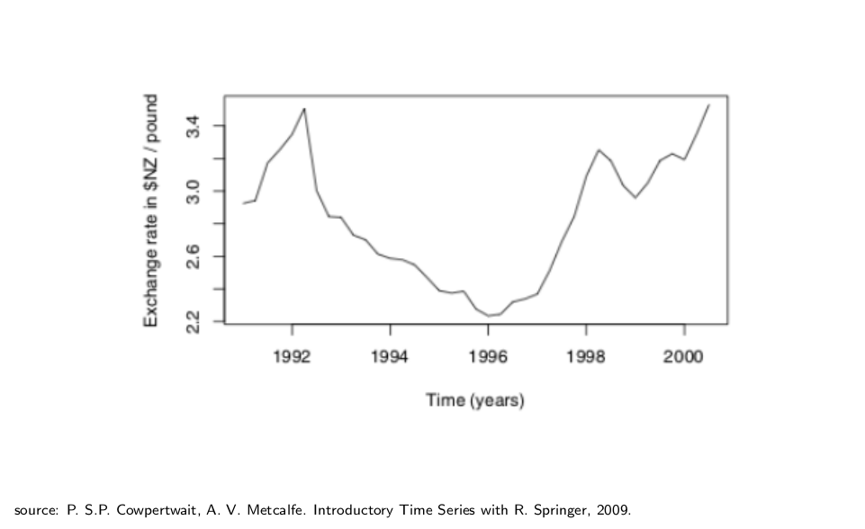
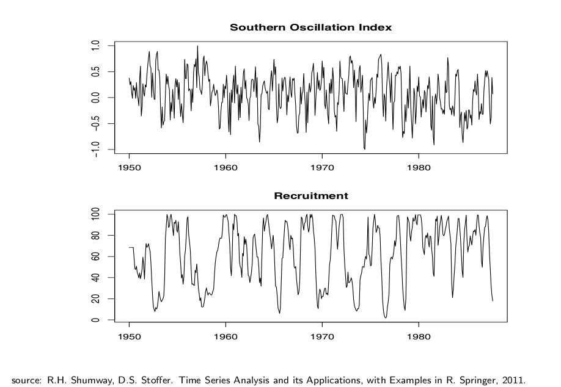
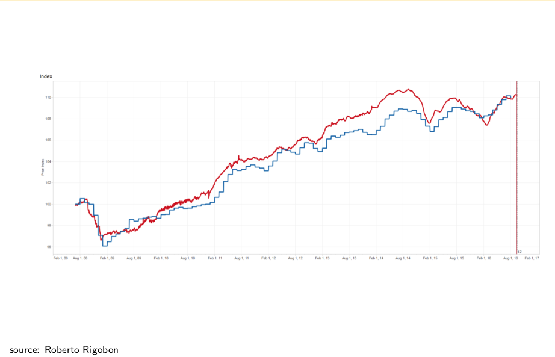

# Time Series

## Introduction

A **time series** is a special kind of statistical data. It is a collection of numerical measurements called **observations**

$$
x_1,x_2,...,x_t,...,x_n \in \mathbb{R}
$$

that are indexed by a time stamp $t=1,...,n$. The time stamps form a deterministic sequence and are regularly spaced in time with equal intervals between any two adjacent stamps. 

The observations are modeled mathematically as realizations of a corresponding series of random variables (r.v.),

$$
X_1,X_2,...,X_t,...,X_n : \Omega \rightarrow \mathbb{R}
$$

and are defined on some common rpobability space ($\Omega,P$). 

Then, what is observed is a particular outcome of a specialized probability model:

$$
x_1 = X_1(\omega),...,x_t = X_t(\omega),...,x_n = X_n(\omega),
$$

for an outcome $\omega in \Omega$ in some probability space ($\Omega,P$).

So, we have one r.v. for each time stamp and one observation for each r.v.. All r.v. are defined on a common probability space, so we can speak of probabilities of **joint events** that involve any number of these r.v. The realizations that come from the real world occur sequentially ($x_t$ before $x_{t+1}$), where the time interval between any observation is the same.

### Dependence in Time Series

The most important feature of time series data is that we make **no assumption about independence of these r.v.** In fact most time series are dependent., typically because past realizations influence future observations. The main goal of time-series analysis is to first model and then estimate from data (guided by a model) the dependence structure of these r.v.

**Statistical dependence in a time series is a double edged sword!** On the one hand, dependence **helps** us make predictions about the future realizations from knowledge of the past realizations. On the other hand, dependence poses technical challenges in the distributional analysis of the estimators, because there is less statistical information in dependent data about the data generating process **(e.g. The LLN and the CLT do not apply here!)**

Let's consider the following examples:

- **Economic data**: stock prices, inflation rate, GDP, emplyment rate, interest rate, exchange rates;
- **Biometric data**: heart rate, blood pressure, weight, fMRI;
- **Environmental data**: temperature, precipitation, pressure, humidity, pollution;
- **Sound data**: speech, music, pollution;

In all these examples, data takes the form of discrete measurements of a real world phenomena that evolves continuously in time. A general probabilistic model to describe such phenomena is called a **stochastic process**, which is simply a collection of r.v. indexed by either a continuous or discrete time parameter $t$. A time series can therefore be considered as a **single realization** of a stochastic process. Each r.v. $X_t$ has a marginal distribution $P_t$. The process ${X_t}_{t>0}$ as a whole also has a probability law, which can be thought of as the **joint** distribution of all the $X_t$s.

