# Consumer price index and break even rate analysis

In this example we will analyze consumer price index (CPI) and break even rate (BER) data for the last decade.

The CPI is the price of a "market basket of consumer goods and services" - a proxy for inflation while BER is the difference in yield between a fixed rate and inflation adjusted 10 year treasury note. This difference can be interpreted as what the market views will be the inflation rate for the next 10 years, on average.

The data will be read from two files `CPI.csv` for CPI and `T10YIE.csv` for BER in the `data_and_materials` folder.

Here we will present an approach to estimate the 1 month ahead forecasts of the CPI starting September 2013. We'll use the data up to this month for training and the rest for evaluation.

## Loading and preparing the data

First we'll load the libraries and the data.

```python
import numpy as np
import scipy as sp
import matplotlib.pyplot as plt
import pandas as pd
from sklearn.linear_model import LinearRegression
from sklearn.model_selection import train_test_split
from sklearn.metrics import mean_absolute_percentage_error,mean_squared_error
from statsmodels.tsa.ar_model import AutoReg
import statsmodels as sm
import seaborn as sb

ps_cpi = pd.read_csv("CPI.csv")
ps_cpi['date'] =pd.to_datetime(ps_cpi['date'])
ps_cpi.head(10)

date	CPI
0	2008-07-24	100.0000
1	2008-07-25	100.0000
2	2008-07-26	100.0000
3	2008-07-27	100.0000
4	2008-07-28	100.0000
5	2008-07-29	100.0000
6	2008-07-30	100.0000
7	2008-07-31	100.0000
8	2008-08-01	100.5251
9	2008-08-02	100.5251
```

By visualizing the data we observe that CPI only changes on a monthly basis. Hence we can take just one value of the CPI for our purposes. We also split the data into training ans testing data sets. 

```python
ps_cpi['YearMonth'] = ps_cpi['date'].dt.strftime('%Y-%m') #add a new column with year and month
cpi =ps_cpi.drop_duplicates('YearMonth', keep='last').copy().reset_index().drop(['index'],axis=1) #drop all columns with the sam Year-Month except the last one
cpi_train = (cpi[cpi.YearMonth<'2013-09'].copy()) #training subsample
cpi_test = (cpi[cpi.YearMonth >='2013-09'].copy()) #testing subsample
```

Let's now take a look at the time series.

```python
sb.set_theme()
sb.lineplot(cpi_train,x='date',y='CPI')
```

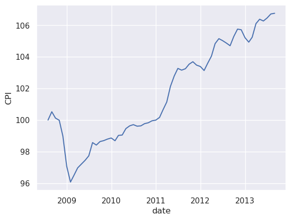

## Fitting a linear model

From the plot we can observe a clear trend. Let's try to find a linear model to see if it's enough to represent the trend. We then subtract this trend from the data.

```python
x = np.array(cpi_train.index).reshape(-1,1)
lr1 = LinearRegression().fit(x,cpi_train['CPI'])

print('Linear trend equation: y =',lr1.coef_[0],'* t +',lr1.intercept_)

sb.lineplot(x=x.flatten(),y=cpi_train['CPI'],label='data')
sb.regplot(x=x,y=cpi_train['CPI'],marker='o',label='linear fit',scatter=False)
plt.legend()

plt.xlabel('time')
```

The plot shows the data and the linear fit. Looks great! 

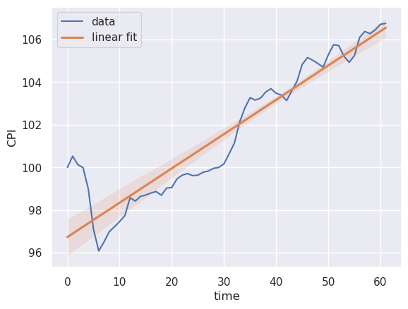

Now, we will create a function to remove the trend. We can do this two ways: i) just subtract the trend. ii) log transform the $CPI$ and take the first difference. 

Here we will use the first option for now.

```python
x = input('Choose Method:')
if x == 'linear':
    remaining = cpi_train.CPI - linear_cpi
    linear_cpi_test = model.predict(np.array(cpi_test.index).reshape(-1, 1))
    remaining_test = cpi_test.CPI - linear_cpi_test
    test = cpi_test.index
    train = cpi_train.index
else:
    cpi_diff_log = np.log(cpi.CPI).diff()
    remaining = cpi_diff_log[0:cpi_train.shape[0]]
    remaining.iloc[0] = 0    
    #.reset_index()#.drop(['index'],axis =1)
    remaining_test = cpi_diff_log[cpi_train.shape[0]:].dropna()
    remaining_test.iloc[0] = 0
    test = cpi_test.index
    train = cpi_train.index
```

Choosing option i) we obtain a maximum residual value of

```python
print("the maximum residual value is:",(np.max(remaining)))
the maximum residual value is: 0.00970362686099957
sb.lineplot(x=x.flatten(),y=remaining),plt.xlabel('time')
```

The plot shows the residuals. 

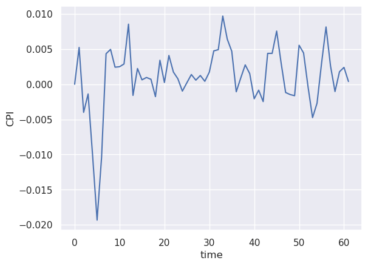

## Fitting the seasonal trend

We don't observe any additional trend but it seems there is a seasonal trend. Let's then do a ACF/PACF analysis.

```python
#linear
plot_acf(remaining)
plt.show()
plot_pacf(remaining)
plt.show()
```
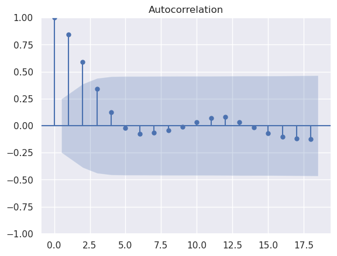

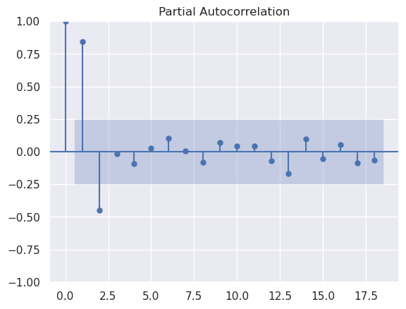

From the plots we can see that the highest order before the statistically significant boundary is AR(2). We can further verify this by calculating the RMSE of the fit for different lags.


```python
rmse_train=[]

for n in range(1,8):
    model = AutoReg(remaining, lags= n,trend='n')
    model_fit = model.fit()
    predictions=model_fit.predict()
    rmse=(mean_squared_error(remaining[n:], predictions[n:]))**0.5
    rmse_train.append(rmse)

sb.scatterplot(x=np.arange(1,8),y=rmse_train),plt.xlabel('n'),plt.ylabel('RMSE')
```

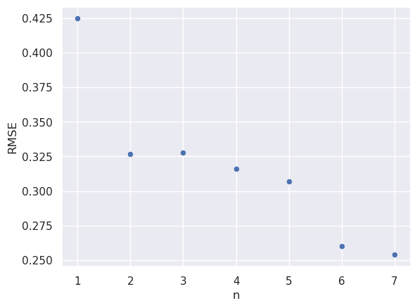

For the plot we can observe that the biggest drop in RMSE occurs precisely at n=2, and only drops again at n=6 at which point we consider the model is overfitting the data.

To evaluate our model however we need to calculate the RMSE on the testing data. To that effect, we use the model coefficients obtained with the training data and compute the 1-month-ahead forecasts. 

```python
#plot RMSE for a range of lags p 
n = 2
rmse_ar=[]
for n in range(1,8):
    model = AutoReg(remaining, lags= n)
    model_fit = model.fit()
    coef = model_fit.params
    past = remaining[len(remaining)-n:].values
    past = [past[i] for i in range(len(past))]    
    test_predictions = list()
    for t in range(len(remaining_test.dropna())):
        length = len(past)
        lag = [past[i] for i in range(length-n,length)]
        pred = coef[0]
        for d in range(n):
            pred += coef[d+1] * lag[n-d-1]
        obs = remaining_test.values[t]
        test_predictions.append(pred)
        past.append(obs)
    rmse = (mean_squared_error(remaining_test.dropna().values, test_predictions))**0.5
    rmse_test.append(rmse)
```

The plot shows us again the RMSE of the testing sample against the order of the AR. Interestingly, the model AR(1) has lower RMSE than AR(2). However, the difference is very small so we'll consider the result of the PACF plot as the strongest argument to choose the best model. It is also best to choose AR(2) so we do no miss out any important information.

**Note: Such discrepancy may occur when working with small sets.**

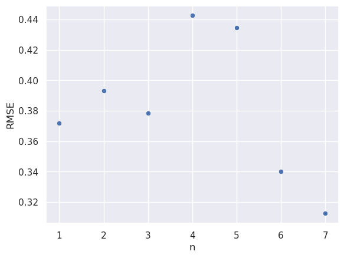

## Forecasting CPI

From here we will rebuild our function and forecast the results for the evaluation sample. This is done with the aid of the function `rebuild_diffed`.

```python
def rebuild_diffed(series, first_element_original,x,linear_trend):
    if x == 'linear':
        final = series + linear_trend
    else:
        cumsum = pd.Series(series).cumsum()
        final = np.exp(cumsum.fillna(0) + first_element_original)
        if first_element_original == 0:
            final = np.exp(cumsum.fillna(0))
    return final

## Building AR (2) Model 
n = 2
AR2_model = AutoReg(remaining, lags= n).fit()# Here we have used the default value for the trend parameter
coef = AR2_model.params
#print(coef)

# walk forward over time steps in test
past = remaining[len(remaining)-n:].values
past = [past[i] for i in range(len(past))]
test_predictions = list()
training_predictions = AR2_model.predict(start = train[0], end =train[-1])
for t in range(len(remaining_test)):
    length = len(past)
    lag = [past[i] for i in range(length-n,length)]
    pred = coef[0]
    for d in range(n):
        pred += coef[d+1] * lag[n-d-1] #this calculates each element of the forecast vector
    obs = remaining_test.values[t]
    test_predictions.append(pred) #the forecast elements are added here
    past.append(obs)
final_training = (rebuild_diffed(training_predictions,np.log(cpi_train.CPI[0]),xxx,linear_cpi))
final_test = (rebuild_diffed(test_predictions,np.log(cpi_train.iloc[-1].CPI),xxx,linear_cpi_test))
```

Finally we plot the final model predictions with the observed data. 

```python
sb.lineplot(x=train,y=cpi_train['CPI'],linestyle='--',color='blue',label='training data')
sb.lineplot(x=test,y=cpi_test['CPI'],linestyle='--',color='red',label='testing data')
sb.lineplot(x=train,y=final_training,label='AR(2) model')
sb.lineplot(x=test,y=final_test,label='AR(2) model predictions')
plt.xlabel('time')
```

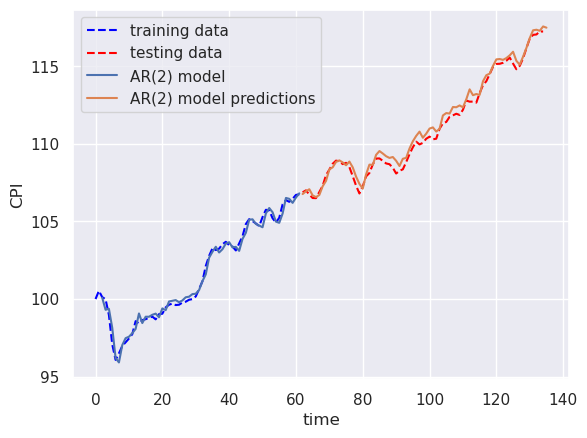

The performance of the AR(2) model is very good. It does predict well the features contained in the evaluation data.

Also, as we've seen, the RMSE is quite small (=0.393) considering that the amplitude of the data is of the order of $10^2$.

## Comparing CPI with BER

To compare CPI with BER we need to make the different data sets comparable, as the CPI is not a rate.

One approach to calculate monthly inflation rates from the CPI data is to subtract and divide by itself. Therefore we can define an CPI-based inflation rate as

$$
IR_t = \frac{CPI_t-CPI_{t-1}}{CPI_{t-1}},
$$

where $t$ indexes the months. We can create a function such as the one below to calculate the IR.

```python
def calc_inflation_rate(data):
    ir = []
    for i in range(1,len(data)):
        ir_temp = (data[i]-data[i-1])/data[i-1] *100      
        ir.append(ir_temp)
#         print(i)
    return ir
```

**Note: the ouput of the IR is already in percentage.**

Another alternative is no log transform the data and then differentiate. Let's use both, copy them to the dataframe and create twn new training and testing samples.

```python
#calculate monthly inflation from CPI
val = calc_inflation_rate(cpi['CPI'].values)
val2=np.log(cpi['CPI']).diff().values*100

cpi.loc[1:, 'IR_cpi'] = val
cpi['diff_log'] = val2

cpi_ir_train = (cpi[cpi.YearMonth<'2013-09'].copy())
cpi_ir_test = (cpi[cpi.YearMonth >='2013-09'].copy())
```

Let's now plot both estimates to check for differences.

```python
sb.lineplot(cpi['IR_cpi'],label='IR_CPI')
sb.lineplot(cpi['diff_log'],label='IR_diff_log')
plt.xlabel('Time'),plt.ylabel('Inflation rate')
plt.legend(loc=4)
```

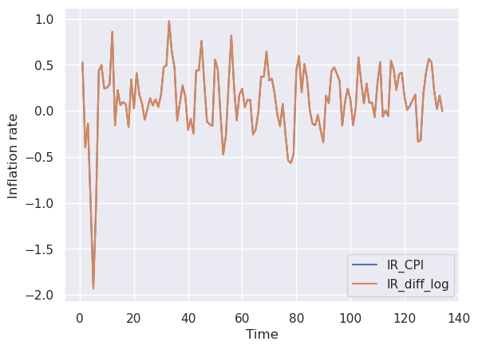

We observe that there are no differences between both models. Therefore we can use any of them.

### Converting BER to monthly inflation rates

From the data of BER we observe that the BER is reported on a daily basis. Therefore, we need to average the daily values to a monthly average and then we need to "deannualize" this value with the following formula

$$
BER_t = (BER_t +1)^\frac{1}{12} -1,
$$

in order to directly compare it to the CPI inflation estimation. We also save the final value in a convenient training/testing setup.

```python
ber = pd.read_csv('data_and_materials/T10YIE.csv')
ber['DATE'] =pd.to_datetime(ber['DATE'])
ber['YearMonth'] = ber['DATE'].dt.strftime('%Y-%m')
ber = ber.drop(ber[ber.YearMonth< '2008-07'].index)
ber = ber.dropna()
#print(ber)

ber_monthly = pd.DataFrame(columns =['YearMonth','BER'])
ber_monthly['BER'] =ber.groupby('YearMonth').T10YIE.mean().values #group monthly values and average them
ber_monthly['YearMonth'] = cpi.YearMonth
#ber_monthly.drop([0])

#print(ber_monthly)
ber_ir_train = (ber_monthly[ber_monthly.YearMonth<'2013-09'].copy())
ber_ir_test = (ber_monthly[ber_monthly.YearMonth >='2013-09'].copy())

ber_ir_train['IR_ber'] = ((ber_ir_train.BER.values/100+1)**(1/12)-1)*100
ber_ir_test['IR_ber'] = ((ber_ir_test.BER.values/100+1)**(1/12)-1)*100
```

We can now compare the two estimates directly. The code to visualize them is written below.

```python
sb.lineplot(cpi_ir_train['IR_cpi'],label='IR_cpi')
sb.lineplot(ber_ir_train['IR_ber'],label='IR_ber')
plt.legend(loc=4),plt.xlabel('time'),plt.ylabel('IR estimates')
```

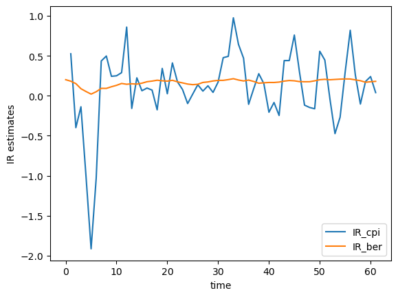

We observe that the inflation estimates are quite different! The one that is taken directly from the consumer prices has higher amplitudes, while the one sourced from BERV varies slower. It is not clear if there is a lag between them.

In order to quantify an hypothetic lag we can use the `cross correlation function` (CCF). When two functions are correlated and without lag, the peak of the CCF will be at zero. Otherwise, the peak will be elsewhere. To this end, we will use the function `xcorr` from the package `matplotlib.pyplot`. 

```python
plt.xcorr(ber_ir_train.IR_ber[1:],cpi_ir_train.IR_cpi[1:], maxlags = 25)
plt.title('Crosscorrelation between CPI and BER Inflation Rates')
plt.xlabel('lag')
```

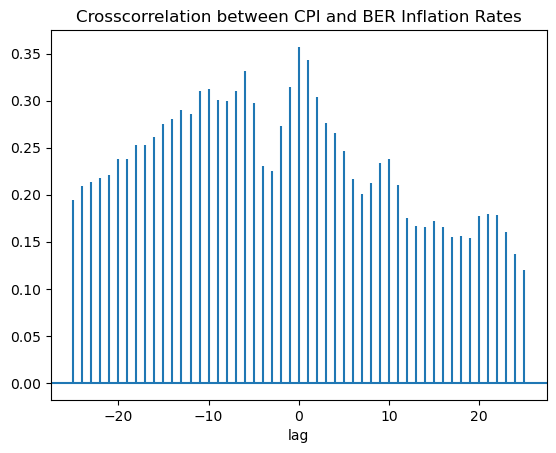

The CCf plot shows a peak at lag zero and another peak at lag -6. It is is possible to incorporate multiple lags, but we will start by using lag zero.

## Incorporating BERV information to improve IR_CPI prediction

To incorporate an exogenous function (in this case it will be IR_ber) in order to improve the IR prediction we will use the function `SARIMAX` from the package `statsmodels` as shown in the code below. Our first attempt will be to fit an AR(2) similar to the one already done before but with the added information from the exogenous function.

```python
exogenous = ber_ir_train.copy().drop(['BER'],axis=1)
exogenous =exogenous.drop(['YearMonth'],axis=1).drop([0,1]).values # exogenous start at index 2, i.e. 2008-09

endogenous = cpi_ir_train.IR_cpi.iloc[2:].reset_index().drop(['index'],axis =1)# drop first 2 rows to match with start of exogenous
model_external = sm.tsa.statespace.SARIMAX(endogenous, exogenous, order=(2,0,0), coerce_errors =True).fit(disp=False) #AR(2)
coef = model_external.params
#print(model_external.summary())

training_predictions3 = model_external.predict(start =2, end = len(endogenous.index) - 1, exog = exogenous)# training prediction start 2008-11
```

From here we evaluate the model with the testing subsample using the code below.

```python
k= 2
coef = model_external.params
past = endogenous.IR_cpi[len(endogenous.IR_cpi)-k:].values #exact the last k items in training data
past = [past[i] for i in range(k)]
test_predictions3 = list()

#prediction of the first time step
#past_ps = ps_ir_train.IR_ps.values[-1] # since lag was 1 between ir_cpi and ir_ps
pred = coef['ar.L2']*past[0] + coef['ar.L1']*past[1] + coef['x1'] * ber_ir_test.IR_ber.iloc[0] 
test_predictions3.append(pred)
obs = cpi_ir_test.IR_cpi.values[0]
past.append(obs)

for t in range(1,len(cpi_ir_test.IR_cpi)):
    length = len(past)
    lag = [past[i] for i in range(length-2,length)]
    pred = coef['ar.L2']*lag[0] + coef['ar.L1']*lag[1] +  coef['x1'] * ber_ir_test.IR_ber.iloc[t] 
    test_predictions3.append(pred)
    obs = cpi_ir_test.IR_cpi.values[t]
    past.append(obs)
print("The rmse of this final fit is " + str(mean_squared_error(cpi_ir_test.IR_cpi.values[:-2], test_predictions3[:-2])**0.5))
print("The mape of this final fit is " + str(mean_absolute_percentage_error(cpi_ir_test.IR_cpi.values[:-2],test_predictions3[:-2])))

The rmse of this final fit is 0.2369309282731057
The mape of this final fit is 280.75840707415006
```

Let's observe how this translates visually. 

```python
sb.lineplot(endogenous['IR_cpi'],linestyle='--',label='CPI Training data')
sb.lineplot(cpi_ir_test['IR_cpi'],linestyle='--',label='CPI Testing data')
sb.lineplot(training_predictions3,color='blue',label='AR(2) model fit')
sb.lineplot(x=cpi_ir_test.index,y=test_predictions3,color='red',label='Model Predictions')
```

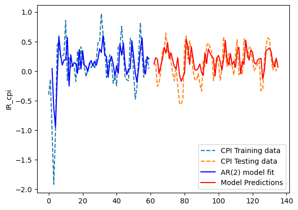


We observe a reasonable fit to the data and that the information from the exogenous source dampened the oscillations a bit.

<!-- Lastly, we will try to improve on the model predictions. To do this we can incorporate moving average terms into the model.  -->


