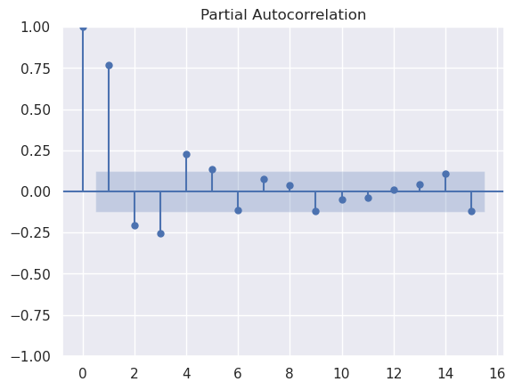
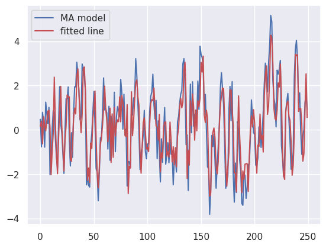

# Time series example: Stock price forecasting

Our research question here is the following: *How well can we predict Meta's closing stock price one day in advance and one month in advance?*

and

*Given the historical series of Meta's closing stock price, what is the best estimator of the stock price one day ahead or one month ahead? What is the test-sample mean squared error of each estimate?*

## Data set: stock prices

Our data is sourced from Yahoo finance, which maintains a python package to retrieve daily stock prices.

The following code loads Meta's stock prices since 2012-05-18. In the table below we can view a sample of Meta's stock series which includes the date, the daily price variation (opening session, highest value, lowest value and closing value). The last column shows the daily stock volume transactions.


```python
import pandas as pd
import matplotlib.pyplot as plt
import numpy as np
import requests
import io
import yfinance as yf
url="https://pkgstore.datahub.io/core/nasdaq-listings/nasdaq-listed_csv/data/7665719fb51081ba0bd834fde71ce822/nasdaq-listed_csv.csv"
s = requests.get(url).content
companies = pd.read_csv(io.StringIO(s.decode('utf-8')))
print("All available NASDAQ listings: \n", companies.head())
fb_series = yf.download("META",start='2012-05-18',progress=False)
print("Sample of Meta stock series: \n", fb_series.head())
price = fb_series.reset_index()['Close'].values.reshape(-1,1)
date = fb_series.reset_index().Date.dt.date.values.reshape(-1,1)
plt.plot(date, price)
plt.title("Meta stock price over time")
plt.show()

All available NASDAQ listings: 
   Symbol                                       Company Name  \
0   AAIT  iShares MSCI All Country Asia Information Tech...   
1    AAL                      American Airlines Group, Inc.   
2   AAME                      Atlantic American Corporation   
3   AAOI                      Applied Optoelectronics, Inc.   
4   AAON                                         AAON, Inc.   

                                       Security Name Market Category  \
0  iShares MSCI All Country Asia Information Tech...               G   
1       American Airlines Group, Inc. - Common Stock               Q   
2       Atlantic American Corporation - Common Stock               G   
3       Applied Optoelectronics, Inc. - Common Stock               G   
4                          AAON, Inc. - Common Stock               Q   

  Test Issue Financial Status  Round Lot Size  
0          N                N           100.0  
1          N                N           100.0  
2          N                N           100.0  
3          N                N           100.0  
4          N                N           100.0  
Sample of Meta stock series: 
                  Open       High        Low      Close  Adj Close     Volume
Date                                                                        
2012-05-18  42.049999  45.000000  38.000000  38.230000  38.230000  573576400
2012-05-21  36.529999  36.660000  33.000000  34.029999  34.029999  168192700
2012-05-22  32.610001  33.590000  30.940001  31.000000  31.000000  101786600
2012-05-23  31.370001  32.500000  31.360001  32.000000  32.000000   73600000
2012-05-24  32.950001  33.209999  31.770000  33.029999  33.029999   50237200

```

The plot generated with the code depicts Meta's stock price over time as shown below.


## Scaling the data

*Do we need to scale the data?* 

In this case yes, because as we can see in the plot the degree of the variance is not constant over time and this violates one of the assumptions of stationarity. We can correct this by taking a log transformation of the data. 

```python
# Applying log transformation
log_price = np.log(price)
plt.plot(date, log_price)
plt.title("log of FB stock price over time")
plt.show()
```

As shown in the plot below, the variance now looks more constant.


## Information criteria

As seen before we will use the AIC and the BIC in the form of the functions depicted in the code. 

```python
# Example here about how to find; what my assumption is behind this 
from scipy.stats import norm 
def evaluate_AIC(k, residuals):
  """
  Finds the AIC given the number of parameters estimated and 
  the residuals of the model. Assumes residuals are distributed 
  Gaussian with unknown variance. 
  """
  standard_deviation = np.std(residuals)
  log_likelihood = norm.logpdf(residuals, 0, scale=standard_deviation)
  return 2 * k - 2 * np.sum(log_likelihood)
def evaluate_BIC(k, residuals):
  """
  Finds the AIC given the number of parameters estimated and 
  the residuals of the model. Assumes residuals are distributed 
  Gaussian with unknown variance. 
  """
  standard_deviation = np.std(residuals)
  log_likelihood = norm.logpdf(residuals, 0, scale=standard_deviation)
  return k * np.log(len(residuals)) - 2 * np.sum(log_likelihood)
```

## Linear model

Let's start with a linear model. The code outputs the MSE,AIC and BIC as shown below.

```python
from sklearn import linear_model
clf = linear_model.LinearRegression()
index = fb_series.reset_index().index.values.reshape(-1,1)

clf.fit(index, log_price)
print(clf.coef_) # To print the coefficient estimate of the series. 
linear_prediction = clf.predict(index)
plt.plot(date, log_price, label='log stock price (original data)')
plt.plot(date, linear_prediction, 'r', label='fitted line')
plt.legend()
plt.show()
linear_residuals = log_price - linear_prediction
plt.plot(date, linear_residuals, 'o')
plt.show();
print("MSE with linear fit:", np.mean((linear_residuals)**2))
print("AIC:", evaluate_AIC(1, linear_residuals))
print("BIC:", evaluate_BIC(1, linear_residuals))

MSE with linear fit: 0.12649596448928904
AIC: 2268.3173142051555
BIC: 2274.304159106317
```

The code also produces two plots: the log stock price versus time plot and its residuals as shown below.


From the residuals we can observe the need of a higher order model.


## Quadratic model

Let's try a model of order 2. 

```python
## After linear fit, it seems like a higher order model is needed
from sklearn import linear_model
clf = linear_model.LinearRegression()
index = fb_series.reset_index().index.values.reshape(-1,1)

new_x = np.hstack((index, index **2))
clf.fit(new_x, log_price)
print(clf.coef_) # To print the coefficient estimate of the series. 
quad_prediction = clf.predict(new_x)
plt.plot(date, log_price, label='log stock price (original data)')
plt.plot(date, quad_prediction, 'r', label='fitted line')
plt.legend()
plt.show()
quad_residuals = log_price - quad_prediction
plt.plot(date, quad_residuals, 'o')
plt.show();
print("MSE with quadratic fit:", np.mean((quad_residuals)**2))
print("AIC:", evaluate_AIC(2, quad_residuals))
print("BIC:", evaluate_BIC(2, quad_residuals))

MSE with quadratic fit: 0.05321548541531681
AIC: -277.04566883374355
BIC: -265.07197903142077
```

There is an huge improvement in the AIC and BIC criteria. The fitted plot as well as the residuals are shown below.


Thus, the quadratic fit is a satisfactory model for the general trend. 

## Examining periodicities with ACF/PACF analysis

Let's now move one and analyze the remaining signal with ACF/PACF methods, as shown in the following code.

```python
import statsmodels.api as sm
sm.graphics.tsa.plot_acf(quad_residuals, lags=30)
plt.show()
sm.graphics.tsa.plot_pacf(quad_residuals, lags=30)
plt.show()
```

The ACf plot shows a exponentially decaying signal (remember, we're analysing a log transformed signal, so an exponentially decaying signal will be transformed into a negative linear trend)


The PACF plot shows a strong first term, which is evidence of an AR(1) component.


It's important to model these terms, because AR/MA can change their error structure. It can also change how we make forecasts, and our confidence bands on those forecasts.

## Simulated data

To review the AR/MA models, we're going to an exercise with simulated data first. 

### ARMA Models

Recall the general form of an AR model of order F

$$
X_t = \phi_1X_{t-1} + \phi_2X{t-2} + ... + \phi T_{t-p} + W_k,
$$

and the form of an MA model

$$
X_t = W_k + \theta_1W_{t-1} + \theta_2W_{t-2} + ... + \theta_qW_{t-q},
$$

where $W_t$ is the white noise that is uncorrelated with any lagged or future values.

### Simulation

First, we need to simulate the dataset with random noise and AR/MA terms.

The condition that the characteristic polynomial must have roots outside the unit circle is used here. For an $order-p$ time series $X_t = \phi_1 X_{t-1} + \phi_2 X_{t-2} \dots + \phi_p X_{t - p}$, there is a **characteristic polynomial** $\Phi(X_t) := 1 - \sum_{i=1}^p \phi_i X_{t-i}$. 

Note that we can equivalently express this polynomial as $\Phi(X_t) = \prod_{i=1}^p (1 - \alpha_i L) X_t$ where $L$ is the lag operator (i.e. $L(X_t) = X_{t-1}$.
By fixing all $\alpha_i = R$, for some constant $R \in (-1,1)$, we guarantee the time series is stationary. 

See [this link](https://math.unm.edu/~ghuerta/tseries/week4_1.pdf) for more details.

The following code shows the generating function for the simulation.

```py
import numpy as np
import matplotlib.pyplot as plt
import seaborn as sns; sns.set_theme()
from scipy.special import comb
import statsmodels.api as sm
def sim_dataset(AR, MA, t=100, trend = None, polynomial_root = -0.5, MA_weight = 0.5):
  # Note: AR=AM=0 will output white noise
  """
  Simulates a dataset given AR or MA order. 
  Selects AR terms so that the polynomial root is the given value;
  as long as the root is within (-1, 1), the series will be stationary. 
  """
  if trend is None: 
    trend = lambda x: 0
  arparams = np.array([comb(AR, i)*(polynomial_root)**(i) for i in range(1, AR + 1)])
  maparams = np.array([MA_weight] * MA)
  ar = np.r_[1, arparams] # add zero-lag 
  ma = np.r_[1, maparams] # add zero-lag
  arma_process = sm.tsa.ArmaProcess(ar, ma)
  print("ARMA process is stationary: ", arma_process.isstationary)
  print("ARMA process is invertible: ", arma_process.isinvertible)
  y = arma_process.generate_sample(t)
  y = np.array([_y + trend(j) for j, _y in enumerate(y)])
  return y
```

#### White noise

Let's start by generating white noise with our function

```py
np.random.seed(1234) #to observe the same output
white_noise = sim_dataset(0, 0, 100) #AR=0,AM=0 --> white noise
plt.plot(white_noise)
plt.show()
sm.graphics.tsa.plot_acf(white_noise, lags=15)
plt.show()
sm.graphics.tsa.plot_pacf(white_noise, lags=15)
plt.show()
```

The previous code generates 3 plots. The first plot shows randomly generated white noise.


The second and third plots show the ACF and the PACF respectively. We can observe that there appears to be only white noise.


### Adding an AR component

Let's now add an AR component to the data. We should expect to observe an exponentially decaying pattern in ACF plot and significant terms showing up in the PACF plot.

```py
np.random.seed(1234)
AR_series = sim_dataset(2, 0, 250, polynomial_root = -0.8)
plt.plot(AR_series)
plt.show()
sm.graphics.tsa.plot_acf(AR_series, lags=15)
plt.show()
sm.graphics.tsa.plot_pacf(AR_series, lags=15)
plt.show()
```

The first generated plot shows the data. The ACF/PACF plots are depited in the second and third figures respectively.


The ACF plot shows the exponential decay. The PACF plot shows the existince of two significant peaks other that the one at $lag=0$. Therefore, this time series must be an AR of order 2.

### Adding an MA component

Now we will test adding a MA component of order 3 to the simulation.

```py
np.random.seed(1234)
MA_series = sim_dataset(0, 3, 250, MA_weight=0.9)
plt.plot(MA_series)
plt.show()
sm.graphics.tsa.plot_acf(MA_series, lags=15)
plt.show()
sm.graphics.tsa.plot_pacf(MA_series, lags=15)
plt.show()
```

The first generated plot is the time series. The second plot is the ACF, where we observe significant terms up to the order of the ACF. Inm the PACF we observe exponentially decaying terms.

### ARMA model

Here we will observe exponentially decaying terms in both ACF and PACF. The usual plots were generated with the code below

```py
np.random.seed(1234)
ARMA_series = sim_dataset(1, 2, 250, polynomial_root = -0.5)
plt.plot(ARMA_series)
plt.show()
sm.graphics.tsa.plot_acf(ARMA_series, lags=15)
plt.show()
sm.graphics.tsa.plot_pacf(ARMA_series, lags=15)
plt.show()
```


The ACF plot shows a 2 or 3 order MA


The PACF plot we can observe a strong signal other than the one at $lag=0$ which indicates an AR of order 1 or or 3.



When we have ARMA signals it can be difficult to estimate its parameters. Luckily we can use python packages to solve this problems quickly and efficiently.

## Fiting ARIMA MODELS

From `statsmodels.tsa.arima.model` we can import `ARIMA` which will use the `SARIMAX` algorithm to obtain the parameters for AR and MA.

In this case we will fit an autoregressive time series of order 2 only as shown in the code below. The code will first output a summary of the fitting and then MSI,AIC and BIC.

```py
from statsmodels.tsa.arima.model import ARIMA
AR_order = 2
ar_higher = ARIMA(AR_series, order=(AR_order, 0, 0)).fit() #AR_series was defined before
print(ar_higher.summary())
ar_higher_predictions = ar_higher.predict()
ar_higher_residuals = AR_series - ar_higher_predictions
ar_higher_residuals = ar_higher_residuals # Fitting AR 1 model means removing one observation
plt.plot(AR_series, label='original data')
plt.plot(ar_higher_predictions, 'r', label='fitted line')
plt.legend()
plt.show()
plt.plot(ar_higher_residuals, 'o')
plt.show()
print("MSE with AR(1) model:", np.mean(ar_higher_residuals**2))
print("AIC with AR(1) model:", evaluate_AIC(AR_order + 1, ar_higher_residuals))
print("BIC with AR(1) model:", evaluate_BIC(AR_order + 1, ar_higher_residuals))

                               SARIMAX Results                                
==============================================================================
Dep. Variable:                      y   No. Observations:                  250
Model:                 ARIMA(2, 0, 0)   Log Likelihood                -351.516
Date:                Mon, 23 May 2022   AIC                            711.032
Time:                        20:26:33   BIC                            725.118
Sample:                             0   HQIC                           716.701
                                - 250                                         
Covariance Type:                  opg                                         
==============================================================================
                 coef    std err          z      P>|z|      [0.025      0.975]
------------------------------------------------------------------------------
const          1.2190      1.508      0.808      0.419      -1.737       4.175
ar.L1          1.5431      0.058     26.696      0.000       1.430       1.656
ar.L2         -0.5853      0.057    -10.249      0.000      -0.697      -0.473
sigma2         0.9599      0.080     11.935      0.000       0.802       1.118
===================================================================================
Ljung-Box (L1) (Q):                   0.03   Jarque-Bera (JB):                 3.77
Prob(Q):                              0.85   Prob(JB):                         0.15
Heteroskedasticity (H):               0.94   Skew:                            -0.24
Prob(H) (two-sided):                  0.79   Kurtosis:                         3.37
===================================================================================
MSE with AR(1) model: 0.963273633944107
AIC with AR(1) model: 706.114826572702
BIC with AR(1) model: 716.6792093262887
```

We observe a difference between the AIC,BIC of the model and the calculated AIC/BIC and this may be due to a slight difference in the number of terms that are added for the calculation. The values `ar.L1`,`ar.L2`, and `sigma2` are the $\phi_1$, $\phi_2$ and $W$ respectively. Also the p-values are very small.

The code above also plots the original data and the fitted line as well as its residuals. From the first plot we observe a very good agreement with the data, also shown in the p-values of the coefficients.


The residuals look like white noise, but we still have high magnitudes relative to the values of the time series! 


Let's look more closely at the time series.

```py
plt.plot(AR_series[:20], label='original data')
plt.plot(ar_higher_predictions[:20], 'r', label='fitted line')
plt.legend()
plt.show()
```


In this zoom in view of the first 20 values we observe that, in fact, there is always one step off from the original data.

This is a caveat of this program. To circunvent this we will step up the predictions as shown in the code below.

```python
ar_higher_residuals2 = AR_series[:-1]-ar_higher_predictions[1:]
plt.plot(ar_higher_residuals2, 'o')
plt.show()
print("MSE with AR(1) model:", np.mean(ar_higher_residuals2**2))
print("AIC with AR(1) model:", evaluate_AIC(AR_order + 1, ar_higher_residuals2))
print("BIC with AR(1) model:", evaluate_BIC(AR_order + 1, ar_higher_residuals2))
```

As observed in the plot and in the error and IC values we now have a much better fit.


In our next step we will compute a grid of models in order to find the best parameters: MA Order and AR Order.

First we define a general grid search function for the `ARIMA` algorithm as shown in the code below 

```python
def grid_search_ARIMA(data, AR_range, MA_range, verbose=False):
  min_aic = np.inf 
  min_bic = np.inf
  min_aic_index = None
  min_bic_index = None 
  aic_matrix = np.zeros((len(AR_range), len(MA_range)))
  bic_matrix = np.zeros((len(AR_range), len(MA_range)))
  for AR_order in AR_range:
    for MA_order in MA_range:
      arma = ARIMA(data, order=(AR_order, 0, MA_order)).fit()
      aic_matrix[AR_order, MA_order] = arma.aic
      bic_matrix[AR_order, MA_order] = arma.bic
      if arma.aic < min_aic:
        min_aic = arma.aic
        min_aic_index = (AR_order, 0, MA_order)
      if arma.bic < min_bic:
        min_bic = arma.bic
        min_bic_index = (AR_order, 0, MA_order)
  if verbose:
    print("Minimizing AIC order: ", min_aic_index)
    print("Minimizing BIC order: ", min_bic_index )
    print("matrix of AIC", aic_matrix)
    print("Matrix of BIC", bic_matrix)
  return min_aic_index, min_bic_index, aic_matrix, bic_matrix
```

We will first apply it for the AR(2) series.

```python
min_aic_index, min_bic_index, _, _ = grid_search_ARIMA(AR_series, range(4), range(4), verbose=True)
if min_aic_index == min_bic_index:
  arma = ARIMA(AR_series, order=min_bic_index).fit()
  print(arma.summary())
  arma_predictions = arma.predict()
  arma_residuals = AR_series - arma_predictions
  arma_residuals = arma_residuals # Fitting AR 1 model means removing one observation
  plt.plot(AR_series, label='AR time series')
  plt.plot(arma_predictions, 'r', label='fitted line')
  plt.legend()
  plt.show()
  plt.plot(arma_residuals, 'o')
  plt.show()
  print("Automatic selection finds model with AR {0}, MA {2}".format(*min_aic_index))
  print("MSE with selected model:", np.mean(arma_residuals**2))
else:
  print("AIC, BIC do not agree.")

SARIMAX Results                                
==============================================================================
Dep. Variable:                      y   No. Observations:                  250
Model:                 ARIMA(2, 0, 0)   Log Likelihood                -351.516
Date:                Wed, 31 Jan 2024   AIC                            711.032
Time:                        10:40:27   BIC                            725.118
Sample:                             0   HQIC                           716.701
                                - 250                                         
Covariance Type:                  opg                                         
==============================================================================
                 coef    std err          z      P>|z|      [0.025      0.975]
------------------------------------------------------------------------------
const          1.2190      1.508      0.808      0.419      -1.737       4.175
ar.L1          1.5431      0.058     26.696      0.000       1.430       1.656
ar.L2         -0.5853      0.057    -10.249      0.000      -0.697      -0.473
sigma2         0.9599      0.080     11.935      0.000       0.802       1.118
===================================================================================
Ljung-Box (L1) (Q):                   0.03   Jarque-Bera (JB):                 3.77
Prob(Q):                              0.85   Prob(JB):                         0.15
Heteroskedasticity (H):               0.94   Skew:                            -0.24
Prob(H) (two-sided):                  0.79   Kurtosis:                         3.37
===================================================================================
Automatic selection finds model with AR 2, MA 0
MSE with selected model: 0.9632736337780373
```

In the end we obtain the same results as above, but the objective here was to observe if the program could find the AR(2) model as the best and it did. I will not show the plots here as they are the same as the one above.

We will now input our MA(3) data and observe the results.

```python
min_aic_index, min_bic_index, _, _ = grid_search_ARIMA(MA_series, range(4), range(4), verbose=True)
if min_aic_index == min_bic_index:
  arma = ARIMA(MA_series, order=min_bic_index).fit()
  print(arma.summary())
  arma_predictions = arma.predict()
  arma_residuals = MA_series - arma_predictions
  arma_residuals = arma_residuals
  plt.plot(MA_series, label='MA model')
  plt.plot(arma_predictions, 'r', label='fitted line')
  plt.legend()
  plt.show()
  plt.plot(arma_residuals, 'o')
  plt.show()
  print("Automatic selection finds model with AR {0}, MA {2}".format(*min_aic_index))
  print("MSE with selected model:", np.mean(arma_residuals**2))
else:
  print("AIC, BIC do not agree.")

SARIMAX Results                                
==============================================================================
Dep. Variable:                      y   No. Observations:                  250
Model:                 ARIMA(0, 0, 3)   Log Likelihood                -347.614
Date:                Wed, 31 Jan 2024   AIC                            705.227
Time:                        11:07:41   BIC                            722.834
Sample:                             0   HQIC                           712.314
                                - 250                                         
Covariance Type:                  opg                                         
==============================================================================
                 coef    std err          z      P>|z|      [0.025      0.975]
------------------------------------------------------------------------------
const          0.1543      0.252      0.613      0.540      -0.339       0.647
ma.L1          0.9240      0.034     27.025      0.000       0.857       0.991
ma.L2          0.9620      0.129      7.440      0.000       0.709       1.215
ma.L3          0.9548      0.122      7.854      0.000       0.717       1.193
sigma2         0.9081      0.138      6.593      0.000       0.638       1.178
===================================================================================
Ljung-Box (L1) (Q):                   1.46   Jarque-Bera (JB):                 6.56
Prob(Q):                              0.23   Prob(JB):                         0.04
Heteroskedasticity (H):               0.93   Skew:                            -0.31
Prob(H) (two-sided):                  0.75   Kurtosis:                         3.49
===================================================================================```

Automatic selection finds model with AR 0, MA 3
MSE with selected model: 0.9390641964205751
```

Again, the algorithm finds MA(3)) as the best fit to the data. The generated plots show the data, the fitted curve, and the residuals.




Let's now see the result of our ARMA(1,2) series.

```python
min_aic_index, min_bic_index, _, _ = grid_search_ARIMA(ARMA_series, range(4), range(4), verbose=True)
if min_aic_index == min_bic_index:
  arma = ARIMA(ARMA_series, order=min_bic_index).fit()
  print(arma.summary())
  arma_predictions = arma.predict()
  arma_residuals = ARMA_series - arma_predictions
  arma_residuals = arma_residuals
  plt.plot(ARMA_series, label='ARMA series ')
  plt.plot(arma_predictions, 'r', label='fitted line')
  plt.legend()
  plt.show()
  plt.plot(arma_residuals, 'o')
  plt.show()
  print("Automatic selection finds model with AR {0}, MA {2}".format(*min_aic_index))
  print("MSE with selected model:", np.mean(arma_residuals**2))
else:
  print("AIC, BIC do not agree.")

Automatic selection finds model with AR 1, MA 2
MSE with selected model: 0.957173618267881
```

As expected the best model found is a ARMA(1,2). The figures below show the data+model and the residuals respectively.


**Note: don't forget about the time-step correction between model and data to increase the accuracy**

### What if AIC/BIC don't agree?

TBD

## Forming forecasts

Now that we can find models, we can form forecasts. 

With estimates of each $\theta$ and $\phi$ term, we can predict one step ahead. 

$$
\hat{X}_{t + 1} = \hat{\phi}_1 X_{t} + \hat{\phi}_2 X_{t-1} \dots + \hat{\phi}_p X_{t - p + 1} + \hat{\theta}_1 W_{t} + \hat{\theta}_2 W_{t-1} \dots + \hat{\theta}_q W_{t-q + 1}.
$$

To form long-range forecasts, we can just plug in our estimate $\hat{X}_{t + 1}$ in place of $X_{t + 1}$ at every future value, and so on for other future estimates. Let's see what happens when we do this. The forecast will be done with `arma.get_forecast(50)` for 50 time points. We will be using our previouse AR(1,2) series.

```python
arma = ARIMA(ARMA_series, order=min_bic_index).fit()
print(arma.summary())
arma_predictions = arma.predict()
fcast = arma.get_forecast(50).summary_frame()

fig, ax = plt.subplots(figsize=(15, 5))

arma_predictions = arma.predict()
ax.plot(np.arange(len(ARMA_series)), ARMA_series, label='original data')
predicted_values = arma_predictions.reshape(-1,1)
ax.plot(np.arange(len(ARMA_series)), predicted_values, 'r', label='fitted ARMA model')
forecast_means = fcast['mean'].values.reshape(-1,1)
forecast_x_vals = np.arange(len(ARMA_series), len(ARMA_series) + 50)
ax.plot(forecast_x_vals, forecast_means, 'k--', label='mean forecast')
ax.fill_between(forecast_x_vals, fcast['mean_ci_lower'], fcast['mean_ci_upper'], color='k', alpha=0.1);
plt.legend();

 SARIMAX Results                                
==============================================================================
Dep. Variable:                      y   No. Observations:                  250
Model:                 ARIMA(1, 0, 2)   Log Likelihood                -349.736
Date:                Wed, 31 Jan 2024   AIC                            709.472
Time:                        11:39:08   BIC                            727.080
Sample:                             0   HQIC                           716.559
                                - 250                                         
Covariance Type:                  opg                                         
==============================================================================
                 coef    std err          z      P>|z|      [0.025      0.975]
------------------------------------------------------------------------------
const          0.1964      0.224      0.878      0.380      -0.242       0.635
ar.L1          0.4084      0.088      4.652      0.000       0.236       0.581
ma.L1          0.5164      0.075      6.917      0.000       0.370       0.663
ma.L2          0.5762      0.068      8.420      0.000       0.442       0.710
sigma2         0.9545      0.083     11.568      0.000       0.793       1.116
===================================================================================
Ljung-Box (L1) (Q):                   0.01   Jarque-Bera (JB):                 3.23
Prob(Q):                              0.92   Prob(JB):                         0.20
Heteroskedasticity (H):               0.96   Skew:                            -0.23
Prob(H) (two-sided):                  0.85   Kurtosis:                         3.32
===================================================================================
```

In this case we obtain a mean forecast. Yes, it sucks.


As we've seen before, long-term predictions converge rapidly to the mean. As we don't have observations, the CI in the forecast regions rely on the variance of the whole series.

## Return to the price forecasting example.

We'll now finally return to the practical problem of price forecasting. We've applied a quadratic trend to the log stock price and obtained the following Figures. 

The first figure shows the log data versus time and the quadratic fit.


The second figure shows the residuals.


The third and fourth figures show the ACF and the PACF respectively. 


From here we can observe that the ACF/PACF plots suggest an AR(1) model: there are two significant terms in the PACF and a slowly decaying ACF. 

Let's see what our grid search finds.

```python
min_aic_index, min_bic_index, _, _ = grid_search_ARIMA(quad_residuals, range(4), range(4), verbose=True)
if min_aic_index == min_bic_index:
  arma = ARIMA(quad_residuals, order=min_bic_index).fit()
  print(arma.summary())
  arma_predictions = arma.predict()
  arma_residuals = (quad_residuals.T - arma_predictions).flatten()
  arma_residuals = arma_residuals # Fitting AR 1 model means removing one observation
  plt.plot(quad_residuals, label='Residuals from fitted quadratic line')
  plt.plot(arma_predictions, 'r', label='fitted ARMA process')
  plt.legend()
  plt.show()
  plt.plot(arma_residuals, 'o')
  plt.show()
  print("Automatic selection finds model with AR {0}, MA {2}".format(*min_aic_index))
  print("MSE with selected model:", np.mean(arma_residuals**2))
else:
  print("AIC, BIC do not agree.")
 SARIMAX Results                                
==============================================================================
Dep. Variable:                      y   No. Observations:                 2943
Model:                 ARIMA(1, 0, 0)   Log Likelihood                6646.949
Date:                Wed, 31 Jan 2024   AIC                         -13287.899
Time:                        12:46:27   BIC                         -13269.937
Sample:                             0   HQIC                        -13281.432
                               - 2943                                         
Covariance Type:                  opg                                         
==============================================================================
                 coef    std err          z      P>|z|      [0.025      0.975]
------------------------------------------------------------------------------
const       1.138e-06      0.065   1.74e-05      1.000      -0.128       0.128
ar.L1          0.9943      0.001    738.070      0.000       0.992       0.997
sigma2         0.0006   4.82e-06    132.400      0.000       0.001       0.001
===================================================================================
Ljung-Box (L1) (Q):                   0.80   Jarque-Bera (JB):             61634.16
Prob(Q):                              0.37   Prob(JB):                         0.00
Heteroskedasticity (H):               1.29   Skew:                            -0.66
Prob(H) (two-sided):                  0.00   Kurtosis:                        25.38
===================================================================================
Automatic selection finds model with AR 1, MA 0
MSE with selected model: 0.0007324663949477522
```

As expected the algorithm found an AR(1) as the best model. The results are really good! The following plots show the data and the fitted ARMA model, and the residuals.


## Prediction

### Evaluating with a test set. 

*How well can we predict future events from data?* 

Let's arbitrarily draw 20% of the data for testing purposes. We will thus use the remaining 80% of the data to train our model.

```python
train_test_split = int(len(price) * 0.8)
train_price, test_price = quad_residuals[:train_test_split], quad_residuals[train_test_split:]
train_date, test_date = date[:train_test_split], date[train_test_split:]
assert(len(train_date) + len(test_date) == len(date))
```

In this context we will use the minimum AIC value. If we used the minimum BIC value instead the result would be the same.

```python
## First, let's see how this does with the AIC selected values. 
arma = ARIMA(train_price, order=min_aic_index).fit()
print(arma.summary())
fig, ax = plt.subplots(figsize=(15, 5))

# Construct the forecasts
fcast = arma.get_forecast(len(test_price)).summary_frame()

arma_predictions = arma.predict()
ax.plot(date, quad_residuals, label='stock price, converted to stationary time series')
predicted_values = arma_predictions.reshape(-1,1)
ax.plot(train_date, predicted_values, 'r', label='fitted line')
forecast_means = fcast['mean'].values.reshape(-1,1)
test_set_mse = np.mean((forecast_means.reshape(test_price.shape) - test_price)**2)
ax.plot(test_date, forecast_means, 'k--', label='mean forecast')
ax.fill_between(test_date.flatten(), fcast['mean_ci_lower'], fcast['mean_ci_upper'], color='k', alpha=0.1);
plt.legend();
print("Test set mean squared error: ", test_set_mse)

SARIMAX Results                                
==============================================================================
Dep. Variable:                      y   No. Observations:                 2354
Model:                 ARIMA(1, 0, 0)   Log Likelihood                5537.536
Date:                Wed, 31 Jan 2024   AIC                         -11069.072
Time:                        13:56:42   BIC                         -11051.780
Sample:                             0   HQIC                        -11062.775
                               - 2354                                         
Covariance Type:                  opg                                         
==============================================================================
                 coef    std err          z      P>|z|      [0.025      0.975]
------------------------------------------------------------------------------
const          0.0118      0.038      0.314      0.753      -0.062       0.085
ar.L1          0.9900      0.002    583.305      0.000       0.987       0.993
sigma2         0.0005   5.75e-06     91.973      0.000       0.001       0.001
===================================================================================
Ljung-Box (L1) (Q):                   1.94   Jarque-Bera (JB):             19532.27
Prob(Q):                              0.16   Prob(JB):                         0.00
Heteroskedasticity (H):               0.67   Skew:                             0.25
Prob(H) (two-sided):                  0.00   Kurtosis:                        17.10
===================================================================================
Test set mean squared error:  0.15227452700738053
```

The generated plot shows the full data, the fitted model in red and the forecast as the dashed black line. We can readily observe that the forescast has very poor quality and it converges rapidly to the average value of the training subsample.


### Long range predictions

If we're interested in long range predictions one way of successfully doing this is to collapse our data into monthly values.

We lose information but this will deter the fast convergence to the mean of the series. 

Let's start by grouping our data by mouth and take its mean as shown in the code below.

```python
collapsed = fb_series.groupby(pd.Grouper(freq ='M')).mean()
month_date = collapsed.reset_index().Date.dt.date.values.reshape(-1,1)
month_price = collapsed.High.values.reshape(-1,1)
month_log_price = np.log(month_price)
plt.plot(month_date, month_log_price)
plt.title("log of Facebook stock price over time")
plt.show()
```


The plot looks much smoother and cleaner. Then we fit a quadratic regression. We obtain the quadratic coefficients and the MSE with the quadratic fit.

```python
clf = linear_model.LinearRegression()
index = collapsed.reset_index().index.values.reshape(-1,1)
new_x = np.hstack((index, index **2))
clf.fit(new_x, month_log_price)
print(clf.coef_,clf.intercept_) # To print the coefficient estimate of the series. 
month_quad_prediction = clf.predict(new_x)
plt.plot(month_date, month_log_price, label='original data')
plt.plot(month_date, month_quad_prediction, 'r', label='fitted line')
plt.legend()
plt.show()
month_quad_residuals = month_log_price - month_quad_prediction
plt.plot(month_date, month_quad_residuals, 'o')
plt.show();
print("MSE with quadratic fit:", np.mean((month_quad_residuals)**2))
[[ 0.0411845  -0.00017904]] [3.1460942]
MSE with quadratic fit: 0.05099051519913883
```

The generated plots are shown below. The first figure is the data with the fit curve, and the second figure depicts the residuals.


Now, we plot the ACF and the PACF.

```python
sm.graphics.tsa.plot_acf(month_quad_residuals, lags=14)
plt.show()
sm.graphics.tsa.plot_pacf(month_quad_residuals, lags=14)
plt.show()
```


We observe a similar trend as before for the AR function. We may have an AR(2) function.

To confirm our hypothesis we run `grid_search_ARIMA` and find that indeed we have an AR(2) function as the best model.

```python
min_aic_index, min_bic_index, *other = grid_search_ARIMA(month_quad_residuals, range(4), range(4), verbose=True)
if min_aic_index == min_bic_index:
  arma = ARIMA(month_quad_residuals, order=min_bic_index).fit()
  print(arma.summary())
  arma_predictions = arma.predict()
  arma_residuals = month_quad_residuals.reshape(arma_predictions.shape) - arma_predictions
  arma_residuals = arma_residuals # Fitting AR 1 model means removing one observation
  plt.plot(month_quad_residuals, label='Residuals from fitted quadratic line')
  plt.plot(arma_predictions, 'r', label='fitted ARMA process')
  plt.legend()
  plt.show()
  plt.plot(arma_residuals, 'o')
  plt.show()
  print("Automatic selection finds model with AR {0}, MA {2}".format(*min_aic_index))
  print("MSE with selected model:", np.mean(arma_residuals**2))
else:
  print("AIC, BIC do not agree.")

                               SARIMAX Results                                
==============================================================================
Dep. Variable:                      y   No. Observations:                  141
Model:                 ARIMA(2, 0, 0)   Log Likelihood                 154.464
Date:                Wed, 31 Jan 2024   AIC                           -300.928
Time:                        11:39:40   BIC                           -289.133
Sample:                             0   HQIC                          -296.135
                                - 141                                         
Covariance Type:                  opg                                         
==============================================================================
                 coef    std err          z      P>|z|      [0.025      0.975]
------------------------------------------------------------------------------
const          0.0357      0.076      0.466      0.641      -0.114       0.186
ar.L1          1.3367      0.073     18.206      0.000       1.193       1.481
ar.L2         -0.4361      0.077     -5.697      0.000      -0.586      -0.286
sigma2         0.0064      0.001     10.732      0.000       0.005       0.008
===================================================================================
Ljung-Box (L1) (Q):                   0.11   Jarque-Bera (JB):                81.91
Prob(Q):                              0.75   Prob(JB):                         0.00
Heteroskedasticity (H):               1.02   Skew:                            -1.05
Prob(H) (two-sided):                  0.94   Kurtosis:                         6.09
===================================================================================

Automatic selection finds model with AR 2, MA 0
MSE with selected model: 0.007191718795732677
```

The code also generates two figures, as shown below. The first one shows the residuals from the quadratic fit and the fitted AR(2) line. The second one depicts the residuals. We can readily observe the de-phasing by one month of the data and the model.


Let's now create the forecast from the 80% training elements.

```python
arma = ARIMA(month_train, order=min_bic_index).fit()
fig, ax = plt.subplots(figsize=(15, 5))

# Construct the forecasts
fcast = arma.get_forecast(len(month_test)).summary_frame()
arma_predictions = arma.predict()
ax.plot(month_date, month_quad_residuals, label='original data')
predicted_values = arma_predictions.reshape(-1,1)
ax.plot(month_date_train, predicted_values, 'r', label='fitted line')
forecast_means = fcast['mean'].values.reshape(-1,1)
ax.plot(month_date_test, forecast_means, 'k--', label='mean forecast')
ax.fill_between(month_date_test.flatten(), fcast['mean_ci_lower'], fcast['mean_ci_upper'], color='k', alpha=0.1);
plt.legend();

test_set_mse = np.mean((forecast_means.reshape(month_test.shape) - month_test)**2)
print("Test set mean squared error: ", test_set_mse)

Test set mean squared error:  0.18344070477352128
```

The generated plot shows the original data, the fitted line model based on the training subset and the forecast. We observe a slower transition towards the mean of the time series. 


**Nevertheless, this approach is quite limited: it can only forecast the mean with precision.**

## A rolling window forecast

TBD


