# The Mauna Loa $CO_2$ concentration

## Introduction

In 1958, Charles David Keeling (1928-2005) from the Scripps Institution of Oceanography began recording carbon dioxide ($CO_2$) concentrations in the atmosphere at an observatory located at about 3,400 m altitude on the Mauna Loa Volcano on Hawaii Island. The location was chosen because it is not influenced by changing $CO_2$ levels due to the local vegetation and because prevailing wind patterns on this tropical island tend to  bring well-mixed air to the site. 

While the recordings are made near a volcano (which tends to produce $CO_2$), wind patterns tend to blow the volcanic $CO_2$ away from the recording site. Air samples are taken several times a day, and concentrations have been observed using the same measuring method for over 60 years. In addition, samples are stored in flasks and periodically reanalyzed for calibration purposes. The observational study is now run by Ralph Keeling, Charles's son. The result is a data set with very few interruptions and very few inhomogeneities. It has been called the “most important data set in modern climate research."

Let $C_i$ be the average $CO_2$ concentration in month $i$ ($i=,1,2...$). We want to look for a form of the type

$$
C_i = F(t_i) + P_i + R_i,
$$

where: 

- $F(t_i)$ accounts for the long-term trend 
- $t_i$ is the time at the middle of the $ith$ month, measured in fractions of years after Jan 15 1958. Specifically we take 

$$
t_i = \frac{i+0.5}{12}, i = 0,1,...,
$$

where $i$ = 0 corresponds to January 1958. We add 0.5 because the first measurement is halfway through the month.
- $P_i$ is periodic in $i$ with a fixed period, accounting for the seasonal pattern.
- $R_i$ is the remaining residual that accounts for all other influences.

## Objective

In this example we want to treat and analyze the data in order to find all possible trends with the first 80% of the data. Then we want to gauge the performance of our model by predicting the last 20% of the data.

*After de-trending the data what can be said relative to the residuals?*

## Data

The input data for this example can be found in the file `CO2.csv` under the folder `data_and_materials`. It provides the concentration of CO2 recorded at Mauna Loa for each month starting March 1958. Here, we will consider only the $CO_2$ concentration given in column 5, which is unadjusted. 

First we load the libraries and the data.

```python
import numpy as np
import math
import scipy as sp
import scipy.stats as st
import matplotlib as mp
import matplotlib.pyplot as plt
import pandas as pd
import statsmodels.sandbox.stats.multicomp as multi
from sklearn.linear_model import LinearRegression
from sklearn.model_selection import train_test_split
from sklearn.metrics import mean_absolute_percentage_error,mean_squared_error
import seaborn as sb

df = pd.read_csv('data_and_materials/CO2.csv',sep=',',skiprows=57,header=None)
df.columns=('yr','mn','datem','date','co2','season','fit','seasonf','co2_2','season_2')
t = np.array((df.index+0.5)/12) #rearranged time index
```

## Pre-processing data

After a quick look at the data we observe that there are missing values in the data of interest (column `co2`) expressed by the number $-99.99$. 

```python
df2 = df[df['co2']!=-99.99] #remove all values with missing CO2
t2 = t[df['co2']!=-99.99]
```

In this particular case we'll just drop the missing values because we have enough data points. Other alternatives would be to forward-fill missing values, average them or use interpolation. Also, we need to reshape the time array as shown in the code below.

```python
x = np.array(t2.reshape(-1,1))
y = df2.copy()
```

We will start the analysis by plotting our data. 

```python
plt.plot(x,y['co2'])
plt.xlabel('time (years)'),plt.ylabel('CO2 concentration (ppm)')
```
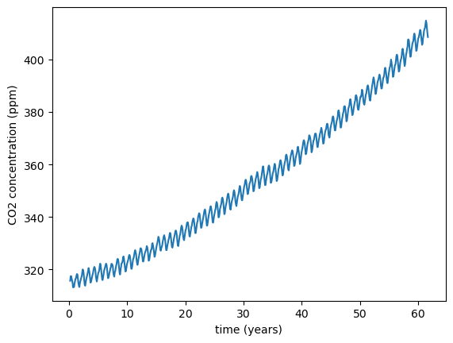

We observe an upward trend and a short term variability.

## Linear fit

Our first step in terms of model construction will be to try to fit a linear regression to the data. Here we will use a training-testing approach with 20% of the data corresponding to the latter times assigned for testing via the `train_test_split` function of the `sklearn.model_selection` package. To perform the linear regression we use the function `LinearRegression` from the ` sklearn.linear_model` package. We also compute the mean squared error and the mean absolute percentage error.

```python
x_train,x_test,y_train,y_test = train_test_split(x,y,test_size=0.20,shuffle=False)
lr = LinearRegression().fit(x_train,y_train)
print('Slope:',lr.coef_[0], '| Intercept',lr.intercept_)
print('RMSE:',mean_squared_error(y_test,ypred_test,squared=False))
print('MAPE:',mean_absolute_percentage_error(y_test,ypred_test)*100)
Slope: 1.4066911494215175 | Intercept 308.9916567323666
RMSE: 10.641458521874679
MAPE: 2.450454956443145
```

Let's now plot the data with the linear regression and its residuals.

```python
plt.plot(x_train,y_train['co2'],label='training data')
plt.plot(x_test,y_test['co2'],label='testing data')
plt.plot(x,ypred,'r',label='linear fit') #plot of the fit + data
plt.xlabel('time (years)'),plt.ylabel('CO2 concentration (ppm)')
plt.legend()
plt.show()
resid = y['co2']-ypred.flatten()
plt.plot(x,resid,'.') #plot of the residuals
plt.xlabel('time (years)'),plt.ylabel('CO2 residuals(ppm)')
plt.show()
```

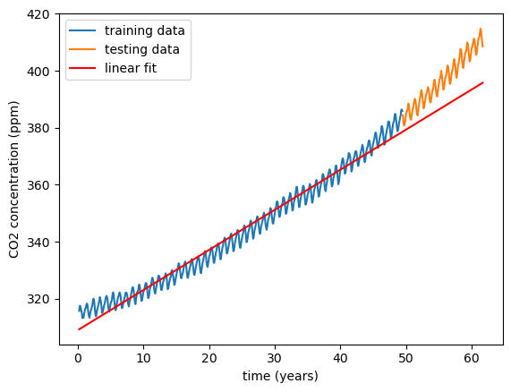

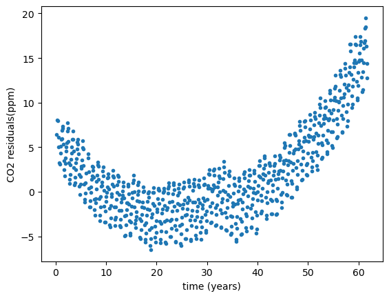

The linear fit is clearly not "fit" for its job! Also, it is especially bad at predicting the testing data. For instance if we calculate the coefficient of determination $R^2$ we get a negative value for the testing subsample as shown below. 

```python
lr.score(x_test,y_test['co2']),lr.score(x_train,y_train['co2'])
(-0.4916310593054052, 0.9764754552037069)
```

If we look back at the plot this is quite clear: the linear fit completely misses the training data.

Also, there is an obvious trend that was overlooked. The residuals look quadratic in shape so we'll try and fit a quadratic fit.

## Quadratic fit

In order to do this we'll just linearize the equation. Therefore we will create a new variable equal to time squared and stacked them with the linear term. Then we train-test split again and do the usual linear regression.

```python
x2 = np.column_stack((x,x**2))
x_train2,x_test2,y_train2,y_test2 = train_test_split(x2,y,test_size=0.20,shuffle=False)
lr2 = LinearRegression().fit(x_train2,y_train2['co2'])
print('Coefficients:',lr2.coef_,' | Intercept',lr2.intercept_)
ypred_train2 = lr2.predict(x_train2)
ypred_test2 = lr2.predict(x_test2)
print('RMSE:',mean_squared_error(y_test2['co2'],ypred_test2,squared=False))
print('MAPE:',mean_absolute_percentage_error(y_test2['co2'],ypred_test2)*100)
Coefficients: [0.80209702 0.0121175 ]  | Intercept 314.1005841870842
RMSE: 2.5013322194897825
MAPE: 0.5320319129740849
```

We observe that the RMSE and MAPE values dropped four times! Also the coefficient of determination is now much better.

```python
lr2.score(x_test2,y_test2['co2']),lr2.score(x_train2,y_train2['co2'])
(0.9175858356919125, 0.9882301911588206)
```

We can observe the difference by plotting the data with the quadratic fit and its residuals.

```python
ypred2 = lr2.predict(x2)
plt.plot(x,y['co2'],label='data')
plt.plot(x,ypred2,label='quadratic fit')
plt.xlabel('time (years)'),plt.ylabel('CO2 concentration (ppm)')
plt.legend()
plt.show()
#residuals
plt.plot(x,y['co2']-ypred2,'.')
plt.xlabel('time (years)'),plt.ylabel('CO2 residuals (ppm)')
plt.show()
```

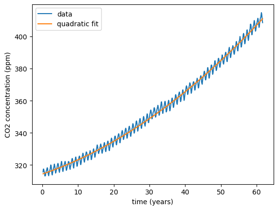

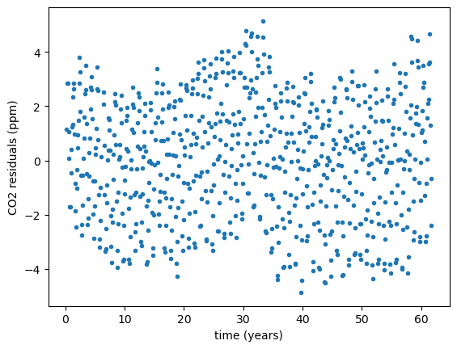

It looks much better! We may try a cubic model but we known the result would be very similar and would not justify an increase in model complexity.

## Fitting a periodic signal

The residuals are low. However there seems still to be some kind of trend there. Let's now try to fit a periodic signal.

It is hard to observe a periodic signal in the residuals, so we'll concentrate the data by averaging for each month. In the end we get one data point for each month.

Fortunately we already have the data discriminated by month in the field `mn`. We order the data and calculate the mean and median of each month with the following code to get the yearly periodic signal.

```python
ypred_train2 = lr2.predict(x_train2)
res = y_train2['co2']-ypred_train2 #remove the deterministic trend from the data
y_train2['res'] = res #adding the residuals to the dataframe

periodic = np.zeros(12)
periodic2 = np.zeros(12)

for n in range(len(periodic)) :
    periodic[n] = y_train2[y_train2['mn']== n+1]['res'].values.mean()
    periodic2[n] = np.median(y_train2[y_train2['mn']== n+1]['res'].values)
```

Now we just need to interpolate and plot as shown below. Here we use a quadratic interpolation using the function `interp1d` from the package `sp.interpolate`. The 95% confidence error bands are estimated from bootstrap.

```python
xp = range(1,13)
xinterp = np.linspace(1,12,100)
finterp = sp.interpolate.interp1d(xp,periodic,kind='quadratic') #interpolation

sb.lineplot(y_train2,x='mn',y='res',marker='o',linestyle='',label='mean')
sb.lineplot(y_train2,x='mn',y='res',estimator='median',marker='o',linestyle='',label='median',errorbar=None)
sb.lineplot(x=xinterp,y=finterp(xinterp),color='black',label='quadratic interpolation')
plt.xlabel('Month'),plt.ylabel('Periodic signal (ppm)')
```

The plot below shows the mean and the median of the residuals corresponding to each month as well as the quadratic interpolation to the points of the mean.

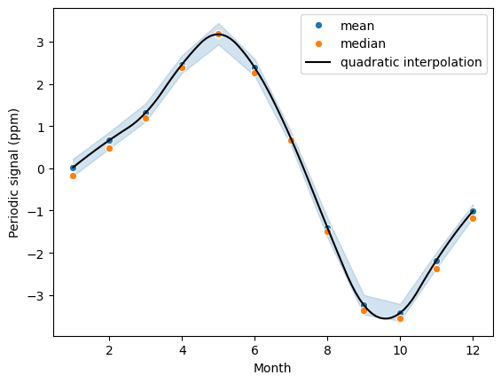

## Constructing the final model

Now, we just need to add this signal to our model. To to this we just run the following code.

```python
#Introducing a periodic signal
y_train2['periodic'] = 0
y_test2['periodic'] = 0
for n in range(len(periodic)) : 
    y_train2['periodic'].loc[y_train2['mn']== n+1] = periodic[n]
    y_test2['periodic'].loc[y_test2['mn'] == n+1] = periodic[n]

y_train2['final'] = ypred_train2+y_train2['periodic']
y_test2['final'] = ypred_test2+y_test2['periodic']

sb.lineplot(x=x_train2[:,0],y=y_train2['co2'],marker='o',markersize=3,linewidth=0,label='training data')
sb.lineplot(x=x_test2[:,0],y=y_test2['co2'],marker='o',markersize=3,linewidth=0,color='black',label='testing data')
sb.lineplot(x=t[0:586],y=y_final[0:586],color='red',label='final model')
sb.lineplot(x=t[586:],y=y_final[586:],color='orange',label='prediction')
plt.xlabel('time (years)'),plt.ylabel('CO2 concentration (ppm)')
plt.show()
plt.figure()
sb.lineplot(x=t2[100:200],y=y['co2'][100:200],marker='o',markersize=3,linewidth=0,label='data')
sb.lineplot(x=t[(100+7):(200+7)],y=y_final[(100+7):(200+7)],color='red',label='final model')
plt.xlabel('time (years)'),plt.ylabel('CO2 concentration (ppm)')
```

The following plots show the data against the final model. The second plot is just a zoom-in of the first plot for clarity.

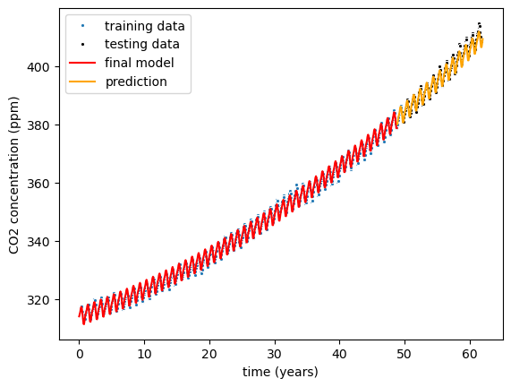

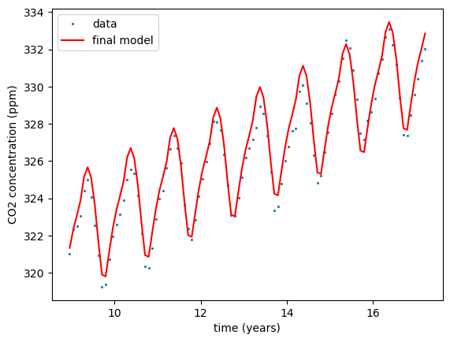

Let's now run some metrics to check out the reliability of our model as we did in the previous models.

```python
print('RMSE:',mean_squared_error(y_test2['co2'],y_test2['final'],squared=False))
print('MAPE:',mean_absolute_percentage_error(y_test2['co2'],y_test2['final'])*100)
RMSE: 1.149360269079452
MAPE: 0.2085916594799123
```

The values of RMSE and MAPE dropped more than half! This gives us confidence that adding the periodic signal to our model is correct.

We can also determine the coefficient of determination, this time by hand. It can be define as

$$
R^2 = 1-\frac{RSS}{SS},
$$

where the residual sum of squares, $RSS = \sum_{i=1}^n{(y_i-y_{i,model})^2}$ and the sum of squares is $SS = \sum_{i=1}^n{y_i-\overline{y}}$.

```python
#Coefficient of determination
rss_test = ((y_test2['co2']-y_test2['final'])**2).sum()
ss_test = ((y_test['co2']-y_test['co2'].mean())**2).sum()
r2_test = 1-rss_test/ss_test

rss_train = ((y_train2['co2']-y_train2['final'])**2).sum()
ss_train = ((y_train['co2']-y_train['co2'].mean())**2).sum()
r2_train = 1-rss_train/ss_train
print(r2_test,r2_train)
0.9825991098444042 0.9987463513547911
```

We obtain a very good value of $R^2$ which also gives confidence in our results.

Finally we will perform a final test: this decomposition is only valid if the amplitude of the quadratic trend is much larger than the amplitude of the periodic trend and this in turn must be much larger than the final residuals. 

To have an ideia of the order of magnitude of this comparisons, we must calculate two ratios of amplitude as shown in the code below.

```python
print ("Amplitude of Trend : ")
Amp_trend=y_train2['co2'].max()-y_train2['co2'].min()
print(Amp_trend)
print ("\nAmplitude of Periodic Signal : ")
Amp_p=y_train2['periodic'].max()-y_train2['periodic'].min()
print(Amp_p)

print ("\nRatio of amplitudes of trend to periodic signal : ")
print(Amp_trend/Amp_p)

print ("\nAmplitude of Residuals : ")
Amp_res=rfinal.max()-rfinal.min()
print(Amp_res)

print ("\nRatio of amplitudes of periodic signal  to residuals : ")
print(Amp_p/Amp_res)


print ("\nMedian of absolute value of Periodic Signal : ")
median_abs_p=(y_train2['periodic'].abs()).median()
print(median_abs_p)
print ("\nMedian of absolute Residual : ") 
median_abs_r=(rfinal.abs()).median()
print(median_abs_r)
print ("\nRatio of amplitudes of periodic signal  to residuals : ")
print(median_abs_p/median_abs_r)

Amplitude of Trend : 
73.20000000000005

Amplitude of Periodic Signal : 
6.29241066715961

Ratio of amplitudes of trend to periodic signal : 
11.633061456404034

Amplitude of Residuals : 
3.836399237579542

Ratio of amplitudes of periodic signal  to residuals : 
1.6401866118422055

Median of absolute value of Periodic Signal : 
2.081486740992056

Median of absolute Residual : 
0.49333288570340983

Ratio of amplitudes of periodic signal  to residuals : 
4.219233708744564
```

The ratio between the quadratic trend amplitude and the periodic signal is 11 which is evident in the plots. Therefore, the modeling of the periodic signal can be seen as a refinement of the model and its scale does not obscure the linear trend.

The range of values of the periodic signal is comparable to the range of the final residuals ($\sim 1.6$). However, the ratio of amplitudes of the periodic signal to residuals is 4 fold. Along with the significant decrease in RMSE and MAPE, and the prior knowledge that seasonality does exist for this data, we conclude it is meaningful to include the periodic signal.

*What about the final residuals? Could't we just fit an AR/MA model?*

First let's look at the residuals plot. 

```python
rfinal = y_train2['co2']-y_train2['final']
plt.plot(x_train,rfinal,'.')
plt.xlabel('time' (years)),plt.ylabel('CO2 concentration ⁽ppm')
```

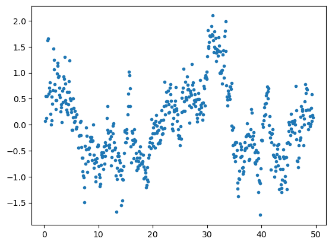

In fact it looks something periodic! Let's perform the ACF/PACF diagnostic.

```python
from statsmodels.graphics.tsaplots import plot_acf,plot_pacf

plot_acf(rfinal)
plt.show()
plot_pacf(rfinal)
plt.show()
```

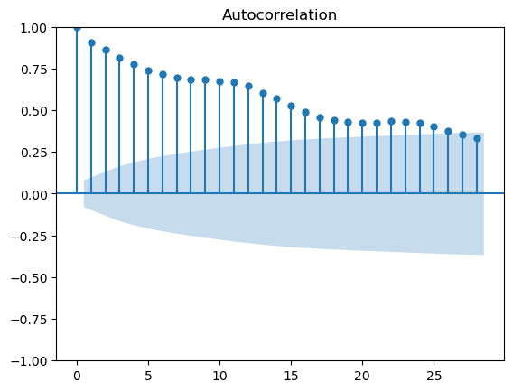

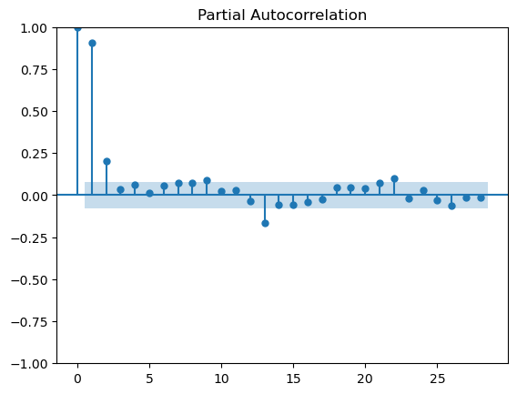

The ACF/PACF suggest the existence of a signal that may be modelled by a AR(2). However it can be a mix of AR and MA. We could then try and remove the signal, **but we think it's not worth it basically because we don't have any more scientific information in order to proceed or to place hypothesis.**

Therefore we will leave it as it is.